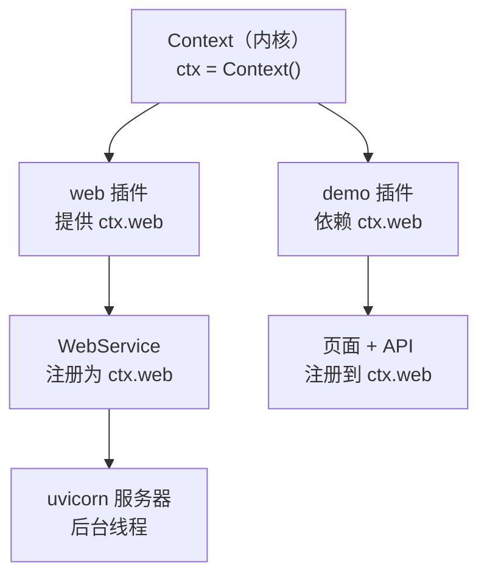
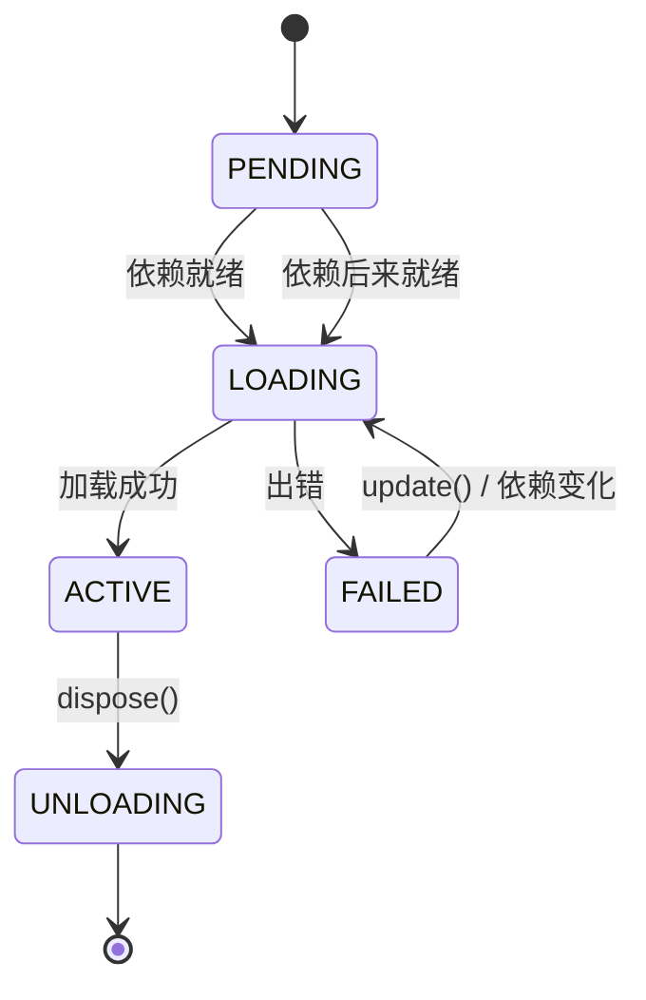
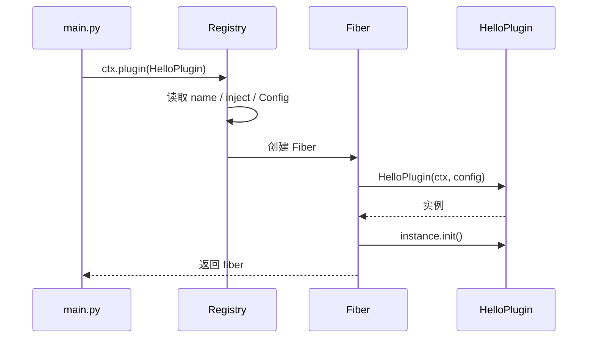
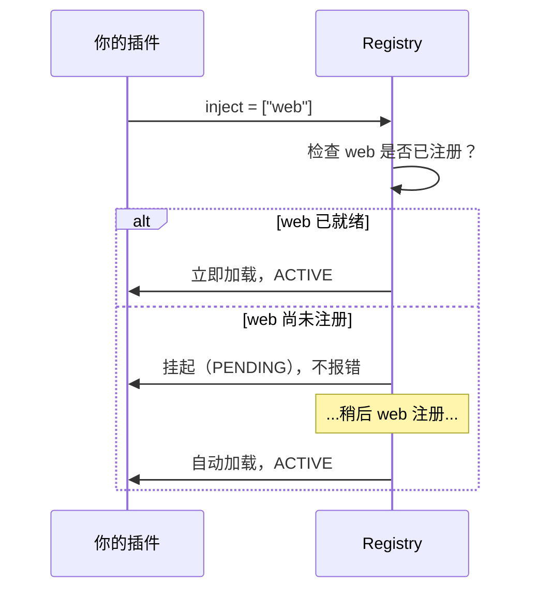
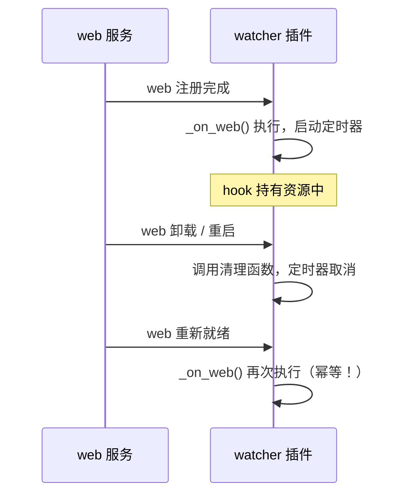

# cordis 插件开发指南

面向 Python 初学者。读完后你能独立写出一个带服务、带网页、能自动清理的插件。

> 本文所有代码都经过实机验证。凡是「实测发现」的坑点，都用 **⚠️** 标出。

---

## 目录

1. [cordis 是什么](#1-cordis-是什么)
2. [三个核心概念](#2-三个核心概念)
3. [第一个插件（5 分钟）](#3-第一个插件5-分钟)
4. [插件的三种写法](#4-插件的三种写法)
5. [插件的四件"声明式"配置](#5-插件的四件声明式配置)
6. [副作用与自动清理](#6-副作用与自动清理)
7. [服务：让插件互相调用](#7-服务让插件互相调用)
8. [依赖注入](#8-依赖注入)
9. [事件总线](#9-事件总线)
10. [配置与校验](#10-配置与校验)
11. [上下文继承与隔离](#11-上下文继承与隔离)
12. [实战：写一个完整插件](#12-实战写一个完整插件)
13. [cordis 惯用法：能用原生就用原生](#13-cordis-惯用法能用原生就用原生)
14. [常见坑点清单](#14-常见坑点清单)
15. [API 速查表](#15-api-速查表)

---

## 1. cordis 是什么

一句话：**cordis 是一个「插件拼装」框架** —— 你把功能拆成一个个小插件，它负责按依赖关系组装、启动、并在不需要时干净地拆掉。

它解决的问题：

| 没有框架时 | 用 cordis |
|---|---|
| 各处 `import` 直接调用，模块耦合死 | 插件通过 `ctx` 拿到服务，不直接 import |
| 关服务要手动记住每个资源怎么释放 | 资源登记为 effect，插件卸载自动全部释放 |
| A 依赖 B，B 没就绪就崩 | 声明 `inject`，框架自动等 B 就绪再加载 A |
| 想加个功能要改核心代码 | 写个插件 `ctx.plugin(MyPlugin)` 即可 |

本项目的 cordis 实现是 `cordis_port` 包（已安装）。

### 一个最小全景图



插件之间**不互相 import**，只通过 `ctx` 交换服务。

---

## 2. 三个核心概念

### 2.1 Context（`ctx`）—— 万能门面

`ctx` 是你唯一需要持有的对象。通过它你能：

```python
ctx.logger.info("日志")        # 打日志
ctx.on("事件名", 处理函数)      # 监听事件
ctx.emit("事件名", 数据)        # 触发事件
ctx.plugin(OtherPlugin)        # 加载子插件
ctx.foo                        # 访问名为 foo 的服务
ctx.fiber                      # 当前插件的生命周期句柄
```

一句话：**`ctx` 是插件的"遥控器"**，所有能力都从它取。

### 2.2 Fiber —— 插件的生命周期句柄

每次 `ctx.plugin(P)` 都会创建一个 Fiber（可以理解为"这次加载的实例记录"）。

```python
fiber = await ctx.plugin(MyPlugin)

fiber.name        # 'my-plugin'
fiber.state       # FiberState.ACTIVE
fiber.config      # 校验后的配置
await fiber.dispose()      # 卸载：自动清理该插件的所有 effect
await fiber.restart()      # 重启：先卸载再加载
await fiber.update({...})  # 改配置并重载
```

Fiber 的状态机：



**⚠️ 关键点**：`PENDING` 表示"在等依赖"，不是错误。插件依赖的服务还没注册时，它会安静地等待，等到了自动加载（实测通过）。

### 2.3 Effect —— 会自动清理的副作用

只要你通过 `ctx.effect(...)` 或 `ctx.fiber.effect(...)` 创建资源，卸载时框架会自动替你清理：

```python
def apply(self, ctx, config):
    ctx.effect(lambda: (start_timer(), stop_timer)[1], "我的定时器")
    #                 ↑ 现在做什么          ↑ 卸载时做什么
```

这是 cordis 最实用的功能 —— **你不需要记住清理什么**。

---

## 3. 第一个插件（5 分钟）

### 3.1 创建文件

新建 `plugins/hello/plugin.py`：

```python
"""我的第一个插件。"""

from typing import Any


class HelloPlugin:
    # 插件名：会出现在日志、fiber.name、路由归属里
    name = "hello"

    def __init__(self, ctx: Any, config: Any = None) -> None:
        """构造：cordis 会传入 ctx 和校验后的 config。

        这里适合放「注册类」动作：注册服务、注册路由、注册事件监听。
        """
        self.ctx = ctx
        self.ctx.logger.info("Hello 插件加载了！")

    def init(self) -> None:
        """可选。cordis 在 __init__ 之后自动调用。"""
        self.ctx.logger.info("Hello 插件初始化完成")
```

再建 `plugins/hello/__init__.py`：

```python
from .plugin import HelloPlugin

__all__ = ["HelloPlugin"]
```

### 3.2 挂载它

在 `master/main.py` 里：

```python
from plugins.hello import HelloPlugin

await ctx.plugin(HelloPlugin)
```

运行 `python master/main.py`，你会看到日志输出。

### 3.3 拆解发生了什么



1. Registry 读取插件类的 `name`、`inject`、`Config`（这就是为什么它们写在类上）
2. 创建 Fiber，并 `extend()` 出一个属于本插件的子 `ctx`
3. 实例化插件类，传入 `ctx` 和配置
4. 调用 `init()`（如果定义了）
5. 返回 fiber

---

## 4. 插件的三种写法

三种都支持，按需要选。

### 4.1 类式（推荐）

```python
class MyPlugin:
    name = "my"

    def __init__(self, ctx, config):
        self.ctx = ctx

    def init(self):
        ...
```

**适合**：有状态、要注册多项内容、需要 `name` / `Config` 等元信息。

### 4.2 函数式（最简单）

```python
def my_plugin(ctx, config):
    ctx.logger.info("加载了")
    return lambda: ctx.logger.info("卸载了")   # 返回值即清理函数
```

`fiber.name` 会自动取函数名 `my_plugin`。

**适合**：一次性小功能、临时脚本。

### 4.3 带 `apply` 的对象

```python
class MyPlugin:
    name = "my"

    def apply(self, ctx, config):
        ...
```

**适合**：需要构造参数但不想用类式时。

### 4.4 字典形式

```python
await ctx.plugin({"name": "my", "apply": my_function, "inject": ["web"]})
```

**适合**：动态组装、配置驱动加载。

### 4.5 对比

| 写法 | `name` 来源 | 能用 `init()` | 能用 `Config` | 推荐度 |
|---|---|---|---|---|
| 类 | 类属性 `name` | ✅ | ✅ | ⭐⭐⭐ |
| 函数 | 函数名 | ❌ | ❌ | ⭐⭐ |
| 带 apply 的对象 | 对象 `name` | ❌ | ✅ | ⭐⭐ |
| 字典 | `"name"` 键 | ❌ | `"Config"` 键 | ⭐ |

---

## 5. 插件的四件"声明式"配置

这四样都写在**类上**，cordis 会去读它们。**注意：它们不需要你在代码里手动使用**，是给框架看的元数据。

### 5.1 `name` —— 插件名

```python
class MyPlugin:
    name = "my-plugin"
```

它会出现在：

- `fiber.name`
- 日志输出
- **web 路由的 `owner` 字段**（排查"这条路由谁注册的"）

**⚠️ 实测提醒**：`name` 不能和别的插件重复，否则日志里分不清谁是谁。

### 5.2 `inject` —— 依赖声明

```python
class MyPlugin:
    inject = ["web"]                    # 只要服务名
    inject = {"web": {"port": 9000}}    # 带配置
```

效果：**web 服务没就绪，本插件就不会加载**。

**⚠️ 实测提醒**：`inject` 里的服务没出现时，fiber 停在 `PENDING` 且**不报错**。如果你发现插件"没反应"，先检查 `fiber.state`。

### 5.3 `Config` —— 配置模型

```python
class MyPlugin:
    Config = MyConfig     # 一个带 validate() 的类
```

框架会用 `Config.validate(传入的配置)` 校验并转换，然后才传给 `__init__`。

**⚠️ 实测提醒**：`Config` 必须是**标准 Schema**（有 `validate` 方法），不能是 `dataclass` 或普通类。写成 `None` 表示不校验。详见[第 10 节](#10-配置与校验)。

### 5.4 `provide` —— 声明本插件提供的服务

```python
class MyPlugin(Service):
    provide = "myservice"
```

见[第 7 节](#7-服务让插件互相调用)。

---

## 6. 副作用与自动清理

这是 cordis 最有价值的部分，值得单独一章。

### 6.1 为什么需要它

传统写法：

```python
def start():
    timer = start_timer()
    conn = connect_db()
    # ... 100 行后 ...
    # 忘记关 timer 和 conn → 资源泄漏
```

cordis 写法：

```python
def apply(ctx, config):
    ctx.effect(lambda: (start_timer(), stop_timer)[1], "定时器")
    ctx.effect(lambda: (connect_db(), disconnect_db)[1], "数据库连接")
    # 不用管清理，卸载时自动全部执行
```

### 6.2 三种登记方式

```python
# 方式一：ctx.effect(execute, label)
#        ⚠️ execute 是「立即执行」的，它的**返回值**才是清理函数
ctx.effect(lambda: (setup(), teardown)[1], "标签")
#                    ↑ 立即执行       ↑ 卸载时执行

# 方式二：显式用 fiber（等价，只是强调归属）
ctx.fiber.effect(lambda: (setup(), teardown)[1], "标签")

# 方式三：返回值直接当清理函数（最简，推荐）
def my_plugin(ctx, config):
    setup()
    return teardown          # apply 的返回值

class MyPlugin:
    name = "my"
    def __init__(self, ctx, config):
        self.ctx = ctx
        setup()
    def init(self):
        return teardown      # init 的返回值（实测同样有效）
```

⚠️ **别把清理逻辑直接写进 `execute`**：

```python
ctx.effect(lambda: stop_timer(), "定时器")     # ❌ 加载时就停了
ctx.effect(lambda: (start(), stop)[1], "定时器")   # ✅
```

详见 [13.3 节](#133-副作用的三种写法实测对比)。

### 6.3 返回值的四种形态

| 你返回什么 | 框架怎么做 |
|---|---|
| 一个函数 | 卸载时调用它 |
| `None` | 不清理 |
| `[清理1, 清理2]` | 卸载时**逆序**全部调用（实测确认是逆序） |
| `async def` 清理函数 | 卸载时 `await` 它 |

```python
# 异步清理示例
def apply(ctx, config):
    async def cleanup():
        await asyncio.sleep(0.1)
        print("异步清理完成")
    return cleanup
```

### 6.4 清理顺序

**后注册的先清理**（LIFO）。这符合直觉：后建的资源先拆。

```python
ctx.effect(lambda: (print("建 A"), lambda: print("拆 A"))[1])
ctx.effect(lambda: (print("建 B"), lambda: print("拆 B"))[1])
# 卸载时输出：拆 B → 拆 A
```

### 6.5 监听器也是 effect

```python
dispose = ctx.on("事件", handler)   # 返回注销函数
dispose()                            # 手动注销
# 或者啥也不做 —— 插件卸载时它自动注销
```

`ctx.on()` 内部已经把监听器登记进 fiber 了，**你不需要手动 `off`**。

---

## 7. 服务：让插件互相调用

### 7.1 什么是服务

服务 = **一个可以被其他插件通过 `ctx.名字` 拿到的对象**。

```python
class GreeterService(Service):
    provide = "greeter"      # 其他插件用 ctx.greeter 访问

    def __init__(self, ctx, config=None):
        super().__init__(ctx)      # 必须：这一步完成注册
        self.count = 0

    def hello(self, who="world"):
        self.count += 1
        return f"你好 {who}（第 {self.count} 次）"
```

提供它：

```python
class GreeterPlugin:
    name = "greeter-plugin"

    def __init__(self, ctx, config):
        GreeterService(ctx, config)     # 构造即注册
```

使用它：

```python
class UserPlugin:
    name = "user"
    inject = ["greeter"]

    def __init__(self, ctx, config):
        print(ctx.greeter.hello())      # 直接用
```

### 7.2 两条铁律

**铁律一：`Service.__init__` 必须最先调用 `super().__init__(ctx)`**

```python
def __init__(self, ctx, config):
    super().__init__(ctx)        # ← 先注册
    self.data = load_data()      # ← 再做自己的初始化
```

原因：`super().__init__` 内部会调用 `ctx.reflect.provide()` 完成注册。如果你先访问 `ctx.xxx` 之类可能触发依赖解析，顺序会乱。

**铁律二：服务名全局唯一**

同名重复注册会抛错：

```
RuntimeError: service "web" has been registered at <web>
```

### 7.3 服务方法里拿到的是"调用方 ctx"

这是 cordis 一个精妙设计，**理解它才能写出正确的服务**：

```python
class MyService(Service):
    provide = "myservice"

    def whoami(self):
        return self.ctx.fiber.name      # ← 返回的是「调用方」的名字！
```

实测验证：

```python
# consumer 插件里
ctx.myservice.whoami()      # 返回 'consumer'，不是 'myservice'
```

**为什么这样设计**：服务需要知道"谁在调用我"，才能做权限判断、按调用方区分数据、把资源绑定到调用方生命周期。

**如何拿到服务自己的 ctx**：用 `self.provided_ctx`（本项目的 `WebService` 提供了这个属性）。

🤯 **对本项目的影响**：web 插件的 `nav()` / `page()` 就是靠这个机制知道"是谁在注册"，才能让路由随插件卸载。详见 `plugins/web/README.md`。

### 7.4 取服务时的三个注意点

⚠️ `ctx.myservice` 拿到的是**代理对象**，不是原始实例：

```python
svc = ctx.myservice

type(svc)                    # ❌ _TraceableProxy
isinstance(svc, MyService)   # ✅ True（v0.1.5 起）
svc.__class__ is MyService   # ✅ True
```

| 注意点 | 说明 |
|---|---|
| **别用 `is` 比较** | `ctx.myservice is ctx.myservice` 是 `False`（每次访问都新建代理） |
| **别序列化代理** | `json.dumps(svc)` / `pickle.dumps(svc)` 都会失败 |
| **要真引用就自己存** | `svc.original` 可取真实实例；或服务构造时注册自己 |

```python
# ✅ 取真实实例
raw = ctx.myservice.original
isinstance(raw, MyService)      # True

# ✅ 服务侧：构造时注册自己，别人拿到的就是真引用
class MyService(Service):
    provide = "mine"

    def __init__(self, ctx, config=None):
        super().__init__(ctx)
        registry["mine"] = self
```

服务方法内的 `self` 同样是代理，细节见 [坑 14](#-坑-14服务方法里的-self-是代理对象)。

### 7.5 服务的可用性检查

有时服务"注册了但还不能用"（比如数据库还没连上）：

```python
class DbService(Service):
    provide = "db"

    def __init__(self, ctx, config):
        super().__init__(ctx)
        self.connected = False

    def __check__(self):
        return self.connected      # False 时，依赖方不会加载
```

把 `connected` 置为 `True` 后，依赖方会自动加载。

### 7.6 服务不能被随意覆盖

```python
ctx.web = something_else
# AttributeError: cannot set property "web" in multiple fibers
```

只有**提供该服务的 fiber** 能修改它。这是防止插件互相踩踏的保护。

---

## 8. 依赖注入

### 8.1 三种声明方式

```python
# 方式一：类属性列表（最常用，推荐）
class P:
    inject = ["web", "db"]

# 方式二：字典（带配置）
class P:
    inject = {"web": {"port": 9000}}

# 方式三：@Inject 装饰器（类上 / 方法上，见 8.3）
@Inject("web")
class P: ...
```

#### 三者混用 / 继承的实测矩阵

`inject` 的合并规则**不是**「无条件叠加」，用错会**静默丢依赖**。完整矩阵（实测确认，`P`=父类声明的依赖，`C`=子类声明的依赖）：

| 父类声明 | 子类写法 | 最终依赖 | 父依赖 |
|---|---|---|---|
| list / dict / `@Inject` | `@Inject(C)`，本类不写 `inject` | `C, P` | ✅ 保留 |
| list / dict / `@Inject` | 不写装饰器，只继承 | `P` | ✅ 保留 |
| list / dict / `@Inject` | `@Inject(C)` + 本类 `inject = [C]` | `C` | ❌ **丢失** |
| list / dict / `@Inject` | `@Inject(C)` + 本类 `inject = {C: None}` | `C` | ❌ **丢失** |

```python
class Base:
    inject = ["other"]

# ✅ 保留父类：本类不写 inject
@Inject("hello")
class Ok(Base):
    pass
# 结果：hello + other

# ✅ 保留父类：不写装饰器
class Ok2(Base):
    inject = ["other", "hello"]

# ❌ 丢父类：本类 inject + 装饰器 同时写
@Inject("hello")
class Bad(Base):
    inject = ["more"]
# 结果：hello + more —— 父类的 other 没了（不报错！）
```

**避坑铁律**：同一个类里，`inject = ...` 和 `@Inject` **只用一个**。

三层继承（列表 → 字典 → 装饰器）实测正常：`{'a': None, 'b': None, 'c': None}` —— 因为每一层都没有「同时写」的情况。

### 8.2 加载时序



实测确认：先加载消费方、后加载 web，消费方会从 `PENDING` 自动变为 `ACTIVE`。

### 8.3 `@Inject` 装饰器

`@Inject` 把「声明依赖」和「依赖就绪后做事」合成一步。两个分支能力不同：

| 分支 | 作用 | 推荐度 |
|---|---|---|
| 装饰**类** | 等价于写 `inject = {...}` | ⭐⭐⭐ |
| 装饰**方法** | 依赖就绪时自动调用该方法；返回值作为清理函数 | ⭐⭐⭐ |

#### 8.3.1 装饰在类上

```python
@Inject("web")
class MyPlugin:
    def __init__(self, ctx, config):
        ctx.web.register_ui(
            "mine",
            kind="page",
            format="vue",
            resource_root=config["resource_root"],
            entry="Mine.vue",
            path="/mine",
            title="我的页面",
        )
```

效果等同 `inject = ["web"]`。可与列表式 `inject` 混用、可被继承，但**有丢依赖的坑**（必读上表）：

```python
class Base:
    inject = ["other"]

@Inject("hello")
class Good(Base):
    pass                  # ✅ 本类不写 inject → hello + other

@Inject("hello")
class Bad(Base):
    inject = ["more"]     # ❌ 本类写了 inject → 只剩 hello + more，other 被丢弃
```

**结论：装饰器与 `inject = ...` 别同时出现在同一个类上；要叠加就直接把全部依赖写全。**

```python
@Inject("hello")
class AlsoGood(Base):
    inject = ["other", "hello"]      # ✅ 写全就没问题
```

#### 8.3.2 装饰在方法上（推荐用 Service 子类）

```python
class MyService(Service):
    provide = "mine"
    name = "mine"            # ← 必须是插件类（见下方限制）
    inject = ["web"]

    def __init__(self, ctx, config=None):
        super().__init__(ctx)
        self.ctx = ctx        # ← 必须自己保存

    @Inject("web")
    def _on_web_ready(self):  # ← 只写 self，不能有 ctx 参数
        print(self.ctx.web.address())
```

**三条硬性要求**（违反会报错，实测确认）：

| 要求 | 违反后果 |
|---|---|
| 签名写 `(self)`，不能写 `(self, ctx)` | `TypeError: missing 1 required positional argument: 'ctx'` |
| 必须自己保存 `self.ctx = ctx` | `AttributeError: '<类名>' object has no attribute 'ctx'` |
| **该类必须作为插件加载**（`ctx.plugin(SvcClass)`） | hook 静默不执行（见 8.3.4） |

⚠️ hook 内的 `self` 也是**代理对象** —— `isinstance()` / `self.__class__` / `self.__dict__` 可用，
但 `type(self)`、`self is 原实例`、`json.dumps(self)` 不可用。写法建议见
[坑 14](#-坑-14服务方法里的-self-是代理对象)。

#### 8.3.3 返回值就是清理函数（很实用）

方法里拿到资源后，把清理逻辑返回即可 —— 依赖失效时自动执行（实测确认）：

```python
class ResourceHolder(Service):
    provide = "holder"
    name = "holder"
    inject = ["web"]

    def __init__(self, ctx, config=None):
        super().__init__(ctx)
        self.conn = None

    @Inject("web")
    def _open(self):
        self.conn = connect()          # 依赖就绪 -> 开资源
        return lambda: self.conn.close()   # 依赖消失 -> 关资源
```

返回值的三种形态都支持：

| 返回什么 | 行为 |
|---|---|
| 一个函数 | 依赖失效/插件卸载时调用 |
| `None` | 无清理 |
| `[fn1, fn2]` | **逆序**全部调用（实测 `cleanup-2` 在 `cleanup-1` 之前） |
| `async def` | 会被 `await` |

⚠️ **注意时机**：清理发生在**依赖失效或插件卸载**时，不是「方法执行完」时。
实测：依赖重启 → 先 `teardown` 再 `setup`，顺序正确。

#### 8.3.4 关键限制：Service 被手动构造时 hook 不执行

实测 5 种场景的完整边界：

| 场景 | hook 是否执行 |
|---|---|
| `ctx.plugin(SvcClass)` —— Service 类自己作插件 | ✅ |
| 普通插件类（继承 `object`） | ✅ |
| Service 继承链上的父子 `@Inject` | ✅ 都执行 |
| **在别的插件里 `SvcClass(ctx, config)`** | ❌ **静默不执行** |

最后一行是本项目 `demo` 插件现在的写法，也是「一个插件类 + 一个服务类」这种分层写法的常见形态。

**两种解法**（推荐第一种）：

```python
# ✅ 解法一：让 Service 自己就是插件（能用 cordis 就用 cordis）
class MyService(Service):
    provide = "mine"
    name = "mine"          # 有 name 就能被 ctx.plugin 加载
    inject = ["web"]

    def __init__(self, ctx, config=None):
        super().__init__(ctx)
        self.ctx = ctx
        self.config = config or MyConfig()
        self._register_routes()      # 直接在 __init__ 里注册，无需 hook

    def init(self):
        self.ctx.logger.info("已加载")

# await ctx.plugin(MyService)
```

```python
# ✅ 解法二：不用 @Inject 方法，在 __init__ 里直接做事
#    （inject 已保证依赖就绪，没必要再挂 hook）
class MyPlugin:
    name = "mine"
    inject = ["web"]

    def __init__(self, ctx, config):
        self.ctx = ctx
        ctx.web.register_ui(...)  # 直接注册插件 Vue UI
```

#### 8.3.5 hook 的执行特征（容易踩）

| 特征 | 说明 |
|---|---|
| **是持续监听，不是一次性初始化** | 依赖每次重新就绪都会再调一次；有副作用的逻辑要幂等 |
| **异步加载** | 相对父插件有个延迟；需要等待可 `await asyncio.sleep(0)` |
| **出错落在内部 fiber** | 宿主 fiber 仍是 `ACTIVE`，需单独检查内部 fiber |
| **内部 fiber 名可辨识** | 形如 `ctx.inject(web)@holder._open`，便于定位 |

排查 hook 错误的方法：

```python
for runtime in ctx.registry.values():
    for fiber in runtime.fibers:
        if fiber._error:
            print(runtime.name, "->", fiber._error)
```

### 8.4 依赖变化时自动重载

依赖的服务被卸载时，依赖它的插件会自动卸载；服务重新注册时又会自动加载。这是 cordis 保证一致性的机制。

🤯 **实测现象**：重启 web 插件后，之前注册了路由的 demo 插件会**被自动重新加载**（`__init__` 会再次执行），路由自动恢复 —— 你不需要手写恢复逻辑。

这也是为什么 `@Inject` 方法必须幂等：**它跟插件重载是同一套机制**。

---

## 9. 事件总线

### 9.1 五种派发模式

| 方法 | 行为 | 用在哪 |
|---|---|---|
| `emit(name, *args)` | 依次调用所有监听器，忽略返回值 | 通知类（"X 发生了"） |
| `serial(name, *args)` | 依次调用，**遇到非空返回值就停** | 找第一个能处理的插件 |
| `bail(name, *args)` | 同 serial，但全程同步 | 需要同步结果的场合 |
| `parallel(name, *args)` | 并发调用所有监听器 | 互不依赖的多个响应 |
| `waterfall(name, *args)` | 链式，每个监听器拿到 `next` 回调 | 环绕式拦截（中间件风格） |

### 9.2 基本用法

```python
def apply(ctx, config):
    ctx.on("data/updated", lambda record: print("收到", record))
    ctx.on("data/updated", lambda record: print("我也收到", record))

ctx.emit("data/updated", {"id": 1})
# 输出：收到 {'id': 1}
#       我也收到 {'id': 1}
```

### 9.3 `serial`：找第一个能处理的

```python
ctx.on("get/name", lambda: None)        # 空返回 = "我不处理"
ctx.on("get/name", lambda: "我是名字")   # 非空返回 = "我处理"
ctx.on("get/name", lambda: print("不会执行"))

result = await ctx.serial("get/name")
# result == "我是名字"
```

**⚠️ 判定规则**：`None` 和 `False` 算"未处理"，其余（含 `0`、`""`）都算"命中"。

### 9.4 `prepend`：插队

```python
ctx.on("e", lambda: print("第一个注册"))
ctx.on("e", lambda: print("第二个注册，但插队"), True)   # 第三参数 True = prepend

ctx.emit("e")
# 输出：第二个注册，但插队 → 第一个注册     （实测确认）
```

### 9.5 `once`：只执行一次

```python
ctx.once("app/ready", lambda: print("只打印一次"))
```

### 9.6 注销

```python
dispose = ctx.on("e", handler)
dispose()          # 手动注销
# 也可以不管：插件卸载时自动注销
```

### 9.7 命名建议

用 `命名空间/动作` 格式，避免撞名：

```python
"report/done"        # 报告生成完成
"web/nav-groups"     # 导航分组过滤
"data/updated"       # 数据更新
"internal/plugin"    # 框架内部事件（不要用这个前缀）
```

**⚠️ 不要用 `internal/` 前缀**，那是框架保留的。

---

## 10. 配置与校验

### 10.1 为什么需要 Config

没有校验时：

```python
await ctx.plugin(WebPlugin, {"port": "abc"})   # 跑到一半才崩，报错难懂
```

有校验时：

```
ValidationError: invalid config:
  - 监听端口 需要 int (at port)
```

一眼看出问题在哪。

### 10.2 写一个 Config

`Config` 必须是**标准 Schema**：提供 `validate(value)` 方法，返回 `{"value": ...}` 或 `{"issues": [...]}`。

```python
class MyConfig:
    """插件配置。类属性即默认值，实例上会被 __init__ 覆盖。"""

    # 用普通标注即可。**不要**写 ClassVar —— 配置字段是实例属性
    # （__init__ 会 setattr 到实例上），ClassVar 会让实例赋值报错。
    port: int = 8080
    host: str = "127.0.0.1"

    def __init__(self, **values):
        for name in ("port", "host"):
            setattr(self, name, values.get(name, getattr(type(self), name)))

    @classmethod
    def validate(cls, value):
        """标准 Schema 的入口。"""
        if value is None:
            return {"value": cls()}
        if not isinstance(value, dict):
            return {"issues": [{"message": "配置必须是字典", "path": []}]}

        issues = []
        if "port" in value and not isinstance(value["port"], int):
            issues.append({"message": "端口需要 int", "path": ["port"]})
        if issues:
            return {"issues": issues}       # ← 返回 issues 表示失败
        return {"value": cls(**value)}      # ← 返回 value 表示成功
```

完整示例见 `plugins/web/config.py`。

### 10.3 `merge`：多层配置合并

如果 Config 定义了 `merge` 类方法，cordis 在解析配置层时会用它：

```python
@classmethod
def merge(cls, *configs):
    """按「前者为底、后者覆盖」合并。"""
    merged = {}
    for config in configs:
        if isinstance(config, cls):
            merged.update(config.to_dict())
        elif isinstance(config, dict):
            merged.update(config)
    return cls(**merged)
```

### 10.4 在插件里读配置

```python
class MyPlugin:
    Config = MyConfig

    def __init__(self, ctx, config):
        # config 已经被校验并转换成了 MyConfig 实例
        self.ctx = ctx
        self.config = config if isinstance(config, MyConfig) else MyConfig()
```

**⚠️ 实测提醒**：`config` 只在 `__init__` 里是参数，`init()` 里访问不到。要存成 `self.config`。

而且**必须存** —— 不存的话，方法内的 `self.config` 会回退到 cordis 的协议符号
`Symbol.for('cordis.config')`，读配置项时报 `AttributeError`。详见
[坑 15](#-坑-15不保存-selfconfig-时方法里读到的是一个-symbol)。

---

## 11. 上下文继承与隔离

这两块属于进阶内容，初学可以先跳过。

### 11.1 子上下文（extend）

```python
child = ctx.extend({"my_data": 123})
child.my_data        # 123
child.logger         # 父级服务照样能用（沿链上溯）
```

子上下文能看到父级的一切，反过来不行。

### 11.2 isolate：让服务"多实例"

```python
a = ctx.isolate("db")
b = ctx.isolate("db")

# a.db 和 b.db 是不同实例，互不干扰
```

**用途**：同一插件为不同租户/模块提供独立实例。

### 11.3 事件也会被隔离

```python
ctx.on("msg", handler)                    # 根上下文监听
isolated_ctx.on("msg", handler2)          # 隔离分支监听

ctx.emit("msg", 1)          # 只有 handler 被调用
isolated_ctx.emit("msg", 1) # 只有 handler2 被调用
```

**⚠️ 实测确认**：隔离分支的监听器不会被根上下文的 `emit` 触发，这是刻意的隔离设计。

### 11.4 让监听器无视隔离

```python
ctx.on("msg", handler, {"global": True})   # global 监听器任何上下文 emit 都会触发
```

---

## 12. 实战：写一个完整插件

目标：一个带服务、带页面、带 API、带清理的插件。

### 12.1 目录结构

```
plugins/todo/
├── __init__.py
└── plugin.py
```

### 12.2 完整代码

> 本例采用 [13.1 节](#131-service-直接当插件--最省事的分层方式)推荐的惯用法：
> **Service 类自己就是插件**（`provide` + `name` + `inject` + `Config` 全写在类上）。

```python
"""待办事项插件：演示完整插件写法。"""

from __future__ import annotations

from pathlib import Path
from typing import Any

from cordis_port import Context, Service


class TodoConfig:
    """插件配置（标准 Schema）。"""

    max_items = 100
    brand = "待办"

    def __init__(self, **values: Any) -> None:
        self.max_items = values.get("max_items", type(self).max_items)
        self.brand = values.get("brand", type(self).brand)

    @classmethod
    def validate(cls, value: Any) -> dict[str, Any]:
        if value is None:
            return {"value": cls()}
        if not isinstance(value, dict):
            return {"issues": [{"message": "配置必须是字典", "path": []}]}

        issues = []
        if "max_items" in value:
            raw = value["max_items"]
            if isinstance(raw, bool) or not isinstance(raw, int):
                issues.append({"message": "max_items 需要 int", "path": ["max_items"]})
        if issues:
            return {"issues": issues}
        return {"value": cls(**value)}

    @classmethod
    def merge(cls, *configs: Any) -> "TodoConfig":
        merged: dict[str, Any] = {}
        for config in configs:
            if isinstance(config, cls):
                merged.update({n: getattr(config, n) for n in ("max_items", "brand")})
            elif isinstance(config, dict):
                merged.update(
                    {k: v for k, v in config.items() if k in ("max_items", "brand")}
                )
        return cls(**merged)


class TodoPlugin(Service):
    """待办插件本体。

    四个类属性把元信息全部声明好：

    * ``provide`` —— 对外提供服务名 ``ctx.todo``
    * ``name``    —— 插件名，**有它才能被 ``ctx.plugin()`` 加载**
    * ``inject``  —— 依赖 web，保证 ``ctx.web`` 可用
    * ``Config``  —— 配置模型，自动校验与合并
    """

    provide = "todo"
    name = "todo"
    inject = ["web"]
    Config = TodoConfig

    def __init__(self, ctx: Context, config: Any = None) -> None:
        # ⚠️ 必须最先调用，这一步完成服务注册
        super().__init__(ctx)
        self.ctx = ctx
        self.config = config if isinstance(config, TodoConfig) else TodoConfig()
        self._items: list[dict[str, Any]] = []
        self._next_id = 1

    def init(self) -> None:
        """依赖就绪后由 cordis 调用 —— 这里可以安全使用 ``ctx.web``。"""
        self._register_routes()
        self.ctx.logger.info("待办插件已加载（最多 %s 条）", self.config.max_items)
        return self._cleanup          # ← 返回值即清理函数

    # -- 业务 API（其他插件通过 ctx.todo 调用）--------------------------------
    def add(self, text: str) -> dict[str, Any]:
        """添加一条待办。"""
        item = {"id": self._next_id, "text": text, "done": False}
        self._items.append(item)
        self._next_id += 1
        return item

    def list_all(self) -> list[dict[str, Any]]:
        """列出全部待办。"""
        return list(self._items)

    def toggle(self, item_id: int) -> bool:
        """切换完成状态；返回是否找到。"""
        for item in self._items:
            if item["id"] == item_id:
                item["done"] = not item["done"]
                return True
        return False

    def remove(self, item_id: int) -> bool:
        """删除一条待办。"""
        before = len(self._items)
        self._items = [i for i in self._items if i["id"] != item_id]
        return len(self._items) < before

    def _cleanup(self) -> None:
        """插件卸载时调用（此处仅为示例）。"""
        self.ctx.logger.debug("待办插件已清理")

    # -- 注册插件 Vue 页面 / API ----------------------------------------------
    def _register_routes(self) -> None:
        ctx = self.ctx

        # UI 页面由 Vue 编写；Python 插件只声明组件入口和菜单元数据。
        ctx.web.register_ui(
            "todo-page",
            kind="page",
            format="vue",
            resource_root=Path(__file__).resolve().parent / "ui",
            entry="TodoPage.vue",
            path="/todo",
            title="待办事项",
            menu_group="工具",
            menu_icon="pi pi-fw pi-check-square",
            menu_order=50,
        )

        # API
        @ctx.web.get("/api/todo")
        def list_items(request: Any) -> list[dict[str, Any]]:
            """列出全部待办。"""
            return self.list_all()

        @ctx.web.post("/api/todo")
        async def add_item(request: Any) -> Any:
            """新增待办：请求体 {"text": "..."}"""
            try:
                payload = await request.json()
            except Exception:
                payload = {}
            text = str(payload.get("text", "")).strip()
            if not text:
                return ctx.web.json({"error": "text 不能为空"}, status_code=400)
            if len(self.list_all()) >= self.config.max_items:
                return ctx.web.json({"error": "已达上限"}, status_code=400)
            return self.add(text)

        @ctx.web.post("/api/todo/{item_id}/toggle")
        def toggle_item(request: Any, item_id: int) -> dict[str, Any]:
            """切换完成状态。"""
            return {"ok": self.toggle(item_id)}

        @ctx.web.delete("/api/todo/{item_id}")
        def delete_item(request: Any, item_id: int) -> dict[str, Any]:
            """删除待办。"""
            return {"ok": self.remove(item_id)}


__all__ = ["TodoConfig", "TodoPlugin"]
```

### 12.3 关键点回顾

| 位置 | 做了什么 | 为什么 |
|---|---|---|
| `provide = "todo"` | 声明服务 | 其他插件用 `ctx.todo` 调用 |
| `name = "todo"` | 声明插件名 | **`ctx.plugin()` 需要它**；日志 / 路由 owner 也用它 |
| `inject = ["web"]` | 声明依赖 | 保证 `ctx.web` 可用；web 未就绪时本插件 PENDING |
| `Config = TodoConfig` | 声明配置模型 | 自动校验用户传的配置 |
| `super().__init__(ctx)` | 注册服务 | Service 的注册入口，必须最先调用 |
| `self.ctx = ctx` | 存上下文 | `init()` 里要用 |
| `self.config = ...` | 存配置 | `init()` 里访问不到构造参数 |
| `init()` 里注册路由 | 依赖已就绪 | 比 `__init__` 更安全；且便于读配置 |
| 返回 `self._cleanup` | 提供清理函数 | 卸载时自动调用 |
| `ctx.web.register_ui(...)` | 注册 Vue 页面与导航元数据 | 卸载时自动移除 UI 清单和静态目录 |

**实测结果**（验证脚本）：8 项 HTTP 检查全通过、配置上限生效（第 4 条返回 400）、
卸载后清理函数执行、服务移除、端口释放。

### 12.4 挂载

```python
# master/main.py
from plugins.todo import TodoPlugin

await ctx.plugin(TodoPlugin, {"max_items": 50})
```

插件显式把自己的 `ui/` 目录传给 `register_ui`，其中包含 `TodoPage.vue`。访问
`http://127.0.0.1:8080/todo` 就能看到页面；Vue 组件通过 `/api/todo` 访问数据，
其他 Python 插件仍可用 `ctx.todo` 读写数据：

```python
class OtherPlugin:
    name = "other"
    inject = ["web", "todo"]        # ← 声明依赖 todo

    def __init__(self, ctx, config):
        self.ctx = ctx
        items = ctx.todo.list_all()  # 直接调用
```

### 12.5 验证清单

写完插件后，逐项检查：

- [ ] `python master/main.py` 能启动
- [ ] `fiber.state == FiberState.ACTIVE`（不是 `PENDING` —— 说明依赖满足）
- [ ] 访问 `/api/web/routes`，能看到自己的路由且 `owner` 正确
- [ ] 访问 `/api/web/ui`，能看到插件页面 contribution
- [ ] Vue 页面、菜单项和插槽能在 Sakai UI 中显示
- [ ] 传非法配置能被拦截并给出清晰报错
- [ ] 若提供服务：`ctx.reflect.has("服务名")` 为 `True`
- [ ] 卸载插件后 UI 清单和插件资源挂载消失，手动刷新后菜单和页面入口消失
- [ ] 卸载后清理函数确实被执行（加一行日志验证）

---

## 13. cordis 惯用法：能用原生就用原生

这一章把前面散落的写法收成「推荐姿势」。**凡是有原生做法，就不要自己造轮子。**

### 13.1 Service 直接当插件 —— 最省事的分层方式

很多项目的习惯是「一个插件类 + 一个服务类」，然后在插件里 `MyService(ctx, cfg)` 手动 new。
这个写法在 cordis 下**有一半能力是失效的**（见 [8.3.4](#834-关键限制service-被手动构造时-hook-不执行)）。

**cordis 惯用法：Service 类自己就是插件**，全套元信息都写在类上：

```python
class TodoService(Service):
    provide = "todo"          # 提供服务
    name = "todo"             # ← 关键：有 name 就能被 ctx.plugin 加载
    inject = ["web"]          # 声明依赖
    Config = TodoConfig       # 配置模型

    def __init__(self, ctx, config=None):
        super().__init__(ctx)         # ← 先注册服务
        self.ctx = ctx                # ← 再存 ctx（@Inject 方法需要）
        self.config = config or TodoConfig()
        self._items = []

    def init(self):                   # 依赖已就绪，这里可以直接用 ctx.web
        self._register_routes()

# 加载：一行搞定
await ctx.plugin(TodoService, {"max_items": 50})
```

> 第 12 章的完整示例就是这个结构（类名叫 `TodoPlugin`，因为它同时承担插件与服务两个角色）。

对比手动 new 的写法：

| 能力 | Service 作插件 | 插件里手动 `new` |
|---|---|---|
| `provide` 注册服务 | ✅ | ✅ |
| `inject` 等待依赖 | ✅ | ❌ 需自己保证顺序 |
| `Config` 校验 | ✅ | ❌ |
| `@Inject` 方法 hook | ✅ | ❌ **静默不执行** |
| 依赖失效自动重载 | ✅ | ❌ |
| `init()` 生命周期 | ✅ | ❌ |

代价只有一个：**「服务必须提供」和「服务可被卸载」绑定在了一起**。
对本项目来说这恰恰是想要的语义。

### 13.2 `@Inject` 方法：管理「依赖存续期」的资源

`@Inject` 方法最常见的误解是「当初始化用」。它的真正用途是
**在依赖存续期间持有资源** —— 因为返回的清理函数会在依赖失效时自动调用：

```python
class Watcher(Service):
    provide = "watcher"
    name = "watcher"
    inject = ["web"]

    def __init__(self, ctx, config=None):
        super().__init__(ctx)
        self.ctx = ctx
        self._timer = None

    @Inject("web")
    def _on_web(self):
        # web 就绪 → 起一个定时任务
        self._timer = start_poll_loop(self.ctx.web)
        # web 卸载（或重启）→ 自动停掉
        return lambda: self._timer.cancel()
```

时序实测：



⚠️ 所以 hook 里**不要做不可重复的事**（追加到模块级列表、写文件头、注册全局单例）。

### 13.3 副作用的三种写法（实测对比）

关键点：**`effect(execute)` 里的 `execute` 是「立即执行」的，它的返回值才是清理函数。**

```python
ctx.effect(lambda: (开启资源(), lambda: 释放资源())[1], "标签")
#                    ↑ 立即执行                ↑ 卸载时执行
```

三种登记方式实测结果：

| 写法 | 加载时 | 登记为 effect | 卸载时 |
|---|---|---|---|
| `ctx.effect(...)`（插件体里） | execute 立即执行 | ✅ `get_effects()` 有 | ✅ 清理执行 |
| `ctx.fiber.effect(...)` | execute 立即执行 | ✅ 有 | ✅ 清理执行 |
| `init()` **返回**函数 | — | ❌ 无 | ✅ 清理执行 |
| `apply()` 返回函数 | — | ❌ 无 | ✅ 清理执行 |

⭐ **推荐姿势**：把清理逻辑直接 `return` 出去 —— 最短，且不需要碰 `ctx`。

```python
# ⭐ 类式插件：init() 返回清理函数
class MyPlugin:
    name = "my"

    def __init__(self, ctx, config):
        self.ctx = ctx
        self.handle = open_thing()

    def init(self):
        self.ctx.logger.info("已加载")
        return lambda: self.handle.close()      # ← 卸载时自动调用

# ⭐ 函数式插件：apply 返回清理函数
def apply(ctx, config):
    handle = open_thing()
    return lambda: handle.close()
```

```python
# ✅ 备选：显式 ctx.effect —— 需要 label（调试面板可见）或在流程中途登记时用
def init(self):
    self.ctx.effect(self._open, "my.autosave")

def _open(self):
    启动定时器()
    return lambda: 停止定时器()      # ← 返回清理函数
```

```python
# ⚠️ 不推荐：手写 try/finally
def apply(ctx, config):
    handle = open_thing()
    try:
        ...
    finally:
        handle.close()
```

`finally` 只在函数返回时执行 —— 插件卸载、依赖失效重载时**都不会跑**，资源会泄漏。
cordis 的清理走的是 effect 机制，必须把清理函数交出去。

### 13.4 等待插件加载：用 `fiber.wait()`

本项目早期用 `common/cordis_utils.py` 的 `wait_until()` 轮询。
cordis 原生提供了更好的方式：

```python
# ⭐ 原生：等到加载完成；失败会抛错（含真实异常信息）
fiber = await ctx.plugin(MyPlugin)
await fiber.wait()

# 简写（Fiber 实现了 __await__）
fiber = await ctx.plugin(MyPlugin)      # plugin() 本身返回 Fiber
await fiber                            # 等价于 fiber.wait()
```

```python
# ⚠️ 绕路：手写轮询
from common.cordis_utils import wait_until
await wait_until(lambda: ctx.reflect.has("todo"), timeout=5)
```

**什么时候还需要 `wait_until()`**：等待的是「某个副作用发生了」而不是「某个插件加载完了」。
例如等一份异步生成的报告：

```python
done = asyncio.Event()
ctx.on("report/done", lambda: done.set())
await ctx.plugin(ReportPlugin)
await done.wait()
```

> 但 web 就绪**不需要**这样等：`WebPlugin.init()` 里 `service.start()` 会阻塞到端口真正
> 开始监听，`await ctx.plugin(WebPlugin)` 返回时就已经可用；业务插件声明
> `inject = ["web"]` 即可保证加载顺序。

### 13.5 卸载：cordis 没有批量卸载

实测确认：`ctx.registry` 只提供 `get` / `has` / `keys` / `values` / `forEach` / `delete`，
`ctx.fiber` 也没有「卸载所有子插件」的方法。想按「停服」顺序清理只能自己遍历：

```python
# common/cordis_utils.py 已封装
async def unload_all(ctx) -> None:
    for runtime in list(ctx.registry.values()):
        for fiber in list(runtime.fibers):
            await fiber.dispose()
```

注意**不能**用 `await ctx.fiber.dispose()`（那是 restart，见 [坑 8](#-坑-8根-fiber-的-dispose-不是卸载)）。

### 13.6 惯用法速查

| 场景 | ⭐ cordis 原生写法 | ⚠️ 不要这样做 |
|---|---|---|
| 插件 + 服务分层 | `Service` 类上加 `name` 直接作插件 | 插件里 `MyService(ctx, cfg)` |
| 依赖就绪后干活 | `Service.init()` | 自造 `on_ready` 事件 |
| 持有依赖期资源 | `@Inject` 方法返回清理函数 | 手动 try/finally |
| 登记副作用 | `apply`/`init` 返回值 | 手写 `try/finally` |
| 等待加载 | `await fiber.wait()` | 轮询 `ctx.reflect.has()` |
| 等端口就绪 | `inject = ["web"]`，加载即就绪 | 轮询 / 造 `ready` 事件 |
| 卸载全部 | 遍历 `ctx.registry`（已封装 `unload_all`） | `ctx.fiber.dispose()` |
| 声明依赖 | 类属性 `inject` **或** `@Inject`（二选一） | 两者同时写（会丢依赖） |
| 判断服务类型 | `isinstance(self, X)` | `type(self) is X`（代理，恒 False） |
| 取类名 | `self.__class__.__name__` | `type(self).__name__`（返回代理名） |
| 读配置 | `self.config = config` 存在实例上 | 什么都不存（读到 Symbol） |
| 拿真实例 | `ctx.svc.original` 或构造时存 `self` | 用 `is` 比较两个服务访问结果 |
| 序列化服务 | 传 `original` 或普通数据 | `json.dumps(代理)` |

---

## 14. 常见坑点清单

都是本项目开发中实测踩到的，按重要性排序。

### ⚠️ 坑 1：`init()` 里访问构造期的局部变量

```python
# ❌ 错误
def __init__(self, ctx, config):
    resolved = config or MyConfig()
    self.service = MyService(ctx, resolved)

def init(self):
    print(resolved.port)      # NameError: name 'resolved' is not defined

# ✅ 正确
def __init__(self, ctx, config):
    self.config = config or MyConfig()

def init(self):
    print(self.config.port)
```

**原因**：`init()` 是构造完成后才被调用的，那时局部变量早已失效。

### ⚠️ 坑 2：忘记 `super().__init__(ctx)`

```python
# ❌ 服务不会注册，ctx.myservice 报 AttributeError
class MyService(Service):
    provide = "myservice"
    def __init__(self, ctx, config):
        self.data = []

# ✅
class MyService(Service):
    provide = "myservice"
    def __init__(self, ctx, config):
        super().__init__(ctx)      # 先注册
        self.data = []
```

### ⚠️ 坑 3：`Config` 用了 dataclass

```python
# ❌ 报 TypeError: invalid config schema
@dataclass
class MyConfig:
    port: int = 8080

# ✅ 必须是标准 Schema（有 validate 方法）
class MyConfig:
    # 注意：写普通标注 `port: int = 8080`，**不要**写 ClassVar[int]
    # 因为 __init__ / validate 都会往实例上赋值（config.port = ...），
    # ClassVar 会让那类赋值被判为「无法通过类实例分配属性」错误。
    port: int = 8080

    @classmethod
    def validate(cls, value):
        ...
        return {"value": cls(...)}
```

### ⚠️ 坑 4：`@Inject` 的两类隐患

**隐患一：`inject = ...` 与 `@Inject` 同时写在同一个类上会丢依赖**（不报错！）：

```python
class Base:
    inject = ["other"]

@Inject("hello")
class Bad(Base):
    inject = ["more"]      # ❌ 父类的 other 被静默丢弃

# ✅ 只用一种；或用装饰器时本类不写 inject
@Inject("hello")
class Good(Base):
    pass
```

完整矩阵见 [8.1 节](#三者混用--继承的实测矩阵)。

**隐患二：`@Inject` 装饰的方法有硬性签名要求**，见 [坑 12](#-坑-12inject-装饰的方法签名和触发条件)。

### ⚠️ 坑 5：以为插件没加载，其实是 PENDING

```python
fiber = await ctx.plugin(MyPlugin)
print(fiber.state)      # FiberState.PENDING
```

这不是错误，是在等 `inject` 里的依赖。检查：

```python
print(ctx.reflect.has("web"))     # 依赖注册了吗？
print(fiber.inject)               # 声明了哪些依赖？
```

### ⚠️ 坑 6：服务方法里的 `self.ctx` 不是自己

见 [7.3 节](#73-服务方法里拿到的是调用方-ctx)。需要自己的 ctx 时用 `self.provided_ctx`（若服务提供了该属性）或构造时另存一份。

### ⚠️ 坑 7：`from __future__ import annotations` 影响类型注解

```python
from __future__ import annotations

@ctx.web.get("/items/{item_id}")
def handler(request, item_id: int):    # 注解实际是字符串 "int"
    ...
```

框架需要用 `typing.get_type_hints()` 才能还原成真实类型。本项目的 web 插件已经处理了这点，但你写**其他**依赖注解的框架代码时要注意。

### ⚠️ 坑 8：根 fiber 的 `dispose()` 不是卸载

```python
await ctx.fiber.dispose()      # ❌ 这是「重启」，不是卸载！
```

实测确认：根 fiber 的 dispose 实现是 `restart()`，插件不会被卸载，资源不会释放。

**正确做法**：用 `common.cordis_utils.unload_all(ctx)`。

### ⚠️ 坑 9：`None` 和 `False` 在 serial 里算"未处理"

```python
ctx.on("e", lambda: 0)        # 0 算「命中」，serial 会返回它
ctx.on("e", lambda: None)     # None 算「未处理」，继续找下一个
ctx.on("e", lambda: False)    # False 也算「未处理」
```

### ⚠️ 坑 10：服务名 / 事件名撞车

- 服务名：同名重复注册会抛 `RuntimeError`
- 事件名：撞车不会报错，但监听器会互相干扰

**建议**：服务名和事件名都带上插件前缀，如 `todo`、`todo/updated`。

### ⚠️ 坑 11：同路径不同 HTTP 方法（本项目 web 插件已修复）

```python
# 修复前：POST 会把 GET 覆盖掉，GET /api/items 变成 405
@ctx.web.get("/api/items")
def list_items(request): ...

@ctx.web.post("/api/items")
def create_item(request): ...
```

**根因**：路由表原先以「路径」为唯一键，同路径的第二个注册会顶掉第一个。

**现状**：已修复 —— 路由表改为按「路径 + 方法」管理：

| 情况 | 行为 |
|---|---|
| 路径不同 | 各自独立 |
| 路径相同、方法不同 | **共存**（`GET /x` 和 `POST /x` 各用各的 handler） |
| 路径相同、方法重叠 | 后注册者覆盖 |
| 请求未注册的方法 | 405 |

`ctx.web.remove(path)` 会移除该路径下的**全部**方法，不是只删一个。

**给插件作者的启示**：把「一个资源的多组操作」注册到同一路径是自然写法：

```python
@ctx.web.get("/api/todo")            # 列表
def list_items(request): ...

@ctx.web.post("/api/todo")           # 新增
async def add_item(request): ...

@ctx.web.delete("/api/todo/{item_id}")   # 删除
def delete_item(request, item_id: int): ...
```

### ⚠️ 坑 12：`@Inject` 装饰的方法：签名和触发条件

#### 签名

```python
# ✅ 正确
@Inject("web")
def on_ready(self):                 # 只写 self
    self.ctx.web.register_ui(...)   # 用 self.ctx

# ❌ 错误：TypeError: missing 1 required positional argument: 'ctx'
@Inject("web")
def on_ready(self, ctx): ...
```

这是官方设计：ctx 通过 `with_props(self, {"ctx": ctx})` 注入到实例属性上，
而不是作为参数传递。

#### 触发条件（最容易踩）

| 场景 | hook |
|---|---|
| `ctx.plugin(SvcClass)` | ✅ 触发 |
| 普通插件类 | ✅ 触发 |
| **在别的插件里 `SvcClass(ctx, config)`** | ❌ **静默不触发** |

而且类级 `inject` **不需要**包含该依赖（实测确认）—— 只要类被 `ctx.plugin` 加载就会触发：

```python
class W(Service):
    provide = "w"
    name = "w"          # 必须有 name 才能作插件加载
    # 注意：这里没写 inject = ["web"]

    @Inject("web")      # 单独声明就够
    def _on_web(self):
        ...
```

**结论：想让 hook 生效，就把这个类用 `ctx.plugin()` 加载，不要手动 new。**
完整说明见 [8.3.4 节](#834-关键限制service-被手动构造时-hook-不执行)。

### ⚠️ 坑 13：`effect` 的 execute 是「立即执行」的，返回值才是清理函数

```python
# ✅ 这是「先建资源，返回拆除函数」
ctx.effect(lambda: (start_timer(), lambda: stop_timer())[1], "定时器")

# ❌ 常见误读：以为 lambda 里写的是「拆逻辑」
ctx.effect(lambda: stop_timer(), "定时器")
# 结果：加载时就把 stop_timer() 执行了，卸载时什么都没发生
```

同理，最干净的写法是**直接 `return` 清理函数**（`apply` / `init` 都支持）：

```python
def init(self):
    开启资源()
    return lambda: 释放资源()      # ← 卸载时自动调用
```

实测：`init()` 的返回值**不会**出现在 `get_effects()` 里，但卸载/依赖失效时确实会被调用。
详见 [13.3 节](#133-副作用的三种写法实测对比)。

### ⚠️ 坑 14：服务方法里的 `self` 是代理对象

在**服务方法**内部和 **`@Inject` hook** 内部，`self` 不是原始实例，而是 cordis 的代理：

```python
type(self)                  # ❌ _TraceableProxy / _PropsProxy，不是你的类
type(self) is X             # ❌ False
self is original            # ❌ False
self == original            # ❌ False（代理没实现 __eq__ 到服务对象）
id(self)                    # ❌ 代理对象的 id
```

**但下面这些可用**（v0.1.5 起 `isinstance` / `__class__` / `__dict__` 均已修复）：

```python
isinstance(self, X)              # ✅ True
self.__class__ is X              # ✅ True
self.__class__.__name__          # ✅ 真实类名 —— 用它替代 type(self).__name__
list(self.__dict__)              # ✅ 真实实例字典（读写都生效）
self.attr = 1                    # ✅ 属性写入落到真实实例
```

**推荐写法**：判类型用 `isinstance()`，取类名用 `self.__class__.__name__`。

```python
# ❌ 不要这样
if type(self).__name__ == "MyService":
    ...

# ✅ 这样
if isinstance(self, MyService):
    ...

# ✅ 需要真实类对象时
cls = self.__class__
```

#### 拿真实实例：`proxy.original`

```python
# 通过 ctx 访问服务时
svc = ctx.myservice          # 代理对象
raw = svc.original           # ✅ 真实实例（isinstance(raw, MyService) == True）
isinstance(raw, MyService)   # ✅ True
```

⚠️ **注意 `ctx.svc is not 真实实例`**：

```python
ctx.myservice is ctx.myservice   # False —— 每次访问都新建一个代理
ctx.myservice == 真实实例         # True
```

所以**不要用 `is` 比较服务实例**。要长期持有，就在构造时自己存一份：

```python
class MyService(Service):
    provide = "mine"

    def __init__(self, ctx, config=None):
        super().__init__(ctx)
        register_singleton(self)      # ✅ 存自己，别的插件拿到的才是真引用
```

#### 仍受限的操作

代理不支持序列化，别把带代理的对象传出去：

| 操作 | 结果 |
|---|---|
| `json.dumps(self)` | ❌ `TypeError` |
| `pickle.dumps(self)` | ❌ `PicklingError` |
| `copy.copy(self)` / `deepcopy` | ✅ 可用 |
| `hash(self)` | ✅ 可用 |
| `repr(self)` | ✅ 显示 `<Svc name='svc'>` |

**避坑**：需要序列化时先取 `self.__class__` 或 `original`，或者干脆只传普通数据。

### ⚠️ 坑 15：不保存 `self.config` 时，方法里读到的是一个 Symbol

`Config` 是 cordis 的**协议符号**（`Service.config = symbols.config`），
所以「不写 `self.config = config`」时，方法内的 `self.config` 会回退到类属性上的那个符号：

```python
class MyService(Service):
    provide = "mine"
    Config = MyConfig

    def __init__(self, ctx, config=None):
        super().__init__(ctx)
        # ❌ 忘了保存

    def do_something(self):
        print(self.config)          # Symbol.for('cordis.config')  ← 不是你想要的配置！
        print(self.config.max_items)  # AttributeError: '_Symbol' object has no attribute
```

实测对比：

| 写法 | `type(self.config)` | 能否读配置项 |
|---|---|---|
| 不保存 | `_Symbol` | ❌ `AttributeError` |
| `self.config = config` | `MyConfig` | ✅ 正常 |

**正确写法**（务必在 `__init__` 里存下来）：

```python
def __init__(self, ctx, config=None):
    super().__init__(ctx)
    self.config = config if isinstance(config, MyConfig) else MyConfig()
```

⚠️ **注意**：如果只是「配置项名」和 `config` 撞车（比如服务自己有个业务属性的 `config`），
同样会被协议符号干扰。这种时候换个名字（`self.settings` / `self.cfg`）更安全。

---

## 15. API 速查表

### 15.1 插件类上可声明的

| 名称 | 类型 | 作用 |
|---|---|---|
| `name` | `str` | 插件名 |
| `inject` | `list[str]` 或 `dict[str, Any]` | 依赖声明 |
| `Config` | 标准 Schema 类 | 配置校验模型 |
| `provide` | `str` 或 `list[str]` | 本插件提供的服务名 |
| `intercept` | `dict[str, bool]` | 拦截声明（进阶） |

### 15.2 `ctx` 常用方法

| 方法 | 说明 |
|---|---|
| `ctx.plugin(P, config)` | 加载插件，返回 `Fiber` |
| `ctx.inject(inject, callback)` | 声明依赖后执行回调 |
| `ctx.on(name, fn, options)` | 监听事件，返回注销函数 |
| `ctx.once(name, fn)` | 只监听一次 |
| `ctx.emit(name, *args)` | 触发事件（不收集返回值） |
| `await ctx.serial(name, *args)` | 依次调用，遇非空返回即停 |
| `await ctx.parallel(name, *args)` | 并发调用 |
| `ctx.waterfall(name, *args)` | 链式拦截 |
| `ctx.effect(fn, label)` | 创建自动清理的副作用 |
| `ctx.provide(name, value)` | 直接提供值（不写 Service 类时） |
| `ctx.get(name)` | 取服务（不存在返回 `None`，不报错） |
| `ctx.isolate(name)` | 创建隔离分支 |
| `ctx.extend(meta)` | 创建子上下文 |

### 15.3 `ctx` 常用属性

| 属性 | 说明 |
|---|---|
| `ctx.fiber` | 当前插件的 fiber |
| `ctx.logger` | 日志服务（`info` / `warn` / `error` / `debug`） |
| `ctx.registry` | 插件注册表 |
| `ctx.events` | 事件服务 |
| `ctx.reflect` | 服务仓库 |
| `ctx.parent` | 父上下文 |

### 15.4 服务代理（`self` / `ctx.服务名`）

服务方法内与服务访问拿到的都是**代理对象**。下表是你需要记的全部行为：

| 表达式 | 结果 |
|---|---|
| `isinstance(self, MyService)` | ✅ `True` |
| `self.__class__` | ✅ 真实类 |
| `self.__class__.__name__` | ✅ 真实类名（替代 `type(self).__name__`） |
| `self.__dict__` | ✅ 真实实例字典（**读写均生效**） |
| `self.attr = x` | ✅ 写入真实实例 |
| `self.__resolve_config__()` | ✅ 可用（官方配置解析协议） |
| `type(self)` | ❌ `_PropsProxy` / `_TraceableProxy` |
| `type(self) is X` | ❌ `False` |
| `self is 原实例` | ❌ `False` |
| `self == 原实例` | ❌ `False` |
| `id(self)` | ❌ 代理的 id |
| `json.dumps(self)` | ❌ `TypeError` |
| `pickle.dumps(self)` | ❌ `PicklingError` |
| `copy.copy(self)` / `deepcopy` | ✅ 可用 |
| `hash(self)` / `repr(self)` | ✅ 可用 |

取真实实例：

```python
raw = ctx.myservice.original      # 跨插件访问时
```

⚠️ `ctx.myservice is not 真实实例`，且**每次访问都是新代理** ——
所以不要用 `is` 比较服务实例，也不要缓存代理。需要长期持有就在构造时存 `self`。

### 15.5 `Fiber` 常用成员

| 成员 | 说明 |
|---|---|
| `fiber.name` | 插件名 |
| `fiber.uid` | 唯一编号（`None` 表示已销毁） |
| `fiber.state` | 状态（`FiberState` 枚举） |
| `fiber.config` | 校验后的配置 |
| `fiber.inject` | 依赖声明字典 |
| `fiber.effect(fn, label)` | 在该 fiber 上创建副作用 |
| `await fiber.dispose()` | 卸载 |
| `await fiber.restart()` | 重启 |
| `await fiber.update(config)` | 改配置并重载 |
| `await fiber.wait()` | 等待加载完成；失败则抛错 |
| `await fiber` | 同上（`__await__`） |

### 15.6 `FiberState` 枚举

| 值 | 含义 |
|---|---|
| `PENDING` | 已创建，等依赖 |
| `LOADING` | 正在加载 |
| `ACTIVE` | 正常运行 |
| `FAILED` | 出错（等 `update()` 恢复） |
| `UNLOADING` | 正在卸载 |
| `DISPOSED` | 已销毁 |

### 15.7 本项目提供的工具

| 工具 | 位置 | 说明 |
|---|---|---|
| `unload_all(ctx)` | `common/cordis_utils.py` | 卸载全部插件（退出时用） |
| `wait_until(pred, timeout)` | `common/cordis_utils.py` | 轮询等待条件成立 |
| `set_ctx(ctx)` / `get_ctx()` | `common/cordis_utils.py` | 全局 ctx 单例（跨模块取内核） |
| `ctx.web` 全套 API | `plugins/web/` | 导航栏 / 页面 / API 注册 |

---

## 附：进一步阅读

- `plugins/web/README.md` —— web 插件完整文档（导航栏、路由、响应类型、换服务器）
- `plugins/demo/plugin.py` —— 官方示例插件，可直接照抄
- `plugins/web/uvicorn_web_service.py` —— 服务如何识别调用方（`_caller_fiber`，进阶技巧）
- `cordis_port` 源码 —— 所有行为的第一手依据

**排查问题的三板斧**：

```python
ctx.reflect.has("服务名")          # 1. 服务注册了吗？
print(fiber.state, fiber._error)   # 2. 插件在什么状态？有错误吗？
for r in ctx.registry.values():    # 3. 现在有哪些插件？
    print(r.name, [f.state.name for f in r.fibers])
```
