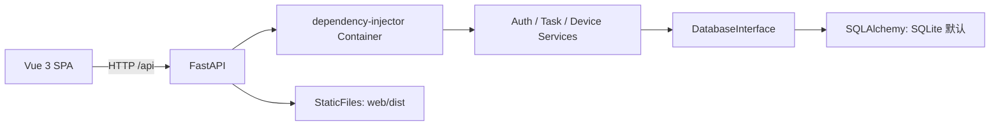
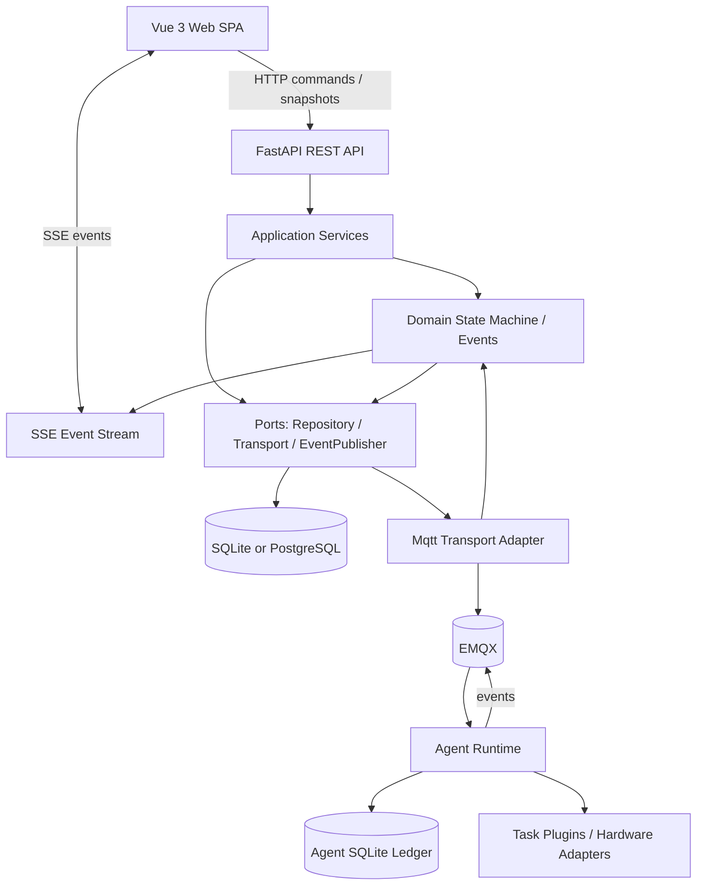
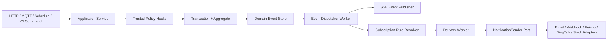
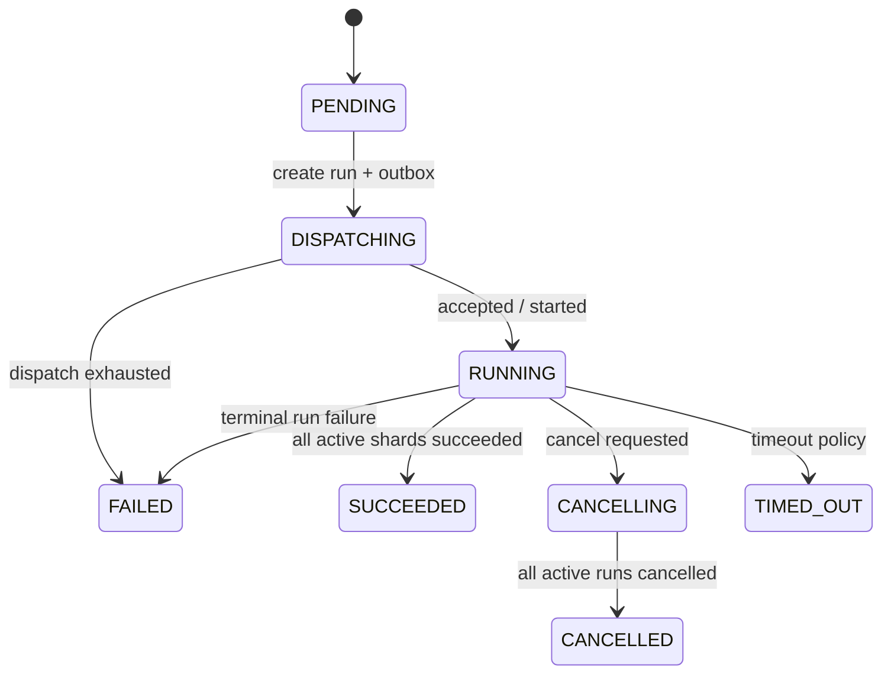
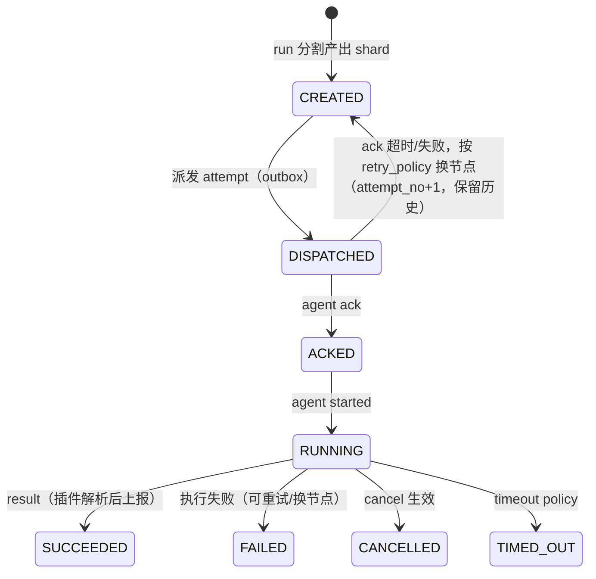
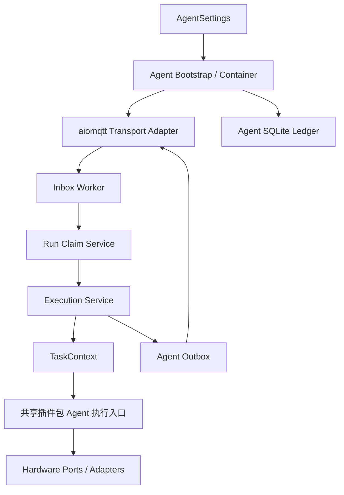
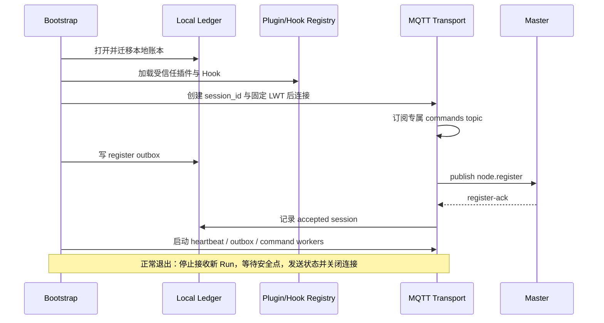
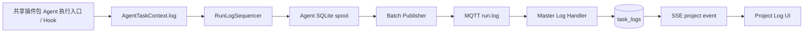
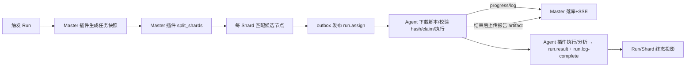

# 汽车电子测试平台（AETP）开发文档

**版本**：v4.10-draft
**日期**：2026-08-19
**状态**：P0/P1/P2/P3 完成；P4.1~P4.7 完成；P5 完成（P5.1~P5.7）；P6.1~P6.8 完成；P7 进行中（Web 已接入 Run、节点、插件中心、插件包生命周期、脚本库、任务定义与能力展示）
**适用范围**：Master、Web、后续 Agent、MQTT 协议、数据库、部署与测试

## 版本历史

| 版本 | 日期 | 主要变更 |
|---|---|---|
| v4.10 | 2026-08-19 | 实现 P8.1 Run 取消：Master 取消服务校验状态后向活跃 Shard 节点发 run.cancel outbox，Agent 在安全点释放硬件；新增前端取消按钮 |
| v4.9 | 2026-08-19 | 实现 P7.6 通知端点/事件订阅/投递状态：项目 owner 管理端点（密钥不回显）、maintainer 管理订阅、投递查询与重试；新增 9 条通知 API 测试 |
| v4.8 | 2026-08-19 | 完成 P7.4 任务定义核心闭环：脚本版本与用例勾选、项目节点绑定、能力告警、分割/重试/优先级策略、编辑校验和运行入口；Schedule 配置继续归 P8.2 |
| v4.7 | 2026-08-19 | 脚本库增加项目管理员删除脚本版本能力：未被任务定义引用时清理用例索引和存储文件；被引用时返回 409 保护 |
| v4.6 | 2026-08-19 | 收口插件包内 UI 架构：插件 UI 资源安装时校验并由 Master 安全托管；脚本上传页通过同源 iframe 加载插件入口，传递节点能力上下文；插件可请求 `script.verify`，Master 经 Agent outbox 下发并提供结果查询 |
| v4.5 | 2026-08-19 | 重构 P7.2 插件架构：配置页面随 ZIP 插件包发布在 `ui/`，Web 仅以 iframe 宿主加载；Master 提供项目节点能力上下文和 Agent `script.verify` 下发/回传接口；插件 UI 使用 `postMessage` 协议与宿主通信 |
| v4.4 | 2026-08-19 | 实现 P7.2：前端任务类型配置注册表、pytest 专用配置表单和未注册 task_type 的通用 JSON Schema 表单回退；`PluginMetadata.ui`/`/task-types` 暴露专用配置页标识和最低前端版本 |
| v4.3 | 2026-08-19 | 实现 P7.1：领域事件先持久化到 `domain_events` 再广播；SSE 强制项目范围授权，支持 `Last-Event-ID` 历史回放与标准 `id/event/data`；Web 按当前项目订阅并在断线重连时续传事件序号 |
| v4.2 | 2026-08-19 | 实现 P6.8：成功 case 耗时滚动平均（失败/取消/缺失耗时不计入）、by-time 缺省耗时配置、异常耗时领域事件 `case.duration_anomaly` 与样本丢弃；新增配置 `AETP_MASTER_CASE_DURATION_DEFAULT_S` / `AETP_MASTER_CASE_DURATION_ANOMALY_PERCENT` |
| v4.1 | 2026-08-19 | ① pytest 默认实时采集 `print`/`logging` 并写入 JUnit case stdout/stderr；② skipped/xfail 不再把 Run 判为失败，失败/错误 case 才影响 `passed`；③ Agent 从 `agent/data/runs` 工作目录生成报告，上传 JUnit XML 和 `artifact_paths` 附件到 Master；④ Web Run 详情支持展开查看 case 输出与产物下载 |
| v4.0 | 2026-08-19 | ① 明确 ZIP 插件持久化目录为 `master/data/plugins/{archives,packages,manifest.json}`，重启通过 manifest 恢复；② 修复插件下载端点测试搬移真实插件目录造成 manifest 丢失和 `plugins.bak-*` 嵌套；③ 增加 PluginManager 重启恢复回归测试，并恢复当前 pytest 插件安装状态 |
| v3.9 | 2026-08-19 | ① 修复单文件 pytest 脚本被物化为 `script.py` 导致收集 `0 items`：统一使用 `test_script.py`；② 分析结果 `passed=false` 时将 Agent Run 上报为 `failed`；③ Master 日志围栏允许声明范围内的迟到日志，避免 MQTT 跨主题乱序造成日志全丢；④ register-ack 路由先过滤主题，消除对 `commands/assign` 的误报 |
| v3.8 | 2026-08-19 | 修复外部测试进程输出空行导致 Agent `run.log` 收尾失败的问题：`TaskContext.log` 忽略空消息且不消耗日志序号，避免 `RunLogEntry.message` 非空校验异常；新增上下文回归测试 |
| v3.7 | 2026-08-19 | ① 修复 Windows Agent 使用 Selector 事件循环时 pytest 插件异步子进程无法启动的问题：改为线程中运行 `subprocess.Popen`，保留输出采集并支持取消终止；② 执行失败不再调用结果分析，避免空摘要被解析为当前目录 `.`；③ 单文件脚本物化为 pytest 默认可发现的 `test_script.py`，避免缓存 `.bin` 扩展名导致 pytest 收集不到用例；④ 同步已安装插件副本并新增相关回归测试 |
| v3.6 | 2026-08-18 | ① P7.3 脚本库：新增 `/projects/{id}/scripts` 上传/列表/详情/用例/重解析/下载 API（`ScriptService`：upload_spec 校验 → Master 插件 `verify_script` 快速失败 → `parse_cases` 生成用例索引，sha256 幂等复用）与 Web 脚本库页面；② P7.4 任务定义：新增 `/projects/{id}/test-tasks` CRUD API（引用脚本版本 + 默认勾选用例 + 节点/分割/重试策略，D-23 两层节点校验 + case 存在性校验 + 软删除）与 Web 任务定义页（case 勾选/分割策略/节点选择）；③ P7.5 Run 详情扩展：`GET /runs/{id}` 返回 case×attempt 结果矩阵（`run_case_results` 按 attempt 全量保留，D-20），Web Run 详情页新增结果矩阵表格；④ 节点能力展示：`NodeOut`/`ProjectNodeBindingOut` 暴露 `capabilities`/`plugin_versions`/`load`，Web 节点与设备/项目节点页渲染能力树（vehicle/language/system/serial）；⑤ Agent 能力自动扫描（`capability_loader.py`）：system（OS/内存/CPU 标准库检测）+ language（shutil.which 探测运行时版本）+ serial（`serial_ports.json` 映射文件 + 端口存在性检查，不存在的端口标记禁用）+ vehicle（`scan_vehicle()` 占位实现由台架侧按需实现），随 `node.register` 上报，替代手工维护能力 JSON；⑥ **Agent 插件按需下载安装（§18.8）**：Master `PluginManager.load_packages()` 为已安装 ZIP 插件注入 `agent_package`（`AgentPackageSpec`：签名下载 URL + sha256 + `main.py:package` 入口），新增 `PluginDownloadService` + 内部端点 `GET /internal/plugins/{plugin_id}/download`（限时 HMAC 签名，同脚本下载机制）；Agent `LocalPluginInstaller` 支持 `main.py:package` 文件入口加载（从 `PluginPackage` 取 Agent 面），`ensure_compatible` 检查本地版本——已有兼容版本直接复用，缺失/不兼容则下载安装后执行；`master/.env` 增 `AETP_MASTER_PUBLIC_BASE_URL`/`AETP_MASTER_INTERNAL_DOWNLOAD_TTL_S`；⑦ **脚本解包修复（§9.8）**：`RunOrchestrator._enrich_script_ref` 把缓存脚本包（zip/.py 单文件）**解包成临时目录**再注入 `script_ref.path`（此前直接注入缓存文件路径，pytest 插件 `execute` 把文件当目录 `cwd` 运行导致失败 + `analyze_results` 对无效报告路径 `ET.parse('.')` 抛 PermissionError）；Run 结束后清理临时目录；pytest 插件 `analyze_results` 对无效报告路径优雅返回（不抛异常）；⑧ 测试：新增 `test_script_upload_and_task_crud.py`（5 用例）、`test_agent_capability_scan.py`（7 用例）、插件下载端点/agent_package 注入测试与脚本解包测试，416 测试全绿 |
| v3.1 | 2026-08-13 | ① 勘误与基线刷新：SSE 事实、API/页面表补全、§7.5 编辑错误、配置键名前缀、§17 路径更新等；② 新增第 18 章“测试任务全生命周期设计”；③ 新增决策 D-14~D-23（多节点执行、用例勾选、插件数据接口、失败历史保留、case 耗时统计、状态命名统一、两层节点绑定）；④ §15 路线图拆分为大阶段 P0~P9 + 小阶段任务目标，并标注实施状态；⑤ 复查修补：术语表补 Script/Case/Artifact/Plugin、错误码补脚本/用例类、§6.4/§8.6 过时与术语修正、runs 详情/retry-failed/脚本下载端点、脚本库页面、插件版本兼容策略、解析能力声明、heartbeat load 结构、引用删除保护、指标与测试层级补充；⑥ P2.9 JWT iss/aud 严格校验 + P2.10 刷新令牌旋转/登出撤销（`refresh_tokens` 表 + `/auth/refresh`、`/auth/logout` + 前端静默续期）；⑦ P3.1 任务状态命名迁移（D-22）：`dispatching`/`cancelling`/`succeeded`/`timed_out`，Alembic 0003 数据回填+CHECK 重建，前后端引用同步；⑧ P3.2 `test_scripts`/`script_cases` 表与仓储（Alembic 0004，唯一约束、sha256 幂等、avg_duration_s/duration_samples、软删除）；⑨ P3.3 `test_tasks` 任务定义模型与仓储（Alembic 0005，脚本版本引用+FK 引用保护、默认用例集合 D-15、split_policy、node_ids D-23、retry_policy D-20）；⑩ P3.4 Run 执行域表与仓储（Alembic 0006：`task_runs`/`run_shards`/`shard_attempts`/`run_case_results`/`run_artifacts` + `results` 重定位为 Run 级汇总，唯一约束与索引按 §6.3，历史失败全量保留 D-20）；⑪ P3.5 可靠消息与审计表与仓储（Alembic 0007：`inbox_messages` 去重、`outbox_messages` 事务性 outbox+claim_due、`domain_events` sequence 事件顺序、`audit_logs` append-only）；⑫ P3.6 纯函数状态机（domain/state_machine.py：Task/Run/Shard/Attempt 四状态机迁移表与 can_transition/assert_transition/is_terminal，D-20 failover next_attempt_no，穷举合法/非法迁移测试）；⑬ P3.7 ports 端口层（domain/event_store.py EventStore、domain/hooks.py AdmissionHook/EventHook、domain/notifications.py NotificationSender/SecretStore，业务层不依赖 adapter，duck-typed 契约测试验证）；⑭ P3.8 任务类型插件数据接口（master/plugins/：TaskTypePlugin 纯数据接口 + CaseInfo/ShardSpec/CaseResult/TaskContext DTO + PluginRegistry 注册表与版本兼容校验，D-19 插件与 Master 仅数据耦合）；P3 大阶段全部完成；⑮ Shard 子任务语义增强（split_shards 产出每 Shard 专属 `execution_params`，run_shards 增列 Alembic 0008，Agent 插件 execute 使用）；⑯ 插件加载错误处理（plugins/errors.py：PluginNotFoundError=PLUGIN_NOT_FOUND、PluginVersionMismatchError=PLUGIN_VERSION_MISMATCH、PluginLoadError；PluginRegistry/ExecutionPluginRegistry 的 require/require_compatible 显式抛错，Master 派发前与 Agent run.assign 接收时共用）；⑰ 插件能力主动上报（plugins/capability.py：PluginCapability 上报 DTO + filter_supported Master 端筛查；ExecutionPluginRegistry.capabilities() 汇总 + revision 变更检测，随心跳周期上报、监测到变动主动上报，§9.4/§18.3，P4 接 MQTT 传输）；⑱ 脚本编译验证（TaskTypePlugin.verify_script：上传后、解析前快速失败，pytest py_compile / cdd 格式 / CANoe 工程完整性；有错 parse_status=failed 不进解析队列）；⑲ 验证位置（verify_location：master/agent 同构 D-17，CANoe 验证依赖 COM 下发 `script.verify`/`script.verify-result` 到 Agent 执行并回传，verify_id 幂等；Agent 侧 ExecutionPlugin.verify_script + PluginCapability.verify_location）；⑳ 插件 Entry Points 发现（PluginRegistry.discover / ExecutionPluginRegistry.discover，§10.6：从已安装受信任包 `aetp.plugins`/`aetp.execution_plugins` 入口点自动发现，零改码；与 uvicorn import_from_string 的任意配置字符串加载不同，限定受信任随包扩展，加载失败 → PLUGIN_LOAD_FAILED）；㉑ 执行编排层（WorkflowSpec + WorkflowEngine：domain/workflow.py + application/workflow_engine.py，把上传→验证→解析→分割→派发→回报的隐式时序改为显式工作流即数据，阶段重试/超时/事件统一处理，与状态机/事件/端口协同不推翻既有设计；§18.12）；㉒ P4.1 共享协议包（`common/src/aetp_protocol`，独立可安装 `aetp-protocol`（pip install -e common）：Envelope 统一消息封装（extra=forbid 非法字段拒绝、协议版本/未知类型/空 ID 校验）、MessageType 枚举+topic 段映射、topics 构建/解析/sender 身份校验（commands=master、events=agent 且 id==node_id）、核心 payloads DTO、golden messages；验收“非法字段、错误 topic/sender 被拒绝”测试覆盖） |
| v3.2 | 2026-08-13 | ① P4.2 MQTT 传输适配（domain/transport.py Transport 端口：connected/on_message/connect/disconnect/subscribe/publish 纯接口 + MqttMessage 消息 DTO + TransportError；application/backoff.py ExponentialBackoff 指数退避+jitter+封顶；adapters/mqtt/transport.py MqttTransport：aiomqtt 后台连接/重连循环、断连自动恢复订阅、TLS（CA 证书）、未连接 publish fail-fast、入站消息转 MqttMessage 分发 fail-open；§9.7 规则 5 断连重连验收测试覆盖）；② P4.3 Outbox worker（`master/workers/outbox_worker.py`：周期 `claim_due` 事务性取到期消息 → Transport 端口发布（payload dict→JSON bytes）→ 成功标记 succeeded / 失败指数退避推进 attempts 与 next_attempt_at / 超 max_attempts 标记 exhausted；断连期间消息停留 outbox、恢复后继续发送；单条失败 fail-open 不影响同批；复用 P3.5 `OutboxMessageRepository.claim_due`，验收“断连后 outbox 恢复发送”测试覆盖）；③ P4.4 节点在线投影（`application/services/node_presence_service.py` NodePresenceService：node.register 校验 sender 身份→关闭旧 session（SESSION_REPLACED）→upsert 节点→建新 session→outbox 回 register-ack（QoS 1）；node.heartbeat 校验当前会话→刷新 online/last_seen_at/load；presence（LWT）关闭会话+节点 offline；**旧 session 消息被拒绝**；Alembic 0009：node_sessions 表 + nodes.load 列 + nodes.status CHECK 扩展 busy/disabled（D-22）；NodeRepository.save + NodeSessionRepository）；④ P4.5 硬件能力匹配器（`domain/capability.py` 纯函数：`HardwareRequirements.from_dict` 结构化谓词解析（all/any 组合 + 能力值比较 gte/gt/lte/lt/eq/neq/in + tags 标签匹配）、`match_capability` 求值返回 `CapabilityMatch`（matched + 逐条件失败原因）、非法谓词抛 `CapabilityRequirementError`；`application/services/capability_service.py` CapabilityService：`require_node` 硬校验不满足抛 `NodeCapabilityMismatchError`（NODE_CAPABILITY_MISMATCH，§5.5/§18.5 D-23）+ `filter_candidates` 候选过滤；API 映射 409；any 组语义：任一满足即通过且不记失败；审查增强：①数值比较前类型规范化（纯数字字符串视为数值，防 Agent 字符串上报误伤），非数字/bool fail-closed 拒绝，eq/neq/in 数字字符串与数值视为相等；②能力值类型契约（仅标量/标量列表合法，嵌套 dict 明确拒绝）+ exists 操作符（布尔能力惯用：Lin/继电器/程控电源支持，value=true 存在且为真 / value=false 缺失或为假）；③错位诊断：NODE_CAPABILITY_MISMATCH 异常附节点实际能力键；④创建任务定义节点筛选（`TestTaskService.validate_node_selection`：node_ids ⊆ 项目绑定硬校验 PROJECT_ACCESS_DENIED + 从脚本硬件需求对选中节点能力匹配 + 无满足节点软校验告警，D-23 保存时校验；新增 ScriptNotFoundError/ProjectAccessDeniedError 映射 404/403）；⑤能力模型重构（审查驱动）：扁平能力字典升级为**层级能力树**（vehicle 车载[厂商→总线→通道] / language / system / serial 串口功能映射表[功能名→{port, enabled}]，Agent 从节点根目录能力配置文件读取、检测在线上报），`cap` 改为点分路径在树中定位叶子，路径终点是 dict 才拒绝嵌套对象，匹配器兼容单段扁平路径；⑥能力强类型化（审查驱动）：`aetp_protocol/capabilities.py` 定义 `NodeCapabilities`/`VehicleCapability`/`VendorCapability`/`SystemCapability`/`SerialCapability`/`SerialPortConfig`/`LanguageCapability` Pydantic 模型（extra=forbid 结构防变形，类内无 `dict[str, Any]`，命名扩展点用 `dict[str, T]` 值强类型；`NodeRegisterPayload.capabilities` 由 `dict[str, Any]` 改为 `NodeCapabilities` 模型，非法结构/类型错误反序列化即拒）；⑦判定器分派（审查驱动）：`Requirement.kind` 判定类型（numeric/version/boolean/channels/serial_port/text）+ 对应判定器类（`NumericJudge`/`VersionJudge`/`BooleanJudge`/`ChannelJudge`/`SerialPortJudge`/`TextJudge`）经 `_JUDGES` 注册表分派——**不同能力类型判定逻辑不同**：语义化版本比较（`"17.10" > "17.2"` 正确，CANoe/OS/语言版本）、通道列表（in 成员/gte 数量）、串口（port/enabled）、布尔（exists）；显式 kind 优先、缺省按路径/操作符推断；操作符语义表与能力层级模型见 §18.5） |

| v3.3 | 2026-08-14 | ① P4.5 能力匹配规格模式重构（`domain/capability.py`：`CapabilitySpec` 协议 + `AllOf` 组合 + `VehicleSpec`/`LanguageSpec`/`SystemSpec`/`SerialSpec`/`TagSpec` 五个规格 + `CapabilityEvaluator` 唯一求值器，新增能力类别只需新增一个规格类）；② P4.6 资源与调度分离（新增 `domain/resources.py`：`PhysicalDeviceMatcher`/`NodeSchedulingState`/`ResourceAssignment`/`ResourceAllocator` 原子回溯分配；`domain/scheduler.py` 瘦身为候选过滤+排序+failover 纯编排）；③ Agent 硬件驱动骨架（`agent/drivers/`：`Driver` 协议 + `ResourceMeta` + `DriverRegistry`，品牌/协议差异隔离在 Agent 侧，新硬件=新增一个 Driver）；④ 服务层与测试同步；⑤ 资源标签能力（`PhysicalDeviceCapability.labels` 用户自定义标签 + `DeviceRequirement.required_labels` must 硬约束 / `preferred_labels` prefer 软约束 + `DeviceAllocation.labels` 回传，解决同型号硬件接线不同的拓扑问题）；⑥ 切换开关连接路径（`PhysicalDeviceCapability.connection` + `SwitchPort` 端口独立标签 + `DeviceRequirement.allow_switching` + `DeviceAllocation.switch_route` 回传，单 CAN + 继电器切换多项目，端口占用整组排队）；⑦ 脚本签名下载端点（P4.7：`/api/v1/internal/scripts/{id}/download` 限时 HMAC 签名 URL + `X-Checksum-Sha256` 响应头校验，`run.assign` 的 `script_ref` 携带 `download_url`，Agent 下载后校验 sha256）；⑧ 文件存储抽象（`domain/storage.py` Storage 端口 + `adapters/storage/local_storage.py` 本地实现 + `ScriptStorageService` 统一脚本文件键规则与读写，上传/下载统一走端口，默认本地 `data/` 目录，后续切 OSS/S3 仅换 adapter）；⑨ P5.1 Agent 配置（`agent/config.py` `AgentSettings` 组合根模式仅从外置 `.env` 读取 `AETP_AGENT_` 前缀、不读系统环境变量 + `agent/container.py` 容器骨架）；⑩ P5.2 本地账本（`agent/domain/ledger.py` Ledger 端口 + `agent/adapters/sqlite/ledger.py` SQLiteLedger：agent_runs / inbox / outbox / task_log_spool / script_cache 五表，run_id 主键原子 claim，枚举 `agent/domain/enums.py`），278 测试全绿 |
| v3.4 | 2026-08-17 | ① P5.3 注册与心跳（Transport/Backoff 共享模块移入 common，`AgentRuntime` 统一启动/关闭，AgentMqttTransport 使用 aiomqtt identifier、固定 Envelope LWT + 指数退避重连，重连重新注册，严格校验 register-ack 关联/session，心跳负载取自本地账本活动 Run）；② Agent outbox 事务性 sending 租约与低等级日志 spool 容量淘汰，error 日志保留；③ AgentSettings 必填项/范围校验，根 wheel 包含 Agent 与 common 模块；④ P5.4 命令处理（`CommandDispatcher` 严格 Envelope+sender.id 校验、Inbox 去重、先原子 claim 后 ACK outbox、重复 assign 幂等 ACK、run.cancel 设置取消标志）；⑤ P5.5 双端插件 registry（Master 负责解析/分片/硬件需求/验证，Agent 独立执行协议负责执行/日志/结果/进度；`run.assign.plugin_ref` 按需下载、SHA-256 校验、隔离安装、重启恢复，Node 持久化 plugin_versions）；⑥ P5.6 脚本下载缓存（`agent/application/services/script_cache_service.py`：`run.assign` 后按 `script_ref` 下载、SHA-256 校验、按 hash 组织目录缓存并写入 `agent_script_cache`，校验失败不落缓存，失败回 ACK(rejected) 可重试）；⑦ P5.7 可选 Agent 辅助预检/解析 worker（`agent/application/services/script_preflight_service.py`：`script.verify`/`script.parse` 命令复用 P5.6 缓存下载解包后调用插件 Agent 入口 `verify_script`/`parse_cases`，回传 `script.verify-result`/`script.parse-result`，按 `verify_id`/`parse_id` 幂等；插件经 `verify_location`/`parse_location` 声明台架侧能力，主用例索引仍由 Master 生成）；⑧ P6.1 执行服务（`agent/application/services/execution_service.py`：`ExecutionService` 并发上限（`max_concurrent_runs` 信号量排队，排队中可被取消唤醒）+ 超时（`timeout_s`，0=不限制）+ 取消 token（`CancellationToken`，排队/执行前检查点 + 取消信号与插件任务竞争，`run.cancel` 触发）+ 异常映射（成功/失败/取消/超时回写账本并返回 `ExecutionResult`）；容器装配单例，`run.cancel` 命令触发取消 token）；⑨ P6.2 任务上下文（`common/src/aetp_protocol/logs.py`：`RunLogEntry`/`RunLogBatch` 严格模型（entries 按 sequence 递增、first_sequence=首条）+ `LogLevel`；`payloads.py` 补 `RunProgressPayload`/`RunCaseStatusPayload`；`agent/application/services/task_context.py`：`TaskContext` 实现 `AgentTaskContext` 协议——`log`/`capture_log` 写 spool（`(run_id, sequence)` 幂等）、`progress`/`case_status` 入 outbox（稳定 ID 幂等覆盖）、`build_log_batch` 组装 `RunLogBatch`、`is_cancelled`/`raise_if_cancelled` 对接取消 token）；⑩ P6.3 插件分割策略（`master/plugins/sharding.py`：`split_none`/`split_by_case_count`/`split_by_time` 共享纯函数，by_time 按 case 耗时切到目标时长、缺耗时 case 按可配置默认值参与切片（D-21）、单 case 超限不丢失，供插件 split_shards 复用）；⑪ P6.4 随包执行插件端到端闭环（Master：`run_trigger_service.py` 任务定义→插件 `split_shards` 分割→`TaskRun`+`RunShard` 创建→`ShardSchedulerService.schedule_run` 派发；`run_projection_service.py` 投影 ack/progress/log/result→Attempt/Shard/Run 终态 + `results` 汇总 + 设备释放；`message_router.py` 严格 Envelope 校验后路由投影；`mqtt_runtime.py` 订阅 `aetp/v1/agents/+/events/#` + outbox worker；`run_logs` 表 Alembic 0012（`(run_id, sequence)` 幂等）；`/api/v1/projects/{id}/runs` 触发/列表/详情/日志端点；Agent：`run_orchestrator.py` 编排器 claim→执行→`collect_logs`→`run.log` 分批上报→`analyze_results`→`run.result` 稳定 outbox ID 上报，`run.result` 增 `shard_id` 定位 attempt）； |
| v3.5 | 2026-08-18 | ⑫ P6.5 Agent 结果分析（`common/src/aetp_protocol/payloads.py` 增 `CaseResultEntry` 强类型 case 结果（case_key/status 白名单/duration_ms≥0），`run_orchestrator.py` 归一化 `analyze_results` 产出为类型化 `case_results`，分析异常/非 Mapping/结构非法统一标记 result=failed（§9.8 保留原始报告不误报 succeeded），Master `_persist_case_results` 兼容类型化条目）；⑬ P6.6 结束产物上传 + 日志围栏（`payloads.py` 增 `RunLogCompletePayload`（run_id/last_sequence/entry_count/artifact_refs）；`task_runs` 增 `log_complete`/`last_log_sequence` 列（Alembic 0013）；`run_projection_service.handle_log_complete` 置位围栏 + `handle_log` 围栏后拒绝日志；`run_orchestrator` flush 后发布 `run.log-complete`（稳定 outbox ID）；`artifact_service.py`/`artifact_storage_service.py` 产物登记与文件存储（Storage 端口），`/api/v1/internal/runs/{id}/artifacts` 上传 + `/projects/{id}/runs/{id}/artifacts` 列表/下载；`python-multipart` 入依赖）；⑭ P6.7 三层重试 + 失败历史全量保留（`run_retry_service.py`：retry=新 Run（trigger_type=retry，trigger_context 引用原 run_id）；retry-failed=失败 case 新 Run（按 (case_key, attempt_no) 取最新 attempt，仅 failed/error 重跑）；failover 同 Run 新 Attempt 由 ShardSchedulerService 复用；`/api/v1/projects/{id}/runs/{id}/retry`、`.../retry-failed` 端点；RunTriggerService 补 trigger_context），401 测试全绿 |
| v3.5 | 2026-08-18 | Web 接入 P6 Run 闭环：新增 Run API 类型与调用封装、任务触发入口、Run 列表/详情页、运行日志/Shard/结果/产物查看与下载、失败 Run 重试和 SSE 运行事件刷新；明确 Master/Agent 端到端已实现，但 Web 原先未接入 |
| v3.5 | 2026-08-18 | 新增插件中心：Master 提供 `/api/v1/task-types` 只读清单，Web 展示任务类型、版本兼容、Master/Agent 能力、配置 Schema 与上传规格 |
| v3.5 | 2026-08-18 | 新增受控插件包生命周期：平台管理员可上传 wheel、安装、启用/停用和删除；插件不在当前 Master 进程热加载，重启后通过受信任 entry point 发现 |

---

## 0. 文档使用规则

### 0.1 目的

本文档是后续开发的实施蓝图，但严格区分以下四类内容：

| 标记 | 含义 | 是否可直接依赖 |
|---|---|---|
| ✅ 已实现 | 已存在于当前代码，且已做过基础验证 | 可以 |
| 🟡 已有骨架 | 路径、配置或模型存在，但尚未形成完整能力 | 仅能作为改造起点 |
| 📐 目标设计 | 推荐的未来实现，尚未写入代码 | 需按计划实施 |
| ⏳ 待决策 | 需要产品或技术负责人确认的选择 | 未确认前不得据此改动现有代码 |

**约束**：任何未来代码变更都必须先更新本文档中的“已实现状态”或“待决策记录”。不得把设计态内容写成已交付内容。

### 0.2 本次审计结论

旧文档存在以下严重问题，已在本版本中修正：

1. 将未存在的 `shared/protocol`、`agent/ledger`、`master/adapters/sql/store`、WebSocket、Inbox/Outbox 等写成已实现。
2. 文档 API 为 `/api/v1` 和统一 `code/message/data` 包装；当前代码已统一使用 `/api/v1/*`，成功响应仍直接返回 Pydantic 资源。
3. 旧文档曾将完整 MQTT、状态机、可靠执行、切片、重试和插件执行闭环描述为现状；当前已落地的是协议、调度基础、共享插件包 registry/版本/安装边界，完整执行闭环仍属于 P6。
4. 文档一处写“前端未实现”，另一处写“前端已通过 EMQX 联调”，与当前 Vue 前端事实冲突。
5. 原协议示例同时使用 `timestamp` 与 `sent_at`、`node_id` 与 `sender_id`，且错误地假设 MQTT LWT 能携带动态的当前运行任务快照。

本文件不删除这些业务目标，而是将其重写为可分阶段落地的目标设计。版本历史中 P3.8 的“插件与 Master 仅数据耦合”是旧版对 Master 侧数据接口的记录；当前统一采用“同一插件包 + Master 任务面 + Agent 执行面”的定义，后续以第 18.2 节为准。本轮插件逻辑重写已完成共享 `PluginPackage` 契约、双端同入口 registry、Master 任务定义生成接口和 Agent 执行入口安装校验，319 个测试全绿。

### 0.3 术语

| 术语 | 定义 |
|---|---|
| Master | 主服务：HTTP API、调度、MQTT 接入、数据持久化、实时事件服务 |
| Agent | 部署在测试台架上的执行端，加载同一任务类型插件包的 Agent 执行面，接收命令、执行脚本、采集日志、分析结果并上报事件 |
| Broker | 独立 MQTT 消息服务器，推荐 EMQX |
| Node | 已注册 Agent 的业务实体，以稳定 `node_id` 识别 |
| Task | 用户创建的逻辑测试请求 |
| Shard | 一次 Run 内由插件分割策略产出的可独立调度子任务；单个 Shard 同一时刻只在一个 Node 执行 |
| Run | 一次触发的实际执行实例（唯一 `run_id`）；用户/系统重试产生新 Run；派发层换节点 failover 与 case 级重试在同一 Run 内产生新 Attempt |
| Attempt | 一个 Shard 向某个 Node 的一次派发尝试；换节点重试递增 `attempt_no`，历史失败信息全量保留 |
| Dispatch | Master 向指定 Agent 投递某个 Shard Attempt 的一次派发意图 |
| Envelope | 所有 MQTT 业务消息共用的版本化外层结构 |
| Inbox | 接收端去重的入站消息持久化记录 |
| Outbox | 与业务事务一起写入、由后台可靠发布的待发送消息记录 |
| Script | 测试脚本：上传到 Master 的脚本包（zip/.py/.cdd/CANoe 工程），按 `ScriptVersion` 版本化，含配置与硬件要求 |
| Case | 测试用例：插件从脚本解析出的用例索引项，以 `stable_key` 稳定标识，可被勾选、分割与统计耗时 |
| Artifact | 产物：测试结束后上传的报告/日志归档/数据文件，是共享插件包 Agent 结果分析入口的输入 |
| Plugin | 任务类型插件：同一版本的 Python 包同时安装到 Master 和 Agent；Master 面负责任务生成/解析/分割/校验/资源需求，Agent 面负责脚本执行/日志整合/结果分析/进度上报 |
| SSE | Server-Sent Events，服务端向浏览器单向推送事件的 HTTP 长连接 |

---

## 1. 当前实现事实基线

本章是当前代码唯一事实源。后续章节的设计如与本章冲突，以本章描述当前行为，以“待决策”章节描述未来改造方向。

### 1.1 当前运行拓扑



当前没有 MQTT 客户端、没有 Agent、没有调度器、没有 WebSocket、没有任务执行器；SSE 已有基础实现（进程内 `EventBus` + `/api/v1/events`，事件不持久化，单进程部署前提）。

### 1.2 当前目录与模块

```text
AutomotiveElectronicsTestPlatform/
├── alembic.ini                       # Alembic 配置（项目根目录）
├── migrations/                       # Alembic 迁移（env.py + versions/）
│   └── versions/0001_initial_schema.py  # 初始基线：全部表结构
├── master/
│   ├── .env / .env.example            # Master 组件外置配置（AETP_MASTER_ 统一前缀）
│   ├── data/aetp.db                   # 当前 SQLite 数据库（master/ 组件根下）
│   ├── run.py                        # CLI 入口、配置初始化、uvicorn 启动
│   ├── config.py                     # MasterSettings、configure/get_settings（AETP_MASTER_* 前缀）
│   ├── main.py                       # FastAPI、lifespan（启动安全校验/迁移/管理员 bootstrap）、
│   │                                 #   健康检查（DB 探活）、前端静态资源挂载
│   ├── domain/                       # 纯领域层（无 SQLAlchemy/FastAPI 依赖）
│   │   ├── enums.py                  # 全部 StrEnum（账户/平台/项目/任务/设备/节点状态）
│   │   ├── time.py                   # UTC 时间工具
│   │   ├── models/                   # 领域对象（dataclass）：User/Project/Node/Device/
│   │   │                             #   ProjectMember/Task(含状态机)/TaskLog/Binding
│   │   └── repositories.py           # 仓储接口（Port）+ UnitOfWork 契约
│   ├── application/                  # 应用层（用例编排）
│   │   ├── errors.py                 # 应用业务异常（API 层统一映射 HTTP）
│   │   └── services/                 # Auth/Task/Device/Project/Member/Node/Binding 服务
│   │                                 #   （依赖 UnitOfWork，返回领域对象）
│   ├── adapters/                     # 适配器层
│   │   ├── sqlalchemy/
│   │   │   ├── database_interface.py # DatabaseInterface 抽象（连接/Session/迁移）
│   │   │   ├── database_factory.py   # URL scheme -> 具体实现
│   │   │   ├── impl_registry.py      # 实现注册表
│   │   │   ├── base_impl.py          # 通用实现（threading.Lock 迁移互斥）
│   │   │   ├── sqlite/mysql/postgres_impl.py
│   │   │   ├── orm/                  # SQLAlchemy ORM 模型（表结构唯一事实源，无业务逻辑）
│   │   │   ├── repositories/         # 仓储实现（ORM ↔ 领域对象映射）
│   │   │   └── uow.py                # SqlAlchemyUnitOfWork（跨仓储事务）
│   │   └── sse/                      # SSE 事件总线（EventBus + DomainEvent）
│   ├── bootstrap/
│   │   └── container.py              # dependency-injector 容器（database/uow_factory/event_bus/服务）
│   └── api/v1/
│       ├── deps.py                   # FastAPI Depends、JWT 当前用户解析（走 UoW 仓储）
│       ├── schemas.py                # 全部 DTO（含 admin 审核 schema）
│       ├── security.py               # JWT 签发/解码/启动校验
│       ├── rate_limit.py             # 登录/注册滑动窗口限流
│       ├── errors.py                 # ApplicationError -> HTTP 统一映射
│       ├── permissions.py            # 平台/项目角色策略
│       └── routes/                   # auth/admin/projects/nodes/project_devices/
│                                     #   project_tasks(分页+SSE)/assets/events(SSE)
├── web/                              # Vue3 + Element Plus + TanStack Query + Pinia
│   └── src/ api/ client.ts|endpoints.ts|sse.ts | composables/useTaskEvents.ts |
│       stores/ | views/(Element Plus 布局+项目切换器) | router/
├── agent/                            # Agent 配置、Runtime、账本、共享插件包 Agent registry/installer
└── common/                           # 共享代码
```

### 1.3 当前 API 契约

| 方法 | 路径 | 鉴权 | 当前行为 |
|---|---|---|---|
| GET | `/api/v1/health` | 否 | 返回 `{"status":"ok"}` |
| POST | `/api/v1/auth/register` | 否 | 创建本地用户 |
| POST | `/api/v1/auth/login` | 否 | 返回 JWT 访问令牌 + 刷新令牌（含 expires_in） |
| POST | `/api/v1/auth/refresh` | 否（凭刷新令牌） | 轮换刷新令牌并返回新令牌对；旧令牌同一事务撤销 |
| POST | `/api/v1/auth/logout` | 否 | 撤销携带的刷新令牌（204） |
| GET | `/api/v1/auth/me` | 是 | 返回当前用户 |
| GET | `/api/v1/projects` | 是 | 返回当前用户所属项目（platform_admin 返回全部） |
| POST | `/api/v1/projects` | platform admin | 创建项目并指定首个 owner |
| GET/PATCH | `/api/v1/projects/{project_id}` | 是 | 查看项目 / 修改项目元数据 |
| GET/POST | `/api/v1/projects/{project_id}/members` | project maintainer / owner | 查询成员 / 分配项目角色 |
| PATCH/DELETE | `/api/v1/projects/{project_id}/members/{user_id}` | project maintainer / owner | 修改项目角色 / 移除成员 |
| GET | `/api/v1/projects/{project_id}/nodes` | 是 | 项目绑定节点列表 |
| POST | `/api/v1/projects/{project_id}/nodes` | project maintainer / owner | 将节点绑定到项目 |
| PATCH/DELETE | `/api/v1/projects/{project_id}/nodes/{node_id}` | project maintainer / owner | 启用禁用 / 解除项目节点绑定 |
| GET | `/api/v1/users` | platform admin | 分页查询账户、审核 pending 用户 |
| PATCH | `/api/v1/users/{user_id}` | platform admin | 激活/禁用账户、修改平台角色 |
| GET | `/api/v1/assets/nodes` | 是 | 全局节点资产（只读） |
| GET | `/api/v1/assets/nodes/{node_id}` | 是 | 全局节点详情（只读） |
| GET | `/api/v1/assets/devices` | 是 | 全局设备资产（只读） |
| GET | `/api/v1/assets/devices/{device_id}` | 是 | 全局设备详情（只读） |
| POST | `/api/v1/projects/{project_id}/tasks` | project operator | 创建项目内 `pending` 任务，不派发 |
| GET | `/api/v1/projects/{project_id}/tasks` | project viewer / operator / maintainer / owner | 查询项目任务，可按 device/status 过滤，支持 limit/offset 分页 |
| GET | `/api/v1/projects/{project_id}/tasks/{task_id}` | project viewer / operator / maintainer / owner | 返回项目范围任务详情 |
| GET | `/api/v1/projects/{project_id}/tasks/{task_id}/logs` | project viewer / operator / maintainer / owner | 返回项目范围任务日志 |
| GET | `/api/v1/projects/{project_id}/devices` | project viewer | 返回项目绑定节点下的设备 |
| GET | `/api/v1/projects/{project_id}/devices/{device_id}` | project viewer | 返回项目范围设备详情 |
| GET | `/api/v1/events?project_id={project_id}` | project viewer 以上 | 项目范围 SSE；先回放 `Last-Event-ID` 之后的 `domain_events`，再推送实时事件 |

当前 API 已统一使用 `/api/v1` 前缀，并且任务、设备等业务资源必须携带 `project_id`；尚未采用统一成功响应包装，当前前端已同步使用 v1 项目范围路径。

### 1.4 当前实体与数据表

| 表/模型 | 当前字段摘要 | 当前用途 |
|---|---|---|
| `users` / `User` | id、username、password_hash、display_name、account_status、platform_role、时间戳 | 本地登录用户 |
| `nodes` / `Node` | id、node_id、name、hostname、status、online、enabled、tags(JSON)、capabilities(JSON)、protocol_version、last_seen_at、时间戳 | Agent 执行节点 |
| `devices` / `Device` | id、device_id、node_pk(FK)、name、status、online、last_seen_at、时间戳 | 设备视图；当前无 MQTT 写入来源 |
| `projects` / `Project` | id、project_id、project_key、name、description、status、created_by、时间戳 | 项目边界 |
| `project_members` / `ProjectMember` | id、project_pk(FK)、user_id(FK)、project_role、assigned_by、时间戳 | 项目内授权 |
| `project_node_bindings` / `ProjectNodeBinding` | id、project_pk(FK)、node_pk(FK)、enabled、assigned_by、时间戳 | 项目可调度节点范围 |
| `tasks` / `Task` | id、task_id、project_pk(FK)、device_pk(FK)、created_by(FK)、status、command(JSON)、result(JSON)、error、started_at、finished_at、时间戳 | 待派发任务占位 |
| `task_logs` / `TaskLog` | id、task_pk(FK)、sequence、level、message、ts、时间戳 | 日志查询占位 |

**2026-08-12 重构说明**：
- 全部外键统一为代理主键 int FK（project_pk / node_pk / device_pk / task_pk），业务字符串标识（project_id / node_id / device_id / task_id）仅作唯一业务键，数据库级参照完整性由 FK + CHECK 约束保证。
- `command` / `result` / `tags` / `capabilities` 为结构化 JSON 列（PostgreSQL 用 JSONB）。
- 时间戳统一 UTC（`UTCDateTime`，写库 naive UTC、读取补时区）。
- 状态字段带 CheckConstraint，领域层 StrEnum 贯穿（详见 `master/domain/enums.py`）。
- 领域对象（`domain/models/`）与 ORM 模型（`adapters/sqlalchemy/orm/`）分离，由仓储负责转换。

### 1.5 当前数据库与依赖注入

- `DatabaseInterface` 抽象连接、Session、迁移与关闭能力；按 URL scheme 分发 SQLite/MySQL/PostgreSQL 实现。
- 迁移：Alembic 显式迁移（`migrations/` 位于项目根目录，基线 `0001_initial_schema`）；启动时自动 `upgrade head`（可配 `AETP_MASTER_AUTO_MIGRATE` 关闭），迁移互斥使用 `threading.Lock`。
- 领域层（`domain/`）不依赖任何框架；应用服务通过 `UnitOfWork` 访问仓储接口（`domain/repositories.py`），由 `adapters/sqlalchemy/repositories/` 实现。
- `Container.database` 是进程单例；`uow_factory` 每个业务操作新建一个 UoW（同一事务内多个仓储）；`event_bus` 为 SSE 事件总线单例；各 Service 为 Factory。
- FastAPI 通过 `app.state.container` 和 `Depends` 解析依赖；`get_current_user` 通过 UoW 仓储加载用户。
- 启动时校验 JWT 密钥强度（收敛在 `main.py` lifespan，覆盖所有启动入口）；登录/注册按 IP 滑动窗口限流；健康检查探活数据库。

### 1.6 当前 Web 页面

| 页面 | 路由 | 当前能力 |
|---|---|---|
| 登录/注册 | `#/login` | 本地注册（pending）、JWT 登录，Element Plus 表单 |
| 仪表盘 | `#/dashboard` | 统计卡片 + 最近任务（TanStack Query 缓存 + SSE 实时失效） |
| 项目列表 | `#/projects` | 项目浏览与进入 |
| 任务列表 | `#/tasks` | 分页列表、设备下拉 + JSON 参数创建任务、SSE 实时刷新 |
| 任务详情 | `#/tasks/:taskId` | 基本信息（JSON 命令/结果）、历史日志（SSE + 轮询兜底） |
| 设备列表 | `#/devices` | 设备状态列表 |
| 项目成员 | `#/members` | 项目成员与角色管理 |
| 平台账户 | `#/users` | 账户审核（platform_admin） |

布局含 **项目切换器**（顶部下拉），切换后各页面数据自动刷新；整体基于 Element Plus 组件库与 TanStack Query 数据缓存。当前页面不含完整 RBAC 控制、取消/重试/结果报表。

---

## 2. 审计发现、风险与改进建议

> **2026-08-12 实施状态**：本次大重构已落地以下项（R-01~R-10 中的对应项）：
> - R-01 配置前缀已统一为 `AETP_MASTER_*`（含 `.env` / `.env.example` / `config.py` / 测试）；
> - R-02/R-03 JWT 启动时校验密钥强度 + 登录/注册按 IP 限流；密码已用 Argon2id；
> - R-04 开放注册新账户 `pending` 零权限 + 管理员审批（已实现）；
> - R-05 Alembic 显式迁移移至项目根 `migrations/`，迁移互斥用 `threading.Lock`；
> - R-06 数据模型重构：代理主键 int FK、JSON 结构化列、UTC 时区、枚举 CHECK、`Task.created_by` 审计；
> - R-09 前端引入 Element Plus + TanStack Query + 项目切换器 + SSE 实时事件流；
> - R-10 `pyproject.toml` 作为依赖唯一来源、pytest 测试（47 用例）全绿、`.gitignore` 与 `.env.example` 已建。
> 以下 R-08 已由文档维护解决；R-07（任务派发/调度）属后续阶段，未在本轮实施。

本章描述当前代码和旧文档中不合理、不规范或会阻塞后续开发的点。除非在第 16 章被确认，以下内容只是建议，不修改当前代码。

| 编号 | 优先级 | 发现 | 风险 | 推荐方案 | 是否需要改现有代码 |
|---|---|---|---|---|---|
| R-01 | P0 | `.env` 使用 `AETP_MASTER_HTTP_HOST/PORT`，代码曾读取 `AETP_HTTP_HOST/PORT` | HTTP 配置覆盖失效；host 若带 `http://` 会导致 uvicorn 参数非法 | ✅ 已实施：统一为 `AETP_MASTER_HTTP_HOST=127.0.0.1`、`AETP_MASTER_HTTP_PORT=8000`（`.env` / `.env.example` / `config.py` / 测试） | 已改 |
| R-02 | P0 | 当前 JWT 密钥过弱，文档/配置不应出现真实密钥 | token 可伪造 | 外置高熵随机密钥；生产启动时拒绝开发默认值 | 是，P1 |
| R-03 | P0 | 密码使用 salt + SHA-256 | 不适合口令存储，抗暴力破解能力弱 | 升级为已确认的 Argon2id；支持旧 hash 验证后自动升级 | 是，P2 |
| R-04 | P0 | 开放自注册且当前 role 未授权 | 未授权用户可创建账号和任务 | 允许公开注册但新账户为 `pending` 零权限；平台审批 + 项目范围 RBAC | 是，P2 |
| R-05 | P1 | 自动 schema diff 只适合简单加列/索引 | 改类型、改约束、删列或重命名会失控 | 引入已确认的 Alembic；自动 diff 仅保留开发期或移除 | 是，P1 |
| R-06 | P1 | Task/Device 关系没有真实 FK，Task.command/result/error 为文本 | 无参照完整性，结构化数据不可查询，扩展 Run/Shard 困难 | 采用已确认的目标数据模型、JSON 文本规范化、显式迁移、FK/唯一约束 | 是，P3 |
| R-07 | P1 | 当前任务只入库，不校验设备/任务类型，不派发 | 前端显示“创建成功”，但任务永不执行 | 先冻结协议与状态机，再实现可靠调度和 Agent | 是，后续阶段 |
| R-08 | P1 | 旧文档把大量未来功能写成已交付 | 后续开发依据错误，形成错误耦合 | 使用本文件的状态标记和决策记录 | 否，本文已处理 |
| R-09 | P2 | 当前前端无组件库、分页、缓存/失效、实时流 | 页面扩展时重复实现，运行态信息陈旧 | 采用已确认的 Element Plus 和 TanStack Query；项目范围缓存与 SSE 事件流 | 是，P7 |
| R-10 | P2 | 无测试目录、依赖清单、显式迁移、打包脚本 | 无法稳定复现与交付 | 增加 `pyproject.toml`/锁文件、pytest、Alembic、PyInstaller spec | 是，后续阶段 |

---

## 3. 已确认的架构决策

以下决策已确认，后续实现应以此为准；任何改动必须先更新决策记录和迁移方案。

| 决策 ID | 事项 | 推荐方案 | 备选方案 | 影响范围 | 状态 |
|---|---|---|---|---|---|
| D-01 | 共享协议包名称 | 在 `common/` 建独立、可安装的 `aetp_protocol` Python 包（src layout） | 新建顶层 `shared/` | Master/Agent/测试 | ✅ 已接受 |
| D-02 | API 版本化 | 全部 HTTP API 统一使用 `/api/v1` | 保留未版本化 `/api` | 后端/前端 | ✅ 已接受 |
| D-03 | 实时推送 | SSE：HTTP 负责命令，SSE 负责状态/日志 | WebSocket | Master/Web | ✅ 已接受 |
| D-04 | MQTT 客户端 | `aiomqtt`（纯 asyncio，Windows 使用默认 Proactor 事件循环即可） | Paho 2.x 线程桥接 | Master/Agent | ✅ 已接受 |
| D-05 | 密码哈希 | Argon2id，支持旧 salt$sha256 平滑升级 | bcrypt | Auth/迁移 | ✅ 已接受 |
| D-06 | 数据库迁移 | Alembic 显式迁移；停止生产自动 diff | 继续自动 diff | DB/部署 | ✅ 已接受 |
| D-07 | 目标领域数据模型 | Node/Task/Run/Shard/Inbox/Outbox 设计 | 维持简化 Task/Device 模型 | DB/协议/调度 | ✅ 已接受 |
| D-08 | 生产注册与权限 | 允许公开注册；新账户默认 `pending` 零业务权限；平台管理员审批账户，项目 owner/maintainer 分配项目角色 | 注册即授予项目权限，或无项目范围校验 | 安全/API/Web | ✅ 已接受 |
| D-09 | 前端组件与数据缓存 | Element Plus + TanStack Query（Vue） | 继续原生 CSS + 自建缓存 | Web | ✅ 已接受 |
| D-10 | 数据库路线 | 单 Master 前期 SQLite，达到阈值后迁 PostgreSQL | 立即 PostgreSQL | 部署/迁移 | ✅ 已接受 |

次级决策 D-11：外部业务 ID 采用 **ULID**。实现必须使用非单调、密码学安全随机数生成器；ULID 仅用于标识和排序，绝不作为授权或访问凭证。

次级决策 D-12：**项目（Project）是任务、CI/CD 集成、成员权限、节点可用范围和实时事件授权的共同边界**。账户的审批与禁用由平台管理员管理；业务权限由项目成员角色决定。✅ 已接受

次级决策 D-13：**通知、外部回调与生命周期扩展统一基于持久化领域事件、Hook 端口和通知端口实现**；核心任务、MQTT、Web 与 Agent 代码不得直接依赖任何具体平台 SDK。✅ 已接受

### 3.1 推荐原则

1. 不拆微服务、不引入 Redis/Kafka/NATS，直到单进程 Master 出现明确吞吐或 HA 需求。
2. 一个 Master exe 内运行 HTTP API、MQTT 适配器、调度器、Outbox worker、SSE hub、SQLite/PostgreSQL adapter。
3. 命令走 HTTP/MQTT，事件走 MQTT/内部事件总线/SSE；浏览器不直连 MQTT。
4. Master 是任务状态的唯一权威；Agent 上报事实，不自行决定任务最终投影。
5. 所有可重试消息使用 `message_id`、`run_id`、`dispatch_id` 三层身份，而不是用 `task_id` 去重执行。

---

## 4. 目标总体架构（设计态）

### 4.1 目标拓扑



### 4.2 分层和依赖方向

```text
api/routes -> application/services -> domain -> ports
adapters/sqlalchemy -> ports
adapters/mqtt       -> ports
adapters/sse        -> ports
bootstrap/container -> adapters + application + domain
```

| 层 | 职责 | 禁止事项 |
|---|---|---|
| API | HTTP 校验、认证、DTO 转换、状态码 | 直接操作 ORM 模型、直接发布 MQTT |
| Application | 用例编排、事务边界、权限检查、调用领域逻辑 | 写协议细节、依赖具体数据库类 |
| Domain | 状态机、实体、不变量、领域事件 | import FastAPI、SQLAlchemy、MQTT |
| Ports | 仓储、消息、事件、时钟等抽象 | import adapter |
| Adapters | SQLAlchemy、MQTT、SSE、硬件具体实现 | 承担业务状态决策 |
| Bootstrap | DI 容器和生命周期装配 | 实现业务规则 |

### 4.3 渐进迁移策略

不建议立即删除当前 `services/` 或 `db/`。采用逐步演进：

1. 保持当前 API 与现有 `AuthService`、`TaskService`、`DeviceService` 可用。
2. 新增领域状态机、ports 和 repositories，优先用于新的调度流程。
3. 将现有任务查询逐步从 `DatabaseInterface + ORM` 迁移到 `TaskRepository`。
4. 新增能力继续进入 `/api/v1`，不再新增未版本化 API。

### 4.4 通知与生命周期 Hook 解耦链路



强制规则：

1. Task、Run、MQTT handler、Agent plugin 和 API 路由**不得**直接调用邮件、钉钉、飞书、Slack、Teams 或通用 HTTP webhook SDK。
2. 业务事务只持久化聚合状态和不可变 `domain_events`；外部通知、SSE、HTTP Hook 均在提交后异步执行。
3. 任何外部平台投递失败不得回滚已提交的 Task/Run 状态；失败通过 delivery retry、告警和审计处理。
4. 只有本地、受信任、随应用发布的策略 Hook 可以在提交前拒绝操作；项目数据库配置不能加载或执行任意 Python 代码。

### 4.5 规范化目标代码结构

当前目录按 P1-P4 逐步迁移到以下结构；不要求一次性移动现有 MVP 文件：

```text
common/                            # 可独立 build/install 的纯 Python 包
├── pyproject.toml                 # 包元数据、Pydantic 依赖、版本
├── src/
│   └── aetp_protocol/             # import aetp_protocol
│       ├── ids.py                 # ULID 生成与校验
│       ├── version.py             # 协议版本与兼容范围
│       ├── enums.py               # 协议/领域通用枚举
│       ├── errors.py              # 机器可读错误码
│       ├── messages.py            # Pydantic Envelope 与 MQTT payload DTO
│       ├── events.py              # 不可变 DomainEvent DTO
│       ├── logs.py                # RunLogEntry、RunLogBatch、日志字段校验
│       ├── redaction.py           # 共享敏感字段名与递归脱敏工具
│       ├── topics.py              # topic 生成/解析
│       └── schemas/               # JSON Schema 与 golden messages
└── tests/                         # 协议/日志 DTO 契约与 golden tests

master/
├── bootstrap/
│   ├── container.py               # DI 组合根
│   └── lifespan.py                # worker 启停、资源释放
├── api/
│   └── v1/
│       ├── routes/                # 只做 HTTP DTO/权限/调用 use case
│       ├── dependencies.py        # 当前用户、项目成员、RBAC 依赖
│       └── schemas/               # request/response/problem DTO
├── application/
│   ├── commands/                  # CreateProject/TriggerRun/CancelRun 等 use case
│   ├── queries/                   # 项目范围查询用例
│   ├── services/                  # 编排服务，不依赖 adapter
│   └── hooks/                     # Hook registry、阶段编排、策略适配
├── domain/
│   ├── aggregates/                # Project/TestTask/Run 等实体与不变量
│   ├── events.py                  # 领域事件类型
│   ├── state_machine.py           # 纯状态迁移
│   └── policies/                  # 受信任的准入、选择、超时策略
├── ports/
│   ├── repositories.py
│   ├── transport.py
│   ├── event_store.py
│   ├── hooks.py
│   ├── notifications.py
│   ├── secrets.py
│   └── clock.py
├── plugins/                        # 与 Agent 共用的任务类型插件包（Master/Agent 两端入口，第 18 章）
│   ├── registry.py                 # Master/Agent 各自注册同一 task_type + plugin_version
│   ├── master_api.py               # 任务生成、脚本验证、用例解析、Shard 分割、硬件需求
│   └── agent_api.py                # 脚本执行、日志采集、结果分析、进度/日志回调
├── adapters/
│   ├── sqlalchemy/                # repositories、Alembic、outbox/event store
│   ├── mqtt/                      # transport、handlers、topic validation
│   ├── sse/                       # event publisher
│   ├── notifications/             # email/webhook/feishu/dingtalk/slack 等
│   └── secrets/                   # 加密 DB 或外部 secret store
├── workers/
│   ├── outbox_worker.py
│   ├── event_dispatcher.py
│   └── delivery_worker.py
├── observability/
│   ├── logging.py                 # JSON Lines、上下文、脱敏 formatter
│   ├── metrics.py                 # Prometheus/运行指标端口
│   └── tracing.py                 # request_id/trace_id 传播
└── legacy/                        # 可选：过渡期 /api MVP 兼容层
```

规范：模块之间只能通过 `ports` 或不可变 DTO 通信；任何适配器仅由 bootstrap 容器装配，不能从 domain/application 反向 import。

### 4.6 共享协议包边界

`common/src/aetp_protocol` 是独立、可测试、可版本化的 Python 包；Master 和 Agent 必须安装同一兼容版本，例如开发期使用 `pip install -e common`，打包期使用构建出的 wheel。

| 允许 | 禁止 |
|---|---|
| 标准库、Pydantic、纯 ULID、纯 JSON Schema、不可变 DTO | FastAPI、SQLAlchemy、aiomqtt、python-can、文件路径、环境变量、线程/事件循环 |
| 协议版本、消息、事件、日志 DTO、主题函数、错误码、脱敏规则 | 业务数据库模型、项目权限查询、通知平台 SDK、硬件调用 |

共享包只定义“消息是什么”，不定义“收到消息后怎样写库、怎样执行插件或怎样发送通知”。这保证 Agent、Master、测试工具和将来的 CLI 能复用相同契约，而不互相依赖运行时实现。

---

## 5. 领域模型、枚举与不变量（设计态）

### 5.1 通用规范

| 项目 | 规范 |
|---|---|
| 时间 | 服务端统一存 UTC ISO 8601；前端按用户本地时区显示 |
| 外部 ID | 使用非单调、密码学安全随机生成的 ULID；禁止用自增 ID 暴露为协议身份；ULID 不得充当授权凭证 |
| JSON | 统一 UTF-8、snake_case；持久化使用规范化 JSON 文本/数据库 JSON 类型 |
| 测量数据 | 不使用浮点做精确计量；需要精度时使用 Decimal 或明确单位整数 |
| 可选字段 | `null` 表示未知；不要用空字符串混淆语义 |
| 幂等键 | 外部请求使用 `Idempotency-Key`；消息使用 `message_id` |

### 5.2 枚举

```python
class AccountStatus(str, Enum):
    PENDING = "pending"
    ACTIVE = "active"
    DISABLED = "disabled"

class PlatformRole(str, Enum):
    USER = "user"
    ADMIN = "admin"

class ProjectRole(str, Enum):
    VIEWER = "viewer"
    OPERATOR = "operator"
    MAINTAINER = "maintainer"
    OWNER = "owner"

class TriggerType(str, Enum):
    MANUAL_WEB = "manual_web"
    API = "api"
    SCHEDULE = "schedule"
    CI_WEBHOOK = "ci_webhook"
    RETRY = "retry"
    RECOVERY = "recovery"

class HookStage(str, Enum):
    BEFORE_TASK_CREATE = "before_task_create"
    BEFORE_RUN_CREATE = "before_run_create"
    BEFORE_DISPATCH = "before_dispatch"
    AGENT_BEFORE_VALIDATE = "agent_before_validate"
    AGENT_BEFORE_EXECUTE = "agent_before_execute"
    AGENT_AFTER_EXECUTE = "agent_after_execute"
    AGENT_ON_ERROR = "agent_on_error"
    AGENT_ON_CANCEL = "agent_on_cancel"
    AGENT_AFTER_RESULT_PERSISTED = "agent_after_result_persisted"

class NotificationChannelType(str, Enum):
    EMAIL = "email"
    GENERIC_WEBHOOK = "generic_webhook"
    FEISHU = "feishu"
    DINGTALK = "dingtalk"
    SLACK = "slack"
    TEAMS = "teams"
    CONSOLE_TEST = "console_test"

class DeliveryStatus(str, Enum):
    PENDING = "pending"
    SENDING = "sending"
    SUCCEEDED = "succeeded"
    RETRYING = "retrying"
    EXHAUSTED = "exhausted"
    CANCELLED = "cancelled"

class NodeStatus(str, Enum):
    OFFLINE = "offline"
    ONLINE = "online"
    BUSY = "busy"
    DISABLED = "disabled"

class TaskStatus(str, Enum):
    PENDING = "pending"
    DISPATCHING = "dispatching"
    RUNNING = "running"
    CANCELLING = "cancelling"
    SUCCEEDED = "succeeded"
    FAILED = "failed"
    CANCELLED = "cancelled"
    TIMED_OUT = "timed_out"

class ShardStatus(str, Enum):
    PENDING = "pending"
    DISPATCHING = "dispatching"
    RUNNING = "running"
    WAITING_RECOVERY = "waiting_recovery"
    SUCCEEDED = "succeeded"
    FAILED = "failed"
    CANCELLED = "cancelled"
    TIMED_OUT = "timed_out"

class RunStatus(str, Enum):
    CREATED = "created"
    DISPATCHED = "dispatched"
    ACKED = "acked"
    RUNNING = "running"
    SUCCEEDED = "succeeded"
    FAILED = "failed"
    CANCELLED = "cancelled"
    TIMED_OUT = "timed_out"
    LOST = "lost"

class DispatchStatus(str, Enum):
    PENDING = "pending"
    SENT = "sent"
    ACKED = "acked"
    EXPIRED = "expired"
    FAILED = "failed"

class TargetMode(str, Enum):
    SPECIFIED = "specified"
    CAPABILITY = "capability"
    TAG = "tag"
    ANY = "any"

class LogLevel(str, Enum):
    DEBUG = "debug"
    INFO = "info"
    WARN = "warn"
    ERROR = "error"

class OfflinePolicy(str, Enum):
    WAIT = "wait"
    FAIL_FAST = "fail_fast"

class SplitPolicy(str, Enum):
    NONE = "none"                # 不分割：单个 Shard
    BY_TIME = "by_time"          # 按测试时间切分（依赖 case 平均耗时，见 D-21）
    BY_CASE_COUNT = "by_case_count"  # 按 case 数量切分
    CUSTOM = "custom"            # 插件自定义策略

class ScriptParseStatus(str, Enum):
    PENDING = "pending"
    PARSING = "parsing"
    PARSED = "parsed"
    FAILED = "failed"

class ShardAttemptStatus(str, Enum):
    CREATED = "created"
    DISPATCHED = "dispatched"
    ACKED = "acked"
    RUNNING = "running"
    SUCCEEDED = "succeeded"
    FAILED = "failed"
    CANCELLED = "cancelled"
    TIMED_OUT = "timed_out"

class CaseStatus(str, Enum):
    PENDING = "pending"
    RUNNING = "running"
    PASSED = "passed"
    FAILED = "failed"
    SKIPPED = "skipped"
    ERROR = "error"

class ArtifactKind(str, Enum):
    REPORT = "report"            # 测试报告文件（Agent 插件结果分析的输入）
    LOG_ARCHIVE = "log_archive"  # 结束后的日志归档
    DATA = "data"                # 测量/数据文件
```

> **D-22 状态命名统一说明（P3.1 已实施）**：TaskStatus 已迁移为目标命名（`succeeded` / `timed_out` / `dispatching` / `cancelling`），Alembic 迁移 `0003_task_status_rename` 完成数据回填与 CHECK 重建，代码引用与前端展示同步更新。`NodeStatus` 已新增 `busy` / `disabled`（P4.4 在线投影，Alembic 0009 扩展 `nodes.status` CHECK）。所有状态值仍为小写 snake_case StrEnum，延续当前代码约定。

### 5.3 核心实体

| 实体 | 责任 | 关键不变量 |
|---|---|---|
| `Project` | 任务、CI/CD、成员与节点范围的业务隔离边界 | `project_id` 和 `project_key` 唯一；删除前必须无活动 Run |
| `ProjectMember` | 用户在一个项目内的授权关系 | `(project_id, user_id)` 唯一；最后一个 `owner` 不可被移除或降级 |
| `Node` | 运行 Agent 的电脑/执行端，包含能力、会话和在线状态 | `node_id` 唯一；禁用节点不可被选择；必须先绑定到项目才可被该项目调度 |
| `Device` | Node 管理或连接的物理外设/测试设备 | `device_id` 唯一；通过 `node_id` 归属一个 Node；任务选择时检查设备状态和能力 |
| `TestTask` | 项目内可复用的测试任务定义（引用脚本与默认用例集合） | 属于唯一 Project；任务类型必须注册；绑定节点必须是项目绑定节点子集（D-23）；定义与执行状态分离 |
| `ScriptVersion` | 上传的测试脚本包及其元数据（含配置与硬件要求） | `(project_id, name, version)` 唯一；文件与 DB 引用分离；同 hash 幂等复用 |
| `ScriptCase` | 脚本解析产出的用例索引 | `(script, stable_key)` 唯一；`stable_key` 跨版本稳定，用于 diff |
| `TaskRun` | 由任意触发方式创建的一次实际执行请求 | 必须属于唯一 `TestTask` 和 Project；记录 trigger_type、本次生效的 case_selection 与分割快照 |
| `TaskShard` | 一次 Run 内由插件分割产出的可独立调度子任务 | `(run_id, shard_index)` 唯一；单个 Shard 同一时刻只在一个 Node 执行 |
| `ShardAttempt` | Shard 向某个 Node 的一次派发尝试 | `(shard_id, attempt_no)` 唯一；历史失败信息全量保留（D-20） |
| `CaseResult` | case 级执行结果 | 按 `(run, shard, case, attempt)` 维度保存；CANoe 类仅在结束后由共享插件包 Agent 面分析报告产生 |
| `RunArtifact` | 结束后上传的报告/日志归档/数据文件引用 | 每个 artifact 有唯一 `artifact_id`；是 Agent 插件结果分析的输入 |
| `RunDispatch` | 某 Attempt 的派发记录 | 同一 Attempt 的无 ACK 重投可复用 `dispatch_id`，每次发布有新 `message_id` |
| `TaskResult` | Run 级最终结果汇总投影 | 每个 `run_id` 至多一个最终结果；由 case 结果聚合 |
| `TaskLog` | 有序执行日志 | `(run_id, sequence)` 唯一 |
| `InboxMessage` | 入站去重 | `(origin_id, message_id)` 唯一 |
| `OutboxMessage` | 事务性可靠发送 | 业务状态与 outbox 在同一事务提交 |

#### 项目授权与触发不变量

1. 注册账户首先为 `account_status=pending`，没有任何项目成员关系和业务权限。
2. 平台管理员审核后将账户设为 `active`；项目 `owner` 或 `maintainer` 才能把活跃账户加入指定项目。
3. `platform_role=admin` 可跨项目管理；普通账户的所有资源读取与操作必须通过 `project_members` 进行项目范围检查。
4. 任务定义属于项目；一次执行 Run 的 `project_id` 必须与其任务定义的项目一致，禁止通过请求体覆盖。
5. 所有触发来源都必须记录 `trigger_type`、触发主体和触发上下文；CI/CD 不得指定任意项目、任意任务或任意节点。
6. 项目可调度节点来自 `project_node_bindings`；项目成员权限并不自动授予对所有台架的调度权。

### 5.4 状态机

任务状态不得由 API 路由、MQTT handler 或前端直接修改。必须由纯函数或聚合方法校验迁移。



关键规则：

1. Agent 的 `result` 只能在 `run_id == shard.run_id` 且 attempt 为该 Shard 当前有效 attempt 时修改该 shard。
2. MQTT 重复投递不产生新的 Attempt；Agent 以 `(run_id, attempt_no)` 原子 claim，重复命令只回复幂等 ACK。
3. **重试三层语义（D-20）**：用户/系统重试（`trigger_type=retry`）= 创建新 Run（新 `run_id`）；派发层 failover（换节点）= 同一 Run 内对同一 Shard 创建新 ShardAttempt（`attempt_no` 递增）；case 级重试 = 同一 Run 内对该 case 新建 Attempt。**所有历史失败信息全量保留，不得覆盖**。
4. Task 的总体状态由 shard/attempt 投影计算，避免多处手工赋值。
5. **CANoe 类任务**：运行中无 case 级实时状态；case 结果仅由共享插件包 Agent 面在测试结束后分析报告产生（D-19）；支持实时 case 状态的插件可在执行中上报。

Shard 与 Attempt 子状态机（Run 内部）：



### 5.5 错误码

对外 API 使用 HTTP 状态码 + 机器可读 `code`；MQTT payload 使用同一领域错误码。

| 代码 | HTTP | 含义 |
|---|---:|---|
| `AUTH_INVALID_CREDENTIALS` | 401 | 用户名或密码错误 |
| `AUTH_FORBIDDEN` | 403 | 角色权限不足 |
| `PROJECT_NOT_FOUND` | 404 | 项目不存在或当前用户不可见 |
| `PROJECT_ACCESS_DENIED` | 403 | 不具备该项目成员角色或节点范围权限 |
| `VALIDATION_ERROR` | 422 | DTO 或任务参数不合法 |
| `TASK_NOT_FOUND` | 404 | 任务不存在 |
| `TASK_INVALID_STATE` | 409 | 当前状态不允许该操作 |
| `NODE_NOT_FOUND` | 404 | 节点不存在 |
| `NODE_OFFLINE` | 409 | 节点不可用 |
| `NODE_CAPABILITY_MISMATCH` | 409 | 节点能力不匹配 |
| `PLUGIN_VERSION_MISMATCH` | 409 | Agent 插件版本与 Master 声明的任务类型不兼容 |
| `PLUGIN_NOT_FOUND` | 422 | Agent/Master 未安装或未注册该任务类型插件（run.assign 被拒） |
| `SCRIPT_NOT_FOUND` | 404 | 脚本不存在或当前用户不可见 |
| `SCRIPT_PARSE_FAILED` | 422 | 脚本用例解析失败（含插件返回的错误摘要） |
| `CASE_NOT_FOUND` | 404 | 用例不在脚本版本用例索引中 |
| `PROTOCOL_UNSUPPORTED_VERSION` | 422 | 协议版本不支持 |
| `DISPATCH_TIMEOUT` | 504 | 等待 ACK 超时 |
| `IDEMPOTENCY_CONFLICT` | 409 | 同一幂等键对应不同请求体 |
| `HOOK_DENIED` | 409 | 受信任准入 Hook 拒绝操作 |
| `HOOK_EXECUTION_FAILED` | 500 | 必需 Hook 异常且策略为 fail closed |
| `NOTIFICATION_ENDPOINT_INVALID` | 422 | 通知端点、密钥引用或外部 URL 不合法 |
| `NOTIFICATION_DELIVERY_EXHAUSTED` | 503 | 通知投递达到最大重试次数 |

---

## 6. 数据库设计与迁移策略（设计态）

### 6.1 当前表的改造原则

当前 `users/devices/tasks/task_logs` 作为 MVP 基线保留，但不能直接承载可靠调度。推荐建立一次显式 migration 基线后再扩展。

| 当前问题 | 目标修正 |
|---|---|
| 业务字符串 join，无数据库 FK | `task_runs`、`run_shards`、`shard_attempts` 等核心链路使用明确 FK；`node_id` 保留唯一业务键 |
| `Task.command/result/error` 为文本 | 拆为 `task_type`、`params_json`、`result_json`、`error_code/error_message` |
| `task_logs` 仅有 task_id | 增加 `run_id`；日志 sequence 按 run 唯一 |
| 自动 diff 建表 | 引入 Alembic；复杂结构只通过显式 revision 变更 |

### 6.2 目标表设计

#### 账户、项目与审计

| 表 | 主键/约束 | 核心字段 |
|---|---|---|
| `users` | `id`；`username` 唯一 | password_hash、password_algorithm、account_status、platform_role、password_updated_at |
| `projects` | `project_id`；`project_key` 唯一 | name、description、status、created_by、created_at、updated_at |
| `project_members` | `(project_id, user_id)` 唯一 | project_role、assigned_by、assigned_at、updated_at |
| `project_node_bindings` | `(project_id, node_id)` 唯一 | enabled、assigned_by、created_at；限制项目可调度节点 |
| `audit_logs` | `audit_id` | project_id、actor_id、action、resource_type、resource_id、request_id、detail_json、occurred_at |

#### 节点与会话

> ✅ 已实现（P4.4）：`node_sessions` 表与仓储（Alembic 0009，(node_pk, session_id) 唯一）、`nodes.load` 负载列、`nodes.status` CHECK 扩展 busy/disabled（D-22）、`NodeRepository.save` upsert；节点注册/心跳/LWT/会话校验见 §9.6 阶段 C。

| 表 | 主键/约束 | 核心字段 |
|---|---|---|
| `nodes` | `node_id` 唯一 | name、status、enabled、tags_json、capabilities_json、protocol_version、last_seen_at、load_json、time戳 |
| `node_sessions` | `session_id`；`(node_id, session_id)` 唯一 | connected_at、disconnected_at、disconnect_reason、client_id |

#### 测试脚本与用例（第 18 章新增）

> ✅ 已实现（P3.2/P3.3/P7.4）：`test_scripts` / `script_cases` / `test_tasks` 表与仓储已落地；P7.4 已提供任务定义 CRUD、用例勾选、节点绑定、能力告警、分割/重试/优先级策略和运行入口。Schedule 数据模型与调度器仍属 P8.2。

`test_scripts` 是上传的测试脚本包元数据；`script_cases` 是插件解析产出的用例索引。脚本文件存 Master 本地 `data/scripts/{script_id}/{version}/`，DB 只存引用与 hash。

| 表 | 主键/约束 | 核心字段 |
|---|---|---|
| `test_scripts` | `script_id`；`(project_id, name, version)` 唯一 | project_id、task_type、name、version、file_ref、size、sha256、config_json、hardware_requirements_json、parse_status、Master 主解析标记、Agent 辅助能力标记、plugin_version、created_by、时间戳 |
| `script_cases` | `case_id`；`(script_id, stable_key)` 唯一 | script_id、stable_key、name、parent_path、tags_json、params_json、avg_duration_s、duration_samples、order_index、deleted |

#### 任务定义、触发与执行

`test_tasks` 是项目内可复用的测试任务定义（引用脚本与默认勾选用例集合）；`task_runs` 是一次真实执行。手动、API、CI/CD、定时、重试和恢复都只创建新的 Run，不复制或覆盖任务定义。

> ✅ 已实现（P3.4）：`task_runs` / `run_shards` / `shard_attempts` / `run_case_results` / `run_artifacts` 与 `results`（Run 级汇总投影）表与仓储已落地（Alembic 0006，唯一约束与索引按 §6.3，D-20 历史失败按 attempt 全量保留）；Run 触发/派发/执行编排属后续阶段（P6/P7）。

| 表 | 主键/约束 | 核心字段 |
|---|---|---|
| `test_tasks` | `task_id`；`project_id` FK；`(project_id, name)` 唯一 | script_id、task_type、name、default_case_selection_json、node_ids_json（⊆ 项目绑定，D-23）、split_policy、retry_policy_json、timeout_s、enabled、priority、created_by |
| `task_runs` | `run_id`；`(task_id, created_at)` 索引 | project_id、task_id、script_ref_json（script_id+version+sha256）、case_selection_json（本次生效用例）、split_policy、trigger_type、triggered_by_user_id、integration_id、trigger_context_json、status、started_at、finished_at |
| `run_shards` | `shard_id`；`(run_id, shard_index)` 唯一 | run_id、shard_index、case_keys_json、execution_params_json（每 Shard 专属执行参数，插件 split_shards 产出，Agent execute 使用）、estimated_duration_s、status、final_node、created_at |
| `shard_attempts` | `attempt_id`；`(shard_id, attempt_no)` 唯一 | shard_id、attempt_no、node_id、status、error_code、error_message、started_at、finished_at；历史失败全量保留（D-20） |
| `run_dispatches` | `dispatch_id` | attempt_id、node_id、status、sent_at、ack_deadline_at、acked_at、publish_count |
| `task_logs` | `log_id`；`(run_id, sequence)` 唯一 | project_id、task_id、run_id、shard_id、node_id、level、message、detail_json、occurred_at |
| `results` | `result_id`；`run_id` 唯一 | Run 级汇总投影：project_id、task_id、node_id、passed、status、metrics_json、data_json、started_at、finished_at |
| `run_case_results` | `(run_id, shard_id, case_key, attempt_no)` 唯一 | case_key、status、duration_ms、error_summary、detail_json；case 级明细，按 attempt 全量保留（D-20） |
| `run_artifacts` | `artifact_id` | run_id、shard_id、node_id、kind（report/log_archive/data）、file_ref、size、sha256、uploaded_at |
| `task_schedules` | `schedule_id`；`task_id` FK | cron_expression 与 interval_seconds 互斥（CHECK 二选一）、timezone、enabled、next_run_at、last_run_at |

产物与脚本文件存储：报告/日志归档存 `data/artifacts/{run_id}/`，脚本存 `data/scripts/{script_id}/{version}/`；DB 只存引用与 hash；保留/清理沿用 §12.3.3 归档规则；下载走内部端点 + 项目权限校验。**引用保护**：被任务定义引用的脚本版本不得物理删除（仅可归档/禁用），防止任务定义悬空；产物保留期内不得清理。

> ✅ 存储抽象（P4.7）：脚本/产物文件读写统一经 `Storage` 端口（`domain/storage.py`：put/open/exists/delete）+ `LocalStorage`（`adapters/storage/local_storage.py`），由 `ScriptStorageService` 统一脚本存储键规则（`scripts/{script_id}/{version}/{filename}`）与读写；默认本地 `data/` 目录，将来切换 OSS/S3 只新增一个 adapter，不改业务层与 API 层。

#### CI/CD 集成与可靠触发

| 表 | 主键/约束 | 核心字段 |
|---|---|---|
| `project_integrations` | `integration_id`；`project_id` FK | provider、name、secret_hash、config_json、enabled、created_by |
| `ci_trigger_bindings` | `binding_id`；`(integration_id, task_id)` 唯一 | event_filter_json、parameter_mapping_json、enabled |
| `ci_webhook_deliveries` | `(integration_id, delivery_id)` 唯一 | received_at、payload_hash、status、triggered_run_ids、error_message |

#### 通知、外部事件 Hook 与可靠投递

同一个项目通过“事件订阅”把领域事件发送给不同通知平台或通用 webhook；入站 CI webhook 与出站事件 Hook 使用不同表和不同安全策略，不可混用。

| 表 | 主键/约束 | 核心字段 |
|---|---|---|
| `notification_endpoints` | `endpoint_id`；`project_id` FK；`(project_id, name)` 唯一 | channel_type、name、config_json、secret_ref、enabled、created_by |
| `event_subscriptions` | `subscription_id`；`project_id` FK | endpoint_id、event_types_json、filter_json、template_json、throttle_policy_json、enabled、created_by |
| `event_deliveries` | `delivery_id`；`(event_id, subscription_id)` 唯一 | project_id、status、attempts、next_attempt_at、sent_at、response_summary、error_message |
| `hook_executions` | `execution_id` | event_id、project_id、hook_name、stage、status、duration_ms、error_message、occurred_at |

#### 可靠消息与实时事件

> ✅ 已实现（P3.5/P7.1）：`inbox_messages`（(origin_id, message_id) 幂等去重）、`outbox_messages`（事务性 outbox，claim_due 事务性 claim）、`domain_events`（sequence 全局单调保证事件顺序）、`audit_logs`（append-only）表与仓储已落地（Alembic 0007）；P7.1 已接入持久化事件发布器，事件先写 `domain_events` 再广播项目范围 SSE。

| 表 | 主键/约束 | 核心字段 |
|---|---|---|
| `inbox_messages` | `(origin_id, message_id)` | message_type、received_at、payload_hash、processed_at |
| `outbox_messages` | `outbox_id` | aggregate_type、aggregate_id、topic、payload_json、qos、status、attempts、next_attempt_at、sent_at |
| `domain_events` | `event_id`；`sequence` 唯一 | project_id、event_type、aggregate_id、payload_json、occurred_at |

### 6.3 索引和约束

至少建立：

```text
projects(project_key)
project_members(user_id, project_id, project_role)
project_node_bindings(project_id, enabled)
nodes(status, enabled, last_seen_at)
test_tasks(project_id, enabled, created_at DESC)
test_scripts(project_id, name, version)
script_cases(script_id, stable_key)
run_shards(run_id, status)
shard_attempts(shard_id, attempt_no)
run_case_results(run_id, shard_id, case_key, attempt_no)
task_runs(project_id, status, created_at DESC)
task_runs(project_id, trigger_type, created_at DESC)
task_runs(node_id, status)
run_dispatches(attempt_id, status)
run_artifacts(run_id, kind)
task_logs(run_id, sequence)
task_logs(project_id, occurred_at)
task_schedules(enabled, next_run_at)
project_integrations(project_id, enabled)
ci_webhook_deliveries(integration_id, received_at)
notification_endpoints(project_id, enabled)
event_subscriptions(project_id, enabled)
event_deliveries(status, next_attempt_at)
event_deliveries(project_id, created_at DESC)
hook_executions(event_id, hook_name)
outbox_messages(status, next_attempt_at)
domain_events(project_id, sequence)
```

### 6.4 迁移策略

1. **开发期**：启动时自动执行 Alembic `upgrade head`（`sync_schema()` 现即封装 Alembic 迁移，默认开启，可配 `AETP_MASTER_AUTO_MIGRATE` 关闭），空库与旧库都能快速到位；但不得将其当作生产部署的替代步骤。
2. **开始引入 Run/Shard 前**：Alembic baseline 已建立（`0001_initial_schema.py`，P1 完成）；后续每个新表/改表走独立 revision，不允许修改已发布的历史 revision。
3. **生产期**：只允许 Alembic migration 修改 schema；每个 migration 必须有向前升级方案和备份说明。
4. **SQLite 迁移**：对于不支持的 `ALTER TABLE`，采用新表复制/替换的 Alembic batch migration，并在维护窗口执行。
5. **PostgreSQL 迁移**：使用 JSONB、部分索引和并发索引前必须分别测试，不在 SQLite 语义上假设可直接兼容。

### 6.5 Repository Ports

当前 `DatabaseInterface` 保留为连接生命周期接口；未来业务层不应直接依赖 SQLAlchemy Session。

```python
class TaskRepository(Protocol):
    def get(self, task_id: str) -> Task | None: ...
    def create(self, task: Task) -> None: ...
    def save(self, task: Task) -> None: ...
    def list(self, query: TaskQuery) -> Page[Task]: ...

class RunRepository(Protocol):
    def create_run(self, run: TaskRun) -> None: ...
    def get_by_id(self, run_id: str) -> TaskRun | None: ...
    def transition(self, run_id: str, expected: RunStatus, target: RunStatus) -> bool: ...

class OutboxRepository(Protocol):
    def enqueue(self, message: OutboxMessage) -> None: ...
    def claim_due(self, limit: int) -> list[OutboxMessage]: ...

class ScriptRepository(Protocol):
    def save(self, script: ScriptVersion) -> None: ...
    def get_by_id(self, script_id: str) -> ScriptVersion | None: ...
    def list_cases(self, script_id: str, version: int) -> list[ScriptCase]: ...

class ShardRepository(Protocol):
    def create_shards(self, run_id: str, shards: list[TaskShard]) -> None: ...
    def add_attempt(self, shard_id: str, attempt: ShardAttempt) -> None: ...
    def save_case_results(self, results: list[CaseResult]) -> None: ...
```

---

## 7. HTTP API 设计（目标 v1）

### 7.1 版本与兼容策略

当前所有 HTTP API 统一使用 `/api/v1/*`，包括认证、用户管理、设备、任务、健康检查和项目接口。

后续不再新增未版本化 `/api/*` 路由；如果未来发生不兼容变更，再新增 `/api/v2/*`。

### 7.2 响应规范

不推荐旧文档中的所有成功响应都包装为 `{code,message,data}`。HTTP 已有状态码；重复包装会使 FastAPI/OpenAPI 和前端类型变复杂。

成功响应直接返回资源或分页对象：

```json
{
  "items": [],
  "page": 1,
  "page_size": 20,
  "total": 0
}
```

错误响应使用 RFC 7807 风格的 problem object：

```json
{
  "type": "https://aetp.local/problems/task-invalid-state",
  "title": "Task state does not allow cancellation",
  "status": 409,
  "code": "TASK_INVALID_STATE",
  "detail": "Task is already succeeded",
  "request_id": "..."
}
```

### 7.3 项目范围 RBAC

账户状态、平台角色和项目角色是三件不同的事：

| 维度 | 取值 | 含义 |
|---|---|---|
| 账户状态 | `pending` / `active` / `disabled` | pending 仅可查看自身审批状态；disabled 不可登录 |
| 平台角色 | `user` / `admin` | admin 可跨项目管理账户、项目、节点和系统配置 |
| 项目角色 | `viewer` / `operator` / `maintainer` / `owner` | 仅在对应项目下生效 |

| 项目角色 | 项目读取 | 创建/编辑任务定义 | 手动触发/取消/重试 Run | 管理成员、节点绑定、CI 集成 | 删除项目/转移 Owner |
|---|---|---|---|---|---|
| `viewer` | 是 | 否 | 否 | 否 | 否 |
| `operator` | 是 | 否 | 是 | 否 | 否 |
| `maintainer` | 是 | 是 | 是 | 可管理低于 owner 的成员与项目配置 | 否 |
| `owner` | 是 | 是 | 是 | 是 | 是 |
| `platform_admin` | 全部项目 | 全部项目 | 全部项目 | 全部项目 | 全部项目 |

公开注册允许创建账户，但服务端必须将新账户固定为 `account_status="pending"`、`platform_role="user"`，忽略客户端传入的任何角色字段。平台管理员审核后将账户激活；项目 owner/maintainer 负责为活跃账户分配项目角色。任何项目资源请求都必须同时校验资源所属 `project_id` 和该用户的项目成员关系，防止通过猜测 ID 跨项目访问（IDOR）。

### 7.4 v1 端点清单

| 方法 | 路径 | 角色 | 说明 |
|---|---|---|---|
| POST | `/api/v1/auth/login` | 公共 | 登录 |
| GET | `/api/v1/auth/me` | 登录用户 | 当前用户 |
| GET | `/api/v1/projects` | active user | 仅返回用户所属项目；platform_admin 返回全部 |
| POST | `/api/v1/projects` | platform_admin | 创建项目并指定首个 owner |
| GET/PATCH | `/api/v1/projects/{project_id}` | project viewer / owner | 查看项目 / 修改项目元数据 |
| GET/POST | `/api/v1/projects/{project_id}/members` | project maintainer / owner | 查询成员 / 分配低权限项目角色 |
| PATCH/DELETE | `/api/v1/projects/{project_id}/members/{user_id}` | project maintainer / owner | 改项目角色 / 移除成员；保护最后一个 owner |
| GET | `/api/v1/task-types` | active user | 返回共享任务类型插件清单（任务生成/配置 Schema、分割策略、Master 能力、Agent 执行能力、plugin_version） |
| POST | `/api/v1/projects/{project_id}/scripts` | project maintainer / owner | 上传测试脚本（multipart：file + task_type + name + config JSON），Master 插件验证 + 解析，创建 ScriptVersion（sha256 幂等复用） |
| GET | `/api/v1/projects/{project_id}/scripts` | project viewer | 项目脚本列表 |
| GET | `/api/v1/projects/{project_id}/scripts/{script_id}` | project viewer | 脚本详情 |
| POST | `/api/v1/projects/{project_id}/scripts/{script_id}/parse` | project maintainer / owner | 重新执行验证 + 用例解析（插件升级后显式触发；同步返回解析结果） |
| DELETE | `/api/v1/projects/{project_id}/scripts/{script_id}` | project maintainer / owner | 删除未被任务定义引用的脚本版本，同时清理用例索引和存储文件；被引用时返回 409 |
| GET | `/api/v1/projects/{project_id}/scripts/{script_id}/cases` | project viewer | 用例列表（含 avg_duration_s） |
| GET | `/api/v1/projects/{project_id}/scripts/{script_id}/download` | project viewer | 下载脚本包（用户侧；Agent 走内部签名端点） |
| GET | `/api/v1/projects/{project_id}/test-tasks` | project viewer | 查询任务定义 |
| POST | `/api/v1/projects/{project_id}/test-tasks` | project maintainer / owner | 创建任务定义（脚本版本、默认用例、节点、分割/重试/优先级策略；与旧版 `/tasks` 占位任务区分） |
| GET | `/api/v1/projects/{project_id}/test-tasks/{task_id}` | project viewer | 查询任务定义详情 |
| PATCH | `/api/v1/projects/{project_id}/test-tasks/{task_id}` | project maintainer / owner | 编辑任务定义；保存时校验脚本、用例、节点绑定和策略 |
| DELETE | `/api/v1/projects/{project_id}/test-tasks/{task_id}` | project maintainer / owner | 软删除任务定义（置为停用） |
| POST | `/api/v1/projects/{project_id}/tasks/{task_id}/runs` | project operator | 手动/API 触发一个新的 Run；支持 `Idempotency-Key` |
| GET | `/api/v1/projects/{project_id}/runs` | project viewer | 分页查询运行记录 |
| GET | `/api/v1/projects/{project_id}/runs/{run_id}` | project viewer | Run 详情（含投影状态、分割快照、case×attempt 结果矩阵，D-20） |
| POST | `/api/v1/projects/{project_id}/runs/{run_id}/cancel` | project operator | 请求取消 Run |
| POST | `/api/v1/projects/{project_id}/runs/{run_id}/cancel` | project operator | 请求取消 Run（向活跃 Shard 节点发 run.cancel；Agent 安全点释放硬件后报告 cancelled 结果） |
| POST | `/api/v1/projects/{project_id}/runs/{run_id}/retry` | project operator | 基于失败 Run 创建新的 Run |
| POST | `/api/v1/projects/{project_id}/runs/{run_id}/retry-failed` | project operator | 仅重跑失败 case：创建新 Run（trigger_type=retry，case 集合=原 Run 失败 case） |
| GET | `/api/v1/projects/{project_id}/runs/{run_id}/logs` | project viewer | 按 level/cursor 查询日志 |
| GET | `/api/v1/projects/{project_id}/runs/{run_id}/shards` | project viewer | Shard 列表及 attempt 历史（D-20） |
| GET | `/api/v1/projects/{project_id}/runs/{run_id}/cases` | project viewer | case 级结果（含全部 attempt 历史，D-20） |
| GET | `/api/v1/projects/{project_id}/runs/{run_id}/artifacts` | project viewer | 产物列表与下载 |
| POST/GET/DELETE | `/api/v1/projects/{project_id}/tasks/{task_id}/schedules` | project maintainer / owner | 管理定时/周期 Schedule（cron 或 interval，D-18） |
| GET | `/api/v1/projects/{project_id}/nodes` | project viewer | 显示该项目绑定的 Node 及其 Device 列表 |
| POST | `/api/v1/projects/{project_id}/nodes` | project maintainer / owner | 将可用 Node 绑定到项目 |
| PATCH | `/api/v1/projects/{project_id}/nodes/{node_id}` | project maintainer / owner | 启用或禁用项目 Node 绑定 |
| DELETE | `/api/v1/projects/{project_id}/nodes/{node_id}` | project maintainer / owner | 解除项目 Node 绑定 |
| GET/POST | `/api/v1/projects/{project_id}/integrations` | project maintainer | 查询 / 创建 CI/CD 集成 |
| PATCH/DELETE | `/api/v1/projects/{project_id}/integrations/{integration_id}` | project maintainer | 更新 / 禁用 CI/CD 集成 |
| POST | `/api/v1/integrations/{integration_id}/webhook` | 签名验证 | CI/CD webhook；项目从 integration 反查，不接受外部 project_id |
| GET/POST | `/api/v1/projects/{project_id}/notification-endpoints` | project owner | 查询 / 创建通知端点；密钥仅写入 secret store |
| PATCH/DELETE | `/api/v1/projects/{project_id}/notification-endpoints/{endpoint_id}` | project owner | 更新 / 禁用端点；不返回明文 secret |
| GET/POST | `/api/v1/projects/{project_id}/event-subscriptions` | project maintainer / owner | 查询 / 创建事件订阅和过滤规则 |
| PATCH/DELETE | `/api/v1/projects/{project_id}/event-subscriptions/{subscription_id}` | project maintainer / owner | 更新 / 禁用订阅；端点归属必须同项目 |
| GET | `/api/v1/projects/{project_id}/event-deliveries` | project maintainer / owner | 查询通知和外部 Hook 投递状态、重试和错误摘要 |
| POST | `/api/v1/projects/{project_id}/event-deliveries/{delivery_id}/retry` | project owner | 对可重试失败投递手动重新入队 |
| GET | `/api/v1/users` | platform_admin | 分页查询账户，审核 pending 用户 |
| PATCH | `/api/v1/users/{user_id}` | platform_admin | 激活/禁用账户、修改平台角色；不得直接授予项目角色 |
| GET | `/api/v1/events` | project viewer | SSE 事件流；必须按项目成员关系过滤 |
| GET | `/api/v1/health` | 公共 | HTTP、DB、MQTT 健康投影 |

内部端点（仅 Agent 服务身份调用，不走用户 JWT）：

| 方法 | 路径 | 说明 |
|---|---|---|
| GET | `/api/v1/internal/scripts/{script_id}/download` | 签名 URL 下载脚本包；Agent 下载后校验 sha256 |
| GET | `/api/v1/internal/plugins/{plugin_id}/download` | 签名 URL 下载已安装插件包的 ZIP 分发；Agent 校验 sha256 后安装执行（§18.8） |
| POST | `/api/v1/internal/runs/{run_id}/artifacts` | 上传结束产物（报告/日志归档/数据），写 `run_artifacts` |

### 7.5 项目任务定义与 Run 触发 DTO

创建项目内任务定义（引用已上传脚本与勾选用例），不会立即执行：

```json
POST /api/v1/projects/{project_id}/tasks

{
  "name": "CAN communication regression",
  "script_ref": {"script_id": "01...", "version": 2},
  "default_case_selection": {
    "case_keys": ["can_open_channel", "can_send_frame", "..."]
  },
  "node_ids": ["bench-001", "bench-002"],
  "split_policy": {"type": "by_time", "target_duration_s": 300},
  "retry_policy": {"max_attempts": 2, "failover_nodes": true, "case_retry": 1},
  "timeout_s": 1800,
  "enabled": true
}
```

创建定义时必须：

1. 从路径解析 `project_id`，忽略或拒绝请求体中的项目标识。
2. 校验调用者为该项目的 `maintainer`、`owner` 或 `platform_admin`。
3. 校验 `script_ref` 属于该项目且 `parse_status=parsed`；`default_case_selection.case_keys` 必须存在于该脚本版本的用例索引中。
4. 校验 `node_ids` 均为该项目绑定节点（D-23，两层绑定）；`split_policy=by_time` 在全部 case 无耗时数据时拒绝并提示（D-21）。
5. 仅写入 `test_tasks`；不创建 Run、不发布 MQTT、不占用台架。

手动或 API 触发执行：

```json
POST /api/v1/projects/{project_id}/tasks/{task_id}/runs
Idempotency-Key: 019...

{
  "case_filter": {
    "only": ["can_open_channel"],
    "exclude": [],
    "tags": []
  },
  "runtime_parameters": {},
  "note": "release candidate verification"
}
```

规则：

1. 服务端生成 `trigger_type`，浏览器不得提交该字段；网页手动操作为 `manual_web`，外部受控 API 为 `api`。
2. 每次有效触发创建新的 `task_run`；同一 `Idempotency-Key` 且请求体相同返回原 Run。
3. `case_filter` 可覆盖定义的默认用例集合（D-15）；`only`/`exclude`/`tags` 均作用于该脚本版本用例索引，空则使用默认集合。
4. `runtime_parameters` 仅允许 task type schema 明确声明可在运行时覆盖的字段；不得覆盖 project、task、target、权限或超时上限。
5. `retry` 和 `recovery` 是服务端触发类型，必须引用原 Run 与原因。
6. `schedule` 与 `ci_webhook` 由可信服务端配置产生，浏览器不能伪造。

### 7.6 账户审批与项目成员授权 DTO

账户审批和项目角色分配必须走不同端点，避免平台管理员意外取得或授予项目 owner 权限。

```json
PATCH /api/v1/users/{user_id}

{
  "account_status": "active",
  "platform_role": "user"
}
```

仅 `platform_admin` 可审批、禁用账户或变更平台角色。注册请求中不得出现 `account_status`、`platform_role` 或 `project_role`。

```json
POST /api/v1/projects/{project_id}/members

{
  "user_id": "01...",
  "project_role": "operator"
}
```

规则：

1. 新注册账户默认 `account_status="pending"`、`platform_role="user"`，没有 `project_members` 记录。
2. 仅活跃账户可被加入项目；`owner` 或 `maintainer` 可授予其自身权限级别以下的项目角色。
3. 仅 `owner` 或 `platform_admin` 可授予或转移 `owner`；最后一个 owner 不可删除或降级。
4. 禁用账户设置 `account_status="disabled"`，此后令牌校验必须拒绝该账户；已禁用账户的项目成员记录保留审计历史。
5. 账户审批、成员增删、项目角色变更和 CI 集成密钥变更必须写入 `audit_logs`。

---

## 8. MQTT 通信协议（目标设计）

### 8.1 设计原则

1. MQTT 只负责至少一次传输，不承诺 exactly once。
2. 业务幂等由 Inbox、Outbox、`run_id`、`dispatch_id` 和 Agent ledger 保证。
3. 命令下行和事件上行分离；浏览器不直连 Broker。
4. 主题用于 ACL 和路由，消息类型使用 Envelope 字段；不得把业务版本解析建立在模糊 topic 字符串上。
5. 所有 payload 使用 Pydantic 严格模型（`extra="forbid"`），不手写随意 dict 解析。
6. `project_id` 是 Master 内部授权和审计边界；Agent 命令中可携带项目投影用于日志关联，但 Agent 不负责浏览器用户授权。

### 8.2 推荐主题

> 这是 D-04 确认后的目标契约。推荐将版本放在主题中，便于 ACL 与新旧协议并行。

| 方向 | 主题 | QoS | 用途 |
|---|---|---:|---|
| Agent -> Master | `aetp/v1/agents/{node_id}/events/register` | 1 | 节点注册 |
| Master -> Agent | `aetp/v1/master/agents/{node_id}/commands/register-ack` | 1 | 注册回执 |
| Agent -> Master | `aetp/v1/agents/{node_id}/events/heartbeat` | 0 | 心跳 |
| Master -> Agent | `aetp/v1/master/agents/{node_id}/commands/parse` | 1 | 特殊场景的 Agent 辅助解析/预检命令；常规脚本解析由 Master 插件完成 |
| Agent -> Master | `aetp/v1/agents/{node_id}/events/parse-result` | 1 | 解析出的用例列表回传 |
| Master -> Agent | `aetp/v1/master/agents/{node_id}/commands/verify` | 1 | 特殊场景的 Agent 辅助预检命令（例如 CANoe COM）；主验证和可用性判断仍由 Master 插件工作流负责 |
| Agent -> Master | `aetp/v1/agents/{node_id}/events/verify-result` | 1 | 验证错误列表回传（按 verify_id 幂等） |
| Master -> Agent | `aetp/v1/master/agents/{node_id}/commands/assign` | 1 | Shard 派发 |
| Master -> Agent | `aetp/v1/master/agents/{node_id}/commands/cancel` | 1 | 取消命令 |
| Agent -> Master | `aetp/v1/agents/{node_id}/events/ack` | 1 | 命令 ACK |
| Agent -> Master | `aetp/v1/agents/{node_id}/events/progress` | 0 或 1 | 进度 |
| Agent -> Master | `aetp/v1/agents/{node_id}/events/log` | 0 | 日志批量/流式上报 |
| Agent -> Master | `aetp/v1/agents/{node_id}/events/result` | 1 | 最终结果 |
| Broker LWT | `aetp/v1/agents/{node_id}/events/presence` | 1 | 非正常离线 |

### 8.3 Envelope

统一使用 snake_case、UTC 时间与不可变消息 ID：

```json
{
  "protocol_version": 1,
  "message_id": "019...",
  "message_type": "run.assign",
  "sent_at": "2026-08-11T08:00:00.000Z",
  "sender": {
    "kind": "master",
    "id": "master-01",
    "session_id": "019..."
  },
  "correlation_id": null,
  "trace_id": "019...",
  "payload": {}
}
```

| 字段 | 规则 |
|---|---|
| `protocol_version` | 整数；收方不支持则拒绝并产生兼容错误 |
| `message_id` | 每次实际 publish 新生成；Inbox 按 sender + message_id 去重 |
| `message_type` | 如 `node.register`、`run.assign`、`run.ack`、`run.result` |
| `sent_at` | UTC RFC 3339 时间 |
| `sender.id` | Master ID 或 node_id，必须与 topic/ACL 身份匹配 |
| `sender.session_id` | 每次进程启动生成，用于隔离旧连接 |
| `correlation_id` | 回执指向触发命令的 message_id |
| `trace_id` | 同一任务链路复用，便于日志与审计关联 |

### 8.4 关键 Payload

| 类型 | 必填字段 | 幂等/状态规则 |
|---|---|---|
| `node.register` | node_id、name、capabilities、tags、supported_versions、plugin_versions | 同 session 重复注册可重放相同 ACK |
| `node.heartbeat` | node_id、status、load、active_run_ids | 只刷新节点投影，不推进任务终态 |
| `script.parse` | script_id、version、task_type、parse_id | 仅在插件声明需要 Agent 辅助解析/预检时使用；主用例索引仍由 Master 插件生成 |
| `script.parse-result` | parse_id、script_id、cases（stable_key/name/path/tags/params） | 按 parse_id 幂等；Master 校验与脚本 hash 一致后写 `script_cases` |
| `run.assign` | project_id、task_id、shard_id、shard_index、run_id、attempt_no、dispatch_id、task_type、plugin_version、`plugin_ref`、script_ref（script_id+version+sha256+download_url）、case_keys、timeout_s | Master 插件已生成任务和 Shard；Agent 校验/按需安装同一插件包后，以 `(run_id, attempt_no)` 原子 claim；project_id 仅用于执行审计与日志归属 |
| `run.ack` | run_id、attempt_no、dispatch_id、accepted、reason | Master 更新 attempt/dispatch；重复 ACK 幂等 |
| `run.progress` | run_id、sequence、percent、stage、message | sequence 单调递增；可丢失 |
| `run.log` | run_id、sequence、level、message、detail | `(run_id, sequence)` 去重 |
| `run.case-status` | run_id、case_key、status | 仅支持实时 case 结果的插件类型（如 pytest）；CANoe 类不发此消息 |
| `run.result` | run_id、attempt_no、status、passed、case_results（结构化）、metrics、data、artifact_refs、started_at、finished_at | 一个 attempt 只接收一个最终结果；由 Agent 侧同一插件包的执行/结果分析入口产出，Master 只校验、落库和投影（D-19） |
| `run.log-complete` | run_id、last_sequence、entry_count、artifact_refs | 日志围栏；Master 此后拒绝该 run 的日志条目 |
| `run.cancel` | run_id、reason | Agent 设置取消标志，最终以 result 为准 |

### 8.5 QoS、重试和幂等

| 消息 | QoS | Outbox | Inbox | 重试策略 |
|---|---:|---|---|---|
| 注册/注册 ACK | 1 | 是 | 是 | 定时重发，直到超时/拒绝 |
| 派发/取消 | 1 | 是 | 是 | 重发同 run/dispatch，新 message_id |
| ACK/最终结果 | 1 | Agent 是 | Master 是 | 直到 broker publish 成功 |
| 心跳/进度 | 0 | 否 | 可选 | 不重传，下一条覆盖 |
| 日志 | 0 | 可选批量 | 可选 | 可丢；ERROR 可提升为 QoS 1 |

身份规则（三层重试语义，D-20）：

```text
Task        = 测试任务定义（脚本 + 默认用例集合 + 节点/分割/重试策略）
Run         = 一次触发产生的执行实例；用户/系统重试 -> 新 run_id
Shard       = Run 内由插件分割产出的可调度子任务
Attempt     = Shard 向某节点的一次派发尝试；failover 换节点 -> attempt_no+1（同 run_id，保留失败历史）
Dispatch    = 向某节点投递该 Attempt 的意图；无 ACK 重投可保留 dispatch_id
Message     = 一次 MQTT 发布；重发 -> 新 message_id
```

### 8.6 LWT 的正确用法

MQTT LWT 在 `CONNECT` 时固定设置，Broker 不能动态替换 payload。因此 **LWT 不能可靠包含实时 current_run_id**。

推荐 LWT 仅携带：`node_id`、`session_id`、`reason="unexpected_disconnect"`、`sent_at`。Master 收到 LWT 后：

1. 校验 `session_id` 是否是该 Node 当前会话。
2. 将 Node 投影为 offline。
3. 查询该 Node 上当前非终态的 Shard/Attempt，按 `OfflinePolicy` 将 Attempt 转为 `WAITING_RECOVERY` 或标记 Run 为 `LOST`（Shard 才有恢复等待态，Run 状态由 Shard 投影，见 §5.4）。
4. 在恢复窗口内仍接受原 `run_id` 的结果；窗口超时后才创建重试 Run 或失败。

### 8.7 MQTT ACL 基线

| 身份 | publish | subscribe |
|---|---|---|
| Master | `aetp/v1/master/#` | `aetp/v1/agents/+/events/#` |
| Agent `{node_id}` | `aetp/v1/agents/{node_id}/events/#` | `aetp/v1/master/agents/{node_id}/commands/#` |

Broker 必须绑定用户名/证书、client_id、topic 中的 node_id，默认拒绝其余主题。

### 8.8 CI/CD Webhook 触发规范

CI/CD 不调用通用任务触发 API，不携带可篡改的 `project_id`、`task_id` 或节点目标；它只能调用由项目集成配置创建的 webhook 入口：

```text
POST /api/v1/integrations/{integration_id}/webhook
X-AETP-Delivery-Id: <provider delivery id>
X-AETP-Signature: <provider HMAC/signature>
```

处理顺序：

1. 根据 `integration_id` 查找集成并确定唯一 `project_id`；不接受请求体的项目标识。
2. 使用该集成保存的 `secret_hash` 或 provider 公钥验证签名，验证失败返回 401/403 且不得解析为任务。
3. 使用 `(integration_id, delivery_id)` 去重，重复投递返回之前的处理结果，绝不重复触发 Run。
4. 依据 `ci_trigger_bindings.event_filter_json` 匹配分支、事件类型、标签或流水线状态。
5. 仅对该 integration 已绑定且启用的 `test_task` 创建 Run，写入 `trigger_type="ci_webhook"`、`integration_id` 和经过脱敏的 `trigger_context_json`。
6. webhook 原始密钥、Authorization header 和敏感 payload 字段不得落入应用日志或 SSE。

---

## 9. Agent 目标设计与详细实施步骤

### 9.1 Agent 目标架构



原则：同一插件包的 Master 入口只依赖任务/能力 DTO，Agent 入口只依赖 `AgentTaskContext` 和硬件 ports；插件不得 import MQTT、FastAPI、数据库实现或具体 broker 主题。

### 9.2 目标 Agent 目录

```text
agent/
├── main.py                       # 唯一启动/装配点
├── config.py                     # AgentSettings，仅从外置 .env 读取
├── container.py                  # Agent DI 容器
├── application/
│   ├── registration_service.py   # 注册、重连、心跳编排
│   ├── command_service.py        # assign/cancel 命令处理
│   ├── execution_service.py      # 并发、超时、取消、终态上报
│   ├── parse_service.py          # 用例解析（parse 命令）与脚本下载/缓存编排
│   ├── hook_runner.py             # 受信任 Agent 生命周期 Hook 排序与执行
│   └── outbox_service.py         # 本地待发送消息重试
├── domain/
│   ├── enums.py                  # 与 aetp_protocol 共用枚举或映射
│   ├── run.py                    # AgentRun 实体与状态
│   └── plugin.py                 # MasterTaskPlugin、AgentExecutionPlugin、TaskContext、ResultAnalysis
├── ports/
│   ├── transport.py              # publish/subscribe
│   ├── ledger.py                 # 本地账本
│   ├── reporter.py               # progress/log/result 上报
│   ├── hardware.py               # CAN/serial/ethernet 抽象
│   └── hooks.py                  # AgentLifecycleHook 协议
├── adapters/
│   ├── mqtt/                     # aiomqtt 实现
│   ├── sqlite/                   # agent_runs、outbox、inbox
│   └── hardware/                 # python-can、pyserial 等实现
├── hooks/                         # 随 Agent 包发布的受信任本地 Hook
│   ├── registry.py
│   ├── preflight.py               # 执行前环境/硬件准入检查
│   └── cleanup.py                 # 终态清理与诊断采集
├── observability/
│   ├── logging.py                 # 本地 JSON Lines、run 上下文、敏感字段脱敏
│   ├── metrics.py                 # spool 深度、执行数、MQTT 重连、丢弃日志计数
│   └── diagnostics.py             # 受控诊断快照与附件引用
└── plugins/
  ├── registry.py                 # Agent 入口注册与版本校验
  └── package_loader.py           # 加载同一任务类型插件包的 Agent 执行入口
```

### 9.3 Agent 本地账本

| 表 | 作用 | 关键约束 |
|---|---|---|
| `agent_runs` | run claim、执行状态、取消标志、结果摘要 | `run_id` 主键；claim 必须是原子 INSERT/UPDATE |
| `agent_inbox_messages` | 接收命令去重 | `(origin_id, message_id)` 唯一 |
| `agent_outbox_messages` | 注册、ACK、结果可靠重发 | `outbox_id` 主键；pending 消息按 next_attempt_at 获取 |
| `agent_task_log_spool` | 任务日志本地批量缓冲与确认状态 | `(run_id, sequence)` 唯一；按 level、created_at、published_at 查询；error 不可因容量策略丢弃 |
| `agent_script_cache` | 脚本包本地缓存（下载后按 hash 组织目录） | `(script_id, version, sha256)` 唯一；下载校验失败不落缓存 |
| `agent_plugin_state` | 可选：支持可恢复插件的 checkpoint | `(run_id, state_key)` 唯一 |

### 9.4 共享任务日志 DTO

`aetp_protocol.logs` 定义 Master 与 Agent 都使用的严格 Pydantic 模型：

```python
class RunLogEntry(BaseModel):
  project_id: str
  task_id: str
  run_id: str
  node_id: str
  sequence: int = Field(ge=1)
  level: LogLevel
  message: str = Field(min_length=1, max_length=8_192)
  detail: dict[str, JsonValue] = Field(default_factory=dict)
  occurred_at: datetime

class RunLogBatch(BaseModel):
  run_id: str
  first_sequence: int = Field(ge=1)
  entries: list[RunLogEntry] = Field(min_length=1, max_length=50)
```

约束：

1. `entries` 必须按 sequence 严格递增，`first_sequence` 必须等于首条 sequence。
2. Agent 只可发送自己 `node_id` 且已 claim 的 `run_id`；Master 反查 Run 的 project/task/node 后才接受。
3. `detail` 只允许 JSON 基础类型、列表和对象，单条序列化后不得超过协议配置上限；大附件存对象存储/文件引用，不直接塞日志。
4. 日志 body 中不得包含任何 secret；共享 `redaction.py` 只作为最后防线，插件和 Hook 本身仍有不记录敏感信息的责任。
5. Agent 与 Master 都必须为 `RunLogEntry` 做 JSON Schema/golden message 契约测试。

### 9.5 插件接口

一个任务类型只有一个插件包，但包内同时提供 Master 面和 Agent 面。两端使用相同的
`task_type`、`plugin_version` 和兼容声明；Master 安装包用于生成可执行任务，Agent
安装同一包的执行入口用于真正运行节点上的脚本。

```python
class MasterTaskPlugin(Protocol):
  task_type: str
  plugin_version: str
  supported_versions: frozenset[str]

  def parameter_schema(self) -> dict: ...
  def verify_script(self, script_dir: str, config: Mapping[str, Any]) -> list[str]: ...
  async def parse_cases(self, script_dir: str, config: Mapping[str, Any]) -> list["CaseInfo"]: ...
  def build_task_definition(self, config: Mapping[str, Any], cases: list["CaseInfo"]) -> "TaskDefinitionSpec": ...
  async def split_shards(self, cases: list["CaseInfo"], policy: Mapping[str, Any], config: Mapping[str, Any]) -> list["ShardSpec"]: ...
  def hardware_requirements(self, config: Mapping[str, Any], cases: list["CaseInfo"]) -> "HardwareRequirements": ...

class AgentExecutionPlugin(Protocol):
  task_type: str
  plugin_version: str
  supported_versions: frozenset[str]

  async def execute(self, context: "AgentTaskContext") -> "ExecutionSummary": ...
  async def cancel(self) -> None: ...
  async def collect_logs(self, context: "AgentTaskContext") -> None: ...
  async def analyze_results(self, execution_result: "ExecutionSummary", context: "AgentTaskContext") -> "ResultAnalysis": ...

class AgentTaskContext(Protocol):
  task_id: str
  shard_id: str
  run_id: str
  node_id: str
  params: Mapping[str, Any]
  script_ref: Mapping[str, Any]

  async def progress(self, percent: int, stage: str, message: str = "") -> None: ...
  async def log(self, level: str, message: str, detail: dict | None = None) -> None: ...
  async def capture_log(self, stream: str, message: str, detail: dict | None = None) -> None: ...
  def is_cancelled(self) -> bool: ...
  async def raise_if_cancelled(self) -> None: ...
```

职责边界：

1. Master 面是任务生成的权威：根据脚本和配置生成任务定义，解析 Case，执行 `verify_script`，
   计算 `HardwareRequirements`，按策略执行 `split_shards`，并完成节点/设备匹配。
2. Agent 面是执行的权威：接收 Master 已生成的 Shard，下载/定位脚本，调用执行器，抓取并整合
   外部进程日志，分析测试结果，并通过 Context 上报 progress、log 和最终 result。
3. Agent 面不得自行生成任务定义、重新分片或改变 Master 的资源选择；Agent 只执行已 claim 的 Shard。
4. Master 面不执行台架脚本，不直接访问 Agent 硬件；Master 只接收 Agent 的事实结果并更新投影。
5. 插件包可以声明 Agent 执行包入口和 SHA-256。`run.assign` 携带包引用；Agent 已有兼容版本时跳过安装，
   缺失或版本不符时先安装并校验，再 claim Run。
6. 插件不得自行创建线程/事件循环，除非经执行服务批准；长循环、硬件等待、重试前后必须调用 `raise_if_cancelled()`。
7. Agent 生命周期 Hook 只能来自随包发布并由 container 注册的受信任模块；不得由项目配置下载、解释或执行任意脚本。
8. CANoe 类插件在 Agent 运行中只产生 Shard 级日志/进度和报告；测试结束后由 Agent 面的 `analyze_results`
   解析报告，结构化结果随 `run.result` 上报（D-19）。

Agent Hook 阶段：

| 阶段 | 可否拒绝执行 | 用途 |
|---|---:|---|
| `agent.before_validate` | 是 | 读取任务、协议、插件能力预检查 |
| `agent.before_execute` | 是 | 硬件占用、设备连接、环境准入 |
| `agent.after_execute` | 否 | 采集诊断、补充结果元数据 |
| `agent.on_error` | 否 | 记录诊断、标准化异常上下文 |
| `agent.on_cancel` | 否 | 释放硬件、保存取消原因 |
| `agent.after_result_persisted` | 否 | 触发本地清理；不得修改已持久化终态 |

### 9.6 Agent 实施阶段

> 阶段 A~G 与第 15 章大阶段（P3~P9）的映射及当前状态见 §15.4；各小阶段任务目标与验收要点见 §15.2/§15.3。

#### 阶段 A：冻结共享契约

**目标**：先建立可验证契约，避免 Master/Agent 各自发明消息格式。

| 项目 | 产物 |
|---|---|
| 共享包 | `common/src/aetp_protocol/`；开发期 `pip install -e common` |
| 枚举 | message type、状态、错误码、QoS 分类 |
| 模型 | Pydantic Envelope 和所有 payload |
| 主题 | `topics.py` 只提供生成/解析函数 |
| 测试 | golden messages、版本兼容与 extra 字段拒绝测试 |

**验收**：Master 和 Agent 都能加载同一 package；所有示例消息经严格校验；非法字段、错误 topic、错误 sender 被拒绝。

#### 阶段 B：Master 持久化升级

**目标**：在接 MQTT 前建立可靠状态与消息基础。

| 项目 | 产物 |
|---|---|
| 迁移 | Alembic baseline + Node/Shard/Run/Dispatch/Inbox/Outbox/Result 表 |
| Domain | 枚举、实体、纯状态机函数 |
| Ports | Repository、Transport、EventPublisher、Clock |
| SQL adapter | SQLAlchemy repository 实现，事务性 outbox |

**验收**：单元测试覆盖全部状态迁移；重复 Inbox 不重复执行业务；同一 Run 只接收一个最终结果；重试生成新 Run。

#### 阶段 C：Master MQTT Adapter

**目标**：Master 可以可靠地向指定 node 发布命令并接收事件。

| 项目 | 产物 |
|---|---|
| Transport | `MqttTransport`，连接、订阅、发布、重连、TLS |
| Handlers | 仅做 topic + envelope 校验，转 application command/event |
| Outbox worker | 轮询/claim 待发送消息，publish 后标记 sent |
| Node registry | 注册、心跳、LWT、session 校验、在线投影 |

**验收**：用 fake transport 做单测；用本地 EMQX 做集成测试；错误 sender/topic/协议版本被拒绝；断连后 outbox 恢复发送。

#### 阶段 D：Agent 最小骨架

**目标**：Agent 能注册、心跳、接收命令并可靠 ACK。

| 项目 | 产物 |
|---|---|
| 配置/启动 | `AgentSettings`、agent container、日志初始化 |
| Ledger | SQLite run/inbox/outbox/task log spool 表与 repository |
| 注册 | connect -> subscribe -> register outbox -> register ack -> heartbeat |
| 命令处理 | 严格 Envelope 校验、Inbox 去重、run claim、ACK outbox |

**验收**：Agent 重启后不重复 claim 同一 run；重复 assign 只返回幂等 ACK；网络中断期间 ACK 留在 outbox，恢复后送达；本地 spool 中未确认的 error 日志可恢复上报。

#### 阶段 E：执行器与共享插件的 Agent 执行面

**目标**：形成端到端单任务可靠执行闭环。

| 项目 | 产物 |
|---|---|
| ExecutionService | 并发上限、timeout、cancel token、异常映射 |
| TaskContext | progress/log/result reporter，RunLogEntry/RunLogBatch 生成 |
| Plugins | registry + 随包安装的执行插件 |
| Master projection | ACK/progress/log/result 更新 run/task/log/result；日志按 `(run_id, sequence)` 幂等落库 |

**验收**：HTTP 创建任务 -> 指定 Agent -> ACK -> progress/log -> result -> Master 状态投影 -> 项目范围 SSE 前端可见；日志批量、断线补发、低等级丢弃与 error 保留均可验证。

#### 阶段 F：真实硬件插件

**目标**：在可靠闭环之上接入 CAN/串口/以太网。

| 项目 | 产物 |
|---|---|
| Hardware ports | CAN、Serial、Ethernet 抽象 |
| Adapters | python-can、pyserial 等实现 |
| Plugins | `can_test`、后续 `flash_test` |
| Mock | virtual CAN、fake serial、模拟 ECU |

**验收**：CI 使用虚拟硬件完成插件契约测试；真实台架验证独立于核心通信测试。

#### 阶段 G：高级能力

按顺序实现：取消 -> 自动重试 -> 分片 -> 定时 -> Webhook -> 通知。每项必须先补状态机转移、迁移、API、协议、前端和测试，再暴露按钮。

### 9.7 Agent 配置、注册与运行生命周期

Agent 配置遵循与 Master 相同的外置 `.env` 原则。Agent 启动必须显式传入配置路径或按 exe/项目默认目录定位；不得读取任意系统环境变量作为隐式覆盖。

当 `AETP_AGENT_NODE_ID` 缺失、为空或仍为示例占位符时，Agent 首次读取配置会生成 `agent-<UUID>`，写回当前 `.env` 的 `AETP_AGENT_NODE_ID`，并据此派生 MQTT client ID；后续启动始终复用该值。

| 配置项 | 示例 | 说明 |
|---|---|---|
| `AETP_AGENT_NODE_ID` | 留空自动生成 | 稳定、全局唯一；首次启动生成 `agent-<UUID>` 并写回 `agent/.env`，后续启动复用；与 MQTT client_id 和 topic 身份一致 |
| `AETP_AGENT_NAME` | `CAN 台架 01` | 人类可读名称 |
| `AETP_AGENT_MQTT_HOST/PORT` | `broker.local` / `8883` | Broker 地址与端口 |
| `AETP_AGENT_MQTT_CLIENT_ID` | `aetp-agent-bench-001` | 每个 Agent 唯一 |
| `AETP_AGENT_MQTT_USERNAME/PASSWORD` | `...` | Broker 身份；不得写日志 |
| `AETP_AGENT_MQTT_CA_CERT_PATH` | `emqxsl-ca.crt` | TLS CA 证书路径 |
| `AETP_AGENT_LEDGER_URL` | `sqlite:///data/agent.db` | 本地账本与 outbox/spool |
| `AETP_AGENT_MAX_CONCURRENT_RUNS` | `1` | 默认单台架串行执行；并发需硬件隔离证明 |
| `AETP_AGENT_HEARTBEAT_INTERVAL_S` | `5` | 心跳周期 |
| `AETP_AGENT_LOG_DIR` | `logs` | 本地运行日志目录 |
| `AETP_AGENT_TASK_LOG_BATCH_SIZE` | `50` | 单批任务日志最大条数 |
| `AETP_AGENT_TASK_LOG_FLUSH_S` | `1` | 任务日志最大缓冲秒数 |
| `AETP_AGENT_SERIAL_MAP_FILE` | `serial_ports.json` | 串口映射文件（功能名→端口号）；相对路径以 .env 所在目录为基准；未配置时尝试运行目录下默认文件名；上报前逐个检查端口存在性，不存在的端口标记禁用 |

启动与关闭顺序：



规则：

1. 每次进程启动创建新的 `session_id`；所有 register、heartbeat、ACK、result 和 LWT 都携带该 session。
2. 未收到并校验 `register-ack` 前，Agent 不接受 `run.assign`，也不执行插件。
3. 先完成 `run_id` 的原子 claim，再写 ACK outbox；不能先 ACK 后 claim。
4. 正常退出时停止接受新命令，等待或取消本地 Run 到安全点，确保关键 ACK/result 写入 outbox；不得伪造 LWT。
5. 所有重连采用指数退避并带抖动；重连后重新注册、恢复 outbox，不能直接假设旧 session 有效。

### 9.8 Agent 故障、恢复与资源隔离

| 场景 | Agent 行为 | Master 行为 |
|---|---|---|
| MQTT 短暂断线 | 保持已执行 Run，继续写本地 ledger/outbox/spool，指数退避重连 | 将节点标记为 stale；不立即重复派发 |
| Agent 进程崩溃 | 下次启动从 ledger 恢复未发送 ACK/result；运行中的硬件任务按插件恢复策略处理 | 收到 LWT/心跳超时后按 OfflinePolicy 处理 Run |
| 重复 `run.assign` | 依据 `(run_id, attempt_no)` 查账本，不二次执行，重放 ACK/当前状态 | ACK 幂等处理，不创建新 Attempt |
| 硬件占用失败 | `before_execute` Hook 或 hardware adapter 返回结构化错误，写 result | 标记 Attempt failed/可重试，不把节点误判为离线 |
| 脚本下载失败/校验失败 | 记录错误并回 ACK(rejected)；hash 不符丢弃缓存重下 | 收到 reject 后按 retry_policy 处理；不推进 Attempt |
| 报告分析失败 | Agent 插件结果分析入口异常写诊断事件，result 标记 failed 并保留原始报告 artifact | 展示分析失败原因；支持人工下载报告（D-19） |
| 日志 spool 满 | 丢弃低等级日志并写诊断事件，保留 error 与 result 关联日志 | 展示丢弃计数并可告警 |

每类硬件资源必须有明确的锁和清理语义。默认一个 Agent 一个并发 Run；若开启并发，必须在 `HardwarePort` 层声明可共享资源与互斥键，不能仅依赖任务类型判断。

---

## 10. SSE 实时事件设计（目标）

### 10.1 为什么推荐 SSE

当前浏览器主要需要接收任务状态、节点状态和日志。HTTP 已足够承载创建/取消/重试命令，SSE 比 WebSocket 更简单：浏览器原生支持、自动重连、复用 Bearer/HTTP 鉴权、部署简单。

如未来确有浏览器双向长连接控制、协作编辑或二进制流需求，再评估 WebSocket。

### 10.2 事件流端点

```text
GET /api/v1/events?project_id={project_id}&topics=task,node,log
Accept: text/event-stream
Authorization: Bearer <token>
Last-Event-ID: 12345
```

示例：

```text
id: 12346
event: task.updated
data: {"task_id":"...","status":"running","run_id":"...","occurred_at":"..."}

```

### 10.3 事件 DTO

```json
{
  "event_id": 12346,
  "event_type": "task.updated",
  "occurred_at": "2026-08-11T08:00:00Z",
  "trace_id": "...",
  "resource": {"type": "task", "id": "..."},
  "data": {}
}
```

规则：

1. 事件来自持久化 `domain_events`，避免直接把 MQTT 原始 payload 广播给前端。
2. 建立 SSE 前必须验证用户是 `project_id` 的成员，或为 `platform_admin`；事件查询和重放同样必须带 project 过滤。
3. 每个 SSE 客户端有独立有界队列；慢客户端丢弃低价值 progress/log 后要求 REST 补快照。
4. 连接重建时使用 `Last-Event-ID` 重放有限历史；超出保留窗口时前端重新拉取 REST 快照。
5. 日志事件按 task/run 订阅过滤；服务端必须做权限校验。

### 10.4 生命周期 Hook 与领域事件模型

“Hook”分为两类，目的不同，不能混用：

| 类型 | 执行时机 | 是否可阻止业务操作 | 是否允许外部 I/O | 用途 |
|---|---|---:|---:|---|
| 准入 Hook（Policy Hook） | 数据库事务提交前 | 是 | 否 | 参数校验、项目节点范围校验、运行准入、调度策略 |
| 提交后事件 Hook（Event Hook） | 领域事件持久化后 | 否 | 是，异步 | 通知、SSE、通用 webhook、指标、审计派生处理 |
| Agent 生命周期 Hook | Agent 本地执行阶段 | 可拒绝执行或标记失败 | 仅受控本地 I/O | 前置检查、设备准备、执行后清理、诊断采集 |

准入 Hook 必须是随应用发布的受信任代码，输入不可变，返回明确 `allow/deny` 决策；不得直接写数据库、发 MQTT 或调用外部 HTTP。项目配置只能选择已注册 Hook 或配置过滤条件，**不得**执行数据库中保存的 Python/脚本代码。

```python
@dataclass(frozen=True)
class DomainEvent:
  event_id: str                 # ULID
  project_id: str
  event_type: str
  aggregate_type: str
  aggregate_id: str
  occurred_at: datetime
  trace_id: str
  payload: Mapping[str, Any]

class AdmissionHook(Protocol):
  name: str
  stage: str
  order: int

  async def evaluate(self, context: HookContext) -> HookDecision: ...

class EventHook(Protocol):
  name: str
  event_types: frozenset[str]

  async def handle(self, event: DomainEvent) -> None: ...

class NotificationSender(Protocol):
  channel_type: str

  async def send(
    self,
    message: NotificationMessage,
    endpoint: NotificationEndpoint,
  ) -> DeliveryReceipt: ...

class SecretStore(Protocol):
  def get(self, secret_ref: str) -> SecretValue: ...
```

推荐阶段与事件：

| 阶段/事件 | 类别 | 典型 Hook 或订阅用途 |
|---|---|---|
| `project.member.before_add` / `project.member.added` | 准入 / 事件 | 成员角色上限、审计、通知项目 owner |
| `task.before_create` / `task.created` / `task.updated` | 准入 / 事件 | 参数策略、通知维护者、更新索引 |
| `script.uploaded` / `script.parsed` / `script.parse_failed` | 事件 | 用例树刷新、解析失败提醒（第 18 章） |
| `run.before_create` / `run.requested` | 准入 / 事件 | 项目权限、配额、触发审计 |
| `run.before_dispatch` / `run.dispatched` / `run.acknowledged` | 准入 / 事件 | 节点绑定和能力校验、通知失败派发 |
| `run.started` / `run.progressed` / `run.logged` | 事件 | SSE；默认不发送高频通知 |
| `run.attempt_failed` | 事件 | failover 换节点重试提醒，保留失败历史（D-20） |
| `run.log_complete` | 事件 | 日志围栏达成；前端停止轮询、展示产物 |
| `run.succeeded` / `run.failed` / `run.cancelled` / `run.timed_out` | 事件 | 通知、外部 webhook、报告生成 |
| `node.online` / `node.offline` | 事件 | 运行台架告警、SSE |
| `delivery.failed` / `delivery.exhausted` | 事件 | 管理员告警、死信检查 |

### 10.5 项目通知、外部 Hook 与可靠投递

项目 `owner` 管理通知端点及其 secret 引用；`maintainer` 可以管理事件订阅规则，但不能读取或导出端点密钥。支持的 `channel_type` 首批包括：

```text
email | generic_webhook | feishu | dingtalk | slack | teams | console_test
```

其中 `generic_webhook` 是项目的出站事件 Hook。它接收标准 `DomainEvent` JSON，并必须附带：

```text
X-AETP-Event-Id: <event_id>
X-AETP-Timestamp: <UTC RFC3339>
X-AETP-Signature: sha256=<HMAC-SHA256(timestamp + "." + body)>
```

接收方按 `event_id` 去重。Webhook endpoint 必须经过 URL 校验、协议限制和网络出口 allowlist；默认拒绝 loopback、metadata IP 和未允许的私网目标，内网部署需显式配置允许地址范围以避免 SSRF。

`event_subscriptions` 使用声明式过滤条件，例如项目、事件类型、任务类型、运行状态、严重级别、节点标签；禁止存储可执行表达式。一个事件匹配规则后，dispatcher 在同一事务写入唯一 `(event_id, subscription_id)` 的 `event_delivery`，由 delivery worker 投递。

| 投递属性 | 规范 |
|---|---|
| 超时 | 每次请求必须设置连接与读取超时；不得无限等待 |
| 重试 | 指数退避 + 抖动；可配置最大次数；2xx 视为成功 |
| 幂等 | `(event_id, subscription_id)` 唯一；重试使用同一 event_id |
| 节流 | 规则可按事件类型/节点/任务聚合，避免 progress/log 轰炸通知平台 |
| 失败 | 不回滚业务状态；达到上限标记 `exhausted` 并产生 `delivery.exhausted` 事件 |
| 模板 | 模板只访问白名单事件字段；HTML/Markdown/平台卡片由 sender adapter 渲染 |
| 密钥 | 只存 `secret_ref`，不存明文；日志、SSE、审计中均脱敏 |

### 10.6 Hook 发现、排序与失败策略

1. 受信任的本地 Hook 和 NotificationSender 由 bootstrap 容器显式注册；可选使用 Python package entry points 发现已安装的受信任扩展，例如 `aetp.hooks`、`aetp.notification_senders`。
2. Hook 名称全局唯一，stage 内按 `(order, name)` 稳定排序，保证同一输入有可预测执行顺序。
3. 准入 Hook 默认 **fail closed**：超时、异常或 deny 均拒绝该命令并返回机器可读错误码；仅明确标记为 advisory 的策略可 fail open。
4. 提交后 Event Hook、通知和外部 webhook 默认 **fail open**：失败写 delivery/error 记录、异步重试，不影响已提交 Task/Run。
5. Hook 不得递归地对同一事件无限触发；event dispatcher 使用 `causation_id`、最大传播深度和 event subscription 去重保护。
6. 每次 Hook 执行写 `hook_executions`，记录 stage、耗时、结果和脱敏错误摘要，供审计与诊断。

---

## 11. Web 页面与交互设计（目标）

### 11.1 设计原则

AETP 是台架运维和测试控制工具，UI 应为安静、数据密集、可扫描的工业控制台，不应采用营销页、巨大 hero 或装饰性卡片。

| 项目 | 规范 |
|---|---|
| 布局 | 左侧固定导航 + 顶部上下文栏 + 内容区；桌面优先，最低支持 1024px |
| 圆角 | 组件最大 8px；不嵌套卡片 |
| 色彩 | 中性背景 + 蓝色主操作 + 绿色成功 + 琥珀告警 + 红色失败；颜色之外必须有文本/图标 |
| 状态 | 每个任务/节点使用明确状态标签、更新时间和来源 |
| 表格 | 支持筛选、排序、分页、列密度；任务/日志避免无界加载 |
| 表单 | 用选择器、开关、枚举下拉、数值输入表达结构化参数；不默认要求用户写 JSON |
| 无障碍 | 键盘焦点、表单错误文本、状态非仅颜色表达 |

### 11.2 目标路由与页面

| 路由 | 页面 | 核心内容 | 当前状态 |
|---|---|---|---|
| `/login` | 登录 | 登录、首次管理员引导 | 🟡 已有登录/注册 |
| `/projects` | 项目选择 | 用户可访问项目、项目角色、最近活动 | 🟡 已有项目列表/切换器 |
| `/projects/:projectId/dashboard` | 项目仪表盘 | 该项目在线节点、运行任务、近期失败、趋势 | 🟡 当前为全局一次性统计 |
| `/projects/:projectId/tasks` | 项目任务列表 | 任务定义、分页、筛选、状态、目标节点、操作 | 🟡 已有分页/筛选/项目切换（旧版占位任务）；任务定义见 `/test-tasks` |
| `/scripts` | 脚本库 | 脚本上传（multipart）、解析状态、用例抽屉、下载、重解析 | ✅ P7.3 已实现 |
| `/test-tasks` | 任务定义 | 引用脚本、case 勾选（全选/过滤）、分割策略、节点选择、超时/重试、运行触发 | ✅ P7.4 已实现 |
| `/projects/:projectId/tasks/new` | 创建任务定义 | 任务类型选择、Schema 动态表单、目标选择、预览 | 📐 |
| `/projects/:projectId/tasks/new/:taskType` | 插件配置页 | 各任务类型专用配置页面（D-16），或通用 Schema 表单 | 📐 |
| `/projects/:projectId/tasks/:taskId` | 任务详情 | 定义、shards/runs、实时日志、结果、审计 | 🟡 当前仅基本信息与历史日志 |
| `/projects/:projectId/tasks/:taskId/schedules` | 任务调度 | 定时/周期 Schedule 管理（D-18） | 📐 |
| `/runs/:runId` | Run 详情 | case×attempt 结果矩阵（D-20）、历史失败、日志、产物下载 | ✅ P7.5 已实现 |
| `/projects/:projectId/nodes` | 项目节点列表 | 项目绑定节点、在线、能力树、负载、标签 | 🟡 已含能力树展示 |
| `/devices` | 节点与设备 | 平台节点快照、能力树、插件版本、外设 | ✅ 已含能力树展示 |
| `/projects/:projectId/results` | 项目结果中心 | 过滤、指标、导出、附件引用 | 📐 |
| `/projects/:projectId/logs` | 项目日志中心 | task/run/node/level/time 过滤、实时 tail | 📐 |
| `/projects/:projectId/settings/members` | 项目成员 | 成员审批、角色分配、移除成员 | 🟡 已有基础成员管理 |
| `/projects/:projectId/settings/integrations` | CI/CD 集成 | Webhook、事件筛选、任务绑定、投递记录 | 📐 |
| `/projects/:projectId/settings/notifications` | 通知与 Hook | 通知端点、事件订阅、节流规则、投递失败与重试 | 📐 |
| `/settings/users` | 平台账户审核 | pending 账户启用/禁用、平台管理员分配 | 🟡 已有基础账户审核 |

### 11.3 前端状态与数据访问

推荐状态划分：

| Store/模块 | 内容 |
|---|---|
| `auth` | token、当前用户、账户状态、平台角色、登出 |
| `projects` | 用户可访问项目、当前 project_id、项目角色、项目切换 |
| `taskTypes` | 任务类型插件清单缓存（配置 Schema、上传规格、分割策略、ui 声明，D-16） |
| `scripts` | 以 project_id 为缓存键的脚本列表、版本、用例索引（含 avg_duration_s） |
| `tasks` | 以 project_id 作为缓存键的筛选、列表、定义、Run、事件合并 |
| `runs` | Run 详情：shard/attempt 历史、case×attempt 结果、产物引用 |
| `nodes` | 以 project_id 作为缓存键的节点快照、在线状态事件 |
| `events` | 当前 project_id 的 SSE 生命周期、重连状态、最后 event id |
| `notifications` | 项目通知端点、事件订阅、投递状态、失败重试与权限能力 |
| `ui` | 主题、表格密度、全局通知 |

推荐在 D-09 确认后引入 TanStack Query 处理 REST 缓存、重试、失效和分页；Pinia 保留跨页面 UI、身份、事件状态。

### 11.4 实时更新策略

1. 登录后先获取可访问项目；必须选择项目或从 URL 解析 `projectId` 后才加载业务页面。
2. 页面进入时先调用该项目范围 REST 获取快照。
3. 建立该项目范围 SSE，按事件更新局部 store。
4. SSE 断线显示明确离线提示，指数退避重连。
5. 重连后用 Last-Event-ID 补事件；无法补齐时仅刷新当前项目 REST 快照。
6. 不把 MQTT topic 或 Envelope 直接暴露给前端。
7. 前端仅显示端点是否已配置、渠道类型和 secret 的掩码状态；永不回显 webhook token、邮件密码或平台机器人密钥。

### 11.5 前端构建与 exe 部署

```text
开发：web/npm run dev (Vite :3000，/api 代理到 Master :8000)
生产：web/npm run build -> web/dist
Master：FastAPI StaticFiles 挂载 web/dist
exe：与 AETP-Master.exe 同目录放置 web/、.env、证书、data/
```

当前 `main.py` 已支持开发目录和冻结 exe 目录下的前端静态资源查找。PyInstaller spec 仍待创建。

---

## 12. 安全、配置、可观测性

### 12.1 配置规范

当前配置仅从 `.env` 读取，这是既定约束。开发和 exe 运行的默认定位：

| 场景 | 默认 `.env` 位置 |
|---|---|
| 源码运行 | `master/` 目录（组件根，含 `master/.env`、`master/data/`、`master/logs/`） |
| exe 运行 | `Path(sys.executable).parent` |
| 指定路径 | `python -m master.run --env-file C:\path\aetp.env` |

已确认并生效（当前实现已遵循；列此便于核对）：

```dotenv
# Master 组件（master/.env）：全部使用 AETP_MASTER_ 前缀；HOST 仅为地址，不带 http://
AETP_MASTER_HTTP_HOST=127.0.0.1
AETP_MASTER_HTTP_PORT=8000
AETP_MASTER_DATABASE_URL=sqlite:///data/aetp.db
AETP_MASTER_JWT_SECRET=<至少32字节随机密钥>
AETP_MASTER_JWT_EXPIRE_MINUTES=30
AETP_MASTER_JWT_ISSUER=aetp-master
AETP_MASTER_JWT_AUDIENCE=aetp-web
AETP_MASTER_REFRESH_TOKEN_EXPIRE_DAYS=7
AETP_MASTER_LOG_LEVEL=info
AETP_MASTER_LOG_FILE=logs/aetp.log
AETP_MASTER_AUTO_MIGRATE=true

# 任务日志保留（Master）
AETP_MASTER_TASK_LOG_RETENTION_DAYS=30
AETP_MASTER_TASK_ERROR_LOG_RETENTION_DAYS=180

# 内部签名下载端点（P4.7/P5.5：Agent 经签名 URL 下载脚本包与插件包并校验 sha256；
# public_base_url 必须填 Agent 能访问的地址，局域网部署填主机 IP）
AETP_MASTER_PUBLIC_BASE_URL=http://127.0.0.1:8000
AETP_MASTER_INTERNAL_SIGNING_SECRET=<至少32字节随机密钥，缺省回退 AETP_MASTER_JWT_SECRET>
AETP_MASTER_INTERNAL_DOWNLOAD_TTL_S=300

# Agent 组件（agent/.env）：以下键属于 Agent，不与 Master 混用
AETP_AGENT_TASK_LOG_BATCH_SIZE=50
AETP_AGENT_TASK_LOG_FLUSH_S=1
AETP_AGENT_TASK_LOG_SPOOL_MAX_BYTES=104857600
```

日志配置必须有明确的默认值、上下界和单位校验；项目级日志保留策略只能在平台上限内调整，不能由 Agent 或插件任意延长。

### 12.2 认证与授权

| 控制 | 当前 | 目标 |
|---|---|---|
| JWT | ✅ HS256 + iss/aud/jti 严格校验（P2.9） | 密钥强度启动检查、短有效期访问令牌 |
| 刷新令牌 | ✅ 随机串仅存 SHA-256 哈希，刷新旋转、登出/改密/禁用账户撤销（P2.10） | 旧令牌重放检测（rotation 链） |
| 密码哈希 | ✅ Argon2id（salt+sha256 旧 hash 平滑升级） | 已达标；保留旧 hash 验证后自动升级路径 |
| 公开注册 | ✅ | 允许注册；新账户固定为 `pending`，无项目成员关系和业务权限 |
| RBAC | 🟡 账户状态+平台角色+项目角色已落地 | 账户状态 + platform_admin + 项目 viewer/operator/maintainer/owner 持续完善 |
| 审计 | ❌ | 记录登录、项目成员、任务定义、Run、CI、通知和 Hook 变更 |
| 通知密钥 | ❌ | `SecretStore` + `secret_ref`；不在 DB、日志或 SSE 中保存明文 |
| MQTT ACL | ❌ | EMQX 用户/证书/client_id/topic 三者绑定 |

### 12.3 日志设计与指标

日志分为两条通道，禁止混用：

| 通道 | 内容 | 存储与保留 | 主要消费者 |
|---|---|---|---|
| 运行日志（operational log） | Master/Agent 自身启动、连接、异常、性能、worker 状态 | 本地 JSON Lines 轮转文件；可选集中日志系统 | 运维、故障排查 |
| 任务日志（task log） | 某个 Run 执行过程的结构化业务日志 | Master `task_logs` 表 + 项目范围 SSE；Agent 本地 spool | 测试工程师、项目成员 |

运行日志不能替代任务日志；任务日志不能用来存放密码、token、HMAC、Webhook payload 或硬件原始敏感数据。

#### 12.3.1 统一结构化日志字段

Master 与 Agent 的运行日志使用 JSON Lines，字段至少如下：

```json
{
  "timestamp":"2026-08-11T08:00:00.000Z",
  "level":"INFO",
  "service":"master",
  "component":"mqtt.transport",
  "message":"MQTT connected",
  "request_id":"...",
  "trace_id":"...",
  "project_id":"...",
  "task_id":"...",
  "run_id":"...",
  "node_id":"...",
  "event_id":"...",
  "detail":{}
}
```

字段规则：

1. 时间统一 UTC RFC 3339；`level` 使用 `debug/info/warn/error`。
2. `project_id`、`task_id`、`run_id`、`node_id`、`trace_id`、`event_id` 在上下文存在时必须携带；不存在使用 `null`，不使用空字符串。
3. `message` 为稳定、面向人类的摘要；结构化详情写在 `detail`，不得通过字符串拼接拼 JSON。
4. `request_id` 来自 HTTP middleware；`trace_id` 由触发链路创建并贯穿 HTTP、任务、MQTT、Agent、事件和通知。
5. 日志 formatter 必须在写入前递归脱敏 `password`、`secret`、`token`、`authorization`、`cookie`、`private_key`、`webhook_signature` 等键。

#### 12.3.2 Agent 任务日志流程



规则：

1. 每条任务日志必须包含 `project_id`、`task_id`、`run_id`、`node_id`、单调递增 `sequence`、`level`、`message`、`detail`、`occurred_at`。
2. Agent 先将日志写入本地 bounded spool，再批量上报；默认按“最多 50 条或 1 秒”触发一批，具体阈值由配置控制。
3. `debug` 默认仅保留本地运行日志或按项目诊断开关上报；`info/warn` 使用 QoS 0 批量上报；`error` 应进入 Agent outbox 并使用 QoS 1 或与最终结果一起可靠发送。
4. Master 按 `(run_id, sequence)` 幂等写入 `task_logs`，拒绝 project/task/node 与 Run 归属不一致的日志。
5. 日志上报失败不得阻塞插件执行；本地 spool 满时按等级丢弃最早的 debug/info，绝不丢弃 error 和最终结果关联日志，并写入 `log.dropped` 诊断事件。
6. 高频 progress/log 默认不触发外部通知；仅达到错误等级、规则阈值或 Run 终态时可由 `event_subscriptions` 发送摘要通知。
7. **结束后日志收尾（第 18 章）**：执行结束阶段 Agent ① flush 剩余 spool（error 走 outbox/QoS 1）；② 将完整日志归档（压缩 JSONL）与测试报告等产物经 HTTP 上传为 `run_artifacts`；③ 发布 `run.log-complete`（末 sequence、条目数、产物引用）。Master 以 `log-complete` 为日志围栏，此后拒绝该 run 的任何日志条目并触发 `run.log_complete` SSE 事件，前端停止轮询并展示产物下载。

#### 12.3.3 查询、SSE 与保留

| 项目 | 规范 |
|---|---|
| REST 查询 | `/api/v1/projects/{project_id}/runs/{run_id}/logs?cursor=&limit=&level=`；使用游标分页，不使用无限 offset |
| SSE | 只推项目范围的新日志摘要；前端高亮/过滤在本地完成，断线后用 cursor REST 补齐 |
| 默认保留 | 任务日志在线保留 30 天，error 日志和结果摘要保留 180 天；实际值允许项目策略配置并受平台上限约束 |
| 归档 | 超过在线保留期的日志导出为压缩 JSONL/对象存储引用，数据库保留归档索引 |
| 配额 | 按项目设置最大在线日志字节数；超过阈值先清理 debug/info，再告警 owner/maintainer |
| 导出 | 仅 project viewer 以上可导出所属项目日志；导出记录 audit log，敏感字段再次脱敏 |

#### 12.3.4 指标

建议首批指标：

```text
aetp_nodes_online
aetp_tasks_total{status}
aetp_runs_total{status}
aetp_shards_total{status}
aetp_shard_attempts_total{status}
aetp_case_results_total{status}
aetp_artifacts_total{kind}
aetp_artifacts_bytes{kind}
aetp_mqtt_messages_total{direction,type}
aetp_outbox_pending
aetp_sse_connections
aetp_dispatch_latency_seconds
aetp_hook_executions_total{stage,status,hook_name}
aetp_hook_duration_seconds{stage,hook_name}
aetp_notification_deliveries_total{channel_type,status}
aetp_notification_delivery_pending
aetp_notification_delivery_exhausted
```

### 12.4 健康检查

目标 `/api/v1/health`：

```json
{
  "status":"ok",
  "database":{"status":"ok"},
  "mqtt":{"status":"ok","connected":true},
  "outbox":{"pending":0},
  "notifications":{"pending":0,"exhausted":0},
  "version":"..."
}
```

当前 `/api/v1/health` 仅代表 HTTP app 存活，不代表 MQTT、调度或 Agent 健康。

---

## 13. 测试与质量策略

### 13.1 测试层级

| 层级 | 目标 | 示例 |
|---|---|---|
| 单元测试 | 领域不变量、状态机、DTO 校验 | 非法状态转换、错误 params、权限判断 |
| 仓储测试 | migration、唯一约束、Inbox/Outbox | 重复 message、run result 围栏 |
| 插件契约测试 | 共享插件包两端接口（D-19） | Master parse_cases/build_task_definition/split_shards 契约 + Agent execute/analyze_results golden 报告 |
| 协议契约测试 | Master/Agent 共用 DTO 和 golden message | 所有类型 parse、旧版本兼容、extra 拒绝 |
| MQTT 集成测试 | Broker、ACL、QoS、重连 | EMQX 中 Master+Agent 注册/派发/结果 |
| Hook/通知集成测试 | 阶段顺序、投递、重试、失败隔离 | 准入 Hook veto、事件 Hook 不回滚业务、endpoint 幂等投递 |
| E2E | Web -> API -> Master -> Agent -> SSE -> Web | 创建任务到页面完成状态 |
| 硬件模拟 | 真实插件接口不依赖真设备 | virtual CAN/fake serial |

### 13.2 最小测试集（开始 Agent 前必须完成）

1. 当前 AuthService 注册/登录/改密。
2. 当前 TaskService 创建/查询/日志。
3. 当前 API JWT 401/403/422 行为。
4. 数据库 factory 的 SQLite/MySQL/PostgreSQL URL 解析。
5. state machine 的所有合法/非法迁移。
6. MQTT Envelope 的校验与 topic/sender 一致性。
7. Agent run claim 幂等性。
8. Outbox 断网恢复与重复 result 去重。
9. 准入 Hook 的稳定排序、deny、timeout 与 fail-closed 行为。
10. 领域事件提交后才产生通知投递；通知失败不得回滚 Task/Run。
11. `(event_id, subscription_id)` 去重、指数重试、exhausted 状态和手动重试。
12. generic webhook HMAC 签名、SSRF URL 拦截、secret 脱敏和项目隔离。
13. 共享插件包 Master 面 `parse_cases` 对 golden 脚本产出的用例索引契约测试（stable_key 稳定性、版本 diff）。
14. 共享插件包 Master 面 `split_shards` 的 by_time/by_case_count 分割契约测试（含缺耗时默认值与异常耗时抛弃，D-21）。
15. failover 三层重试测试：retry 产生新 Run、failover 同 Run 新 Attempt、case 重试新 Attempt，且历史失败信息全量保留（D-20）。

### 13.3 前端质量门槛

- `npm run build` 必须通过。
- `vue-tsc --noEmit` 必须通过。
- 登录、任务创建、任务详情、断线 SSE 重连至少有 Playwright 流程。
- 复杂表单和状态标签必须有视觉回归截图。

---

## 14. 部署与打包（目标）

### 14.1 推荐分发结构

```text
dist/
├── AETP-Master.exe
├── .env
├── emqxsl-ca.crt
├── web/
│   ├── index.html
│   └── assets/
├── data/
│   ├── aetp.db
│   ├── scripts/        # 测试脚本包（§6.2，DB 存引用）
│   └── artifacts/      # 产物（报告/日志归档/数据，§6.2）
└── logs/
```

### 14.2 PyInstaller 规则

1. 先执行 `cd web && npm run build`。
2. PyInstaller 将 `web/dist` 作为外部 `web/` 目录随包分发，避免 onefile 解压目录不可编辑。
3. `.env`、数据库、证书默认外置，绝不把生产密钥固化进 exe。
4. 启动时打印实际使用的 `.env`、数据库和 web 目录路径，但不得打印密码/JWT secret。
5. 先提供 `--onefolder` 安装包，再评估 `--onefile`；对含静态资源和证书的桌面服务，onefolder 通常更易维护。

### 14.3 运维边界

- SQLite 适用于单 Master、低到中等写入量；大量日志与多用户并发后迁 PostgreSQL。
- EMQX 必须以独立服务部署，不嵌入 Master exe。
- Agent 以独立 exe/服务运行，直接访问硬件。
- 每次 schema migration 前备份数据库；每次升级前备份 `.env` 和 `data/`。

---

## 15. 实施路线图与验收标准

### 15.1 大阶段总览

| 大阶段 | 前置条件 | 交付主题 | 当前进度 |
|---|---|---|---|
| P0 文档与决策 | 本文确认 | 状态标记体系 + 决策记录 D-01~D-23 + 版本历史 | ✅ 完成 |
| P1 工程卫生 | P0 | 依赖清单、pytest、Alembic baseline、配置键修复 | ✅ 完成（47 用例全绿） |
| P2 安全、账户与项目 API | P1 | Argon2、账户审批、平台管理员、项目/成员/节点绑定 API、iss/aud、刷新令牌 | ✅ 完成 |
| P3 领域、事件与持久化 | P2 | 脚本/用例/定义/Run/Shard/Attempt 表、状态机、Inbox/Outbox、ports、插件数据接口 | ✅ 完成（P3.1~P3.8） |
| P4 MQTT Master | P3 + D-04 | 共享协议包、Transport、Outbox worker、节点注册、能力匹配与调度、脚本签名下载 | ✅ 完成（P4.1~P4.7） |
| P5 Agent MVP | P4 | Agent 配置/账本/注册/ACK、Master/Agent 双端插件 registry、脚本缓存、按需插件安装 | ✅ 完成（P5.1~P5.7） |
| P6 执行闭环 | P5 | 执行器、TaskContext、分割/解析、随包执行插件、三层重试、耗时统计 | ✅ 完成（P6.1~P6.8） |
| P7 SSE/Web 与项目设置 | P6 + D-03 | 事件持久化、插件页面、勾选 UI、结果矩阵、通知页面 | ⏳ 未开始 |
| P8 高级触发、Hook 与通知 | P6 | 取消、Schedule、CI/CD webhook、Hook 框架、通知 sender | ⏳ 未开始 |
| P9 硬件与交付 | P6 | CAN/Serial 插件、虚拟硬件 CI、PyInstaller、部署手册 | ⏳ 未开始 |

### 15.2 已实施阶段（P0~P2）小阶段目标与状态

#### P0 文档与决策（✅ 完成）

| 编号 | 任务目标 | 验收要点 | 状态 |
|---|---|---|---|
| P0.1 | 建立 ✅/🟡/📐/⏳ 四类状态标记与审计规则 | 无“设计态被写成已实现”的冲突 | ✅ |
| P0.2 | 主架构决策 D-01~D-10 | 第 3 章决策表记录完整 | ✅ |
| P0.3 | 次级决策 D-11~D-13 | 第 16 章记录完整 | ✅ |
| P0.4 | 全生命周期决策 D-14~D-23 + 第 18 章设计 | 与第 5~12 章交叉引用一致 | ✅ |
| P0.5 | 版本历史与变更登记机制 | 文档头版本历史表可追溯 | ✅ |

#### P1 工程卫生（✅ 完成）

| 编号 | 任务目标 | 验收要点 | 状态 |
|---|---|---|---|
| P1.1 | `pyproject.toml` 作为依赖唯一来源 | 空环境可安装 | ✅ |
| P1.2 | pytest 测试体系 | 47 用例全绿 | ✅ |
| P1.3 | Alembic 显式迁移 baseline（`migrations/versions/0001_initial_schema.py`） | 可迁移、可启动 | ✅ |
| P1.4 | 配置键统一 `AETP_MASTER_*` 前缀 | `.env` / `.env.example` / `config.py` / 测试一致 | ✅ |
| P1.5 | `.gitignore` 与 `.env.example` | 无凭据入库风险 | ✅ |
| P1.6 | 文档版本历史（v3.0 → v3.1） | 变更可追溯 | ✅ |

#### P2 安全、账户与项目 API（✅ 完成）

| 编号 | 任务目标 | 验收要点 | 状态 |
|---|---|---|---|
| P2.1 | Argon2id 密码哈希 + 旧 salt+sha256 hash 平滑升级 | 旧密码登录后自动升级 | ✅ |
| P2.2 | JWT 启动时密钥强度校验 | 开发默认值启动被拒绝 | ✅ |
| P2.3 | 登录/注册按 IP 滑动窗口限流 | 限流生效 | ✅ |
| P2.4 | 公开注册新账户固定 `pending` 零权限 + 管理员审批 | 注册请求中的角色字段被忽略 | ✅ |
| P2.5 | 平台管理员账户审核 API（`/api/v1/users`） | 激活/禁用/平台角色变更 | ✅ |
| P2.6 | 项目/成员 API + 项目角色 RBAC | viewer/operator/maintainer/owner 生效 | ✅ |
| P2.7 | 项目节点绑定 API（绑定/启用禁用/解除） | 项目可调度节点范围受控 | ✅ |
| P2.8 | 跨项目访问防护（IDOR）测试 | 猜测 ID 跨项目访问被拒 | ✅ |
| P2.9 | JWT issuer/audience 增强 | 令牌携带并严格校验 iss/aud/jti，跨系统复用被拒 | ✅ |
| P2.10 | refresh token 与注销增强 | 刷新旋转+旧令牌撤销；登出/改密/禁用账户撤销会话 | ✅ |

### 15.3 目标阶段（P3~P9）小阶段目标与状态

#### P3 领域、事件与持久化（✅ 完成，含 §9.6 阶段 B）

| 编号 | 任务目标 | 验收要点 | 状态 |
|---|---|---|---|
| P3.1 | 状态命名统一迁移（D-22）：`succeeded`/`timed_out` + `dispatching`/`cancelling`；Alembic 更新 DB CHECK 与代码引用 | 新旧状态映射完整、迁移可回滚 | ✅ |
| P3.2 | `test_scripts` / `script_cases` 表与仓储（含 avg_duration_s/duration_samples） | 唯一约束与 hash 幂等 | ✅ |
| P3.3 | `test_tasks` 任务定义模型（脚本引用、默认用例集合、split_policy、node_ids、retry_policy） | 定义与执行分离；node_ids ⊆ 项目绑定节点（D-23）；定义与执行分离 | ✅ |
| P3.4 | `task_runs` / `run_shards` / `shard_attempts` / `run_case_results` / `run_artifacts`；`results` 重定位为 Run 级汇总 | 唯一约束与索引按 §6.3 | ✅ |
| P3.5 | `inbox_messages` / `outbox_messages` / `domain_events` / `audit_logs` | 事务性 outbox、事件顺序 | ✅ |
| P3.6 | 纯函数状态机（Task/Shard/Attempt + 三层重试语义 D-20） | 全部合法/非法迁移测试通过 | ✅ |
| P3.7 | Repository / EventStore / Hook / Notification ports | 业务层不依赖 adapter | ✅ |
| P3.8 | 共享任务类型插件数据接口（Master：任务生成/parse_cases/split_shards/hardware_requirements；Agent：execute/log/result/progress，D-19） | 同一插件包两端入口通过数据契约协作 | ✅ |

#### P4 MQTT Master（✅ 完成，含 §9.6 阶段 A/C）

| 编号 | 任务目标 | 验收要点 | 状态 |
|---|---|---|---|
| P4.1 | `common/src/aetp_protocol` 共享包（Envelope/payload/topics/golden messages） | 非法字段、错误 topic/sender 被拒绝 | ✅ |
| P4.2 | `MqttTransport`（aiomqtt、重连、TLS） | 断连重连恢复 | ✅ |
| P4.3 | Outbox worker（claim/publish/标记 sent） | 断连后 outbox 恢复发送 | ✅ |
| P4.4 | 节点注册/心跳/LWT/会话校验与在线投影 | 旧 session 消息被拒绝 | ✅ |
| P4.5 | 硬件能力匹配器（谓词 all/any + cap 比较 + tag） | 不满足→NODE_CAPABILITY_MISMATCH | ✅ |
| P4.6 | Shard 调度器（候选节点选择、设备资源集合分配、failover 换节点） | 项目不能调度未绑定/不满足节点；资源不足时 Master 侧排队 | ✅ |
| P4.7 | 脚本签名下载端点（`/api/v1/internal/scripts/{id}/download`，限时 HMAC 签名 + `X-Checksum-Sha256`） | Agent 下载并校验 sha256 | ✅ |

#### P5 Agent MVP（✅ 完成，含 §9.6 阶段 D）

| 编号 | 任务目标 | 验收要点 | 状态 |
|---|---|---|---|
| P5.1 | `AgentSettings` / container / 日志初始化（组合根模式，仅从外置 `.env` 读取 `AETP_AGENT_` 前缀） | 不读取系统环境变量作为隐式覆盖 | ✅ |
| P5.2 | 本地账本（agent_runs / inbox / outbox / task_log_spool / script_cache） | 原子 claim（run_id 主键 + ON CONFLICT DO NOTHING） | ✅ |
| P5.3 | 注册 → register-ack → 心跳 → 指数退避重连（session 隔离；Transport/Backoff 共享模块移入 common） | 未收到 register-ack 前不接受 run.assign | ✅ |
| P5.4 | 命令处理（严格 Envelope 校验、Inbox 去重、先 claim 后 ACK） | 重复 assign 幂等 ACK；断网 ACK 补发 | ✅ |
| P5.5 | 共享插件包 registry 与 plugin_version 上报 | Master/Agent 同版本；Agent 缺失或版本不符时按 plugin_ref 安装 | ✅ |
| P5.6 | 脚本下载 + sha256 校验 + 按 hash 本地缓存 | 校验失败不落缓存 | ✅ |
| P5.7 | 可选 Agent 辅助预检/解析 worker（共享插件包 Agent 入口） | parse-result 按 parse_id 幂等，主用例索引仍由 Master 生成 | ✅ |

#### P6 执行闭环（🟡 进行中，含 §9.6 阶段 E）

| 编号 | 任务目标 | 验收要点 | 状态 |
|---|---|---|---|
| P6.1 | ExecutionService（并发上限、timeout、cancel token） | 取消/超时语义正确 | ✅ |
| P6.2 | TaskContext（progress/log/case-status 上报，RunLogBatch 生成） | 日志按 (run_id, sequence) 幂等 | ✅ |
| P6.3 | 插件 split_shards（by_time/by_case_count，含缺耗时默认值与异常抛弃 D-21） | 分割契约测试 | ✅ |
| P6.4 | 随包执行插件端到端闭环 | HTTP 创建任务到最终结果可见 | ✅ |
| P6.5 | Agent 插件结果分析 + 结构化 case 结果上报（CANoe 时序：运行中无 case 级数据，结束后分析） | 一个 attempt 只接收一个最终结果 | ✅ |
| P6.6 | 结束产物上传（run_artifacts）+ `run.log-complete` 日志围栏 | 围栏后日志被拒；前端停止轮询 | ✅ |
| P6.7 | 三层重试 + 失败历史全量保留（D-20） | retry=新 Run；failover/case 重试=新 Attempt；历史不覆盖 | ✅ |
| P6.8 | case 耗时统计（D-21：仅成功计入、缺省默认值、异常通知+抛弃） | 平均耗时滚动更新 | ✅ |

#### P7 SSE/Web 与项目设置（🟡 进行中）

| 编号 | 任务目标 | 验收要点 | 状态 |
|---|---|---|---|
| P7.1 | domain_events 持久化 + 项目范围 SSE + Last-Event-ID 重放 | 事件不跨项目泄露 | ✅ |
| P7.2 | 插件包内 UI 配置页 + 节点能力上下文 + Agent 验证下发 | 新 task_type 的配置页面不进入 Web 主应用；未提供 UI 的插件拒绝上传 | ✅（ZIP `ui/` + iframe + `script.verify`） |
| P7.3 | 脚本上传 / 解析状态 / case 勾选 UI（by_time 禁用态提示） | 上传后可见用例树 | ✅（`/scripts` API + Scripts.vue + TestTasks.vue 勾选） |
| P7.4 | 任务定义页（脚本版本、用例勾选、分割/重试/优先级、节点绑定） | 保存时两层节点校验提示 | ✅（`/test-tasks` CRUD API + TestTasks.vue；Schedule 配置属 P8.2） |
| P7.5 | Run 详情：case×attempt 结果矩阵 + 产物下载 | 历史失败可见（D-20） | ✅（`/runs/{id}` 返回 case_results + RunDetail.vue 矩阵） |
| P7.6 | 通知端点 / 事件订阅 / 投递状态页面 | 密钥永不回显 | ✅（3 张新表 + 完整 CRUD + 重试 + 前端页面 + 9 条测试） |

#### P8 高级触发、Hook 与通知（⏳ 未开始，含 §9.6 阶段 G）

| 编号 | 任务目标 | 验收要点 | 状态 |
|---|---|---|---|
| P8.1 | 取消（cancel 命令 + 状态机 cancelling→cancelled） | 安全点释放硬件 | ✅（RunCancelService + API + 前端按钮 + Agent run.cancel 处理） |
| P8.2 | Schedule 调度器（cron/interval 互斥，D-18） | next_run_at 驱动、失败告警 | ⏳ |
| P8.3 | CI/CD webhook 与集成（§8.8：签名验证、delivery 去重、绑定任务定义） | 重复投递不重复触发 Run | ⏳ |
| P8.4 | 生命周期 Hook 框架（准入 fail-closed、事件 Hook fail-open、hook_executions 审计） | 稳定排序、deny/timeout 测试 | ⏳ |
| P8.5 | 通知 sender adapters（email/generic_webhook/feishu/dingtalk/slack/teams/console_test） | (event_id, subscription_id) 幂等投递 | ⏳ |
| P8.6 | 业务通知（如 D-21 异常耗时提醒） | 通知失败不回滚业务状态 | ⏳ |

#### P9 硬件与交付（⏳ 未开始，含 §9.6 阶段 F）

| 编号 | 任务目标 | 验收要点 | 状态 |
|---|---|---|---|
| P9.1 | CAN/Serial 硬件 ports 与 adapters（python-can/pyserial） | 互斥资源键声明 | ⏳ |
| P9.2 | `can_test` / `flash_test` 等真实插件 | 插件契约测试 | ⏳ |
| P9.3 | 虚拟硬件 CI（virtual CAN/fake serial/模拟 ECU） | CI 不依赖真设备 | ⏳ |
| P9.4 | PyInstaller spec 与打包（onefolder 优先） | exe 可独立运行 | ⏳ |
| P9.5 | 部署手册 + 台架验收 | 升级备份流程可执行 | ⏳ |

### 15.4 Agent 实施阶段（§9.6 阶段 A~G）与大阶段映射

| Agent 阶段 | 目标 | 对应大阶段 | 状态 |
|---|---|---|---|
| A 冻结共享契约 | aetp_protocol 包、枚举、模型、主题、golden tests | P4.1 | ✅ |
| B Master 持久化升级 | 表、领域、状态机、ports、事务性 outbox | P3 | ✅ |
| C Master MQTT Adapter | Transport、handlers、outbox worker、node registry | P4.2~P4.4 | ✅ |
| D Agent 最小骨架 | 配置/账本/注册/ACK、共享插件包 Agent registry、脚本缓存 | P5 | ✅（P5.1~P5.7 完成） |
| E 执行器与共享插件 Agent 面 | ExecutionService、TaskContext、脚本执行、日志/结果/进度上报与 Master 投影 | P6 | 🟡（P6.1~P6.7 完成） |
| F 真实硬件插件 | CAN/Serial adapters 与插件 | P9.1~P9.2 | ⏳ |
| G 高级能力 | 取消、重试、分片、定时、Webhook、通知 | P8 | ⏳ |

---

## 16. 已确认架构决策记录

已确认：D-01 至 D-10 全部主架构决策，以及 D-11 外部业务 ID、D-12 项目边界、D-13 通知与 Hook 扩展规范、D-14~D-23 测试任务全生命周期决策（2026-08-13）。

| 决策 | 已确认结论 |
|---|---|
| D-11 | 使用非单调、密码学安全随机生成的 ULID 作为公开业务 ID；不使用 UUIDv7；ULID 不得作为授权、重置密码或下载资源的访问凭证。 |
| D-12 | Project 是任务定义、Run、CI/CD 集成、成员权限、节点可用范围、通知订阅与 SSE 事件授权的共同边界。 |
| D-13 | 使用持久化 DomainEvent、受信任生命周期 Hook、NotificationSender 与 SecretStore ports 实现扩展；外部通知和 webhook 不得直接耦合核心业务或阻塞事务。 |
| D-14 | 任务定义可绑定多个 node，只有绑定节点才可运行；执行时按插件分割策略生成多个 Shard 并发派发到绑定节点；单个 Shard 同一时刻只在一个绑定节点执行，失败可换绑定节点重试（failover）。 |
| D-15 | 任务定义保存默认勾选用例集合；手动/API 触发时可传入子集/过滤覆盖；CICD/定时触发用默认集合。 |
| D-16 | 每任务类型一个专用前端配置页面（前端组件注册表按 task_type 路由）；未注册回退通用 JSON Schema 表单；专用页面随 web 前端发布，后端插件清单声明 ui_requires 最低前端版本。 |
| D-17 | 同一插件包的用例解析、任务生成和分片默认由 Master 面完成；只有明确依赖台架运行时的验证/预检才由 Agent 面辅助执行，结果回到 Master 统一判定。 |
| D-18 | 周期与定时统一 Schedule 建模：cron_expression 与 interval_seconds 互斥二选一，共用调度器。 |
| D-19 | 同一插件包同时提供 Master 任务面和 Agent 执行面：Master 负责任务生成、Case、Shard 和资源需求；Agent 负责脚本执行、日志整合、测试结果分析和进度上报；Master 接收结构化事实并负责状态投影。CANoe 类运行中无 case 级实时数据，结束后由 Agent 面分析报告并上报。 |
| D-20 | 失败尝试全量保留：重试（同节点或换节点）保留每次 attempt 完整失败信息（状态、错误、case 结果、日志），历史不覆盖；查询与 UI 按 attempt 展开。 |
| D-21 | case 耗时只统计执行成功的 case（失败/取消不计入平均）；全部 case 无耗时数据时 by_time 分割禁用；仅个别 case 缺耗时按可配置默认值参与切片；成功耗时滚动更新平均，偏离阈值（均值±Nσ 或百分比，可配置）判定异常→通知提醒并抛弃该值。 |
| D-22 | 状态命名统一为目标命名（succeeded/failed/timed_out/cancelled + dispatching/cancelling），编写 Alembic 迁移更新 DB CHECK 与代码引用；NodeStatus 增 busy/disabled 并补 DeviceStatus 迁移说明。 |
| D-23 | 两层节点绑定：任务定义的 node_ids 必须是项目绑定节点子集；保存时校验，触发时两层硬校验（非项目绑定→PROJECT_ACCESS_DENIED；能力不满足→NODE_CAPABILITY_MISMATCH）。 |

后续如需改变已确认架构，必须先补充新的决策记录和迁移方案，再修改实现；不得直接破坏现有 API、数据库或前端调用。

### 16.1 D-06：Alembic 的收益与迁移成本

当前 `sync_schema()` 只能安全处理“缺表、缺列、缺索引”这一类增量变化。它无法可靠表达以下生产变更：重命名列、删除列、改字段类型、回填已有数据、拆表/合表、修改约束或跨版本回滚。

| 对比项 | 当前自动 diff | Alembic 显式迁移 |
|---|---|---|
| Schema 来源 | 运行时检查模型并尝试修补 | 版本受控的 revision 文件 |
| 可复现性 | 同一版本代码在不同旧库上的结果可能不同 | 任意环境按相同 revision 顺序升级 |
| 复杂变更 | 风险高，通常无法处理 | 可写数据回填、建新表、迁移、切换、删除旧表 |
| 审计与发布 | 无法回答“哪次部署改了什么” | 每次 schema 改动可评审、可追踪 |
| 回滚 | 没有明确路径 | 可按 revision 定义 downgrade 或恢复预案 |
| 运行时权限 | 应用启动即可能执行 DDL | 应用只读写业务数据，迁移由部署步骤执行 |

**对当前项目的直接收益**：P3 需要新增 Node、Run、Shard、Inbox、Outbox 等关联表、唯一约束与数据迁移；这些无法安全地依赖当前自动 diff 完成。Alembic 可以先为现有四张表建立 baseline，再逐次增加新表，不需要清空现有 `data/aetp.db`。

**成本**：增加 Alembic 配置、revision 文件和部署命令；每次模型结构变更必须生成、审查并执行 migration。这个成本在当前阶段很低，但进入可靠调度前再引入会显著增加数据迁移风险。

**推荐结论**：接受 D-06。Alembic baseline（`migrations/versions/0001_initial_schema.py`）已在 P1 完成。当前实现保留启动自动迁移（`AETP_MASTER_AUTO_MIGRATE=true`，由评审确认保留）；生产环境建议关闭该开关，改为部署脚本显式执行 `alembic upgrade head`。

### 16.2 D-08：RBAC 的含义、收益与推荐策略

**RBAC** 是 Role-Based Access Control，中文为“基于角色的访问控制”。它不为每个用户逐个配置每个接口，而是将权限赋给角色，再将用户归属到角色。

| 权限层 | 典型人员 | 权限 |
|---|---|---|
| `pending` 账户 | 新注册用户 | 等待管理员审批；不能获取访问令牌，无项目成员关系和业务接口权限 |
| `platform_admin` | 平台管理员 | 审批/禁用账户、创建项目、跨项目系统管理 |
| 项目 `viewer` | 质量、观察人员 | 在已加入项目内查看任务、设备、结果、日志 |
| 项目 `operator` | 测试工程师 | viewer 权限 + 在项目内触发、取消、重试 Run |
| 项目 `maintainer` | 项目维护者 | operator 权限 + 编辑任务定义、管理项目集成和普通成员 |
| 项目 `owner` | 项目负责人 | 项目完整管理、成员角色与节点绑定管理 |

当前 API 尚未根据项目成员角色阻止敏感操作。因此目前任意已登录用户都可调用任务创建接口；在连接真实台架后，这会造成误触发测试或误占用设备的风险。

**公开注册但不自动授权** 的含义是：匿名浏览器可以调用 `/register` 创建账户，但服务端一律将新账户保存为 `account_status="pending"`、`platform_role="user"`，不得接受前端提交的平台角色或项目角色。`pending` 账户不具备任务、设备、结果、日志、节点或项目管理权限；平台管理员先审核并激活账户，项目 owner/maintainer 负责为活跃账户分配项目角色。首次平台管理员仍由 `.env` 的一次性 bootstrap 配置或受控初始化命令创建。

`pending` 与 `disabled` 必须分开：前者表示“已注册、等待审批”；后者表示“账户被管理员禁用”。两种状态都不能获取访问令牌。

**推荐结论**：接受 D-08，采用“公开注册 + pending 零权限 + 平台管理员审批 + 项目范围角色”的 RBAC。这既保留用户自助注册，又避免任何未审核账户或跨项目用户操作真实台架；不建议当前引入复杂的逐资源 ACL。

---

## 17. 当前与目标的简要映射

| 当前文件 | 当前职责 | 目标演进 |
|---|---|---|
| `master/config.py` | .env 配置（`AETP_MASTER_*` 前缀） | 增加生产校验、Agent 配置共享规范 |
| `master/bootstrap/container.py` | DB/Service/EventBus DI 组合根 | 装配 repositories、transport、event hub、scheduler、task-type 插件 |
| `master/application/services/task_service.py` | 任务 CRUD | 迁为 application task use cases，调用状态机与 ports；演进为脚本/用例/定义/Run 全生命周期用例（第 18 章） |
| `master/adapters/sqlalchemy/base_impl.py` | 连接生命周期 + Alembic 自动迁移（threading.Lock 互斥） | 生产 schema 改由部署脚本显式迁移；按第 6 章扩展 Run/Shard/Inbox/Outbox 仓储 |
| `master/api/v1/dependencies.py` | JWT 当前用户 | 增加 RBAC、request_id、项目节点范围依赖 |
| `master/adapters/mqtt/` | 空目录 | 实现 Transport、handlers、outbox publisher |
| `master/adapters/sse/event_bus.py` / `master/application/services/event_publisher.py` | 项目范围 SSE 广播与持久化事件发布 | `domain_events` 持久化 + 项目过滤 + Last-Event-ID 重放 |
| `master/adapters/sqlalchemy/orm/` | ORM 模型（表结构唯一事实源） | 按第 6.2 节扩展 test_scripts/run_shards 等表 |
| `agent/` | Agent 配置、账本、Runtime、共享插件包 Agent registry/installer | 继续接入 ExecutionService、日志/进度/结果上报和硬件驱动 |
| `web/src/views/` | MVP 页面 | 按第 11 章扩展为事件驱动运营控制台 + 任务类型插件页面注册表 |
| `web/src/api/endpoints.ts` | v1 API 封装 | 增加上传（multipart）、脚本/用例/Schedule/结果矩阵端点封装 |

---

## 18. 测试任务全生命周期设计（目标设计）

> 本章为 **📐 目标设计**，尚未写入代码。它把“测试脚本上传 → 用例解析 → 勾选 → 任务定义 → 触发 → 分割 → 下发执行 → 运行时日志 → 结束日志/报告收尾”串成一条完整链路，并复用/细化第 5~12 章既有设计。核心决策见第 16 章 D-14~D-23。本章与第 1 章“当前实现事实基线”不冲突。

### 18.1 核心概念与资源层次

| 资源 | 说明 | 生命周期 |
|---|---|---|
| `ScriptVersion` | 上传的测试脚本包（zip/.py/.cdd/CANoe 工程）+ 配置 JSON + 硬件要求；文件存 Master 本地 `data/scripts/{script_id}/{version}/`，DB 只存引用与 hash；可多版本 | 上传 → 解析 → 被任务定义引用 |
| `ScriptCase` | 插件解析产出的用例索引：`stable_key`（跨版本稳定标识）、名称、路径、tags、params、`avg_duration_s` | 解析产出 → 版本 diff（新增/删除/改名） |
| `TestTask` | 测试任务定义：引用脚本+版本、默认勾选用例集合、绑定 node_ids、分割/重试/超时策略、schedules；**定义与执行分离** | 创建 → 编辑 → 禁用 → 删除 |
| `Run` | 一次触发的执行实例（ULID `run_id`）：trigger_type、本次生效的 case_selection（可覆盖默认）、分割结果快照 | 创建 → 投影终态 |
| `Shard` | 插件 `split_shards` 产物：Run 内可独立调度子任务（shard_index、case 子集、预计时长、互斥资源键） | 创建 → 派发 → 终态 |
| `ShardAttempt` | Shard 向某 Node 的一次派发尝试；换节点 failover 递增 `attempt_no`，**历史失败全量保留（D-20）** | created→dispatched→acked→running→终态 |
| `CaseResult` | case 级结果，按 `(run, shard, case, attempt)` 维度保存；CANoe 类仅结束后由共享插件包 Agent 面分析报告产生 | Agent 分析 → 上报 → Master 聚合 |
| `RunArtifact` | 结束后上传的报告/日志归档/数据文件引用，是共享插件包 Agent 结果分析入口的输入 | 上传 → 引用 → 按 §12.3.3 归档 |

### 18.2 任务类型插件体系（D-19）

插件采用**同一插件包、双端入口、同一版本号**模型。一个任务类型插件包同时安装到 Master 和 Agent：
Master 入口负责把脚本和配置生成可执行任务定义，完成验证、用例解析、分片、硬件需求计算和节点筛选；
Agent 入口负责把已下发的 Shard 变成台架上的真实执行，抓取并整合日志、分析测试结果、上报进度和终态。
Master 和 Agent 不各自发明插件版本，`task_type + plugin_version` 必须来自同一插件包元数据。

#### Master 侧：TaskTypePlugin（纯数据接口）

| 接口 | 输入 → 输出 | 说明 |
|---|---|---|
| 元数据 | — | task_type、display_name、plugin_version、supported_versions、config_schema、upload_spec、Master/Agent 入口、`agent_package`（package_name/version/download_url/sha256/entry_point）、ui 声明（builtin_page/schema_form + ui_requires） |
| `verify_script` | (script_dir, config) → 错误列表 | **Master 主验证**（上传后、解析前，快速失败）：pytest=py_compile 语法检查、cdd=格式验证、CANoe=工程完整性（三模式）；若需要 CANoe COM 等台架环境，可由 Agent 面提供受控辅助预检并回传，最终仍由 Master 工作流决定 `parse_status` |
| `parse_cases` | (script_dir, config) → CaseInfo[] | 用例解析；`stable_key` 必须稳定（pytest nodeid / CANoe 用例名 / cdd 服务路径），可附 `estimated_duration_s` |
| `build_task_definition` | (config, cases) → TaskDefinitionSpec | 根据插件配置、脚本元数据和 Case 集合生成任务类型专属定义：默认用例选择、参数约束、分割策略、超时/重试默认值和资源需求快照；不直接创建 Run |
| `split_shards` | (cases, policy, config) → ShardSpec[] | 任务分割产出**子任务（Shard）**：`by_time`（按 case 平均耗时切到目标时长）、`by_case_count`（每 N 个 case 一个 shard）、`custom`；每个 Shard 自包含 `case_keys` + `execution_params`（每 Shard 专属执行参数，如 CAN 通道，Agent execute 时与共享 config 合并/覆盖）；物理资源由 Master 按 `HardwareRequirements.devices` 原子分配 |
| `result_schema` | config → 结果结构约束 | 声明 Agent 结果分析必须产出的 case 状态、指标、错误摘要和产物引用结构；Master 负责校验和投影，不执行报告解析 |
| `hardware_requirements` | (config, cases) → 能力谓词 | 供节点匹配（§18.5） |

#### Agent 侧：AgentExecutionPlugin

P5.5 起 Agent 侧执行插件使用 `execute(context)` / `cancel()` / `analyze_results(execution_result, context)` / `collect_logs(context)`。
插件只能通过 `AgentTaskContext.progress()`、`log()`、`capture_log()` 上报进度和日志，不得直接依赖 MQTT、FastAPI 或数据库。
Agent 先检查本地 registry：已有同版本且兼容的插件直接复用；缺失或版本不兼容时，消费 Master 下发的
`plugin_ref`，下载、校验 SHA-256、安全解包并加载同一插件包的 Agent 入口，成功后再进行 Run claim。
安装失败不写 Inbox，允许同一 `run.assign` 重试；ACK 使用稳定逻辑 ID 替换旧状态。

Agent 面不负责生成任务定义、解析脚本用例或决定资源分配；如果某类插件需要 Agent 参与硬件预检，
只能作为 Master 工作流中的受控辅助步骤，结果仍回到 Master 统一判断。

**插件版本兼容策略**：`test_scripts` 记录上传时的 `plugin_version`；插件升级后需声明 `supported_versions`（兼容范围）才能继续解析/执行旧脚本，否则 Master 提示“插件不兼容，需升级插件或将脚本迁移到兼容版本”；`script_cases` 与解析实现版本强绑定，插件升级后对存量脚本重新解析需显式触发 `parse`。

#### 插件场景示例

| 任务类型 | 配置/上传模式 | 用例来源 | case 级实时性 |
|---|---|---|---|
| pytest | 上传 .py（无配置） | 同一插件包的 Master 面 `parse_cases` | Agent 面执行并实时上报进度/日志/case 状态 |
| cdd 解析 | 上传 .cdd，插件自动解析生成 case | 同一插件包的 Master 面解析 | Agent 面执行并分析结果 |
| CANoe | 专用页面提供“工程来源”三模式：**auto_create**（按配置生成工程并加载 dbc/cdd/CAPL）/ **template_upload**（上传基础工程+页面改配置）/ **complete_upload**（上传完整工程直接测） | Master 面解析工程配置并生成任务；必要时由 Agent 面辅助预检 | **运行中无 case 级数据**，Agent 面结束后分析报告并上报 |

### 18.3 脚本上传与用例解析流程

1. 用户选择任务类型 → 进入插件配置页（§18.11）→ 上传脚本文件 + 填写配置 → 提交。
2. Master 按同一插件包的 `upload_spec` 做文件检查，并调用 Master 面 `verify_script`；格式/语法/工程结构错误直接让 `parse_status=failed`，不进入后续流程。
3. Master 调用同一插件包的 `parse_cases` 生成 Case 索引，再调用 `build_task_definition` 生成任务定义所需的默认配置、参数约束、用例选择规则和硬件需求快照。脚本解析和任务生成的权威始终在 Master。
4. 用户保存任务定义后，Master 插件在 Run 创建阶段按 case_filter 和 split_policy 调用 `split_shards`，生成 Shard、execution_params 和资源需求；Agent 不重新生成任务定义或分片。
5. 如果某类脚本需要台架侧 COM/运行时预检，Master 可通过受控的验证命令调用同一插件包的 Agent 辅助入口；该辅助结果回到 Master，由 Master 决定脚本是否可用，不把解析权转移给 Agent。
6. 解析结果按 sha256 幂等写入 `script_cases`；同 hash 重复上传直接复用既有用例索引；`script.parsed` SSE 事件通知前端刷新用例树。
7. 新版本解析后按 `stable_key` diff（新增/删除/改名）；任务定义中已删除的 case 标记失效并提示维护者。
8. 项目 maintainer/owner 可从脚本库删除脚本版本；若仍被任一任务定义引用，Master 拒绝物理删除并返回 `409`，未被引用时同步清理 `script_cases` 和 `file_ref` 对应文件。

### 18.4 用例勾选与任务定义（D-15）

- 前端用例树/表格勾选（全选、按 tag/名称过滤、搜索）→ 保存为任务定义的 `default_case_selection`。
- 触发 Run 时可传 `case_filter`（only/exclude/tags）覆盖默认集合；CICD/定时触发使用默认集合。
- 保存任务定义时校验：脚本已 `parsed`；case_keys 存在于用例索引；node_ids ⊆ 项目绑定节点（D-23）；`by_time` 在全部 case 无耗时数据时禁用（D-21）。
- P7.4 当前实现：任务定义保存时对 `default_case_selection`、`split_policy`、`retry_policy`、`timeout_s`、`priority` 做服务端校验；节点越界硬拒绝，能力不匹配返回 `validation_warning` 但允许保存；空 `node_ids` 表示使用项目全部启用绑定节点，空默认用例集合兼容解释为全部用例。
- **脚本版本升级**：任务定义可 PATCH 切换 `script_ref` 到新版本；切换时按 stable_key diff 校验 default_case_selection，失效 case 需维护者确认后移除或保留为“待迁移”。
- **删除保护**：被任务定义引用的脚本版本不可物理删除，删除接口返回 `409`；未被引用的脚本版本可由项目 maintainer/owner 物理删除，关联用例和文件一并清理。

### 18.5 硬件匹配与节点绑定（D-23）

> ✅ 已实现（P4.5，规格模式重构）：共享协议包 `aetp_protocol.capabilities` 定义节点能力与任务硬件需求的强类型对象图（`NodeCapabilities` / `HardwareRequirements`）；`domain/capability.py` 采用规格模式——`CapabilitySpec` 协议 + `AllOf` 组合 + `VehicleSpec`/`LanguageSpec`/`SystemSpec`/`SerialSpec`/`TagSpec` 五个规格 + `CapabilityEvaluator` 唯一求值器；新增能力类别只需新增一个规格类。`CapabilityService` 提供硬校验和候选过滤。旧 `cap/op/kind` 动态谓词不再保留，开发阶段允许直接迁移已有 JSON 数据。

#### 能力对象模型（节点上报与任务需求均为强类型对象图）

节点 `node.register` 上报的 `capabilities` 是**共享协议包 `aetp_protocol.capabilities.NodeCapabilities` 强类型 Pydantic 模型**（Master/Agent 共用同一契约）：`extra=forbid` 拒绝未知字段/类型错误，结构由模型校验保证，类内不使用 `dict[str, Any]`。厂商、总线、语言和串口功能是开放名称；能力结构使用 `VehicleVendor`/`VehicleBus`/`HardwareChannel`、`LanguageRuntime`、`OperatingSystem`、`SerialPortCapability` 等具体类。

> ✅ 已实现（P5 延伸）：Agent 启动时**自动扫描**本机能力并随 `node.register` 上报，无需手工维护完整能力 JSON（`agent/application/services/capability_loader.py`）：
> - **system**：标准库自动检测操作系统 / 内存 / CPU（Windows `GlobalMemoryStatusEx`，POSIX `/proc/meminfo`）；
> - **language**：`shutil.which` 探测 python/java/node/dotnet/go/gcc/cmake/pytest 可执行文件并解析 `--version` 输出（仅接受点分数字版本，错误消息不当版本）；
> - **serial**：从**串口映射文件**（`serial_ports.json`，功能名 → 端口号，如 `{"relay_board": "COM20"}`）读取，逐个用 `os.path.exists` 检查端口当前是否存在，**不存在的端口标记为禁用**（`enabled=false`）；
> - **vehicle**：`scan_vehicle()` 为**占位实现**返回 `None`（不声明 CAN 能力），台架侧按需实现返回 `VehicleCapability`。

同一层的厂商、总线类型、通道名不得重复。

```json
{
  "vehicle": {
    "vendors": [{
      "name": "vector",
      "buses": [{
        "bus_type": "can",
        "channels": [{"name": "can0", "enabled": true}, {"name": "can1", "enabled": true}]
      }]
    }]
  },
  "language": {"runtimes": [{"name": "python", "version": "3.11"}]},
  "system": {"operating_system": {"name": "windows", "version": "10.0.19045"}, "memory_mb": 16384, "cpu_cores": 8},
  "serial": {"ports": [
    {"function": "relay_board", "port": "20", "enabled": true},
    {"function": "psu", "port": "30", "enabled": true},
    {"function": "oscilloscope", "port": "40", "enabled": false}
  ]}
}
```

| 分类 | 层级 | 说明 |
|---|---|---|
| `vehicle` | `VehicleVendor` → `VehicleBus` → `HardwareChannel` | 车载硬件：Vector/同星等厂商，CAN/LIN/ETH 等总线，通道列表 |
| `language` | `LanguageRuntime` | 插件运行时（python/java 等）及语义化版本 |
| `system` | `OperatingSystem` + memory/cpu | 系统信息（操作系统版本、内存、CPU） |
| `serial` | `SerialPortCapability` 列表 | **串口功能映射表**：功能对象含 `function/port/enabled`（20=继电器板卡、30=程控电源、40=示波器）；按功能匹配取端口 |

**任务需求不再使用 `cap/op/kind` 路径字典**。任务定义保存 `HardwareRequirements`：例如 `VehicleRequirement(all_of=(BusRequirement(bus_type="can", vendor="vector", minimum_channels=2),), any_of=(BusRequirement(bus_type="can", vendor="tongxing", minimum_channels=2),))`、`LanguageRequirement(name="python", version=VersionConstraint(minimum=Version("3.11")))`、`SerialPortRequirement(function="psu", enabled=True)`。数据库 JSON 只是持久化/传输表示，业务层只使用公共模型。

#### 需求对象与专用判定逻辑

| 能力类别 | 需求对象 | 能力规格 |
|---|---|---|
| 车载总线 | `VehicleRequirement(all_of, any_of)` → `BusRequirement(bus_type, vendor, minimum_channels, required_channels)` | `VehicleSpec`：按厂商/总线查找已启用通道，分别判断数量和名称；`all_of` 全部满足，`any_of` 任一满足 |
| 语言运行时 | `LanguageRequirement(name, VersionConstraint)` | `LanguageSpec`：语义化版本逐段比较 |
| 系统 | `SystemRequirement(operating_system, memory_mb, cpu_cores)` | `SystemSpec`：操作系统名称/版本、内存、CPU 独立判断 |
| 串口功能 | `SerialPortRequirement(function, port, enabled)` | `SerialSpec`：按功能找端口，再判断端口号和启用状态 |
| 节点标签 | `required_tags` | `TagSpec`：标签集合成员判断 |

#### 能力值类型契约（fail-closed）

- 公共模型 `extra=forbid`，类型和结构在协议反序列化时校验；Version 只接受点分数字版本；数值约束和版本约束在构造时校验边界。
- `CapabilityEvaluator` 通过 `AllOf` 组合全部能力规格；任一规格不满足即拒绝，失败原因带类别和字段语义。新增能力类别只需新增一个规格类并加入默认组合。
- **错位诊断**：`NODE_CAPABILITY_MISMATCH` 的 detail 附节点实际能力对象的叶子路径列表，便于对照厂商/总线/功能。

#### 候选与校验流程

- 候选节点 = 项目绑定节点 ∩ 任务绑定 node_ids（D-23 子集）∩ enabled ∩ 在线 ∩ 谓词满足。
- 保存定义时软校验（缺失满足条件的节点仅告警）；触发 Run 时两层硬校验：非项目绑定 → `PROJECT_ACCESS_DENIED`；能力不满足 → `NODE_CAPABILITY_MISMATCH`。
  - ✅ 已实现（P4.5 延伸，`TestTaskService.validate_node_selection`）：创建/编辑任务定义时，第一层硬校验 node_ids ⊆ 项目绑定（越界 → `PROJECT_ACCESS_DENIED`，403）；从引用脚本读强类型 `HardwareRequirements` 对每个选中节点做能力匹配（`CapabilityService.evaluate`），返回逐节点 `matched/failures` 明细；无满足节点 → `warning`（可保存，仅告警）。任务定义 CRUD 的其余部分（脚本 parsed/case 校验、by_time 禁用）属 P7.4。
- 每个 Shard 独立选节点：节点能力满足 > 设备资源集合可完整分配 > 最近心跳；failover 时排除已失败节点。Master 不使用任务级或节点级并发容量限制。
- 脚本的 `HardwareRequirements.devices` 描述一次执行需要的完整资源集合。每项可指定 `resource_type`、`vendor`、`model`、`channel`、`function`、`quantity`、具体 `device_ids`，以及 `required_labels`（must 硬约束）与 `preferred_labels`（prefer 软约束）；例如 `vector/1640/can1 + 另一个 CAN + eth1 + relay-board-2 + power-supply-1` 必须整体满足。
- **资源标签（labels）**：设备的 `PhysicalDeviceCapability.labels` 是用户自定义键值（如 `{"project": "P3", "dut": "ECU-x"}`），描述“该口接的是什么”，解决同一型号硬件接线各台架不同的问题。脚本用 `required_labels` 指定必须接的设备（must），用 `preferred_labels` 表达偏好、命中越多越优先（prefer），实际选中资源的标签随 `run.assign` 的 `device_allocations[].labels` 回传（return），脚本据此自适应。
- **切换开关连接路径（switch）**：当资源自身 `labels` 不满足 `required_labels`，但资源声明经切换开关接入（`PhysicalDeviceCapability.connection`：`switch_device_id` + 若干带独立接线标签的 `SwitchPort`）且需求开启 `allow_switching` 时，分配器展开端口——端口标签命中 must 且该端口未被本轮占用即选中，路径写入 `DeviceAllocation.switch_route`（`switch_device_id` + `port`）随 `run.assign` 回传，Agent 据此在采集前切换继电器。典型场景：单块 CAN 卡 + 继电器板，多个项目（P1/P3）共用同一物理 CAN 通道，按项目标签切换端口；同一继电器端口被占用时整组排队。
- 设备处于 `busy` 或离线时不能被分配；集合中任一资源不可用，整个 Shard 在 Master 侧保持 `pending`，不创建 Attempt、不写 `run.assign` Outbox。Master 选择完成后在同一事务将全部设备标记为 `busy`，Attempt 与 `run.assign` 同时记录完整设备集合；终态处理释放整组设备。Agent 只执行已经收到的 `run.assign`，不负责排队。

#### 能力与资源的代码分层（P4.5/P4.6 重构）

- `domain/capability.py`：能力规格（规格模式），只回答“节点有没有这种硬件”。`CapabilitySpec` 协议 + `AllOf` 组合 + 各类别规格 + `CapabilityEvaluator` 唯一求值器。
- `domain/resources.py`：物理资源匹配与原子分配，只回答“现在能分到哪些具体设备”。`PhysicalDeviceMatcher`（资源类型+厂商/型号/通道/功能）、`ResourceAllocator`（回溯分配+切换开关端口展开+预留）、`NodeSchedulingState`、`ResourceAssignment`（含 `routes_by_device`）、`SwitchRoute`/`Allocation`。
- `domain/scheduler.py`：候选过滤、排序与 failover 排除的纯编排，委托能力求值器和资源分配器，不再包含分配算法。
- `agent/drivers/`：Agent 侧硬件驱动骨架（`Driver` 协议 + `ResourceMeta` + `DriverRegistry`）。品牌/协议差异隔离在 Agent 驱动层，Master 不感知具体品牌；新硬件 = 新增一个 Driver。

### 18.6 任务分割与并发（D-21）

- `split_policy`：none（单 Shard）/ by_time / by_case_count / custom；分割由插件 `split_shards` 在 Run 创建时执行（case_filter 每次触发可变，Shard 因此是 Run 级）。
- **case 耗时统计**：只统计成功 case 耗时（失败/取消不计入）；全部 case 无耗时 → by_time 在 UI 禁用；仅个别 case 缺耗时 → 按可配置默认值参与切片；成功后滚动更新平均；偏离阈值（均值±Nσ 或百分比，可配置）判为异常 → 走 §10.5 通知链路提醒 maintainer/owner 并抛弃该值。
- **Shard 资源占用**：不设置任务级 `max_parallel_shards`、节点级 `max_concurrent_runs` 或 `mutex_keys` 并发门槛。调度器只根据脚本声明的物理设备资源集合做原子分配；资源不足时在 Master 侧排队，资源释放后再次调度。

### 18.7 触发方式（D-18）

统一 `TriggerType`：manual_web / api / schedule / ci_webhook / retry / recovery，全部走同一 `RunRequested` 用例：

- **手动/API**：`POST .../tasks/{task_id}/runs`，支持 `Idempotency-Key`；可传 `case_filter` 覆盖默认集合。
- **定时/周期**：`task_schedules` 一行内 cron_expression 与 interval_seconds 互斥（CHECK 二选一），共用调度器与 next_run_at 推进。
- **CI/CD**：沿用 §8.8 webhook 与 `ci_trigger_bindings` 绑定任务定义，使用默认用例集合。
- **retry/recovery**：服务端触发，引用原 Run 与原因；retry 产生新 Run，recovery 视离线策略处理。
- **失败 case 手动重跑**：`POST .../runs/{run_id}/retry-failed` 创建新 Run（trigger_type=retry，case 集合=原 Run 的失败 case）；自动 case 级重试仍遵循 §18.8 三层语义（D-20）。

### 18.8 下发与执行流程（D-14 / D-20）



关键规则：

1. **插件与脚本分发**：MQTT 不传大文件；Master 插件生成任务和 Shard，`run.assign` 携带 `plugin_ref` 与 `script_ref`（均含版本、sha256 和签名下载 URL）。
   - **插件按需下载安装（✅ 已实现）**：Master `PluginManager.load_packages()` 为已安装 ZIP 插件注入 `agent_package`（`AgentPackageSpec`：签名下载 URL 指向 `/internal/plugins/{plugin_id}/download`，sha256 = 插件包哈希，entry_point = `main.py:package`），派发时经 `agent_package_ref()` 生成 `plugin_ref`。Agent `ensure_compatible` 先检查本地 `data/plugins`：**已有兼容版本直接复用；缺失/版本不兼容则从 `plugin_ref.download_url` 下载，校验 SHA-256 后解包加载执行**（`LocalPluginInstaller` 支持 `main.py:package` 文件入口，从 `PluginPackage` 取 Agent 面），重启后从本地 manifest 恢复。
   - **脚本（✅ 已实现）**：Agent 下载脚本包并校验 hash，本地按 hash 缓存（`agent_script_cache`）；`RunOrchestrator._enrich_script_ref` 把缓存脚本包（zip/.py 单文件）**解包成临时目录**再注入 `script_ref.path`，插件 `execute` 以该目录为 `cwd` 运行（§9.8）；Run 结束后清理临时目录。
2. **重试三层语义**：用户/系统重试 = 新 Run；派发层 failover = 同 Run 新 Attempt（换节点，attempt_no+1）；case 级重试 = 同 Run 内对该 case 新建 Attempt。**所有历史失败信息（状态、错误、case 结果、日志）全量保留（D-20）**，前端按 attempt 展开展示。
3. **ACK 等待**：assign 后等待 ACK；超时/拒绝按 retry_policy（max_attempts / failover_nodes）处理，排除已失败节点重试。
4. **CANoe 时序**：运行中仅 Shard 级日志/进度（无 case 级实时数据）→ 结束 → Agent 上传报告 artifact → 同一插件包的 Agent 面 `analyze_results` 分析报告 → 结构化 case 结果随 `run.result` 上报 → Master 只校验、保存结果与 artifact 引用并更新投影。
5. **终态投影**：所有 Shard 终态 → Run 状态投影（succeeded / failed / cancelled / timed_out，D-22）；`results` 表保存 Run 级汇总，`run_case_results` 保存 case×attempt 明细。

### 18.9 运行时日志与结束日志收尾

- **运行时**：沿用 §12.3.2——Agent 插件通过 Context 产生日志和进度，Agent spool 批量上传 `run.log`（`(run_id, sequence)` 幂等）；progress QoS0 可丢；error 提升 QoS1 走 outbox；支持实时 case 结果的插件类型可运行中发 `run.case-status`。
- **结束后**：Agent ① flush 剩余 spool；② 上传日志归档（压缩 JSONL）与测试报告等产物 → `run_artifacts`；③ 发布 `run.log-complete`（末 sequence、条目数、产物引用）。Master 以 log-complete 为**日志围栏**，此后拒绝该 run 的任何日志条目并触发 SSE `run.log_complete`；前端停止轮询、展示产物下载。
- 产物与脚本文件保留/清理沿用 §12.3.3 归档规则；下载走内部端点 + 项目权限校验。

### 18.10 数据模型与 API 摘要

- 表设计见 §6.2：`test_scripts` / `script_cases` / `test_tasks`（扩展）/ `task_runs`（扩展）/ `run_shards` / `shard_attempts` / `run_case_results` / `run_artifacts` / `task_schedules`（interval）；索引见 §6.3。
- API 见 §7.4/§7.5：task-types 清单、插件 UI 资源、项目范围 task-type 配置上下文、scripts 上传/解析/用例/验证、任务定义（含 split_policy 与物理设备需求）、runs 触发（case_filter）、shards/attempts/cases 查询、schedules 管理、内部下载/产物端点。P7.2 新增 `GET /api/v1/projects/{project_id}/task-types/{task_type}/config-context`、`POST /api/v1/projects/{project_id}/scripts/{script_id}/verify` 和 `GET .../verify/{verify_id}`。
- 新增 SSE 事件：`script.parsed`、`run.dispatched`、`run.attempt_failed`（failover 提醒）、`run.log_complete`、`run.succeeded/failed`（沿用 §10.4 事件表）。
- MQTT 扩展见 §8.2/§8.4：`script.verify` / `script.verify-result`（按 `verify_id` 幂等且校验项目、脚本、节点归属）、`script.parse`（仅 Agent 辅助场景）/ `script.parse-result` / `run.assign`（`plugin_ref`+`script_ref`+plugin_version+case_keys）/ `run.case-status` / `run.result`（Agent 插件分析后的 case_results+artifact_refs）/ `run.log-complete`。

### 18.11 前端插件页面机制（D-16/P7.2）

- Web 只维护插件清单和安全宿主，不维护任何 task_type 专用配置组件或 SchemaForm 回退。上传脚本时先选择 `/api/v1/task-types` 返回的任务类型，再加载该插件包声明的 `ui.entry` 页面；没有插件 UI 的任务类型不能提交上传。
- 插件 ZIP 必须包含 `ui/` 目录和入口资源（当前 pytest 示例为 `ui/index.html`）。Master 安装时校验入口必须位于 `ui/` 内且资源访问拒绝目录穿越；Web 通过 Master UI 资源端点获取 Blob URL，再以同源 iframe 挂载。
- Master 向 `GET /projects/{project_id}/task-types/{task_type}/config-context` 返回插件版本、Schema、`upload_spec`、项目绑定节点及其 `capabilities`，Web 通过 `postMessage` 转发给 iframe。插件 UI 自己渲染脚本名称、文件选择、配置和上传按钮，不直接访问 Master 内部实现。
- iframe 协议：宿主发送 `aetp.plugin.context`；插件发送 `aetp.plugin.ready`、`aetp.plugin.config`、`aetp.plugin.upload`、`aetp.plugin.verify`；宿主回传 `aetp.plugin.upload-result`、`aetp.plugin.verify-dispatch` 或 `aetp.plugin.verify-result`。`aetp.plugin.upload` 携带 `File`、名称和配置，由宿主代理现有脚本上传 API；验证由 Master 生成 `script.verify` outbox，下发到选定 Agent，结果关联校验通过后持久化并按项目广播。

### 18.12 执行编排层（WorkflowSpec + 工作流引擎）

> ✅ 已实现（执行编排层，P4 前置）：`domain/workflow.py`（WorkflowStage/WorkflowSpec/WorkflowProgress + 参考工作流 `SCRIPT_WORKFLOW`）与 `application/workflow_engine.py`（WorkflowEngine + WorkflowActionRunner 端口）已落地，测试覆盖推进/重试/超时/事件。

把“上传→验证→解析→分割→派发→回报”的**隐式时序**改为**显式工作流**（工作流即数据）：每个聚合（script / task_run）的生命周期定义为一个 `WorkflowSpec`（阶段图），由 `WorkflowEngine` 统一推进，取代散落在服务方法里的阶段逻辑。

```python
# 阶段定义（WorkflowStage）：动作名 + 超时 + 重试 + 成功/失败去向
WorkflowStage(name="verify", action="verify_script",
              timeout_s=30, retry=2,
              on_success="parse", on_failure="failed")

# 工作流定义（WorkflowSpec）：起始 + 阶段图 + 终态；构造时校验不变量
SCRIPT_WORKFLOW = WorkflowSpec(
    aggregate_type="script", start="uploaded",
    stages={...}, terminal_success="ready", terminal_failure="failed")

# 引擎推进（只依赖端口）：重试/超时/事件/去向全部由引擎处理
progress = WorkflowProgress(aggregate_id=script_id, stage=spec.start, context=...)
await engine.advance(spec, progress, runner)   # runner: WorkflowActionRunner 端口
```

职责划分：
- `WorkflowStage`：一个阶段（动作名、超时、重试、成功/失败去向）。
- `WorkflowSpec`：聚合生命周期阶段图；构造时校验起始/终态/去向不变量；`next_stage(current, ok)` 为纯函数。
- `WorkflowProgress`：推进进度（当前阶段、尝试次数、错误、动作上下文）；持久化由调用方负责。
- `WorkflowEngine`：统一推进——执行动作（经 `WorkflowActionRunner` 端口）、处理重试与超时、发出阶段事件（`stage_entered/stage_succeeded/stage_failed/workflow.succeeded/failed`）经 EventStore 持久化（可观测/回放/告警）。

与现有原语协同（不推翻）：
- 阶段推进**仍用 state_machine 校验聚合 status 迁移**（微观合法性）；Workflow 描述业务阶段编排（宏观序列）。
- 任务生成动作经共享插件包的 Master 入口（verify/parse/build_task_definition/split）执行；派发动作经 outbox；
  执行动作、日志采集和结果分析经同一插件包的 Agent 入口执行，结果再通过 MQTT 回到 Master 投影。
- 阶段失败 = 聚合进入失败终态（`parse_status=failed` 等）+ 事件告警；重试预算耗尽才终态，历史保留（D-20）。

收益：新增动作（验证/恢复/重试）只加 WorkflowSpec 节点；每阶段独立超时/重试/事件，可观测、可定位、可回放。

### 18.13 实施顺序与验收（对应第 15 章 P3-P7）

1. **P3**：脚本/用例/定义/Shard/Attempt/case 结果/产物表 + 状态命名迁移（D-22）+ 插件数据接口契约测试。
2. **P4**：能力匹配器 + 调度器（any 选节点、failover、并发上限）+ 内部下载端点。
3. **P5**：Master/Agent 共享插件包 registry、版本协商与 Agent 按需安装，完成脚本缓存和 ACK/claim 幂等。
4. **P6**：Master split_shards + Agent 随包执行/结果分析闭环 + case 结果落库（CANoe 时序）。
5. **P7**：插件配置页注册表 + case 勾选 + 结果矩阵 + Schedule UI + SSE 事件流。
6. 每阶段验收标准沿用 §15 对应行；失败历史保留（D-20）与 CANoe 时序（D-19）贯穿 P4-P6 测试用例。
