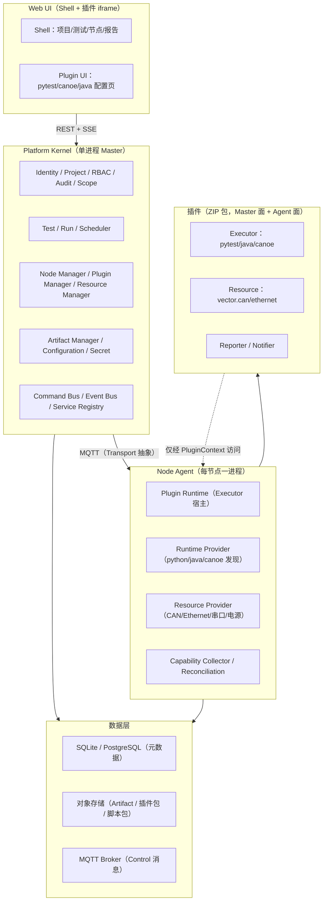

# 自动化设备测试平台（AETP）开发文档 V2

**版本**：v2.0-draft
**日期**：2026-08-27
**前置文档**：《自动化设备测试平台开发文档.md》（下称 V1 文档）
**来源**：本文件融合两部分内容——① V1 文档中已确认的事实基线、领域模型与决策（D-01~D-24）；② 与 GPT 关于「插件化测试平台架构」的完整设计对话（下称「设计对话」）。
**定位**：V2 不是对 V1 的推倒重写，而是把 V1 已落地的「任务类型插件 + Master/Agent 双面」架构，**演进**为「平台核心（Kernel）+ 能力插件（Plugin）+ 能力注册与匹配 + 统一执行上下文」的测试平台架构。凡 V1 已实现且仍正确的部分，V2 直接沿用；凡「设计对话」提出的、V1 尚未覆盖的目标设计，V2 以 📐 标记并给出演进路径。

---

## 0. 文档使用规则

### 0.1 状态标记

沿用 V1 的四态标记，并新增一态用于表达「V1 已实现 → V2 需演进」的映射：

| 标记 | 含义 | 是否可直接依赖 |
|---|---|---|
| ✅ 已实现 | 已存在于当前代码（V1 基线） | 可以 |
| 🔁 需演进 | V1 已实现，但 V2 需要调整职责边界或接口 | 改造起点 |
| 📐 目标设计 | V2 目标，尚未写入代码 | 按计划实施 |
| ⏳ 待决策 | 需负责人确认的选择 | 未确认前不得改动代码 |

**约束**：任何代码变更先更新本文档状态标记，不得把设计态写成已交付。

### 0.2 V1 → V2 的核心变化（一段话）

V1 的架构重心是「任务类型插件如何执行测试」：`TestTask.config → run.assign.task_config → AgentTaskContext.params`，插件以 `task_type` 为一等公民，Master 面做解析/分片/校验，Agent 面做执行/日志/结果。

V2 的架构重心升级为「测试平台如何用能力（Capability）组合出一次完整执行」：把「执行器 / 运行时 / 硬件资源」彻底拆开，让调度器回答一个问题——**「哪个节点在当前时刻具备这次 Run 所需的完整执行上下文（ExecutionContext）？」**，插件只回答——**「给我这个上下文，我知道怎么执行」**。

这条主线来自「设计对话」中反复强调的一条原则：

> 插件负责提供能力；Dependency 描述插件需要什么；Resource 表示实际可被占用的物理资源；Runtime 表示软件环境；Artifact 表示大数据产物；Event 表示状态变化；Command 表示主动请求；而 Core 负责把这些东西编排起来。

### 0.3 术语（V2 增补）

在 V1 术语表（Master/Agent/Broker/Node/Task/Shard/Run/Attempt/Dispatch/Envelope/Inbox/Outbox/Script/Case/Artifact/Plugin/SSE）基础上，V2 新增以下术语：

| 术语 | 定义 |
|---|---|
| Kernel（平台核心） | 身份、项目、RBAC、数据隔离、审计、调度、资源协调、事件总线等**不可被插件绕过**的基础能力集合 |
| Capability（能力） | 插件对外声明的、可被调度器发现与匹配的抽象能力标识（如 `test.collect`、`test.execute`） |
| Runtime（运行时） | 软件运行环境（如 Python 3.12、Java 21、CANoe 17），与插件本体分离 |
| Resource（资源） | 可被占用/释放的物理或逻辑资源（CAN 通道、以太网口、电源、继电器），带属性与租约 |
| ExecutionRequirement | 一次执行对 executor / runtime / software / resource 的完整需求声明，是调度器的输入 |
| ExecutionContext | 冻结的、不可变的执行上下文快照，是插件执行的唯一输入 |
| ExecutionPlan | Master 生成、下发给 Agent 的执行计划，是 Master ↔ Agent 的边界对象 |
| NodeCapability | 节点上报的完整能力快照（executors / runtimes / software / resources） |
| Plugin UI Protocol | 插件 iframe 与 Web 宿主之间的 `postMessage` 标准消息契约 |
| Metadata Plane / Data Plane | 元数据面（Event/Command，走事件总线）与数据面（Artifact 大文件，走对象存储）分离 |

---

## 1. 现状事实基线（V1 已实现，V2 沿用）

> 本章是「V1 文档 §1 当前实现事实基线」的浓缩引用。V2 的演进建立在以下已确认事实上，不重复展开。

| 维度 | V1 事实（V2 沿用） |
|---|---|
| 技术栈 | Python 3.12 / FastAPI / SQLAlchemy 2.0 / SQLite（开发）/ aiomqtt / Vue 3 / Pinia / Element Plus / Vite |
| 进程拓扑 | 单体 Master（HTTP API + MQTT 接入 + 调度 + Outbox worker + SSE hub）+ 多 Agent + MQTT Broker（EMQX） |
| ID 生成 | 26 字符 Crockford Base32 ULID（`aetp_protocol.ids.new_id`），非授权凭证 |
| 错误响应 | `{"code": str, "message": str, "data": Any}` 三段式 |
| 密钥派生 | HKDF-SHA256 按用途派生（`common/secret_derivation.py`）：JWT 签名 / 内部下载签名 / SecretStore 加密三类隔离 |
| MQTT 主题 | `aetp/{scope}/{node_id}/{command or event}`，协议 3.1.1（D-24） |
| 可靠消息 | 事务性 outbox + 周期 `claim_due` + 按尝试次数指数退避；inbox 去重 |
| 领域事件 | 先持久化到 `domain_events` 再广播；SSE 项目范围授权 + `Last-Event-ID` 回放 |
| 任务模型 | `test_tasks`（任务定义）/ `task_runs` / `run_shards` / `shard_attempts` / `run_case_results` / `run_artifacts`（D-14~D-23） |
| 插件机制 | 同一 ZIP 插件包提供 Master 面 + Agent 面（D-19）；`TestTask.config` 由插件 UI 提供（D-16） |
| 能力匹配 | `domain/capability.py` 纯函数谓词匹配；`domain/resources.py` 物理设备匹配与原子回溯分配；`domain/scheduler.py` 候选过滤 + 排序 + failover |
| 状态机 | Run / Shard / Attempt 三状态机（`domain/state_machine.py`） |
| 扩展点 | 持久化 DomainEvent + 生命周期 Hook（准入 fail-closed / 事件 fail-open）+ NotificationSender + SecretStore 端口（D-13） |
| 数据隔离 | Project 为任务/CI/成员/节点/通知订阅/SSE 的共同边界（D-12） |

> V2 不改动上述事实，而是在其上**新增能力层抽象**（§4~§7），并**调整插件职责边界**（§5）。

---

## 2. 「设计对话」核心结论摘录

本章摘录「设计对话」中最有价值的、将纳入 V2 目标设计的结论（原文要点 + V2 落地方式）。

### 2.1 不要做「插件调插件」的简单 Plugin Pattern

- **结论**：插件之间不要直接依赖（`PythonPlugin → ReportPlugin` 应禁止），统一改为 `PythonPlugin → EventBus → {Report/Statistics/Notification}`。
- **落地**：V2 的插件间数据交换只走四条通道——**Service（查询/请求）、Command（执行动作）、Event（状态已发生）、Artifact（大数据）**。V1 已实现 Event 通道（DomainEvent + Hook + NotificationDispatcher），V2 补齐 Command/Service 边界的正式 Contract（§6）。

### 2.2 Plugin Type 与 Capability 必须分离

- **结论**：`canoe` 是插件类型；`test.execute`、`canoe.measurement`、`canoe.trace` 是能力。平台判断「是否存在 `test.execute` 能力且 runtime=canoe」，而非 `if plugin.type == CANoe`。
- **落地**：V1 的 `capability.py` 已是「能力谓词匹配」雏形；V2 把「插件类型（PluginType）」与「能力（Capability）」建模为两个独立概念（§4.2、§4.3），调度器只认能力不认插件（§7）。

### 2.3 Executor ≠ Runtime ≠ Resource

- **结论**：`pytest.executor` 需要 `python.runtime >= 3.10`；`canoe.executor` 需要 `canoe software >= 17` + `can resource` + `ethernet resource`。三者彻底分开，才能表达「Node A 有 Python 3.10+Pytest 7，Node B 有 Python 3.12+Pytest 8」的异构现实。
- **落地**：V2 新增 Runtime 与 Software 概念（V1 仅有 `device`/`resource_occupancy` 与能力值，未显式建模 Runtime/Software），并引入 `ExecutionRequirement` 统一表达（§7.1）。

### 2.4 插件通过 Dependency 描述需要什么，而非硬编码调用

- **结论**：CANoe manifest 声明 `provides: test.executor.canoe`、`requires: runtime.canoe + resource.can`；调度器做依赖解析（Dependency Resolution），而非按任务类型写 if/else。
- **落地**：V1 的插件 manifest 已有 `task_type/plugin_version/entry/ui`，但无 `provides/requires` 依赖声明；V2 扩展 PluginManifest V2（§5.3），引入 `ExecutionRequirement` 作为解析产物。

### 2.5 Configuration Schema 是插件与 Web 的契约，Web 不认具体字段

- **结论**：pytest 参数（`pytest_args`/`test_path`/`fail_fast`）由插件声明 JSON Schema，Web 只认 `PluginConfigurationSchema` 生成表单/加载 iframe；且支持 `resource`/`runtime`/`artifact`/`secret` 等扩展类型（资源选择器、运行时选择器）。
- **落地**：V1 已实现「任务配置 UI 由插件提供（D-16）」「Web 宿主不硬编码 pytest 字段（v4.24）」。V2 在现有机制上**标准化 ConfigurationSchema 的类型系统**（§5.4），新增 `resource`/`runtime` 引用类型，使参数可反向参与依赖解析（§7.1）。

### 2.6 TestDefinition 与 TestRun 严格分离 + ExecutionContext 冻结

- **结论**：同一测试可 Run #1（DUT01）、Run #2（DUT02）、Run #3（DUT03）；每次执行形成**不可变** `ExecutionContext`，测试运行中不得漂移（CAN1→CAN2、Python 3.12→3.13 均禁止，除非显式迁移）。
- **落地**：V1 已有 `test_tasks`（定义）与 `task_runs`（执行）分离（D-14）。V2 新增 `ExecutionContext` 冻结语义与 `ExecutionPlan` 边界对象（§7.3）。

### 2.7 Metadata Plane 与 Data Plane 分离

- **结论**：2GB CANoe trace 不得进 EventBus，只传 `artifact_id`；Event 走元数据面，文件走对象存储。
- **落地**：V1 已实现脚本包/插件包/产物走「限时 HMAC 签名 URL + sha256 校验」，Event 只传 `artifact_refs`。V2 把这条原则固化为显式章节（§6.4）。

### 2.8 单体 Control Server，不拆微服务，第一版不强行引入新中间件

- **结论**：明确「主节点为单体控制程序」后，不建议为架构完整而引入 MQTT/Kafka/RabbitMQ；内部用 asyncio 事件总线即可；Transport 抽象化（`NodeTransport` Protocol），第一版实现一个，未来可换。
- **落地**：V1 已采用 **MQTT（aiomqtt）** 作为 Master↔Agent 传输（D-04/D-24），且「不拆微服务」原则与 V1 §3.1 推荐原则一致。**V2 保留 MQTT 事实基线**；「设计对话」中「第一版用 gRPC、MQTT 可后加」的选型建议，与 V1 已确认的 MQTT 决策冲突，**V2 不推翻 MQTT**，仅在 §8 记录「Transport 可替换抽象」这一思想（MQTT 本身已是该抽象的一个实现）。

### 2.9 Core 与 Plugin 的边界：治理能力不可插件化过度

- **结论**：用户、项目、RBAC、数据隔离、审计、调度、资源锁属于 Kernel（几乎被所有插件依赖）；执行方式、硬件驱动、报告格式、通知渠道、外部系统、业务页面属于 Plugin。避免出现 `UserPlugin/ProjectPlugin/PermissionPlugin` 拼出来的「分布式意大利面」。
- **落地**：V2 明确 Kernel / Plugin 边界表（§3.2）。

### 2.10 其他纳入 V2 的要点

| 结论 | V2 落地位置 |
|---|---|
| 资源分配要有生命周期 + Lease/TTL，节点断电不永久锁死 | §7.2 |
| 节点断线 ≠ Run 失败，需「执行对账」区分 OFFLINE/FAILED/LOST/UNKNOWN | §8.3（V1 `RecoveryService` 已有，V2 沿用并命名） |
| 通知防风暴：聚合/去重/限流/Digest，300 条失败不逐条发 | §9.2 |
| Secret 不进 TestSpecification，用 `secret://` 引用 + 日志 Mask | §10.1（V1 `EncryptedSecretStore` 已实现） |
| Artifact 不可变 + `derived_from` 溯源 | §6.4（V1 `run_artifacts` 已有，V2 补溯源字段） |
| 可复现性：TestRun 保存完整 Snapshot（包+配置+插件版本+运行时+节点+硬件） | §7.3 |
| 可观测性：trace_id/run_id/request_id 贯穿全链路 | §10.3 |
| 插件升级双目录 + 回滚 + SHA256 | §5.6（V1 `LocalPluginInstaller` 已有雏形） |
| 节点能力上报完整 Snapshot（非布尔开关） | §4.4、§8.2（V1 `NodeOut.capabilities` 已有，V2 扩展为 executor/runtime/software/resource 四类） |

---

## 3. V2 目标架构

### 3.1 分层与四 Plane

「设计对话」提出的 Control Plane / Agent Plane / Plugin Plane / Resource Plane 四层，映射到 V1 现有进程拓扑如下：



**关键约束（继承 V1 §3.1 推荐原则 + 设计对话结论）**：

1. 单体 Master 进程内运行全部 Kernel 模块；不拆微服务、不引入 Redis/Kafka/NATS。
2. 命令走 HTTP/MQTT，事件走内部事件总线/MQTT/SSE；浏览器不直连 MQTT。
3. **插件之间不直接通信**，只经 `PluginContext`（受控 API 集合）与事件总线交互。
4. Master 是任务/节点状态的唯一权威；Agent 上报事实，不自行决定最终投影。
5. **元数据面（Event/Command）与数据面（Artifact）分离**，大文件永不过事件总线。

### 3.2 Kernel 与 Plugin 边界

| 功能 | Kernel / Plugin | 理由 |
|---|---|---|
| 用户 / 认证 | Kernel（身份源可插件化：LDAP/SSO/OAuth） | 所有模块依赖 |
| 项目 / RBAC / 数据隔离 / 审计 | Kernel | 安全边界，不可绕过 |
| 测试定义 / Run / 调度 / 资源协调 | Kernel | 领域模型 + 全局资源锁 |
| 通知引擎（订阅/规则/路由） | Kernel | 平台能力 |
| Python/Pytest/Java/CANoe | Plugin（Executor） | 执行能力 |
| CAN/Ethernet/电源/继电器 | Plugin（Resource Driver） | 硬件驱动 |
| 报告解析/生成、统计 | Plugin（Reporter） | 格式可扩展 |
| Email/飞书/钉钉/Teams | Plugin（Notifier Channel） | 通道可扩展 |
| Jira/Git/CI | Plugin（Integration） | 外部系统 |
| Web UI Shell | Kernel | 页面框架 |
| Web 功能页/配置页 | Plugin（UI） | 页面可扩展 |

**一句话原则（设计对话）**：把「安全、身份、项目、Scope、事件、任务模型、资源模型」做成不可绕过的 Kernel；把「执行方式、硬件驱动、报告格式、通知渠道、外部系统、业务页面」做成 Extension。

---

## 4. V2 核心领域模型

### 4.1 概念总览

```text
Plugin ──provides──▶ Capability
   │
   ├──declares──▶ Requirement（ExecutionRequirement）
   │
   └──participates──▶ Execution（ExecutionContext）
```

四个根概念：**Plugin（插件）、Capability（能力）、Resource（资源）、Execution（执行）**。

### 4.2 Plugin 与 Capability 分离（🔁 需演进）

- **V1 现状**：插件以 `task_type` 为一等公民，`capabilities` 是插件 JSON 里的一个字段（`PluginMetadata.capabilities`），用于节点能力上报与匹配。
- **V2 目标**：显式区分
  - `PluginType`（executor / resource / runtime / reporter / notifier / integration）
  - `Capability`（如 `test.collect` / `test.execute` / `canoe.measurement`）
  - 调度器通过 **Capability + Requirement** 匹配，**禁止** `if task_type == "pytest"` 分支。

### 4.3 六类插件（📐 目标设计）

| 类型 | 示例 ID | 职责 |
|---|---|---|
| executor | `pytest.executor` / `java.executor` / `canoe.executor` | 执行测试、收集用例、取消 |
| runtime | `python.runtime` / `java.runtime` | 发现/校验软件运行环境（多走 Provider 而非 ZIP 包，见 §4.5） |
| resource | `vector.can.resource` / `vector.ethernet.resource` / `power.supply.resource` | 发现/占用/释放/健康检查硬件 |
| reporter | `junit.reporter` / `canoe.reporter` / `html.reporter` | 报告解析与生成 |
| notifier | `feishu.notifier` / `email.notifier` / `webhook.notifier` | 通知渠道 |
| integration | `jira.integration` / `git.integration` / `ci.integration` | 外部系统对接 |

> 兼容说明：V1 的「任务类型插件（Master 面 + Agent 面双面）」对应 V2 的 `executor` 类型；V1 的 `NotificationSender`（console/generic_webhook/feishu/dingtalk/slack/teams/email）对应 V2 的 `notifier` 类型。V2 不要求一次性改完，按 §12 路线图渐进迁移。

### 4.4 NodeCapability（🔁 需演进）

- **V1 现状**：`NodeOut.capabilities` 暴露 vehicle/language/system/serial 能力树；`plugin_versions` 暴露已装插件；`load` 暴露负载。
- **V2 目标**：节点上报完整能力快照，四类分区：

```json
{
  "node_id": "NODE-001",
  "executors": [
    { "id": "pytest.executor", "version": "2.0.0" },
    { "id": "canoe.executor", "version": "1.0.0" }
  ],
  "runtimes": [
    { "type": "python", "version": "3.12" },
    { "type": "java", "version": "21" }
  ],
  "software": [
    { "name": "CANoe", "version": "17" }
  ],
  "resources": [
    { "id": "CAN1", "type": "can", "properties": { "vendor": "Vector", "can_fd": true } },
    { "id": "ETH0", "type": "ethernet" }
  ]
}
```

### 4.5 Runtime 与 Software（📐 目标设计）

- **Runtime**：可被 `RuntimeProvider` 发现的软件环境（python/java），带 `discover()`/`validate(requirement)`/`prepare()`。
- **Software**：商业软件/驱动（CANoe、Vector Driver、Java），可能涉及 License/安装器/注册表/重启，**不强行做成 ZIP 插件包**，由 Agent 侧 `SoftwareDetector` 发现上报。
- **与插件的关系**：`pytest.executor` 是插件，`Python 3.12` 是 Runtime，`CANoe 17.0` 是 Software。三者分离（对应 V1 中 `agent/capability_loader.py` 已探测 system/language/serial，V2 显式命名 runtime/software）。

### 4.6 状态标记汇总

| 概念 | V1 状态 | V2 状态 |
|---|---|---|
| Plugin / PluginType | ✅（task_type 插件） | 🔁 需演进为六类 |
| Capability 匹配 | ✅（`domain/capability.py`） | ✅ 沿用 + 归一化 |
| Resource 分配 | ✅（`domain/resources.py`） | ✅ 沿用 + Lease 语义增强 |
| Runtime / Software | 🟡（能力值里隐含） | 📐 显式建模 |
| ExecutionRequirement | 🟡（散落在 capability/resources） | 📐 统一建模 |
| ExecutionContext / ExecutionPlan | 🟡（`run.assign` + task_config） | 📐 显式建模 |
| NodeCapability 快照 | 🟡（capabilities/plugin_versions） | 🔁 扩展四类分区 |

---

## 5. 插件系统 V2

### 5.1 Plugin Contract（🔁 需演进）

V1 的插件契约是「Master 面 + Agent 面」（见《插件开发指南.md》§4），V2 在**保留这条双面链路**的基础上，把 Executor 的生命周期接口补全：

```python
class ExecutorPlugin(Protocol):
    def get_configuration_schema(self) -> ConfigurationSchema: ...
    def resolve_requirements(self, configuration: dict) -> ExecutionRequirement: ...
    async def collect(self, context: CollectionContext) -> TestPlan: ...       # Master 面
    async def prepare(self, context: ExecutionContext) -> None: ...            # 新增
    async def execute(self, context: ExecutionContext) -> ExecutionResult: ... # Agent 面
    async def cancel(self, context: ExecutionContext) -> None: ...
    async def cleanup(self, context: ExecutionContext) -> None: ...            # 新增
```

> `prepare()`/`cleanup()` 是为 CANoe 类任务补的：启动 CANoe → 打开工程 → 连接 CAN → 执行 → 生成报告 → 关闭 CANoe → 释放 CAN。单一 `execute()` 无法表达。

### 5.2 PluginContext（📐 目标设计）

插件**不直接**拿 `core.database`、`core.user_manager` 等对象，只拿受控的 `PluginContext`：

```python
class PluginContext:
    plugin_id: str
    config: ConfigService
    events: EventBus            # 订阅/发布
    commands: CommandBus
    artifacts: ArtifactService  # 而非直接访问 DB/存储
    resources: ResourceService
    tests: TestService
    identity: IdentityService
    authorization: AuthorizationService
    logger: Logger
```

> 关键：插件只通过平台 API 访问数据，**永不直连数据库**（V1 已通过「插件禁止直接请求 Master API、UI 经宿主中转」体现，V2 扩展到 Agent 侧 Executor 同样遵守）。

### 5.3 PluginManifest V2（📐 目标设计）

```json
{
  "id": "pytest.executor",
  "version": "2.0.0",
  "api_version": "2",
  "type": "executor",
  "entry": "main.py:package",
  "capabilities": ["test.collect", "test.execute", "test.cancel"],
  "requirements": {
    "runtime": [{ "type": "python", "version": ">=3.10" }]
  },
  "configuration": { "schema": { "...": "..." }, "ui": { "entry": "ui/task-config.html" } },
  "ui": { "upload": "ui/index.html", "configuration": "ui/task-config.html" }
}
```

V1 manifest（`task_type/plugin_version/entry/ui`）→ V2 增加 `id/type/api_version/capabilities/requirements/configuration`。迁移分阶段：先加 `id/type/capabilities/requirements`，`task_type` 保留为过渡别名。

### 5.4 ConfigurationSchema 类型系统（📐 目标设计）

V2 的配置 Schema 在标准 JSON Schema 基础上扩展平台类型，使参数可反向生成依赖：

| 扩展类型 | 示例 | UI 呈现 | 反向依赖 |
|---|---|---|---|
| `parameter` | `pytest_args: array<string>` | 文本框 | 无 |
| `resource` | `can_channel: {resource_type: can}` | 资源下拉（查 Node Registry） | 生成 `ResourceRequirement` |
| `runtime` | `python: {runtime_type: python}` | 运行时下拉 | 生成 `RuntimeRequirement` |
| `artifact` | `config_file: {artifact_type: canoe.config}` | 文件选择 | 生成 Artifact 引用 |
| `secret` | `server_password: {type: secret}` | 密文引用 | 生成 `secret://` 引用 |

### 5.5 Plugin UI Protocol（🔁 需演进）

V1 已实现 iframe + `postMessage`（《插件开发指南.md》§6）。V2 把消息契约标准化：

```text
Host → Plugin : initialize / context / configuration / capabilities / validation_result
Plugin → Host : ready / configuration.changed / validate / requirements.changed / submit
```

**新增 `requirements.changed`**：用户把 `Python 3.10 → 3.12` 或 `CAN1 → CAN2` 时，插件告知宿主 Requirement 已变化，宿主据此刷新依赖解析与节点筛选。

### 5.6 插件生命周期 / 升级 / 回滚（🔁 需演进）

- **V1 现状**：`LocalPluginInstaller` 支持 `main.py:package` 入口、版本兼容检查、按需下载安装；插件新版本自动停用旧版本。
- **V2 目标**（设计对话）：插件目录双版本 + `current` 软链，升级失败回滚旧版本；包 SHA256 校验（已实现）+ 可选数字签名；插件状态机 `INSTALLED/ENABLED/DISABLED/UPDATE_PENDING/ERROR`。

```
plugins/
└── pytest.executor/
    ├── versions/
    │   ├── 2.0.0/
    │   └── 2.1.0/
    ├── current -> 2.1.0
    └── state.json
```

### 5.7 插件间数据交换四通道（📐 固化）

| 通道 | 语义 | 示例 | V1 对应 |
|---|---|---|---|
| Service | 查询/请求能力 | `artifacts.create()`、`resources.get()` | ✅ Service 层 |
| Command | 执行动作 | `ExecuteTest`、`CancelTest` | ✅ MQTT command 主题 |
| Event | 状态已发生 | `TestFinished`、`NodeOffline` | ✅ DomainEvent + Hook |
| Artifact | 大数据 | `artifact://trace/xxx.blf` | ✅ 签名 URL 下载 |

---

## 6. 数据交换与执行上下文

### 6.1 Context 是数据交换中心（📐）

插件间数据交换统一经 Context，而非 `Plugin A → Plugin B`：

```text
              ExecutionContext
             /       |        \
            /        |         \
       Parameters  Runtime   Resources
          │          │           │
       Executor   Provider    Provider
          │
       Artifact → Report
```

### 6.2 ExecutionRequirement（📐 目标设计）

```python
@dataclass
class ExecutionRequirement:
    executor: PluginRequirement          # pytest.executor >= 2.0
    runtimes: list[RuntimeRequirement]   # python >= 3.11
    software: list[SoftwareRequirement]  # CANoe >= 17
    resources: list[ResourceRequirement] # can channel=CAN1, ethernet=ETH0
```

来源：插件 manifest 的 `requirements`（静态）+ `resolve_requirements(configuration)`（用户配置动态产生）。

### 6.3 ExecutionContext / ExecutionPlan（📐 目标设计）

```python
@dataclass
class ExecutionContext:          # 冻结、不可变
    run_id: str
    task_id: str
    shard_id: str
    project_id: str
    plugin_id: str
    plugin_version: str
    parameters: dict             # 用户配置（pytest_args 等）
    runtime: RuntimeContext      # python 3.12 path
    resources: ResourceContext   # CAN1 lease 等
    artifacts: ArtifactContext
    environment: EnvironmentContext
```

`ExecutionPlan` 是 Master → Agent 的边界对象（Master 做好全部调度决策，Agent 不再做调度）：

```json
{
  "run_id": "RUN-001",
  "node_id": "NODE-003",
  "executor": { "id": "pytest.executor", "version": "2.0.0" },
  "runtime": { "type": "python", "version": "3.12", "path": "..." },
  "resources": [ { "lease_id": "CAN-LEASE-001", "type": "can", "resource_id": "CAN1" } ],
  "configuration": { "pytest_args": ["-m", "smoke"] },
  "shard": { "id": "SHARD-001", "cases": ["test_login", "test_logout"] }
}
```

> 映射：V2 `ExecutionPlan` ≈ V1 `run.assign`（含 `plugin_ref`/`script_ref`/`task_config`/`execution_params`/`case_keys`）。V2 把 `run.assign` 的字段重组为 `execution`（executor/runtime/resources）+ `configuration` + `shard`，语义等价、结构更清晰。

### 6.4 Artifact 管理器（🔁 需演进）

- **V1 现状**：`run_artifacts` 表 + `ArtifactService`/`ArtifactStorageService` + 限时 HMAC 签名下载 + `X-Checksum-Sha256`。
- **V2 目标**：Artifact 不可变 + `derived_from` 溯源（`artifact-001 → artifact-002`）；大文件永不过事件总线，事件只带 `artifact_id`；`StorageCleanupService`（V1 已实现）负责孤儿文件回收。

---

## 7. 节点能力匹配与调度

### 7.1 调度流程（🔁 需演进）

V2 调度链：`Run → 解析 ExecutionRequirement → NodeMatcher → ResourceAllocator → ExecutionPlan → Node`。

```text
Run
 ↓
Plugin Resolver（resolve_executor）
 ↓
ExecutionRequirement（静态 + 用户配置动态）
 ↓
NodeMatcher（能力 + Runtime + Software + Resource 匹配）
 ↓
ResourceAllocator（原子回溯分配 + Lease）
 ↓
ExecutionPlan
 ↓
Node（经 Transport 下发）
```

- **V1 对应**：`capability.py`（谓词匹配）→ `resources.py`（设备匹配 + 分配）→ `scheduler.py`（候选 + failover）。V2 把「能力 / 运行时 / 软件 / 资源」四类匹配统一进 `NodeMatcher`，把「分配」统一进 `ResourceAllocator`。

### 7.2 资源占用与 Lease（🔁 需演进）

- **V1 现状**：`resource_occupancy` 投影（device_id → run_id）+ `Device.status=BUSY` 权威 + `RecoveryService` 三条恢复路径对称释放。
- **V2 目标**（设计对话）：Resource Allocation 带 `lease_id / owner / expire_at / heartbeat`，资源锁有 TTL，节点断电后租约过期自动释放，不永久锁死。V1 的 `resource_occupancy` 是 Lease 的雏形，V2 为其补 TTL/心跳语义。

### 7.3 可复现性快照（📐 目标设计）

TestRun 保存完整快照（而非仅 `executor=pytest`）：

```json
{
  "executor": { "plugin_id": "pytest", "plugin_version": "2.1.0" },
  "runtime": { "python": { "version": "3.12.4" } },
  "resources": { "can": { "id": "CAN1", "vendor": "Vector" } },
  "test_package": { "artifact_id": "xxx", "sha256": "xxx" }
}
```

---

## 8. Master ↔ Agent 通信（沿用 MQTT + Transport 抽象）

### 8.1 决策：V2 保留 MQTT，不引入 gRPC

「设计对话」建议第一版用 gRPC、MQTT 可后加；但 V1 已确认 MQTT（D-04 aiomqtt、D-24 协议 3.1.1），且 MQTT 的 QoS/retained/LWT/断线重连正好覆盖节点管理需求。**V2 不推翻已落地且验证过的 MQTT 事实基线。**

「设计对话」中真正有价值的是 **Transport 抽象**思想——V1 的 `domain/transport.py` `Transport` 端口已是该抽象；MQTT 只是其中一个实现，未来可加 `GrpcTransport` 而不动上层（Scheduler/NodeManager/PluginManager 无感知）。

### 8.2 节点能力上报（沿用 + 扩展）

- V1 已实现：`node.register`（校验身份 → 关旧 session → upsert → 回 register-ack）、`node.heartbeat`（刷新 online/load）、LWT presence、能力随注册上报。
- V2 扩展：`NodeCapability` 快照从「能力值 + plugin_versions」扩展为 §4.4 的四类分区；心跳追加 `resource_occupancy`（V1 v4.19 已实现）。

### 8.3 断线恢复与执行对账（沿用）

V1 `RecoveryService` 已实现节点离线 → Shard waiting_recovery + failover、Master 启动扫描遗留 Run、Stale Run 超时。V2 沿用，并显式区分节点离线状态：

```text
NODE_OFFLINE ≠ EXECUTION_FAILED
EXECUTION_LOST / EXECUTION_UNKNOWN（执行中失去节点，状态未知，等待对账）
```

Agent 重连后上报 `ReportRunningTasks`，Master 据此对账（`UNKNOWN → RUNNING / SUCCESS / FAILED`）。

---

## 9. 事件、通知、报告、统计

### 9.1 事件总线（沿用 + 分类）

V1 已实现持久化 DomainEvent + EventBus + Hook（准入 fail-closed / 事件 fail-open）+ EventHookWorker 有界异步队列。V2 沿用，并明确事件分类：

```text
Domain Event        TestRunFinished / NodeOffline / PluginUpdated
Integration Event   外部系统对接
Notification Event  NotificationRequested
Audit Event         account.approved / plugin.updated / project.member.role_changed
```

### 9.2 通知（沿用 + 防风暴）

- V1 已实现：通知端点（owner 管理，密钥不回显）、事件订阅（含 task_id 绑定）、投递内容快照、`(event_id, subscription_id)` 唯一占位防重复外发、7 个 Sender、pending 崩溃接管。
- V2 目标（设计对话）：**通知防风暴**——聚合/去重/防抖/限流/Digest。300 个失败 case 汇总为一条，而非 300 条飞书。V2 在 Subscription 上增加聚合窗口与速率限制配置。

### 9.3 报告与统计（沿用 + 边界明确）

- V1 已实现：case 耗时滚动平均（成功才计入）、异常耗时事件 `case.duration_anomaly`、结果矩阵、失败历史全量保留。
- V2 明确边界：**Executor 不承担最终报告格式转换**——`canoe.executor` 产出原始报告为 Artifact，`canoe.reporter` 订阅 `TestRunFinished` 后统一解析为 Unified TestResult，再交给报告/统计/通知。

---

## 10. 安全、权限、审计

### 10.1 Secret 管理（沿用）

V1 已实现 `EncryptedSecretStore`（Fernet，密钥派生自 JWT secret）+ `secret_values` 表。V2 补充两条约束：

1. Secret 不进 TestSpecification，用 `secret://project/server/password` 引用，ExecutionContext 运行时解析。
2. 日志自动 Mask（`password=******`、`token=******`）。

### 10.2 RBAC 与数据隔离（沿用）

V1 已实现项目范围 RBAC（账户审批/禁用、项目成员角色、Project 为数据边界 D-12）。V2 沿用，补充：

- **Node 不一定属于单一 Project**：节点可共享给多个项目（`NodeBinding` 已实现），V2 明确「节点归属 = 资源访问策略」而非 `node.project_id`。
- 数据隔离三层：API 层 → Service 层（`ProjectScope`）→ 数据层查询，插件**永不经由**。

### 10.3 可观测性（沿用 + 强化）

V1 已实现结构化日志与 trace 关联。V2 要求全链路（Web → Scheduler → Node → Plugin → Report → Notification）贯穿 `trace_id / run_id / request_id`，使「这个 Run 为什么没执行」可追溯。

---

## 11. V1 资产 → V2 概念映射总表

| V1 资产 | V2 概念 | 变化 |
|---|---|---|
| `master/domain/capability.py` | Capability 谓词匹配 | ✅ 沿用 |
| `master/domain/resources.py` | Resource 分配 + Lease | 🔁 补 TTL/心跳 |
| `master/domain/scheduler.py` | Scheduler（候选/排序/failover） | 🔁 输入统一为 ExecutionRequirement |
| `master/domain/workflow.py` / `run_projection_service` | 执行投影 | ✅ 沿用 |
| `master/plugins/*`（base/registry/manager/sharding） | Plugin Runtime | 🔁 增 resolver/validator/lifecycle |
| `common/src/aetp_protocol/plugin.py` | Plugin Contract | 🔁 拆分 metadata/master/agent/package/config/execution |
| `TestTask.config → run.assign.task_config` | ConfigurationSchema + ExecutionPlan | 🔁 重组，不推翻 |
| `agent/capability_loader.py` | Runtime/Software Detector | 🔁 显式命名 runtime/software |
| `agent/plugins/*`（execution/installer/registry） | Agent Plugin Runtime | 🔁 增 lifecycle/verifier/state |
| `RecoveryService` | 执行对账 + 节点断线恢复 | ✅ 沿用 |
| `EncryptedSecretStore` | Secret 管理 | ✅ 沿用 |
| `NotificationDispatcher` + 7 Sender | Notifier Plugin | 🔁 类型化为 notifier |
| `domain/transport.py` `Transport` 端口 | Transport 抽象（MQTT 实现） | ✅ 沿用 |
| `storage_cleanup_service` | Artifact 孤儿回收 | ✅ 沿用 |

---

## 12. 演进路线图

### 12.1 八个里程碑（源自设计对话 M1~M8 + 与 V1 现状对齐）

```text
             M1 协议与插件契约 V2
                    │
         ┌──────────┴──────────┐
         ↓                     ↓
   M2 节点能力快照          M3 Runtime/Resource 模型
         │                     │
         └──────────┬──────────┘
                    ↓
             M4 调度器 / ExecutionPlan
                    ↓
             M5 pytest Executor V2 闭环
                    │
         ┌──────────┴──────────┐
         ↓                     ↓
   M6 插件同步/升级        M7 事件/报告/通知
                    │
                    ↓
             M8 项目/RBAC/审计/隔离
```

| 里程碑 | 内容 | 优先级 | 相对 V1 的增量 |
|---|---|---|---|
| M1 | Plugin Contract V2（六类插件 + Manifest V2 + ConfigurationSchema） | P0 | `plugin.py` 拆分、manifest 扩展 |
| M2 | NodeCapability 四类分区快照 + 心跳 | P0 | 扩展 `capabilities/plugin_versions` |
| M3 | Runtime/Software 显式建模 + Resource Provider/Lease | P0 | 新增 runtime/software 概念 |
| M4 | Scheduler 输入统一为 ExecutionRequirement → ExecutionPlan | P0 | 重组 scheduler/resources |
| M5 | pytest Executor V2（prepare/execute/cancel/cleanup） | P0 | 补生命周期接口 |
| M6 | 插件双目录升级/回滚/签名 | P1 | 升级 `LocalPluginInstaller` |
| M7 | 事件分类 + 通知防风暴 + Reporter 边界 | P1 | 订阅聚合/限流 |
| M8 | 项目/RBAC/审计/隔离补强 | P1 | 大部分已实现，收口 |

### 12.2 第一批提交建议（源自设计对话）

第一批严格控制在 6 个 Commit，保证每次重构都可运行：

```text
1. feat(protocol): introduce execution context and requirement v2
2. feat(plugin): introduce executor/runtime/resource/reporter/notifier plugin types
3. feat(node): introduce four-part node capability snapshot
4. feat(transport): keep mqtt transport abstract (grpc as future impl)
5. feat(scheduler): introduce execution requirement and execution plan
6. refactor(pytest): migrate pytest plugin to executor v2
```

> 注：V1 已确认 MQTT，故第 4 条改为「保持 MQTT + 确认 Transport 抽象」，而非设计对话原文的「引入 gRPC」。

### 12.3 关键接口冻结清单（源自设计对话）

实施前先冻结以下接口（V2 骨架）：

```python
class ExecutorPlugin(Protocol):
    async def prepare(self, context: ExecutionContext) -> None: ...
    async def execute(self, context: ExecutionContext) -> ExecutionResult: ...
    async def cancel(self) -> None: ...
    async def cleanup(self) -> None: ...

class RuntimeProvider(Protocol):
    def discover(self) -> list[RuntimeInfo]: ...
    def validate(self, requirement: RuntimeRequirement) -> ValidationResult: ...
    async def prepare(self, requirement: RuntimeRequirement) -> RuntimeContext: ...

class ResourceProvider(Protocol):
    async def discover(self) -> list[Resource]: ...
    async def acquire(self, request: ResourceRequest) -> ResourceLease: ...
    async def release(self, lease: ResourceLease) -> None: ...

class NodeMatcher(Protocol):
    def match(self, requirement: ExecutionRequirement) -> list[Node]: ...

class EventBus(Protocol):
    async def publish(self, event: PlatformEvent) -> None: ...
    def subscribe(self, event_type: type[PlatformEvent], handler: EventHandler) -> None: ...

@dataclass
class ExecutionContext:
    run_id: str
    task_id: str
    shard_id: str
    project_id: str
    parameters: dict[str, Any]
    runtime: RuntimeContext
    resources: ResourceContext
    artifacts: ArtifactContext
```

---

## 13. 待决策项（⏳）

| # | 决策项 | 默认值（已采用） | 备选 |
|---|---|---|---|
| V2-01 | PluginType 六类 vs 保留 task_type 单一类型 | 六类，task_type 保留为过渡别名 | 只扩不拆 |
| V2-02 | Runtime/Software 是否做成 ZIP 插件包 | 不做成 ZIP，走 Agent 侧 Detector 发现 | 全部 ZIP 化 |
| V2-03 | 资源 Lease 的 TTL 默认值 | 心跳间隔 3 倍 + 可配置 | 无 TTL 靠恢复服务 |
| V2-04 | 通知防风暴的聚合窗口默认值 | 按 Run 结束聚合，可配置 | 逐条发送 |
| V2-05 | ConfigurationSchema 是否完全替换现有 plugin.json 的 config 字段 | 扩展（保留旧字段 + 新增 schema/requirements） | 一次性替换 |
| V2-06 | 节点能力快照是否需要 Software 独立分区 | 需要（CANoe/Vector 等商业软件） | 并入 runtime |

> 以上决策项均按「默认值先做、备选留档」原则推进，不阻塞 M1~M5 的实施节奏。

---

## 附录 A：完整测试执行链路（V2 目标 E2E）

```text
用户上传 pytest 包
     ↓  Plugin.detect / verify
Master 面 collect() → TestPlan（cases 索引）
     ↓
创建 TestTask（引用脚本版本 + 默认勾选用例）
     ↓  Plugin UI（iframe + postMessage）
用户配置 pytest_args / Python 版本
     ↓  requirements.changed
resolve_requirements() → ExecutionRequirement
     ↓
Scheduler → NodeMatcher（能力/运行时/软件/资源匹配）
     ↓
ResourceAllocator（Lease 分配）
     ↓
ExecutionPlan
     ↓  Transport（MQTT）
Agent → PythonRuntimeProvider（/path/to/python3.12）
     ↓
pytest Executor.prepare / execute / cleanup
     ↓
JUnit / Logs / Artifacts 上传
     ↓
Agent → Master（结构化事实）
     ↓
TestRunFinished
     ↓  EventBus
  /   |   \
Report  Statistics  Notification
```

**核心不变式（贯穿 V1 与 V2）**：

1. CANoe Plugin 不知道 Report Plugin 存在。
2. Report Plugin 不知道 CANoe Plugin 存在。
3. Statistics Plugin 不知道测试是 Python 还是 CANoe。
4. Notification Plugin 不需要知道测试怎么执行。

---

## 附录 B：与 V1 文档的引用关系

- V1 §1（事实基线）、§5（领域模型/枚举/状态机/错误码）、§6（数据库与迁移）、§7（HTTP API）、§8（MQTT）、§9（Agent）、§10（SSE）、§12（安全配置）、§14（部署）在 V2 中**继续有效**，V2 不重复展开。
- V1 决策 D-01~D-24 在 V2 中**全部继续有效**；V2 新增决策 V2-01~V2-06（§13）。
- 《插件开发指南.md》描述 V1 插件契约，V2 的 §5 是其在六类插件方向上的演进；迁移完成前，《插件开发指南.md》仍为 V1 插件的权威规范，V2 的 Plugin Contract 以本文档为准。
