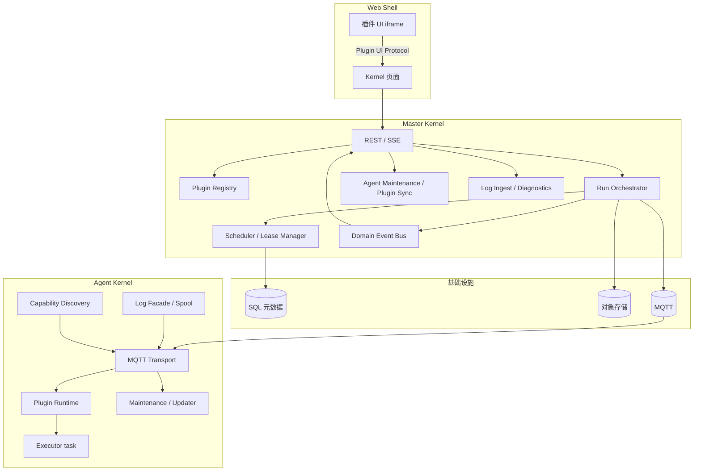
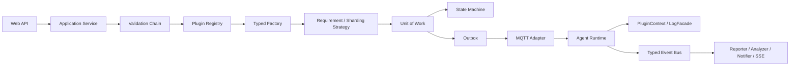
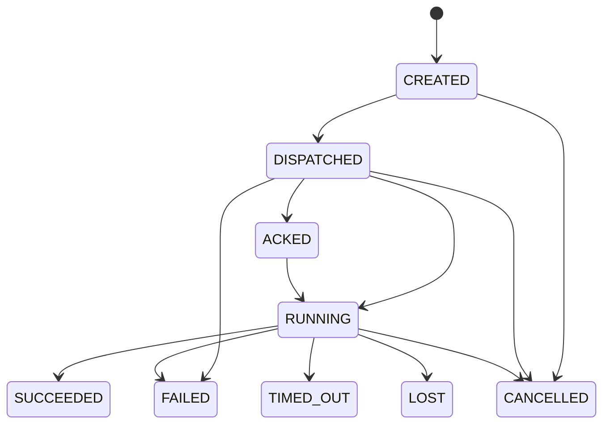
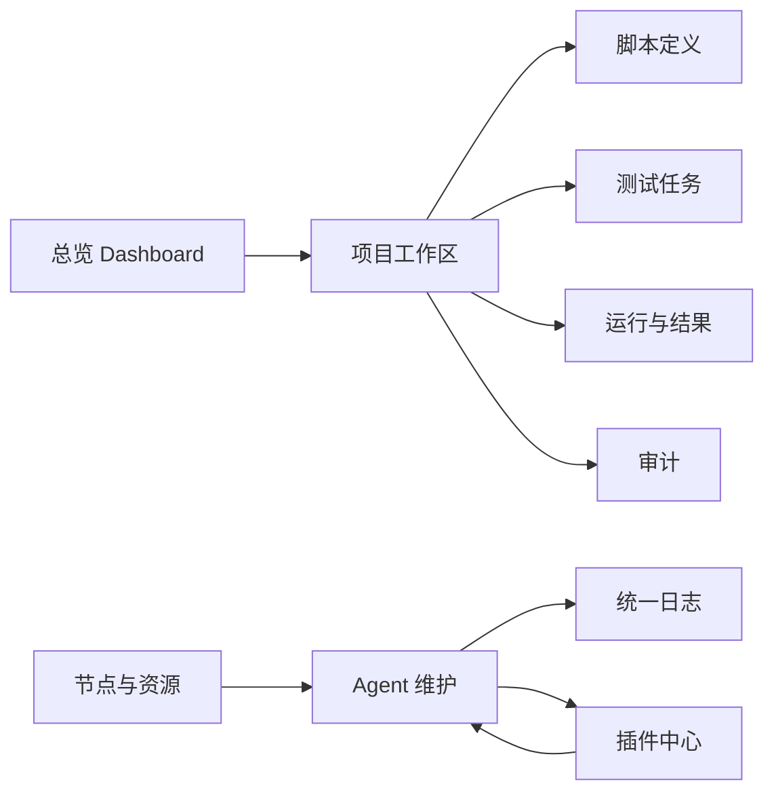

# 自动化设备测试平台（AETP）V2 开发规范

- **版本**：2.8-draft
- **日期**：2026-09-01
- **状态**：目标架构与实施规范
- **适用范围**：`web/`、`master/`、`agent/`、`dev_agent/`、`common/src/aetp_protocol/`、内置与第三方插件

**本次修订**：明确 V2 直接新建协议和数据库；新增脚本定义与测试任务两级模型、Master 主动维护 Agent、能力不可用状态、远程诊断与统一日志门面、Keycloak/Casbin 权限方案、设计模式组合规范、Web 页面设计草图

---

## 0. 文档约定

### 0.1 状态标记

| 标记 | 含义 | 是否可作为当前实现依据 |
|---|---|---|
| ✅ | V2 已实现并通过测试 | 可以 |
| 🔁 | 当前源码有可复用实现，但 V2 需要重构 | 只能参考，不代表兼容 |
| 📐 | V2 目标设计，尚未实现 | 不可以 |
| ⏳ | 需负责人确认 | 不得据此开发 |

**约束**：代码变更前先更新本文状态；只有测试通过且代码合入后才能把 📐 或 🔁 改为 ✅。V2 不承担现有数据库、Topic、API 或插件包的兼容责任。

### 0.2 部署约束与安全取向

**部署环境**：Master 与 Agent 部署在不同机器上，可能不在同一内网；MQTT Broker 由运维单独部署。平台为内部使用，所有用户均为受信任的内部员工或合作方。

**安全取向**：以「能用、好维护」为优先。不引入插件签名信任链、独立 origin iframe 沙箱、操作系统级进程隔离、Job Object 资源限制、Secret Worker IPC 等面向多租户或不可信第三方的安全机制。安全底线为：认证、RBAC、项目范围隔离、SHA-256 完整性校验、审计日志。插件由管理员手动审核和安装，不自动信任外部来源。

### 0.3 V2 目标

V2 的目标是“万物皆插件”，但不是“任意代码可以改变平台语义”。平台把可变的实现做成插件，把安全边界、领域事实和编排规则保留在 Kernel：

- 用户可扩展测试执行器、硬件驱动、报告、通知、外部集成、分片算法与 Web 页面。
- Kernel 唯一负责身份、项目范围、RBAC、审计、Run 状态机、资源租约、调度、可靠投递和数据隔离。
- 调度器只匹配能力与需求，不根据 `pytest`、`canoe` 等具体插件 ID 写分支。
- 插件不能直接访问数据库、Broker 凭据、其他插件工作目录或 Web 主应用状态。
- V2 是全新协议和数据模型：不保留 `task_type`、`run.assign`、旧能力树或旧插件包入口；项目未上线，因此不编写历史数据迁移，直接初始化 V2 数据库。

### 0.4 术语

| 术语 | 定义 |
|---|---|
| Kernel | 不可由插件绕过的平台治理与编排能力 |
| 扩展点（Extension Point） | Kernel 预先定义的稳定 SPI 契约，例如 `executor` |
| 插件（Plugin） | 带 manifest、SHA-256 校验和版本的扩展点实现包 |
| Capability | 实现可声明、调度可匹配的能力，例如 `test.execute` |
| Requirement | 一次运行所需 executor、runtime、software、resource 的约束 |
| Provider | Agent 侧的运行时/软件/资源发现与准备适配器；它是插件实现的一种，不自行注册新扩展点 |
| ExecutionPlan | Master 决策后下发给 Agent 的不可变执行计划 |
| ExecutionContext | Agent 根据 Plan 构造并传给执行器的受控运行上下文 |
| Artifact | 脚本、日志、报告、抓包等不可变大文件对象 |
| Lease | 资源占用的带 TTL、所有者和心跳的租约 |
| ScriptDefinition | 一个可解析、可版本化的测试脚本定义，包含脚本 Artifact、插件、配置和用例索引 |
| TestTask | 用户可执行的测试任务，可组合多个 ScriptDefinition，并定义统一调度和执行策略 |
| PluginAvailability | 插件在某个 Agent 上是否可执行，以及不可用原因 |
| AgentMaintenance | Master 对 Agent 执行插件同步、升级、诊断和重启的维护状态 |
| LogFacade | Master、Agent、插件统一使用的结构化日志门面 |
| Principal | 经过 Identity Provider 认证的用户、服务或 Agent 身份 |

### 0.5 强类型约定

V2 是强类型协议，文档中的 JSON 只用于表示线上的序列化结果，不能直接作为 Python 或 TypeScript 接口。所有跨端对象必须先定义类型，再定义 JSON 表示。

| 边界 | 首选类型 | 强制规则 |
|---|---|---|
| MQTT/HTTP 线协议 | Python Pydantic `BaseModel` | `extra="forbid"`、明确字段类型、枚举使用 `StrEnum`、禁止裸 `dict` 作为业务 DTO |
| Master/Agent 端内领域 | `dataclass(frozen=True)` 或 Pydantic 不可变模型 | 创建后不可修改；集合使用 `tuple` 或只读映射；状态迁移由显式函数执行 |
| Web API | TypeScript `interface`、字符串联合类型、运行时 Schema | `Record<string, unknown>` 只允许出现在插件自定义配置和未解释扩展数据中 |
| 插件自定义配置 | JSON Schema 2020-12 | Kernel 不解释业务字段，但必须校验 Schema、版本和配置实例 |
| 纯扩展数据 | `JsonValue` | 只能放在明确命名的 `metadata`、`detail`、`configuration` 字段，禁止扩散到 ID、状态、引用和协议控制字段 |

Python 共享协议模型是唯一的线协议事实源；Web 类型由同一 Schema 生成或手工同步并通过契约测试校验。任何 `dict[str, Any]` 必须注明它是插件私有数据，不能用来承载跨端控制语义。

---

## 1. 现有源码基线与 V2 边界

### 1.1 可复用的源码事实

| 能力 | 当前实现 | V2 处理 |
|---|---|---|
| 进程拓扑 | Master + 多 Agent + MQTT Broker | ✅ 保留 |
| Web | Vue 3、Pinia、Element Plus、Vite | ✅ 保留 |
| 后端 | FastAPI、SQLAlchemy、Dependency Injector | ✅ 保留 |
| 可靠消息 | MQTT、Outbox、Inbox、重试 | ✅ 保留为 Kernel 契约 |
| 项目隔离 | Project、成员、节点绑定、SSE 授权 | ✅ 保留 |
| 执行模型 | 当前有 TestTask、Run、Shard、Attempt | 🔁 直接重构为 ScriptDefinition、TestTask、Run、ExecutionPlan |
| 插件模型 | 当前有双端 `PluginPackage`、`task_type` 注册表 | 🔁 直接替换为扩展点和 Manifest V2 |
| 节点能力 | 当前有 capabilities、plugin_versions、设备分配 | 🔁 直接替换为版本化 Capability Snapshot |
| 文件存储 | 当前有 Storage 端口、本地存储、SHA-256 完整性校验下载 | 🔁 保留端口思想，按 V2 Artifact 契约重写 |

> 本表只说明哪些源码值得参考，不把现有 API、数据库和插件包作为 V2 输入；V2 启动时直接使用全新的协议、数据库和运行目录。

### 1.2 V2 实施状态（2026-09-02）

以下状态以当前代码为准，不能因为本文出现了目标 DTO 就视为已完成：

| V2 能力 | 当前状态 | 当前代码事实 | 完成标准 |
|---|---|---|---|
| 强类型基础能力模型 | 🔁 | `aetp_protocol.capabilities` 已使用 Pydantic 严格模型 | 以 V2 DTO 为唯一线协议，不保留旧 payload |
| V2 Envelope | 🔁 | 已实现 `protocol_version=2`、严格消息联合类型和独立 V2 Topic；V1 Envelope 仍并行保留 | V2 全量切换后移除 V1 |
| V2 MessageType | 🔁 | 已实现注册、能力、诊断、插件同步、Plan、ACK 和 Lease 消息；V1 消息仍并行保留 | V2 全量切换后移除 V1 |
| Plugin Registry | 🔁 | Master/Agent 已有按 `plugin_id + point + version` 的 V2 Registry，并与 V1 `task_type` Registry 并行 | V2 执行链完全接管后移除 V1 |
| ScriptDefinition/TestTask | 🔁 | 已新增强类型 ScriptDefinition、TestTask revision、脚本绑定、Run Snapshot、parallel/sequence 展开和 V2 API；脚本 Artifact 上传/解析与完整 Web 编辑器仍待补齐 | 新增脚本定义层和多脚本任务聚合 |
| Agent 维护中心 | 🔁 | 已具备 V2 注册、插件同步、维护状态、远程诊断、结构化日志 ACK、维护锁、日志级别、排空和重启命令；已接入进程自替换重启回调，部署级服务启动器和完整空闲资源探测仍待强化 | Master 主动完成同步、排空、诊断、日志级别和重启 |
| Agent Resource Provider | 🔁 | 核心仅保留 `ResourceProvider` SPI、Registry 和生命周期编排；CAN 扫描、串口映射/端口检查、电源适配实现位于 `plugins/resource_providers/`，V2 快照使用 Provider 发现结果；已接入 V2 Manifest/Resolver 动态装配，`discover` 仍为同步端内接口 | 资源发现、健康检查和 activate/deactivate 全部由 Agent resource 插件提供 |
| Web 远程诊断 | 🔁 | 节点面板已展示 V2 能力/系统/插件/通信诊断快照，支持结构化日志历史/实时流、维护操作查询、日志级别、排空和重启 | 展示 Agent 全量结构化日志、能力、插件、系统和通信状态 |
| Web API 类型 | 🔁 | 当前 Web 有手写接口和 `Record<string, unknown>` | OpenAPI/Schema 生成类型和 `vue-tsc` 契约检查 |
| Reporter/Analyzer/Notifier | 🔁 | 已新增强类型 Report/Analysis/Notification DTO、Master ReportPipeline、V2 Master Reporter/Analyzer Resolver、JUnit Reporter、case 统计 Analyzer 和 `run_extension_results` 持久化；通知已支持持久化 `dedupe_key`、`run_summary`、`digest` 窗口及维护 worker 刷新；V2 NotifierPlugin 尚未绑定现有 Sender Adapter，Agent 侧 JUnit 兼容解析和耗时统计 Kernel 兼容服务仍并行 | 以独立扩展点完成报告、分析、通知、聚合、限流和 Digest |
| Identity/Domain Authorization | 🔁 | 当前仍使用本地 JWT、用户表和平台/项目角色；Keycloak OIDC、Casbin 域策略和 MQTT peer identity 绑定尚未接入 | 生产使用 Keycloak + Casbin，Agent 凭据与用户身份分离 |
| V2 Plan/Lease | 🔁 | 已实现 Plan RFC 8785 摘要、原子物化、Lease 条件续租/回收、具体资源绑定、parallel/sequence 调度、执行 ACK、到期恢复和 execution.reconcile；跨机器断线收敛与完整重试验收仍待补齐 | 完成多脚本调度、Agent 执行、对账和终态回收 |
| V2 Executor | 🔁 | 已实现 Manifest 精确 entrypoint、pytest V2 executor、Plan runner、Provider activate/deactivate、progress/log/case-status/log fence、JUnit Artifact 和 Master RunResult 投影；跨机器 HTTP 重试/真实 Provider 部署验收仍待补齐 | 以精确 executor 版本执行 Plan，并发布 `execution.finished` |

M6 资源边界：CAN/串口/电源发现与控制实现位于 `plugins/resource_providers/` 的 Agent `resource` 插件；核心 `ResourceProviderRegistry` 只负责 SPI 注册、发现结果校验、按资源路由和生命周期编排。CAN 资源只能由硬件扫描得到，串口只读取功能名到端口号映射并复核端口存在性；JSON 不得声明 CAN 通道或伪造电源硬件。旧 `capability_loader` 中的 CAN/串口入口仅保留为 V1 兼容委托，V2 快照使用基础能力扫描加 resource 插件结果。

**2026-09-02 文档一致性回查**：已修正 CAN/串口扫描边界，并接入 resource 插件的 V2 `PluginManifest`/Resolver 动态装配；Master Reporter/Analyzer 与通知聚合初版已接入。当前仍不符合目标设计的项目必须按 🔁/📐 处理：`ResourceProvider.discover` 尚为同步端内接口；V2 `NotifierPlugin` 尚未绑定现有 Sender Adapter，Agent 侧 JUnit 兼容解析、耗时统计 Kernel 兼容服务和通知失败重试策略仍有并行实现；生产 Keycloak/Casbin、Broker peer identity 与节点凭据绑定、通用写 API `Idempotency-Key` 和跨机器端到端验收仍未完成，当前仅 Run 创建/重试/取消 API 已接入幂等键。V1 `task_type`/`run.assign` 并行代码属于过渡态，直到 M7 不得宣称已移除。

**2026-09-02 M0/M1 倒查结果**：M0 已补齐执行需求与多脚本 Schema 快照、对账拒绝码、Artifact 上传范围签名和兼容拒绝测试；M1 已补齐插件版本 rollback、旧版本自动停用、节点/节点组期望版本 API、同步 point 校验、安装时间审计和 Agent 已安装目录复核。V1 Registry、Topic 和任务链仍按并行过渡策略保留，不能据此宣称 V2 全量启用。

### 1.3 不继承的设计

以下设计在 V2 禁止继续扩展：

1. 以 `task_type` 作为调度条件或 API 领域字段。
2. 在 Master、Agent 或 Web 中为具体插件写 `if/elif` 分支。
3. 插件直接访问 SQLAlchemy、MQTT client、FastAPI 路由内部对象或其他插件对象。
4. 让第三方动态注册任意新的扩展点。扩展点集合由 Kernel 版本发布；第三方只能实现已公开的扩展点。

V2 启动策略是一次性切换：创建新数据库和新运行目录，只注册 V2 路由和 `aetp/v2` Topic，不加载旧 Registry、旧 Handler、旧 DTO 或旧插件包；不编写双读双写、字段别名和历史数据转换程序。

## 2. 总体架构



### 2.1 跨机器部署前提

Master 与 Agent 不要求处于同一内网，但必须满足以下连通关系。平台不允许假设 Agent 可以直接访问 Master 的数据库或文件系统。

| 发起方 | 目标 | 用途 | 必需条件 |
|---|---|---|---|
| Master | MQTT Broker | 发布命令、订阅 Agent 事件 | Broker 地址、端口、账号和 ACL |
| Agent | MQTT Broker | 发布事实、订阅命令 | Agent 所在网络允许出站连接 |
| Agent | Master HTTP API | 下载脚本/插件、上传 Artifact | `public_base_url` 从 Agent 可解析、可访问 |
| Master | SQL 数据库 | 持久化 Kernel 状态 | 仅 Master 访问 |
| Master/Agent | 对象存储（可选） | 大型 Artifact | 两端按部署配置访问；首版可由 Master 代理 |

Master 不直接向 Agent 建立业务 TCP 连接，所有控制消息经过 MQTT。Agent 的 `register`、`heartbeat`、`execution.*` 消息经 Broker 到达 Master；Master 的 Plan 和取消命令经 Broker 到达 Agent。MQTT 断线重连、QoS 1、Outbox/Inbox 只能提供“至少一次投递”，不能提供 exactly-once，业务幂等必须由消息 DTO 和状态机保证。

Agent 下载脚本、插件包和上传 Artifact 使用 Master 签发的限时 HMAC URL。这里的 HMAC 是服务端点访问控制和完整性校验，不是插件代码签名体系。所有机器使用 UTC 时间并保持时钟同步；时钟偏差必须小于 URL 过期窗口和 Lease TTL 的安全余量，推荐由 NTP 或企业时间服务统一校时。

如果 Agent 无法访问 Master HTTP 地址，部署必须提供可由 Agent 访问的对象存储上传/下载地址，并在配置中启用对应 Storage 实现；不能把 Master 本机路径写入 Plan 并期待远端 Agent 可用。

### 2.2 Plane 与权威性

| Plane | 所在端 | 权威对象 | 不负责 |
|---|---|---|---|
| Control Plane | Master | 项目、任务定义、Run、Attempt、Lease、插件准入 | 直接执行台架脚本 |
| Execution Plane | Agent | 本机执行事实、进程生命周期、资源本地操作 | 改写 Run 的最终状态机 |
| Experience Plane | Web | 页面路由、交互状态、插件 UI 宿主 | 解释插件业务字段 |
| Data Plane | Storage Port（对象存储或 Master 代理后端） | Artifact 字节及校验和 | 经 MQTT/SSE 传输大文件 |

Master 是 Run、资源租约和节点投影的唯一权威。Agent 上报可验证事实；任何事实都必须关联 `run_id`、`attempt_id`、`node_id`、`plan_hash` 与消息幂等键。

### 2.3 Kernel 与插件边界

| 功能 | 所属 | 说明 |
|---|---|---|
| 身份、会话、RBAC、ProjectScope、审计 | Kernel | 身份源可替换，授权判定不可替换 |
| ScriptDefinition、TestTask、Run、状态机、调度、Lease | Kernel | 维护跨插件的一致性 |
| Outbox/Inbox、MQTT Topic、重试、对账 | Kernel | 传输实现可换，可靠语义不变 |
| executor、resource、reporter、analyzer、notifier、integration | Plugin | 业务和硬件实现可替换 |
| runtime、software 探测 | Agent Plugin / Provider | 只产生事实快照，不能分配资源 |
| storage、identity、transport | Kernel 选择的单例扩展实现 | 只允许管理员配置启用一个实现 |
| Web Shell、导航、授权、API client | Kernel | 不接受插件越权调用 |
| 插件配置页、结果页、专用面板 | Plugin UI | 受宿主 postMessage 协议约束，同源 iframe 加载 |

### 2.4 架构模式与设计模式组合

V2 采用“模块化单体 + Ports and Adapters + 插件化 + 事件驱动”的组合架构。Master 仍是一个进程，但内部按领域、应用服务、端口和适配器分层；Agent 也是一个进程，负责节点本地执行、能力发现和维护。设计模式用于稳定依赖方向和替换点，不用于把简单逻辑包装成过度抽象。

#### 2.4.1 模式职责

| 模式 | 使用位置 | 负责什么 | 不负责什么 |
|---|---|---|---|
| Registry | Master/Agent Plugin Registry、Capability Registry | 保存实现元数据，按 `plugin_id + point + version` 查询 | 不创建实例、不执行插件业务 |
| Factory | PluginFactory、ProviderFactory、MessagePayloadFactory | 根据已校验的 Manifest/枚举创建实现 | 不从用户输入直接导入任意 Python 模块 |
| Strategy | NodeMatcher、Sharding、Retry、Storage、Identity、Transport | 替换同一算法或端口的实现 | 不改变 Kernel 状态机和数据约束 |
| Chain of Responsibility | 插件包校验、配置校验、Run 准入、Plan 接收校验 | 逐项执行强类型校验，可短路或收集错误 | 不执行测试、不提交事务 |
| Adapter | MQTT、HTTP 文件传输、Keycloak、Casbin、CAN、串口、对象存储 | 将外部系统转换为平台 Port | 不把外部系统模型直接泄漏到领域层 |
| Facade | `PluginContext`、`LogFacade`、`AuthorizationService`、`ArtifactService` | 为调用方提供稳定的窄接口 | 不绕过授权、事务和状态机 |
| Observer / Event Bus | Reporter、Analyzer、Notifier、审计和 Web SSE | 解耦事实发布者与多个订阅者 | 不让订阅者修改已提交的原始事实 |
| State Machine | Run、Shard、Attempt、PluginStatus、AgentMaintenanceState | 统一校验状态迁移和终态收敛 | 不把状态转换散落在 Web 或插件中 |
| Template Method / Orchestrator | Run 生命周期编排器 | 固定 `collect -> resolve -> match -> allocate -> execute -> project` 骨架 | 不让插件改变阶段顺序 |
| Unit of Work + Repository | Master 应用服务和持久化适配器 | 保证一次业务操作的事务边界和仓储抽象 | 不把 ORM Entity 当作跨端 DTO |

#### 2.4.2 推荐组合关系



一次执行的职责链固定为：

1. **Registry** 查找可用插件版本和 Provider，不执行插件代码。
2. **Factory** 根据已校验的 `PluginRef` 创建对应端口实现。
3. **Strategy** 计算 Requirement、节点候选、分片和重试策略。
4. **Validation Chain** 校验项目范围、配置、能力、资源、Plan 和版本引用。
5. **Unit of Work** 在一个事务中写入 Run/Shard/Attempt、Lease 和 Outbox。
6. **State Machine** 只允许合法状态迁移，拒绝重复或过期事实。
7. **Adapter** 负责 MQTT、文件和外部服务的具体通信。
8. **Facade** 向插件暴露日志、Artifact、Secret 和平台服务的窄接口。
9. **Event Bus** 广播已持久化事实，Reporter、Analyzer、Notifier 和 SSE 各自订阅。

#### 2.4.3 强类型模式接口

模式接口必须使用 Protocol、Pydantic DTO 或不可变领域对象定义。示例：

```python
class PluginFactory(Protocol):
  def create(
    self,
    ref: PluginRef,
    point: PluginPoint,
  ) -> ExecutorMasterPlugin | ExecutorAgentPlugin | ReporterPlugin | NotifierPlugin: ...


class ValidationHandler(Protocol):
  def validate(self, context: ValidationContext) -> tuple[ValidationIssue, ...]: ...


class ValidationChain(Protocol):
  def validate(self, context: ValidationContext) -> ValidationResult: ...


class RequirementStrategy(Protocol):
  def resolve(
    self,
    script: ScriptDefinition,
    configuration: Configuration,
  ) -> ExecutionRequirement: ...


class StateTransitionService(Protocol):
  def transition(
    self,
    aggregate_id: BusinessId,
    current: RunStatus | ShardStatus | AttemptStatus,
    target: RunStatus | ShardStatus | AttemptStatus,
  ) -> None: ...
```

`ValidationContext`、`ValidationResult`、`ScriptDefinition` 等必须使用本章其他位置定义的强类型模型；示例中的联合类型需要在实际代码中按扩展点拆分为具体 Protocol，避免一个 Factory 返回无法静态检查的“大联合”。

#### 2.4.4 组合约束

1. Factory 只接受 Registry 已解析的 `PluginRef`，不得接受 `module:class` 用户输入并直接调用 `importlib`。
2. Registry、Factory、Strategy 和 Adapter 均不得持有跨请求可变业务状态；状态写入由 Application Service + Unit of Work 完成。
3. Chain 中的每个 Handler 都是纯校验或只读查询；需要写库的动作必须在校验完成后进入同一个 Unit of Work。
4. Event Bus 的订阅者不能直接调用另一个插件实例；跨插件协作使用强类型 Event、Command、Service 或 ArtifactRef。
5. Orchestrator、State Machine、Lease Manager 和 ProjectScope 属于 Kernel，不允许通过插件替换。
6. 一个扩展点优先只有一个稳定 Port；新增实现使用 Registry 注册，不复制一套近似接口。
7. 当一个类同时负责 Registry、Factory、Strategy 和业务执行时，必须拆分；当一个模式只包一行无变化逻辑时，不强行保留该模式。

#### 2.4.5 模式测试

每个模式都有独立契约测试：Registry 测试版本唯一性和查询；Factory 测试入口类型和 point 一致；Strategy 测试相同输入的确定性；Validation Chain 测试错误路径和短路规则；Adapter 测试外部错误映射；Facade 测试权限和数据范围；Event Bus 测试订阅幂等；State Machine 测试所有允许/禁止迁移；Unit of Work 测试提交、回滚和 Outbox 原子性。

---

## 3. 固定扩展点与能力模型

### 3.1 扩展点目录

扩展点是 Kernel 发布的 API，不是数据库可随意新增的字符串。每个扩展点有 `point`、SPI 版本、装配侧、实例数和隔离等级。

| point | 示例插件 ID | 装配侧 | 多实例 | 说明 |
|---|---|---|---|---|
| `executor` | `org.pytest.executor` | Master + Agent | 是 | 双端入口；Agent 侧以执行任务运行 |
| `resource` | `com.vector.can-resource` | Agent | 是 | 硬件驱动适配器 |
| `runtime` | `org.python.runtime` | Agent | 是 | 软件环境探测与准备 |
| `software` | `com.vector.canoe-software` | Agent | 是 | 商业软件探测 |
| `reporter` | `org.junit.reporter` | Master | 是 | 报告解析与统一结果 |
| `analyzer` | `org.case-statistics.analyzer` | Master | 是 | 结果统计与质量指标 |
| `notifier` | `org.feishu.notifier` | Master | 是 | 通知渠道 |
| `integration` | `org.jira.integration` | Master | 是 | 外部系统对接 |
| `hook` | `com.acme.quality-gate` | Master | 是 | Run 生命周期钩子 |
| `sharding` | `org.case-count.sharding` | Master | 是 | 测试分片策略 |
| `ui` | `com.acme.run-detail-ui` | Web | 是 | 同源 iframe 配置/结果页 |
| `storage` | `org.s3.storage` | Master + Agent | 否 | 管理员配置的单例存储后端 |
| `transport` | `org.mqtt.transport` | Master + Agent | 否 | 管理员配置的单例传输实现 |
| `identity` | `org.oidc.identity` | Master | 否 | 管理员配置的单例身份源 |

首版仅发布上述扩展点。增加新 point 必须修改 `aetp_protocol`、安全评审、契约测试和 Kernel 装配代码，并提升 `api_version`。

### 3.2 强类型协议总则

跨机器 JSON 只是序列化格式，不是类型定义。V2 的线协议模型统一由 `common/src/aetp_protocol/` 中的 Pydantic 模型定义，Master 和 Agent 使用同一版本的协议包；Web 使用由这些模型生成的 JSON Schema 或同步的 TypeScript 类型。

```python
from collections.abc import Awaitable, Callable
from datetime import datetime
from enum import StrEnum
from typing import Annotated, BinaryIO, Literal
from typing import TypeAlias

from pydantic import BaseModel, ConfigDict, Field, RootModel, field_validator, model_validator

JsonPrimitive: TypeAlias = None | bool | int | float | str
JsonValue: TypeAlias = JsonPrimitive | list["JsonValue"] | dict[str, "JsonValue"]
JsonObject: TypeAlias = dict[str, JsonValue]


class StrictModel(BaseModel):
  model_config = ConfigDict(extra="forbid", frozen=True)


class BusinessId(RootModel[str]):
  root: str = Field(pattern=r"^[0-7][0-9A-HJKMNP-TV-Z]{25}$")


class PluginId(RootModel[str]):
  root: str = Field(pattern=r"^[a-z][a-z0-9-]*(?:\.[a-z0-9-]+)+$")


class CapabilityName(RootModel[str]):
  root: str = Field(pattern=r"^[a-z][a-z0-9-]*(?:\.[a-z0-9-]+){1,3}$")


class ErrorCode(RootModel[str]):
  root: str = Field(pattern=r"^[A-Z][A-Z0-9_]{2,63}$")


class SessionId(RootModel[str]):
  root: str = Field(min_length=16, max_length=64, pattern=r"^[A-Za-z0-9_-]+$")


class MessageId(RootModel[str]):
  root: str = Field(min_length=16, max_length=64, pattern=r"^[A-Za-z0-9_-]+$")


class RequestId(RootModel[str]):
  root: str = Field(min_length=16, max_length=64, pattern=r"^[A-Za-z0-9_-]+$")


class TraceId(RootModel[str]):
  root: str = Field(min_length=16, max_length=128, pattern=r"^[A-Za-z0-9_-]+$")


class Sha256(RootModel[str]):
  root: str = Field(pattern=r"^[a-fA-F0-9]{64}$")

  @field_validator("root")
  @classmethod
  def normalize(cls, value: str) -> str:
    return value.lower()


class SemVer(RootModel[str]):
  root: str = Field(pattern=r"^(0|[1-9][0-9]*)\.(0|[1-9][0-9]*)\.(0|[1-9][0-9]*)(?:-[0-9A-Za-z.-]+)?(?:\+[0-9A-Za-z.-]+)?$")


class Version(RootModel[str]):
  root: str = Field(pattern=r"^v?[0-9]+(?:\.[0-9]+)*$")


class VersionConstraint(StrictModel):
  exact: Version | None = None
  minimum: Version | None = None
  maximum: Version | None = None

  @model_validator(mode="after")
  def validate_presence(self) -> "VersionConstraint":
    if self.exact is None and self.minimum is None and self.maximum is None:
      raise ValueError("version constraint must contain exact, minimum or maximum")
    return self


class RelativePath(RootModel[str]):
  root: str = Field(pattern=r"^(?!/)(?!.*(?:^|/)\.\.(?:/|$))[A-Za-z0-9_.-]+(?:/[A-Za-z0-9_.-]+)*$")


class VersionRange(StrictModel):
  exact: SemVer | None = None
  minimum: SemVer | None = None
  maximum: SemVer | None = None

  @model_validator(mode="after")
  def validate_presence(self) -> "VersionRange":
    if self.exact is None and self.minimum is None and self.maximum is None:
      raise ValueError("version range must contain exact, minimum or maximum")
    return self


class ArtifactKind(StrEnum):
  REPORT = "report"
  LOG_ARCHIVE = "log_archive"
  DATA = "data"


class CaseStatus(StrEnum):
  PENDING = "pending"
  RUNNING = "running"
  PASSED = "passed"
  FAILED = "failed"
  SKIPPED = "skipped"
  ERROR = "error"


class DeliveryStatus(StrEnum):
  SUCCEEDED = "succeeded"
  FAILED = "failed"
  RETRYING = "retrying"


class LogLevel(StrEnum):
  DEBUG = "debug"
  INFO = "info"
  WARN = "warn"
  ERROR = "error"


class TriggerType(StrEnum):
  MANUAL_WEB = "manual_web"
  API = "api"
  SCHEDULE = "schedule"
  CI_WEBHOOK = "ci_webhook"
  RETRY = "retry"
  RECOVERY = "recovery"


class ResourceHealth(StrEnum):
  READY = "ready"
  DEGRADED = "degraded"
  UNAVAILABLE = "unavailable"


class SplitPolicy(StrictModel):
  type: Literal["none", "by_time", "by_case_count", "custom"]
  target_count: int | None = Field(default=None, ge=1)
  target_duration_s: int | None = Field(default=None, ge=1)
  plugin_id: PluginId | None = None

  @model_validator(mode="after")
  def validate_policy(self) -> "SplitPolicy":
    if self.type == "by_case_count" and self.target_count is None:
      raise ValueError("by_case_count requires target_count")
    if self.type == "by_time" and self.target_duration_s is None:
      raise ValueError("by_time requires target_duration_s")
    if self.type == "custom" and self.plugin_id is None:
      raise ValueError("custom requires plugin_id")
    return self


class RetryPolicy(StrictModel):
  max_attempts: int = Field(default=1, ge=1)
  failover_nodes: bool = False
  retry_failed_cases: bool = False
  backoff_initial_s: int = Field(default=1, ge=0)
  backoff_max_s: int = Field(default=60, ge=0)

  @model_validator(mode="after")
  def validate_backoff(self) -> "RetryPolicy":
    if self.backoff_max_s < self.backoff_initial_s:
      raise ValueError("backoff_max_s cannot be less than backoff_initial_s")
    return self


class PluginStatus(StrEnum):
  UPLOADED = "uploaded"
  VERIFIED = "verified"
  INSTALLED = "installed"
  PENDING_RESTART = "pending_restart"
  ENABLED = "enabled"
  DISABLED = "disabled"
  REMOVED = "removed"
  ERROR = "error"


class PluginAvailability(StrEnum):
  AVAILABLE = "available"
  BLOCKED = "blocked"
  UPDATING = "updating"
  ERROR = "error"
  NOT_INSTALLED = "not_installed"


class AgentMaintenanceState(StrEnum):
  READY = "ready"
  IDLE = "idle"
  BUSY = "busy"
  DRAINING = "draining"
  UPDATING = "updating"
  RESTARTING = "restarting"
  DEGRADED = "degraded"


class NodePresenceState(StrEnum):
  ONLINE = "online"
  OFFLINE = "offline"


class RunStatus(StrEnum):
  CREATED = "created"
  DISPATCHED = "dispatched"
  ACKED = "acked"
  RUNNING = "running"
  SUCCEEDED = "succeeded"
  FAILED = "failed"
  CANCELLED = "cancelled"
  TIMED_OUT = "timed_out"
  LOST = "lost"


class AttemptStatus(StrEnum):
  CREATED = "created"
  DISPATCHED = "dispatched"
  ACKED = "acked"
  RUNNING = "running"
  UNKNOWN = "unknown"
  SUCCEEDED = "succeeded"
  FAILED = "failed"
  CANCELLED = "cancelled"
  TIMED_OUT = "timed_out"
  LOST = "lost"


class ShardStatus(StrEnum):
  PENDING = "pending"
  DISPATCHING = "dispatching"
  RUNNING = "running"
  WAITING_RECOVERY = "waiting_recovery"
  SUCCEEDED = "succeeded"
  FAILED = "failed"
  CANCELLED = "cancelled"
  TIMED_OUT = "timed_out"


class PluginPoint(StrEnum):
  EXECUTOR = "executor"
  RESOURCE = "resource"
  RUNTIME = "runtime"
  SOFTWARE = "software"
  REPORTER = "reporter"
  ANALYZER = "analyzer"
  NOTIFIER = "notifier"
  INTEGRATION = "integration"
  HOOK = "hook"
  SHARDING = "sharding"
  UI = "ui"
  STORAGE = "storage"
  TRANSPORT = "transport"
  IDENTITY = "identity"
```

插件发布版本使用 `SemVer` 和 `VersionRange`；Runtime/Software 的本机版本使用 `Version` 和 `VersionConstraint`。`VersionConstraint` 的 `exact`、`minimum`、`maximum` 按点分数字段比较，不能把运行时版本约束写成未解析的字符串。

强类型规则如下：

1. 业务 ID 使用 26 字符 Crockford Base32 ULID；`str` 只允许用于插件自定义标识和展示文本。
2. 状态、方向、产物类型和错误码使用 `StrEnum`，禁止在业务代码中散落魔法字符串。
3. 列表在不可变领域对象中使用 `tuple`；Pydantic 输入模型可使用 `list`，验证后转换为不可变模型。
4. `JsonObject` 只允许用于明确标注的插件扩展字段：`configuration.values`、`execution_parameters`、事件 `payload`、结果 `metrics/data`、`metadata` 和 `detail`；这些字段必须由插件 Schema 或具体 event_type Schema 校验。`message_type`、ID、状态、版本、Lease 和引用不得使用动态字典。
5. 所有跨端模型 `extra="forbid"`。新增字段必须提升相应 Schema 版本并更新 Master、Agent、Web 契约测试。
6. `frozen=True` 只保证顶层不可赋值；模型中的自定义 JSON 由构造时深拷贝，运行期不允许修改原始配置快照。

### 3.3 能力模型

V2 直接使用 `NodeCapabilitySnapshot` 作为节点能力的唯一线协议，不保留旧能力树。现有 `NodeCapabilities` 代码只作为领域建模经验参考，V2 新协议按以下分区重新实现：

| V2 分区 | 内容 | 是否参与调度 |
|---|---|---|
| `executors` | Agent 已安装且满足依赖的执行器插件、版本和能力 | 是 |
| `runtimes` | Python、Java 等运行时实例、版本和本机绑定 | 是 |
| `software` | CANoe、Vector Driver 等软件及版本、License 状态 | 是 |
| `resources` | CAN、LIN、以太网、串口、电源、继电器等可分配资源 | 是 |
| `system` | OS、CPU、内存、磁盘和 Agent 运行状态 | 按 Requirement 参与 |
| `tags` | 节点标签和维护分组 | 是 |

`vehicle` 和 `serial` 不再作为顶层调度类别，而是展开为具有 `resource_type/vendor/model/channel/function/labels` 的 ResourceCapability；这样 CAN 通道、串口和电源可以使用同一套 Lease。V2 不保留 `legacy_capabilities`、`supported_versions` 或 `task_type -> version` 作为调度输入。

### 3.4 Capability 命名

Capability 是可查询和可匹配的声明，不等于插件 ID。

- 格式：`<domain>.<action>` 或 `<vendor>.<domain>.<action>`，只允许小写字母、数字、点和连字符。
- 例：`test.collect`、`test.execute`、`test.cancel`、`can.channel`、`canoe.measurement`。
- 版本不写入 capability 字符串；版本约束写入 Requirement。
- 同一节点可有多个实现提供同一 capability，但必须以 `provider_id + version` 区分。调度器根据 Requirement 选择实现，不能以“ZIP 优先”等隐含规则裁决。
- Manifest 中 capability 必须属于其 point 的允许集合。未知 capability 拒绝安装。

### 3.5 Capability Snapshot

Agent 每次注册、插件变更、硬件热插拔或周期心跳时发送完整快照。快照是替换语义，包含单调递增的 `revision`；Master 仅接受同一 Agent session 内更新的 revision。

```json
{
  "node_id": "01J00000000000000000000000",
  "session_id": "01J00000000000000000000001",
  "schema_version": 2,
  "revision": 42,
  "reported_at": "2026-09-01T08:00:00Z",
  "executors": [
    {"plugin_id": "org.pytest.executor", "version": "2.0.0", "capabilities": ["test.collect", "test.execute", "test.cancel"]}
  ],
  "runtimes": [
    {"provider_id": "org.python.runtime", "runtime_id": "python-312", "runtime_type": "python", "version": "3.12.4"}
  ],
  "software": [],
  "resources": [
    {"resource_id": "01J00000000000000000000002", "provider_id": "com.vector.can-resource", "resource_type": "can", "vendor": "Vector", "properties": {"can_fd": true}, "labels": {}, "health": "ready"}
  ],
  "maintenance_state": "idle",
  "plugin_inventory": [
    {"plugin_id": "org.pytest.executor", "point": "executor", "version": "2.0.0", "archive_sha256": "0123456789abcdef0123456789abcdef0123456789abcdef0123456789abcdef", "availability": "available", "unavailable_reasons": [], "checked_at": "2026-09-01T08:00:00Z"}
  ]
}
```

推荐使用以下强类型模型表示快照（省略重复的具体资源属性）：

```python
class RuntimeCapability(StrictModel):
  provider_id: str
  runtime_id: str
  runtime_type: str
  version: Version
  executable_ref: str | None = None


class ExecutorCapability(StrictModel):
  plugin_id: PluginId
  version: SemVer
  capabilities: tuple[CapabilityName, ...]


class SoftwareCapability(StrictModel):
  provider_id: str
  name: str
  version: Version
  properties: JsonObject = Field(default_factory=dict)


class ResourceCapability(StrictModel):
  resource_id: BusinessId
  provider_id: str
  resource_type: str
  vendor: str | None = None
  model: str | None = None
  channel: str | None = None
  function: str | None = None
  labels: dict[str, str] = Field(default_factory=dict)
  properties: JsonObject = Field(default_factory=dict)
  health: ResourceHealth
  switch_connection: SwitchConnection | None = None


class PluginInventoryItem(StrictModel):
  plugin_id: PluginId
  point: PluginPoint
  version: SemVer
  archive_sha256: Sha256
  availability: PluginAvailability
  unavailable_reasons: tuple[ErrorCode, ...] = ()
  checked_at: datetime


class NodeCapabilitySnapshot(StrictModel):
  schema_version: Literal[2]
  node_id: BusinessId
  session_id: SessionId
  revision: int = Field(ge=1)
  reported_at: datetime
  tags: tuple[str, ...] = ()
  executors: tuple[ExecutorCapability, ...] = ()
  runtimes: tuple[RuntimeCapability, ...] = ()
  software: tuple[SoftwareCapability, ...] = ()
  resources: tuple[ResourceCapability, ...] = ()
  system: SystemCapability | None = None
  maintenance_state: AgentMaintenanceState
  plugin_inventory: tuple[PluginInventoryItem, ...] = ()
```

`SemVer`、`Version`、`SoftwareCapability`、`ResourceCapability` 是共享协议中的明确模型，不使用 `dict[str, Any]` 代替。资源条目应复用现有 `PhysicalDeviceCapability` 的 vendor、model、channel、function、labels 和 `SwitchConnection` 语义；资源经切换开关分配时，Plan 必须携带明确的 route。

`plugin_inventory` 是 Agent 实际安装的完整插件清单；`executors`、`resources` 和其他能力分区只包含当前 `availability=available` 的可用能力。插件已安装但缺少依赖时仍出现在 inventory 中，并以 `blocked` 和 `unavailable_reasons` 说明原因，不得进入调度候选。例如 CANoe 未安装时，CANoe executor 可以显示“已安装/不可用：`SOFTWARE_NOT_FOUND`”，而不是让用户在 Agent 机器上排查。

路径、序列号和 License 信息只在确实需要执行或诊断时上报；Web 只能看到项目授权范围内的字段。快照是替换语义，`revision` 在同一 Agent `session_id` 内严格递增；旧 session 或旧 revision 的快照不得覆盖当前投影。插件依赖重新检查后必须生成新 revision，即使能力从可用变为不可用也不能原地修改历史快照。

### 3.6 共享协议包的模块边界

`common/src/aetp_protocol/` 是 Master、Agent 和测试工具共同依赖的唯一线协议包。依赖方向只能是 `web -> HTTP Schema`、`master -> aetp_protocol`、`agent -> aetp_protocol`；`aetp_protocol` 不得反向导入 Master、Agent、FastAPI、SQLAlchemy、MQTT client、文件系统或配置模块。

推荐模块分工：

| 模块 | 内容 |
|---|---|
| `ids.py` | `BusinessId`、`MessageId`、`SessionId` 的生成和校验 |
| `capabilities.py` | 现有 vehicle/language/system/serial 模型及 V2 快照、资源能力 |
| `execution.py` | Requirement、Plan、Lease、ExecutionContext 的线协议 DTO |
| `plugins.py` | Manifest、PluginRef、扩展点 SPI 和配置 Schema DTO |
| `artifacts.py` | ScriptRef、ArtifactRef、上传/下载元数据 |
| `maintenance.py` | Agent 插件同步、维护状态和诊断快照 DTO |
| `logs.py` | LogEvent、AgentLogBatch、日志游标和日志级别 DTO |
| `payloads.py` | 各 message_type 的 payload 模型 |
| `envelope.py` | 公共 Envelope、发送方、协议版本和 typed-message 解析 |
| `message_types.py` | V2 `StrEnum` 和 Topic 段映射 |
| `errors.py` | `ErrorCode`、协议校验异常和版本异常 |

实际文件名可以不同，但职责不能混合。`master.domain` 中的 ORM 模型、`agent.domain` 中的本地账本模型和 `web` 中的页面 ViewModel 不能冒充共享线协议类型；它们必须通过显式 DTO 转换。每次修改共享模型都要更新 JSON Schema、golden message、Master/Agent 双端测试和 Web 生成类型。

---

## 4. 插件包与生命周期

### 4.1 发布物

一个插件发布物是 ZIP，包含 manifest、可选 Master/Agent 代码与 Web 静态资源。Python 依赖必须锁定在包内的虚拟环境或轮子仓库，不允许安装时解析公网依赖。

```text
plugin.zip
├── plugin.json
├── master/
├── agent/
├── ui/
├── schemas/
└── wheels/
```

### 4.2 Manifest V2

```json
{
  "schema_version": 2,
  "id": "org.pytest.executor",
  "version": "2.0.0",
  "api_version": "2.0.0",
  "point": "executor",
  "display_name": "Pytest Executor",
  "entrypoints": {
    "master": "master.plugin:create_plugin",
    "agent": "agent.plugin:create_plugin",
    "ui": "ui/task-config.html"
  },
  "capabilities": ["test.collect", "test.execute", "test.cancel"],
  "static_requirements": {
    "runtimes": [{
      "runtime_type": "python",
      "version": {"minimum": "3.11", "maximum": "3.14"}
    }]
  },
  "configuration_schema": "schemas/task-config.json",
  "ui_protocol_version": 2
}
```

安装时必须校验：JSON Schema、ID 唯一性、SemVer、支持的 point、SPI 版本、capability 白名单、所有入口与文件路径、包 SHA-256 完整性。任一失败均不得加载代码。

#### 4.2.1 版本层级与兼容矩阵

文档中的版本字段不是同一个概念，必须在模型中使用不同字段表达：

| 字段 | 类型 | 作用 | 不兼容时 |
|---|---|---|---|
| `protocol_version` | `int` | MQTT Envelope 线协议版本 | 收到方拒绝消息 |
| `schema_version` | `int` | `plugin.json` 结构版本 | 插件拒绝安装 |
| `api_version` | `SemVer` | 插件实现依赖的 Kernel/SPI API 版本 | 插件拒绝装配 |
| `ui_protocol_version` | `int` | Web 插件 UI 消息版本 | 页面拒绝握手 |
| `version` | `SemVer` | 插件发布版本 | 按 Requirement 选择或拒绝 |
| `schema_hash` | `Sha256` | 配置 Schema 内容摘要 | Definition 引用不再静默复用 |
| `plan_hash` | `Sha256` | 一次 Plan 内容摘要 | Agent 拒绝执行或上报不匹配 |

协议兼容规则：同一 `protocol_version` 内只能增加有默认值且不改变语义的字段；删除、改名、改变类型或改变状态语义必须提升版本。`api_version` 兼容性由每个扩展点声明，不能用插件版本号代替。Master 和 Agent 使用的 `aetp_protocol` 主版本必须一致；不一致时 Agent 注册失败并报告明确错误。

#### 4.2.2 插件身份和任务模型

V2 使用全局稳定的 `plugin_id` 标识一个扩展点实现。插件不是任务类型；测试任务通过 `ScriptDefinition.executor` 引用 executor 插件的精确版本，调度器只处理插件能力和 Requirement。

| V2 对象 | 身份字段 | 规则 |
|---|---|---|
| PluginVersion | `plugin_id + version` | 唯一标识一个插件发布版本，不允许复用 |
| ScriptDefinition | `script_definition_id + revision` | 一个可解析脚本的业务定义，可被多个 TestTask 引用 |
| TestTask | `task_id + revision` | 一个可执行任务，可包含多个 ScriptDefinition |
| TestRun | `run_id` | 一次 TestTask 执行，保存完整快照 |
| ExecutionPlan | `plan_id` | 一个 ScriptDefinition 的一个 Shard/Attempt 执行计划 |

V2 的数据库、REST、MQTT 和 Plugin UI Protocol 均不得出现 `task_type`、`plugin_version` 作为独立旧式字段或兼容别名。插件 ID 使用反向域名风格的小写标识，例如 `org.example.pytest.executor`；插件停用后不得把同一 ID 分配给另一种语义。

#### 4.2.3 Manifest 强类型模型

`plugin.json` 解析后必须得到单一的 `PluginManifest`，入口字符串仅允许在安装校验阶段解析，不能作为业务层的任意导入配置：

```python
class EntrypointRef(RootModel[str]):
  root: str = Field(pattern=r"^[A-Za-z_][A-Za-z0-9_.]*:[A-Za-z_][A-Za-z0-9_]*$")


class PluginEntrypoints(StrictModel):
  master: EntrypointRef | None = None
  agent: EntrypointRef | None = None
  ui: RelativePath | None = None


class StaticRequirements(StrictModel):
  runtimes: tuple["RuntimeRequirement", ...] = ()
  software: tuple["SoftwareRequirement", ...] = ()
  resources: tuple["ResourceRequirement", ...] = ()


class PluginManifest(StrictModel):
  schema_version: Literal[2]
  id: PluginId
  version: SemVer
  api_version: SemVer
  point: PluginPoint
  display_name: str
  entrypoints: PluginEntrypoints
  capabilities: tuple[CapabilityName, ...] = ()
  static_requirements: StaticRequirements = Field(default_factory=StaticRequirements)
  configuration_schema: RelativePath | None = None
  ui_protocol_version: int | None = Field(default=None, ge=1)
```

`RuntimeRequirement`、`SoftwareRequirement` 和 `ResourceRequirement` 使用 §5.2 中的共享模型；实现时放在同一个 `aetp_protocol` 模块并用 `from __future__ import annotations` 解决声明顺序，不能退化为 `dict`。

安装校验除 JSON Schema、路径和 SHA-256 外，还要按 `point` 校验入口组合：`executor` 必须有 `master` 和 `agent`，`resource/runtime/software` 必须有 `agent`，`reporter/analyzer/notifier/integration/hook/sharding` 必须有 `master`，`storage/transport` 需要按配置同时提供 Master/Agent 入口，`identity` 必须有 `master`，纯 `ui` 必须有 `ui`。入口文件必须位于 ZIP 根目录下对应目录，禁止绝对路径、`..`、符号链接和解压覆盖安装目录外的文件。

### 4.3 完整性校验与状态机

- 插件包由管理员手动审核后上传安装；平台不做自动信任链验证。
- Master 计算并保存 ZIP 的 SHA-256 摘要；Agent 下载后再次校验 SHA-256，防止传输损坏。
- 插件状态：`UPLOADED -> VERIFIED -> INSTALLED -> PENDING_RESTART -> ENABLED`；异常进入 `ERROR`；启用后可进入 `DISABLED`，`DISABLED -> REMOVED` 仅在没有活动引用时允许，`REMOVED` 为终态。
- 同一 `id` 可并存多个版本；每个 Run 固定版本。新 Run 只能选择已启用版本，旧 Run 可在其引用版本仍存在时继续或重试。
- 升级采用 `versions/<version>` 目录和原子 `active.json` 指针。失败时指针不动；禁止依赖软链接以保证 Windows 可用。
- 卸载前检查运行中 Run、待执行 Plan、任务定义引用和可回放 Artifact；有引用时仅允许停用。

首版不做 Master/Agent 的 Python 插件热加载。安装、启用、停用和回滚先写入管理状态并标记 `PENDING_RESTART`，Master 重启后加载 Master 面，Agent 在重启或收到新 Plan 时按精确版本同步 Agent 面。正在运行的插件实例不因管理页面操作强制卸载。

`VERIFIED` 仅表示人工审核、Manifest、入口路径和 SHA-256 校验完成，不表示插件经过自动安全审查或获得更高权限。

### 4.4 安装与装配

```text
上传 -> 验证 SHA-256 + manifest -> 保存不可变归档 -> 安装版本
     -> 读取 manifest（不执行插件）-> 校验 point/SPI
     -> 管理员启用 -> Registry 发布可用版本 -> Agent 上报能力快照
```

Registry 只保存已验证的元数据和健康状态。Registry 不接受数据库中的任意 import 字符串。

### 4.5 Registry、Resolver 与装配边界

```python
class PluginRef(StrictModel):
  plugin_id: PluginId
  version: SemVer
  archive_sha256: Sha256


class PluginDistributionRef(StrictModel):
  plugin_id: PluginId
  version: SemVer
  archive_sha256: Sha256
  download_url: str | None = None


class PluginRegistry(Protocol):
  def register(self, manifest: PluginManifest, archive_sha256: Sha256) -> PluginRef: ...
  def get(self, plugin_id: PluginId, version: SemVer) -> PluginManifest | None: ...
  def list(self, point: PluginPoint | None = None) -> tuple[PluginManifest, ...]: ...


class PluginResolver(Protocol):
  def resolve(self, requirement: "PluginRequirement", point: PluginPoint) -> PluginRef: ...
```

Master Registry 负责插件版本的元数据、启停状态和 Master 入口；Agent Registry 负责本机 Agent 入口、缓存和能力上报；Web 不加载 Python 插件。一个 ZIP 可以同时含 Master 和 Agent 入口，但两端分别实例化，不能把 Master 对象通过 MQTT 或 HTTP 序列化传给 Agent。

Resolver 只在创建 ScriptDefinition、TestTask 或生成 Plan 时运行：ScriptDefinition 创建时必须把 executor 精确版本保存下来；Requirement 中的范围只用于从已启用版本中选择实现，选择结果按 SemVer 降序后取第一项，并记录选择理由。Plan 生成后不再重新解析“当前版本”。无匹配版本返回 `PLUGIN_VERSION_UNAVAILABLE`，不自动安装、不静默降级。

Registry 的注册顺序为“解析 Manifest -> 校验归档摘要 -> 校验入口和扩展点 -> 保存版本 -> 管理员启用 -> 重启后装配”。安装成功不等于可执行；只有目标端已加载入口并完成能力上报后，版本才可作为调度候选。

---

## 5. 插件 SPI 与隔离

### 5.1 类型分层与 PluginContext

插件接口只接受协议对象和 `PluginContext`，不接受 FastAPI、SQLAlchemy session、MQTT client 或容器对象。`PluginContext` 是解耦门面，不是安全沙箱；当前内部信任模型下，插件代码可以访问宿主进程权限，管理员必须审核插件来源和依赖。

下面的类型均为共享协议中的强类型模型；`JsonObject` 只允许承载插件自定义配置或扩展详情：

```python
class ArtifactRef(StrictModel):
  artifact_id: BusinessId
  project_id: BusinessId
  run_id: BusinessId | None = None
  shard_id: BusinessId | None = None
  attempt_id: BusinessId | None = None
  node_id: BusinessId | None = None
  kind: ArtifactKind
  filename: str
  content_type: str
  size: int = Field(ge=0)
  sha256: Sha256
  derived_from: BusinessId | None = None


class ScriptRef(StrictModel):
  script_id: BusinessId
  version: int = Field(ge=1)
  filename: str
  size: int = Field(ge=0)
  sha256: Sha256
  download_url: str | None = None


class ConfigurationSchema(StrictModel):
  schema_version: int = Field(ge=1)
  schema_hash: Sha256
  document: JsonObject
  ui_entry: RelativePath | None = None


class Configuration(StrictModel):
  schema_version: int = Field(ge=1)
  schema_hash: Sha256
  values: JsonObject


class CaseSelection(StrictModel):
  selected_keys: tuple[str, ...] = ()
  include_all: bool = False

  @model_validator(mode="after")
  def validate_selection(self) -> "CaseSelection":
    if self.include_all and self.selected_keys:
      raise ValueError("include_all cannot be combined with selected_keys")
    if len(self.selected_keys) != len(set(self.selected_keys)):
      raise ValueError("selected_keys must be unique")
    return self


class CollectRequest(StrictModel):
  project_id: BusinessId
  script: ScriptRef
  configuration: Configuration
  selection: CaseSelection = Field(default_factory=CaseSelection)


class TestCase(StrictModel):
  stable_key: str = Field(min_length=1, max_length=512)
  name: str = Field(min_length=1, max_length=512)
  parent_path: str = ""
  tags: tuple[str, ...] = ()
  estimated_duration_s: float | None = Field(default=None, ge=0)


class TestPlan(StrictModel):
  cases: tuple[TestCase, ...]
  default_case_keys: tuple[str, ...]
  sharding_point: PluginId | None = None

  @model_validator(mode="after")
  def validate_cases(self) -> "TestPlan":
    case_keys = tuple(case.stable_key for case in self.cases)
    if len(case_keys) != len(set(case_keys)):
      raise ValueError("case stable_key must be unique")
    if not set(self.default_case_keys).issubset(case_keys):
      raise ValueError("default_case_keys must refer to cases")
    return self


class ValidationIssue(StrictModel):
  code: ErrorCode
  path: str = ""
  message: str


class PluginEvent(StrictModel):
  event_type: str = Field(pattern=r"^[a-z][a-z0-9_.-]{1,127}$")
  project_id: BusinessId | None = None
  run_id: BusinessId | None = None
  payload: JsonObject = Field(default_factory=dict)


class ArtifactWriteRequest(StrictModel):
  kind: ArtifactKind
  filename: str = Field(min_length=1, max_length=255)
  content_type: str = "application/octet-stream"


class SecretReference(RootModel[str]):
  root: str = Field(pattern=r"^secret://project/[A-Za-z0-9_-]+(?:\.[A-Za-z0-9_-]+)*(?:/[A-Za-z0-9_-]+(?:\.[A-Za-z0-9_-]+)*)*$")


class SecretValue(StrictModel):
  value: str
  expires_at: datetime | None = None


class PluginLogger(Protocol):
  async def write(self, entry: "PluginLogEntry") -> None: ...


class PluginLogEntry(StrictModel):
  level: LogLevel
  message: str = Field(min_length=1, max_length=8192)
  detail: JsonObject = Field(default_factory=dict)


class ArtifactHandle(Protocol):
  ref: ArtifactRef

  async def open(self) -> BinaryIO: ...


class ArtifactWriteHandle(Protocol):
  async def write(self, chunk: bytes) -> None: ...
  async def finish(self) -> ArtifactRef: ...


class PluginContext(Protocol):
  plugin_id: PluginId
  invocation_id: BusinessId
  project_id: BusinessId | None

  async def emit_event(self, event: PluginEvent) -> None: ...
  async def read_artifact(self, artifact_id: BusinessId) -> ArtifactHandle: ...
  async def write_artifact(self, request: ArtifactWriteRequest) -> ArtifactWriteHandle: ...
  async def get_secret(self, reference: SecretReference) -> SecretValue: ...
  def logger(self) -> PluginLogger: ...
```

`Artifact` 是 Project 范围内的不可变对象。脚本源文件在创建 Run 之前登记，因此源 Artifact 的 `run_id`、`shard_id`、`attempt_id` 和 `node_id` 为 `null`；执行过程中产生的 Artifact 必须填写 `run_id`，并按适用情况填写 Shard、Attempt 和节点归属。`ArtifactUploadMetadata` 仍要求上传方提供完整的 Run/Shard/Attempt/Node 关联，不能用项目级源 Artifact 的空值规则绕过上传归属校验。

`ArtifactHandle` 是端内对象，应另外定义为包含本地临时路径和不可变 `ArtifactRef` 的模型；本地路径不能进入 MQTT 或数据库。`get_secret()` 只返回短生命周期值，Secret 不写日志、不回传 Web、不进入 ExecutionPlan 持久化 JSON。

### 5.2 Requirement 与 Executor SPI

Requirement 中的版本、资源和运行时必须使用模型，不使用 `">=3.11"` 这种未经解析的业务字符串：

```python
class PluginRequirement(StrictModel):
  plugin_id: PluginId
  version: VersionRange


class RuntimeRequirement(StrictModel):
  runtime_type: str
  version: VersionConstraint | None = None


class SoftwareRequirement(StrictModel):
  name: str
  version: VersionConstraint | None = None
  license_required: bool = False


class ResourceRequirement(StrictModel):
  resource_type: str
  quantity: int = Field(default=1, ge=1)
  vendor: str | None = None
  model: str | None = None
  properties: JsonObject = Field(default_factory=dict)
  required_labels: dict[str, str] = Field(default_factory=dict)
  preferred_labels: dict[str, str] = Field(default_factory=dict)
  allow_switching: bool = False


class ExecutionRequirement(StrictModel):
  executor: PluginRequirement
  runtimes: tuple[RuntimeRequirement, ...] = ()
  software: tuple[SoftwareRequirement, ...] = ()
  resources: tuple[ResourceRequirement, ...] = ()
  required_tags: tuple[str, ...] = ()


class CancelRequest(StrictModel):
  cancel_request_id: MessageId
  run_id: BusinessId
  shard_id: BusinessId
  attempt_no: int = Field(ge=1)
  plan_id: BusinessId
  reason: str = ""


class ExecutionStatus(StrEnum):
  SUCCEEDED = "succeeded"
  FAILED = "failed"
  CANCELLED = "cancelled"
  TIMED_OUT = "timed_out"


class CaseResult(StrictModel):
  case_key: str
  status: CaseStatus
  duration_ms: int | None = Field(default=None, ge=0)
  error_summary: str | None = None
  detail: JsonObject | None = None


class ExecutionError(StrictModel):
  code: ErrorCode
  message: str
  retryable: bool = False


class ExecutionResult(StrictModel):
  status: ExecutionStatus
  passed: bool
  case_results: tuple[CaseResult, ...] = ()
  artifacts: tuple[ArtifactRef, ...] = ()
  metrics: JsonObject = Field(default_factory=dict)
  data: JsonObject = Field(default_factory=dict)
  error: ExecutionError | None = None

  @model_validator(mode="after")
  def validate_consistency(self) -> "ExecutionResult":
    if self.status is ExecutionStatus.SUCCEEDED and self.error is not None:
      raise ValueError("succeeded result cannot contain execution error")
    if self.status is not ExecutionStatus.SUCCEEDED and self.passed:
      raise ValueError("non-succeeded result cannot be passed")
    case_keys = tuple(result.case_key for result in self.case_results)
    if len(case_keys) != len(set(case_keys)):
      raise ValueError("case_results.case_key must be unique")
    return self


class ExecutorMasterPlugin(Protocol):
  def configuration_schema(self) -> ConfigurationSchema: ...
  def verify(self, request: CollectRequest, context: PluginContext) -> tuple[ValidationIssue, ...]: ...
  async def collect(self, request: CollectRequest, context: PluginContext) -> TestPlan: ...
  def resolve_requirements(
    self, configuration: Configuration, selection: CaseSelection
  ) -> ExecutionRequirement: ...


class ExecutorAgentPlugin(Protocol):
  async def prepare(self, context: ExecutionContext) -> None: ...
  async def execute(self, context: ExecutionContext) -> ExecutionResult: ...
  async def cancel(self, request: CancelRequest) -> None: ...
  async def cleanup(self, context: ExecutionContext) -> None: ...
```

`ValidationIssue` 是包含 `code`、`path` 和 `message` 的严格模型。`cleanup()` 必须幂等；`execute()` 不得修改 Context。Master 侧 `verify/collect` 只产生测试定义事实，Agent 侧只执行已经固定的 Plan。

### 5.3 Runtime 与 Resource SPI

```python
class RuntimeInfo(StrictModel):
  provider_id: str
  runtime_id: str
  runtime_type: str
  version: Version
  executable_ref: str | None = None


class RuntimeRequest(StrictModel):
  requirement: RuntimeRequirement
  runtime_id: str | None = None


class RuntimeBinding(StrictModel):
  runtime_id: str
  runtime_type: str
  version: Version
  executable_path: str


class RuntimeSelection(StrictModel):
  runtime_id: str
  runtime_type: str
  version: Version


class ResourceInfo(StrictModel):
  resource_id: BusinessId
  provider_id: str
  resource_type: str
  vendor: str | None = None
  model: str | None = None
  channel: str | None = None
  labels: dict[str, str] = Field(default_factory=dict)
  properties: JsonObject = Field(default_factory=dict)
  health: ResourceHealth
  switch_connection: SwitchConnection | None = None


class ResourceBinding(StrictModel):
  resource_id: BusinessId
  resource_type: str
  labels: dict[str, str] = Field(default_factory=dict)
  switch_route: SwitchRouteAllocation | None = None


class RuntimeProvider(Protocol):
  async def discover(self) -> tuple[RuntimeInfo, ...]: ...
  async def prepare(self, request: RuntimeRequest) -> RuntimeBinding: ...


class ResourceProvider(Protocol):
  async def discover(self) -> tuple[ResourceInfo, ...]: ...
  async def activate(self, binding: ResourceBinding) -> None: ...
  async def deactivate(self, binding: ResourceBinding) -> None: ...
```

资源分配在 Master 完成；Agent Provider 只验证和激活分配给本节点的 binding，不能自行挑选其他资源或更改 Lease。硬件操作须提供超时、幂等撤销和明确的 `ResourceError`；没有硬超时能力的驱动必须在能力快照中标记限制。

### 5.4 Reporter、Notifier、Hook、Integration 与 Sharding SPI

```python
class UnifiedTestResult(StrictModel):
  run_id: BusinessId
  status: ExecutionStatus
  passed: bool
  cases: tuple[CaseResult, ...] = ()
  metrics: JsonObject = Field(default_factory=dict)


class ReportRequest(StrictModel):
  run_id: BusinessId
  artifacts: tuple[ArtifactRef, ...]
  execution_result: ExecutionResult | None = None


class ReportResult(StrictModel):
  result: UnifiedTestResult | None = None
  derived_artifacts: tuple[ArtifactRef, ...] = ()


class AnalysisRequest(StrictModel):
  run_id: BusinessId
  result: UnifiedTestResult
  historical_window: int = Field(default=0, ge=0)


class AnalysisResult(StrictModel):
  metrics: JsonObject = Field(default_factory=dict)
  derived_artifacts: tuple[ArtifactRef, ...] = ()


class NotificationPolicy(StrictModel):
  mode: Literal["immediate", "run_summary", "digest"] = "immediate"
  window_s: int = Field(default=0, ge=0)
  max_items: int = Field(default=1, ge=1)
  dedupe_key: str | None = None


class NotificationRequest(StrictModel):
  event_id: BusinessId
  event_type: str
  project_id: BusinessId
  payload: JsonObject
  policy: NotificationPolicy = Field(default_factory=NotificationPolicy)


class DeliveryResult(StrictModel):
  status: DeliveryStatus
  provider_message_id: str | None = None
  retry_after_s: int | None = Field(default=None, ge=0)
  error: str | None = None


class AdmissionRequest(StrictModel):
  run_id: BusinessId
  project_id: BusinessId
  requirement: ExecutionRequirement
  trigger: TriggerType


class AdmissionDecision(StrictModel):
  accepted: bool
  code: ErrorCode | None = None
  message: str = ""


class ShardingRequest(StrictModel):
  cases: tuple[TestCase, ...]
  policy: SplitPolicy
  configuration: Configuration


class ShardSpec(StrictModel):
  shard_index: int = Field(ge=0)
  case_keys: tuple[str, ...]
  execution_parameters: JsonObject = Field(default_factory=dict)


class ShardingResult(StrictModel):
  shards: tuple[ShardSpec, ...]


class ReporterPlugin(Protocol):
  async def report(self, request: ReportRequest, context: PluginContext) -> ReportResult: ...


class AnalyzerPlugin(Protocol):
  async def analyze(self, request: AnalysisRequest, context: PluginContext) -> AnalysisResult: ...


class NotifierPlugin(Protocol):
  async def send(self, request: NotificationRequest, context: PluginContext) -> DeliveryResult: ...


class AdmissionHook(Protocol):
  async def check(self, request: AdmissionRequest, context: PluginContext) -> AdmissionDecision: ...


class ShardingPlugin(Protocol):
  def split(self, request: ShardingRequest, context: PluginContext) -> ShardingResult: ...
```

Reporter 消费已持久化的 `RunFinished` 事件，读取 Artifact，产出 `UnifiedTestResult` 或派生 Artifact；失败不回滚 Run。Analyzer 消费 `UnifiedTestResult`，产出统计指标和派生 Artifact，不改变原始 case 结果。Notifier 消费 `NotificationRequested`，`immediate` 逐条发送，`run_summary` 按 Run 聚合，`digest` 按 `window_s` 聚合并限制 `max_items`；投递记录使用 `event_id + subscription_id + dedupe_key` 幂等保存。Admission Hook 在 `run.pre_allocate`、`run.pre_execute` 运行，拒绝或异常均 fail-closed；观察型 Hook 订阅事件并 fail-open。Integration 使用同样的强类型 Command/Event DTO；外部回调需定义请求模型和响应模型，不能直接接收 `dict`。

### 5.5 执行模型

插件代码在宿主进程内运行。Agent 侧 executor 以 `asyncio.Task` 执行，通过超时控制和取消 token 响应取消；同步阻塞操作必须由插件显式提交到平台提供的有限线程池，不能直接阻塞事件循环。Master 侧 reporter/notifier/hook 等异步调用设超时，失败不回滚已完成的 Run。

| 类型 | 运行位置 | 执行方式 | 失败语义 |
|---|---|---|---|
| executor | Agent | asyncio task + 超时 + 取消 token；阻塞操作使用有限线程池 | 标记 attempt 异常，进入对账与清理 |
| resource/runtime/software | Agent | 同进程调用 | 不健康则能力快照移除或降级 |
| reporter/notifier/hook/integration | Master | 异步任务 + 超时 | 记录失败，不改写已完成 Run |
| analyzer | Master | 异步任务 + 超时 | 记录失败，不改写原始结果 |
| sharding | Master | 同步调用 | 任务创建失败，不创建 Run |
| UI | Web | 同源 iframe | 宿主显示插件错误，不影响 Web Shell |

### 5.6 插件作者规范

插件作者只需要实现公开 SPI，不需要了解 Master 数据库、MQTT Topic 或 Web 路由。一个 executor 的推荐目录如下：

```text
org-example-pytest/
├── plugin.json
├── master/
│   ├── __init__.py
│   └── plugin.py
├── agent/
│   ├── __init__.py
│   └── plugin.py
├── schemas/
│   └── configuration.json
├── ui/
│   └── task-config.html
└── requirements.lock
```

生命周期调用约定：

| 方法 | 调用次数 | 返回/异常语义 |
|---|---:|---|
| `configuration_schema()` | 每次加载一次或按版本缓存 | 必须返回与 Schema 文件内容计算结果一致的 `schema_hash` |
| `verify()` | 上传解析时 0 次或多次 | 返回 `ValidationIssue`；不得修改脚本和平台状态 |
| `collect()` | 每个脚本版本按需调用 | 返回稳定、唯一的 case key；异常则 Definition 不创建 |
| `resolve_requirements()` | 创建/修改 Definition 时调用 | 只返回强类型 Requirement；不访问节点实时状态 |
| `prepare()` | 每个 Attempt 最多一次 | 只准备当前 Plan 指定的 runtime/resource |
| `execute()` | 每个有效 Attempt 一次 | 返回结构化 `ExecutionResult`；不得自行重试或创建 Attempt |
| `cancel()` | 0 次或多次 | 必须幂等；只请求停止，不直接写最终状态 |
| `cleanup()` | 成功/失败/取消后至少尝试一次 | 必须幂等；异常单独记录，不覆盖原始结果 |

插件规则：

1. `stable_key` 必须由脚本内容、插件规则和用例定位决定，不能包含随机数或当前机器路径；同一脚本版本重复解析必须得到相同 key。
2. `resolve_requirements()` 不得读取某个节点并返回“节点 A”；它只描述需要什么，由 Master Matcher 选择节点。
3. `execute()` 只能使用 `ExecutionContext` 和 `PluginContext`；不能导入 `master.*`、`agent.adapters.mqtt`、SQLAlchemy 或 FastAPI。
4. 进度百分比、日志和 case 状态是观测事实，不得用来直接改变 Run 状态；最终结果由 `ExecutionResult` 和 Master Projection 决定。
5. 插件产生的报告、测量文件和日志归档必须通过 `ArtifactWriteRequest` 登记，结果只返回 `ArtifactRef`，不得把文件字节或本地路径塞进 `data`。
6. 所有外部程序调用、串口读写、CANoe COM 调用和文件 IO 必须设置超时；同步库调用提交到平台有限线程池，并在取消后检查 token。
7. 插件异常必须使用稳定错误码；错误 message 用于诊断，不得让平台根据异常文本分支。需要重试时设置 `retryable=true`，是否重试仍由 Kernel 策略决定。
8. 插件不能直接调用另一个插件实例。需要协作时发布平台事件、请求 Artifact 或使用 Kernel 提供的 Service。

### 5.7 插件间协作契约

插件之间不共享 Python 对象。协作只使用以下四种方式：

| 方式 | 适用语义 | 类型要求 |
|---|---|---|
| Service | 查询已存在的数据或申请 Kernel 能力 | 通过 `PluginContext` 的明确方法调用，返回严格 DTO |
| Command | 请求一次动作 | 使用预先登记的 Command DTO，返回 `CommandResult` |
| Event | 通知“事实已经发生” | 先持久化再广播；事件按 `event_type` 使用具体 payload 模型 |
| Artifact | 传递日志、报告、测量文件 | 只传 `ArtifactRef`，字节通过 Storage 传输 |

```python
class PlatformEvent(StrictModel):
  event_id: BusinessId
  event_type: str = Field(pattern=r"^[a-z][a-z0-9_.-]{1,127}$")
  occurred_at: datetime
  project_id: BusinessId | None = None
  aggregate_id: BusinessId
  payload: JsonObject = Field(default_factory=dict)
  artifact_refs: tuple[ArtifactRef, ...] = ()


class CommandResult(StrictModel):
  accepted: bool
  code: ErrorCode | None = None
  message: str = ""
  data: JsonObject = Field(default_factory=dict)


class EventBus(Protocol):
  async def publish(self, event: PlatformEvent) -> None: ...
  async def subscribe(self, event_type: str, handler: Callable[[PlatformEvent], Awaitable[None]]) -> None: ...
```

平台事件的 `payload` 虽然是 `JsonObject`，但每个内置 `event_type` 必须绑定一个具体 Pydantic payload 模型；Router 先按事件类型解析，再交给插件。插件自定义事件必须使用插件 ID 前缀，例如 `org.example.calibration.finished`，并提供事件 Schema。事件处理失败不回滚已提交的领域事实；需要重试的处理由 Event Hook Worker 或事件投影表负责，不能在插件内无限循环。

---

## 6. 配置与 Plugin UI Protocol

### 6.1 Configuration Schema

配置使用 JSON Schema 2020-12，并通过 `x-aetp-*` 扩展声明平台引用。Web Shell 只负责基础校验、保存和展示，不解析具体业务字段。

| 扩展 | 语义 | 存储形式 |
|---|---|---|
| `x-aetp-resource` | 资源选择约束 | 稳定 resource ID 或选择器 |
| `x-aetp-runtime` | runtime 约束 | runtime 类型与版本范围 |
| `x-aetp-artifact` | Artifact 引用 | artifact ID + SHA-256 |
| `x-aetp-secret` | Secret 引用 | `secret://project/...` |
| `x-aetp-ui` | 推荐控件提示 | 仅 UI 表现，不影响语义 |

配置 Schema 必须满足以下约束：根节点为 `object`，`additionalProperties` 默认设为 `false`，字段类型、必填项、枚举和范围由插件声明；Schema 中的 `x-aetp-*` 只能出现在属性节点，未知平台扩展拒绝安装。插件业务字段可以使用 JSON Schema 的 `object` 和 `array`，但最终值仍只能是 `JsonValue`。

Master 在创建或修改 ScriptDefinition 或 TestTask 脚本绑定时按以下顺序处理配置：

```text
接收 Configuration.values
  -> 根据 schema_hash 查找已安装 Schema
  -> JSON Schema 校验（失败返回字段路径和错误码）
  -> 解析 x-aetp-resource / x-aetp-runtime 引用
  -> 调用 executor.resolve_requirements(configuration, selection)
  -> 合并并校验 ExecutionRequirement
  -> 保存配置快照、schema_hash、plugin_id 和 plugin_version
```

`x-aetp-resource` 如果保存的是选择器，创建 Run 时必须解析为具体 `resource_id` 和 `ResourceRequirement`；Plan 中不得保留只可解释的 UI 选择器。`x-aetp-runtime` 同理，Plan 必须引用 Agent 快照中的 `runtime_id` 和实际版本。`x-aetp-artifact` 必须引用已存在且同 Project 可见的 Artifact；`x-aetp-secret` 只保存 URI，不保存明文。

示例：

```json
{
  "$schema": "https://json-schema.org/draft/2020-12/schema",
  "type": "object",
  "additionalProperties": false,
  "properties": {
    "python_runtime": {
      "type": "string",
      "x-aetp-runtime": {"runtime_type": "python", "selection": "runtime_id"}
    },
    "can_channel": {
      "type": "string",
      "x-aetp-resource": {"resource_type": "can", "selection": "resource_id"}
    },
    "server_password": {
      "type": "string",
      "x-aetp-secret": true
    }
  },
  "required": ["python_runtime", "can_channel"]
}
```

### 6.2 iframe 模型

插件 UI 由 Master 从已安装插件目录托管，Web 主应用以同源 iframe 加载。插件页面：

- 不得直接请求 Master API（只能通过 `postMessage` 与宿主通信）。
- 不得直接访问父页面的 Vue 状态或 Pinia 状态。
- 大文件上传由宿主代理（宿主调用 API，插件只选择文件和传递元数据）。
- 依赖如 Vue、Element Plus 应随包放入 `ui/vendor/`，不依赖外部 CDN。

同源 iframe 不是安全边界，只是内部插件与 Web Shell 的模块化边界。平台当前默认插件代码受管理员信任；如果将来允许不受信任的第三方插件，必须整体改为独立 origin、sandbox iframe 和独立上传 API，不能只增加一条 CSP 就宣称已隔离。

### 6.3 消息协议

所有消息使用 `event.data` 中的结构化对象，不使用 Base64 文件和 JSON 字符串二次封装。消息必须包含协议版本、会话 ID、请求 ID 和类型。宿主校验 `event.origin`、`event.source`、`session_id`、消息 Schema 与调用时序。

```json
{
  "protocol": "aetp.plugin-ui.v2",
  "session_id": "01J00000000000000000000003",
  "request_id": "01J00000000000000000000004",
  "type": "configuration.changed",
  "payload": {"configuration": {"markers": ["smoke"]}}
}
```

TypeScript 类型：

```ts
type JsonPrimitive = null | boolean | number | string;
type JsonValue = JsonPrimitive | JsonValue[] | { [key: string]: JsonValue };
type ConfigurationValues = { [key: string]: JsonValue };
type UiSessionId = string & { readonly __brand: "UiSessionId" };
type UiRequestId = string & { readonly __brand: "UiRequestId" };

type PluginUiType =
  | "initialize"
  | "context.updated"
  | "validation.result"
  | "command.result"
  | "ready"
  | "configuration.changed"
  | "requirements.preview"
  | "validate"
  | "command.request";

interface PluginUiMessage<TType extends PluginUiType, TPayload> {
  readonly protocol: "aetp.plugin-ui.v2";
  readonly session_id: UiSessionId;
  readonly request_id: UiRequestId;
  readonly type: TType;
  readonly payload: TPayload;
}

type ConfigurationChangedMessage = PluginUiMessage<
  "configuration.changed",
  { configuration: ConfigurationValues }
>;

type PluginUiMessageUnion =
  | ConfigurationChangedMessage
  | PluginUiMessage<"ready", { ui_protocol_version: 2 }>
  | PluginUiMessage<"validate", { configuration: ConfigurationValues }>;
```

`ConfigurationValues` 由生成的插件 Schema 类型提供；它不应被写成 `Record<string, unknown>`。若插件无法生成静态字段类型，可以使用 `JsonObject`，但必须在运行时调用 Schema 校验器，不能把未知字段传入 Kernel 控制对象。

| 方向 | 允许消息 |
|---|---|
| Host -> Plugin | `initialize`、`context.updated`、`validation.result`、`command.result` |
| Plugin -> Host | `ready`、`configuration.changed`、`requirements.preview`、`validate`、`command.request` |

`command.request` 只能请求宿主白名单操作，例如打开 Artifact 选择器；它不是通用 REST 代理。UI session 在页面关闭、插件版本变化或项目切换时失效。宿主返回的错误使用 `code/path/message` 强类型对象，不能只返回字符串。

---

## 7. 领域模型与持久化

### 7.1 聚合与不可变快照

| 聚合 | 关键字段 | 责任 |
|---|---|---|
| PluginVersion | `plugin_id/version/archive_sha256/manifest_sha256/status` | 插件准入与版本治理 |
| ScriptDefinition | `script_definition_id/revision/executor/source/cases` | 单个脚本的定义、解析和版本 |
| TestTask | `task_id/revision/scripts/policy` | 组合多个 ScriptDefinition 的可执行任务 |
| TestRun | `run_id/task_snapshot/status` | 一次 TestTask 执行 |
| ExecutionPlan | `plan_id/run_id/script_binding_id/shard_id/attempt_no/plan_hash` | 一个脚本 Shard 的不可变调度决策 |
| ResourceLease | `lease_id/resource_id/run_id/expires_at/revision` | 资源独占与回收 |
| Artifact | `artifact_id/sha256/size/derived_from` | 不可变数据与溯源 |

```python
class ScriptDefinition(StrictModel):
  script_definition_id: BusinessId
  project_id: BusinessId
  revision: int = Field(ge=1)
  name: str
  executor: PluginRef
  source: ScriptRef
  configuration: Configuration
  cases: tuple[TestCase, ...]
  enabled: bool = True

  @model_validator(mode="after")
  def validate_cases(self) -> "ScriptDefinition":
    keys = tuple(case.stable_key for case in self.cases)
    if len(keys) != len(set(keys)):
      raise ValueError("script case stable_key must be unique")
    return self


class TaskScriptRef(StrictModel):
  binding_id: BusinessId
  script_definition_id: BusinessId
  script_revision: int = Field(ge=1)
  case_selection: CaseSelection
  configuration: Configuration
  split_policy: SplitPolicy
  order_index: int = Field(ge=0)
  enabled: bool = True


class TestTask(StrictModel):
  task_id: BusinessId
  project_id: BusinessId
  revision: int = Field(ge=1)
  name: str
  scripts: tuple[TaskScriptRef, ...]
  execution_mode: Literal["parallel", "sequence"] = "parallel"
  stop_on_failure: bool = False
  retry_policy: RetryPolicy = Field(default_factory=RetryPolicy)
  node_ids: tuple[BusinessId, ...] = ()
  priority: int = 0
  enabled: bool = True

  @model_validator(mode="after")
  def validate_scripts(self) -> "TestTask":
    if not self.scripts:
      raise ValueError("TestTask must contain at least one script")
    binding_ids = tuple(script.binding_id for script in self.scripts)
    if len(binding_ids) != len(set(binding_ids)):
      raise ValueError("task script binding_id must be unique")
    order_indexes = tuple(script.order_index for script in self.scripts)
    if len(order_indexes) != len(set(order_indexes)):
      raise ValueError("task script order_index must be unique")
    return self


class RunScriptSnapshot(StrictModel):
  binding_id: BusinessId
  script_definition_id: BusinessId
  script_revision: int = Field(ge=1)
  executor: PluginRef
  source: ScriptRef
  configuration: Configuration
  requirement: ExecutionRequirement
  selected_case_keys: tuple[str, ...]
  split_policy: SplitPolicy


class RunSnapshot(StrictModel):
  task_id: BusinessId
  task_revision: int = Field(ge=1)
  scripts: tuple[RunScriptSnapshot, ...]
  execution_mode: Literal["parallel", "sequence"]
  stop_on_failure: bool
  retry_policy: RetryPolicy
  trigger_type: TriggerType
  original_run_id: BusinessId | None = None

  @model_validator(mode="after")
  def validate_scripts(self) -> "RunSnapshot":
    if not self.scripts:
      raise ValueError("RunSnapshot must contain at least one script")
    bindings = tuple(script.binding_id for script in self.scripts)
    if len(bindings) != len(set(bindings)):
      raise ValueError("RunSnapshot binding_id must be unique")
    return self


class TestRun(StrictModel):
  run_id: BusinessId
  project_id: BusinessId
  snapshot: RunSnapshot
  status: RunStatus
  created_at: datetime
```

`ScriptDefinition` 是脚本层，负责上传后的格式校验、用例解析、脚本配置和 executor 选择；`TestTask` 是任务层，负责组合脚本、选择用例、统一优先级、节点范围、分片、重试和执行顺序。一个 TestTask 可以包含多个脚本，脚本可以使用不同 executor、runtime 和硬件资源。

创建 TestTask 时，Master 必须逐项加载 `script_definition_id + script_revision`，确认脚本属于当前 Project、处于 enabled、case selection 全部存在且配置符合该脚本 executor 的 Schema。TaskScriptRef 中保存的是该任务实际生效的完整配置，不允许运行时把 ScriptDefinition 默认值和任务配置做不透明的动态合并。

TestTask 的执行规则：`parallel` 表示多个脚本同时进入调度，`sequence` 按 `order_index` 依次执行；`stop_on_failure=true` 时后续尚未开始的脚本取消，已经运行的脚本不强制终止。每个脚本的每个 Shard 都生成独立 Attempt 和 ExecutionPlan，Run 负责聚合所有脚本结果。

任何 ScriptDefinition 或 TestTask 变更生成新 revision。触发 Run 时，Master 复制 Task、每个脚本定义、插件版本、Requirement、脚本 Artifact、配置和 case 选择到 Run Snapshot；运行中的 Run 不读取可变对象。TestTask 删除只允许软删除，仍被 Run/Artifact 引用的 revision 不物理删除。

ScriptDefinition、TestTask 和 Run Snapshot 中的 `ScriptRef.download_url`、插件分发 URL 一律为 `null`；HMAC URL 只在准备下发 Plan 时临时注入，不能被持久化或参与业务快照。重试次数、failover 开关和退避参数使用 `RetryPolicy`，不能放进插件自定义 `JsonObject`。

### 7.2 ExecutionRequirement

```json
{
  "executor": {
    "plugin_id": "org.pytest.executor",
    "version": {"minimum": "2.0.0", "maximum": "2.99.99"}
  },
  "runtimes": [{
    "runtime_type": "python",
    "version": {"minimum": "3.11", "maximum": "3.14"}
  }],
  "software": [],
  "resources": [{
    "resource_type": "can",
    "quantity": 1,
    "properties": {"can_fd": true},
    "required_labels": {}
  }],
  "required_tags": ["bench"]
}
```

Requirement 由 Manifest 的静态需求、插件的 `resolve_requirements()` 与经校验的配置共同生成。`version` 在线协议中必须序列化为 `VersionRange`/`VersionConstraint` 对象，不能使用未解析的字符串范围。Master 将 Requirement 保存为 Run Snapshot，之后不得因节点能力变化而改写；重新匹配只改变候选节点和新的 Plan。

Requirement 的合并规则：同一插件或 runtime 的多个约束取交集；空交集在创建 Run 前返回 `REQUIREMENT_CONFLICT`；资源需求按 all-of 处理，不同资源需求不能隐式合并；`preferred_labels` 只影响排序，不得使不满足硬约束的节点入选。配置中指定的 `resource_id` 必须属于目标 Project 可见的节点资源，指定的 `runtime_id` 必须来自该节点最近一次有效 Snapshot。

### 7.3 ExecutionPlan 与 Context

```json
{
  "schema_version": 2,
  "plan_id": "01J00000000000000000000005",
  "plan_hash": "0123456789abcdef0123456789abcdef0123456789abcdef0123456789abcdef",
  "run_id": "01J00000000000000000000006",
  "task_id": "01J00000000000000000000012",
  "script_binding_id": "01J00000000000000000000013",
  "script_definition_id": "01J00000000000000000000014",
  "shard_id": "01J00000000000000000000007",
  "attempt_id": "01J00000000000000000000008",
  "attempt_no": 1,
  "project_id": "01J00000000000000000000009",
  "node_id": "01J00000000000000000000000",
  "target_session_id": "01J00000000000000000000001",
  "executor": {"plugin_id": "org.pytest.executor", "version": "2.0.0"},
  "plugin_package": {
    "plugin_id": "org.pytest.executor",
    "version": "2.0.0",
    "archive_sha256": "0123456789abcdef0123456789abcdef0123456789abcdef0123456789abcdef",
    "download_url": "https://master.example/api/v2/internal/plugins/org.pytest.executor/2.0.0/download?expires=...&signature=..."
  },
  "runtime": {"runtime_id": "python-312", "runtime_type": "python", "version": "3.12.4"},
  "resource_bindings": [{
    "lease_id": "01J00000000000000000000010",
    "resource_id": "01J00000000000000000000002",
    "resource_type": "can",
    "properties": {"can_fd": true},
    "labels": {"bus": "CAN1"},
    "lease_revision": 4,
    "expires_at": "2026-09-01T08:02:00Z",
    "switch_route": null
  }],
  "script": {
    "script_id": "01J00000000000000000000011",
    "version": 1,
    "filename": "tests.zip",
    "size": 1024,
    "sha256": "0123456789abcdef0123456789abcdef0123456789abcdef0123456789abcdef",
    "download_url": "https://master.example/internal/scripts/01J00000000000000000000011/download?expires=...&signature=..."
  },
  "input_artifacts": [],
  "configuration": {"schema_version": 1, "schema_hash": "0123456789abcdef0123456789abcdef0123456789abcdef0123456789abcdef", "values": {"markers": ["smoke"]}},
  "execution_parameters": {},
  "case_keys": ["tests/test_login.py::test_login"],
  "artifact_upload_url": "https://master.example/api/v2/internal/runs/01J00000000000000000000006/artifacts?expires=...&signature=...",
  "created_at": "2026-09-01T08:01:00Z",
  "deadline_at": "2026-09-01T09:00:00Z"
}
```

Plan 必须使用 RFC 8785 JSON Canonicalization Scheme 对“去掉 `plan_hash` 字段以及所有临时 `download_url`/`artifact_upload_url` 字段的语义 Plan”编码，再对 UTF-8 字节计算 SHA-256；摘要字段只保存 64 位十六进制小写字符串，不带 `sha256:` 前缀。字段顺序、空值和数字格式按 JCS 规则处理，Python 和 TypeScript 不得各自实现一套近似算法。插件版本、脚本版本、Artifact ID 和 SHA-256 必须参与摘要，临时 URL 不参与。

URL 过期不改变 Plan 语义。Master 在 Outbox 重试或 Agent 预检时可以为同一 `plan_id + archive_sha256/script_sha256` 重新签发 URL；Agent 只接受与当前 Plan 引用和摘要一致的 URL。初始 URL 的过期时间至少覆盖 `deadline_at + retry_margin`，不能因为短 URL 过期把有效 Plan 误判为版本不匹配。

```python
class ExecutorRef(StrictModel):
  plugin_id: PluginId
  version: SemVer


class LeaseState(StrEnum):
  ACTIVE = "active"
  RELEASED = "released"
  EXPIRED = "expired"


class ResourceLease(StrictModel):
  lease_id: BusinessId
  run_id: BusinessId
  shard_id: BusinessId
  attempt_id: BusinessId
  node_id: BusinessId
  resource_id: BusinessId
  state: LeaseState
  revision: int = Field(ge=1)
  acquired_at: datetime
  heartbeat_at: datetime
  expires_at: datetime


class PlanResourceBinding(StrictModel):
  lease_id: BusinessId
  resource_id: BusinessId
  resource_type: str
  properties: JsonObject = Field(default_factory=dict)
  labels: dict[str, str] = Field(default_factory=dict)
  lease_revision: int = Field(ge=1)
  expires_at: datetime
  switch_route: SwitchRouteAllocation | None = None


class ExecutionPlan(StrictModel):
  schema_version: Literal[2]
  plan_id: BusinessId
  plan_hash: Sha256
  run_id: BusinessId
  task_id: BusinessId
  script_binding_id: BusinessId
  script_definition_id: BusinessId
  shard_id: BusinessId
  attempt_id: BusinessId
  attempt_no: int = Field(ge=1)
  project_id: BusinessId
  node_id: BusinessId
  target_session_id: SessionId
  executor: ExecutorRef
  plugin_package: PluginDistributionRef | None = None
  runtime: RuntimeSelection | None = None
  resource_bindings: tuple[PlanResourceBinding, ...] = ()
  script: ScriptRef
  input_artifacts: tuple[ArtifactRef, ...] = ()
  configuration: Configuration
  execution_parameters: JsonObject = Field(default_factory=dict)
  case_keys: tuple[str, ...]
  artifact_upload_url: str | None = None
  created_at: datetime
  deadline_at: datetime

  @model_validator(mode="after")
  def validate_plan(self) -> "ExecutionPlan":
    if self.deadline_at <= self.created_at:
      raise ValueError("deadline_at must be later than created_at")
    if len(self.case_keys) != len(set(self.case_keys)):
      raise ValueError("case_keys must be unique")
    lease_ids = tuple(binding.lease_id for binding in self.resource_bindings)
    if len(lease_ids) != len(set(lease_ids)):
      raise ValueError("resource lease_id must be unique")
    return self
```

Plan 不包含 Agent 本地绝对路径、Secret 明文、数据库连接信息或完整 Artifact 字节。Agent 收到 Plan 后必须依次校验：Envelope 发送方、`target_session_id`、`node_id`、`plan_hash`、插件精确版本、脚本摘要、Configuration Schema、Lease 状态和 deadline；任一失败发送 `execution.ack(accepted=false)`，不得开始执行。

`ExecutionContext` 是 Agent 端内模型，不是 MQTT payload：

```python
from dataclasses import dataclass
from pathlib import Path


class CancellationToken(Protocol):
  @property
  def cancelled(self) -> bool: ...

  def raise_if_cancelled(self) -> None: ...


class ExecutionCallbacks(Protocol):
  async def progress(self, percent: int, stage: str, message: str = "") -> None: ...
  async def log(self, entry: PluginLogEntry) -> None: ...


@dataclass(frozen=True)
class ExecutionContext:
  plan: ExecutionPlan
  script_directory: Path
  runtime: RuntimeBinding | None
  resources: tuple[ResourceBinding, ...]
  plugin_context: PluginContext
  cancellation: CancellationToken
  callbacks: ExecutionCallbacks
```

`Path`、`CancellationToken`、`ExecutionCallbacks` 只存在 Agent 运行时模块，不得从 `aetp_protocol` 导入。插件可以通过 Context 方法上报进度、日志和产物，但不能修改 Plan、Lease 或 Run 状态。

### 7.4 V2 数据库模型

V2 直接新建数据库，不导入现有源码数据库数据。以下表和约束是 V2 的首版持久化模型：

| 表 | 关键约束 |
|---|---|
| `plugin_versions` | `(plugin_id, version)` 唯一；保存 manifest、manifest_sha256、archive_sha256、状态和安装时间 |
| `script_definitions` | `(script_definition_id, revision)` 唯一；保存 executor、source Artifact、配置和解析出的 cases |
| `test_tasks` | `(task_id, revision)` 唯一；保存执行模式、重试、优先级、节点范围和启用状态 |
| `test_task_scripts` | `(task_id, task_revision, binding_id)` 唯一；保存脚本 revision、case selection、配置和分片策略 |
| `task_runs` | 保存 TestTask Snapshot、多个脚本 Requirement、触发来源和重试来源 |
| `execution_plans` | `(run_id, script_binding_id, shard_id, attempt_no)` 唯一；保存完整 Plan、plan_hash、target_session_id |
| `resource_leases` | 活跃 `(resource_id)` 唯一；含 attempt_id、revision、expires_at、heartbeat_at |
| `node_capability_snapshots` | `(node_id, session_id, revision)` 唯一；保存强类型快照 JSON 和摘要 |
| `agent_plugin_desired_versions` | `(node_id, plugin_id)` 唯一；保存 Master 期望版本和来源策略 |
| `agent_plugin_sync_operations` | `sync_id` 唯一；保存同步项、阶段、结果和重试时间 |
| `agent_log_events` | `(node_id, session_id, sequence)` 唯一；保存结构化日志索引和原始批次引用 |
| `agent_diagnostics_snapshots` | `(node_id, collected_at)` 唯一；保存最近诊断快照和采集请求 |
| `artifacts` | `artifact_id` 唯一，内容 hash、大小和元数据不可变；`derived_from_artifact_id` 可选 |

数据库约束补充：

- 所有业务外键使用 ULID 字符串；用户账号的内部自增主键可以保留整数，但不能用它代替 Run、Node、Plugin、Artifact 的公开业务 ID。
- `execution_plans`、`resource_leases`、`artifacts` 的控制字段使用独立列，不塞入 JSON；JSON 只保存完整快照和插件自定义数据。
- `script_definitions` 保存每个脚本的 `source_artifact_id`、`source_sha256`、解析状态和 case 索引；脚本源文件变更必须生成新 revision。
- `test_task_scripts` 保存绑定的脚本 revision 和有效配置；同一 ScriptDefinition 可以被多个 TestTask 以不同配置和 case selection 引用。
- `task_runs` 保存 `task_revision`、`script_snapshots`、`requirement_snapshot` 和每个脚本的 `source_sha256`；后续 Task、脚本或插件升级不能改变历史 Run 的查询结果。
- 所有时间列使用 UTC `datetime`，数据库和 API 统一 RFC 3339；禁止混用本地时间和 naive datetime。
- 对 `node_capability_snapshots(node_id, session_id, revision)`、`resource_leases(resource_id) WHERE state='active'`、`execution_plans(run_id, script_binding_id, shard_id, attempt_no)` 建立唯一约束或等价的部分唯一索引。

Lease 使用条件更新：续租必须满足 `lease_id`、`revision` 和未过期；回收必须以 `expires_at <= now` 作为 SQL 条件。任何更新影响行数为 0 都表示竞态失败，调用方必须重新读取，而不能盲目覆盖。

### 7.5 状态机、Attempt 和重试

V2 仍然使用三层状态机，状态值由共享 `StrEnum` 定义：

| 对象 | 非终态 | 终态 |
|---|---|---|
| Run | `created`、`dispatched`、`acked`、`running` | `succeeded`、`failed`、`cancelled`、`timed_out`、`lost` |
| Shard | `pending`、`dispatching`、`running`、`waiting_recovery` | `succeeded`、`failed`、`cancelled`、`timed_out` |
| Attempt | `created`、`dispatched`、`acked`、`running`、`unknown` | `succeeded`、`failed`、`cancelled`、`timed_out`、`lost` |
| CaseResult | `pending`、`running` | `passed`、`failed`、`skipped`、`error` |

`UNKNOWN` 只表示 Attempt 已经失去 Agent 事实，不能直接当作 Run 失败；对账期限结束后才转换为 `LOST` 或创建新的 Attempt。状态迁移只能由 Master 的纯函数状态机执行，插件、Web 和 Agent 不能直接写目标状态。

三层重试明确如下：

1. **完整重试**：用户或系统创建新的 `run_id`，`trigger_type=retry`，记录 `original_run_id`；原 Run 的终态和历史不修改。
2. **节点故障转移**：同一 Run、同一 Shard 创建新的 `attempt_id` 和递增 `attempt_no`，排除已失败节点；每个 Attempt 都保存独立 Plan 和 Lease。
3. **失败用例重试**：当前平台创建新的 Run，只选择原 Run 最新结果为 `failed/error` 的 case；新 Run 记录 `original_run_id` 和 case 筛选快照。不能把同一 case 的旧结果覆盖掉。

所有重试请求必须有 `request_id` 或 `Idempotency-Key`。相同项目、原 Run、重试模式和幂等键只能产生一个新 Run；MQTT 重投不能创建新的 Attempt。`attempt_no` 只在同一 `(run_id, shard_id)` 内递增，业务唯一定位始终使用 `attempt_id`。

---

## 8. 调度、资源与 Run 生命周期

### 8.1 调度算法

```text
创建 Run Snapshot
  -> 对每个 RunScriptSnapshot 解析 Requirement 和 Shard
  -> parallel: 同时进入调度；sequence: 只开放当前 order_index
  -> 预过滤在线、授权、具备对应 executor/runtime/software 的节点
  -> 精确匹配资源属性与数量
  -> 在事务中申请该 Shard 的全部 Lease
  -> 为每个 Shard 生成并保存 ExecutionPlan
  -> 写 Outbox
  -> MQTT 下发 Plan
```

预过滤可按 capability 索引和 Snapshot revision 缓存；精确匹配必须在同一事务内完成，不能基于缓存直接占用资源。候选排序依次考虑用户指定节点、项目绑定、健康度、负载、同插件版本亲和性和公平性。

一个 TestTask 的 Run 可以同时存在多个不同 executor 的 Attempt。调度器以 `script_binding_id` 区分脚本，不把多个脚本的 Requirement 强行合并为一个节点或一组资源；只有 TestTask 明确声明共享资源组时才在同一事务中做联合分配。`sequence` 模式的下一脚本只有在前一脚本的全部 Shard 达到允许继续的状态后才可派发，`stop_on_failure` 会阻止后续未派发脚本，并生成脚本级 `cancelled` 结果及明确原因。

### 8.2 Lease

- Master 分配 Lease，默认 TTL 为 `clamp(3 * heartbeat_interval, 30s, 300s)`，并允许按节点/资源类型配置。
- Agent 仅为 Plan 中的 Lease 续租；续租必须带 `plan_id`、`lease_id`、`revision` 和 session ID。
- Master 仅在消息来自当前 session、Plan 未过期且 Lease 仍为 active 时延长 Lease；普通进度消息不能绕过 Lease 校验。
- Agent 断连后 Lease 自然过期。Lease 过期先将对应 Attempt 标记为 `unknown`，不直接把 Run 标为失败；重连对账成功可恢复，超过对账窗口才进入 `lost` 或按重试策略创建新 Attempt。
- 一个 Run 申请多资源时必须 all-or-nothing；申请失败释放已获得 Lease 并保持 Shard `PENDING`。
- Lease 续租和过期回收都通过数据库条件更新完成：续租条件为当前 `lease_id + revision + state=active + expires_at>now`，成功后 `revision + 1`；回收条件为 `state=active + expires_at<=now`。更新影响行数为 0 时不得重试覆盖，必须重新读取状态。

Lease 只代表 Master 的资源占用事实；Agent 的 Provider 还必须执行 `activate/deactivate`。Provider 激活失败时，Agent 上报 `RESOURCE_ACTIVATION_FAILED`，Master 释放该 Attempt 的全部 Lease，并根据策略重试或将 Shard 标记失败。切换开关资源必须在 `PlanResourceBinding.switch_route` 中携带完整路径，不能由 Agent 根据标签自行猜测。

### 8.3 生命周期与清理



上图是 Run 投影；`Shard` 和 `Attempt` 有更细粒度的状态。Attempt 发生节点断线时进入 `unknown`，对账成功回到 `running` 或直接投影终态，超过对账窗口才进入 `lost`。Run 只有在所有 Shard 都收敛后才进入终态：全部成功为 `succeeded`；已知存在失败/超时且没有可重试 Attempt 为 `failed`；必需结果无法确认、存在 `lost` 且没有可重试 Attempt 为 `lost`；取消请求后所有 Shard 取消为 `cancelled`。迟到的旧 Attempt 结果只能记审计，不能覆盖当前 Attempt 或 Run 终态。

阶段顺序：

1. `collect`：executor Master 端解析脚本与用例，生成 ScriptDefinition。
2. `resolve`：生成并校验 ExecutionRequirement。
3. `match`：Kernel 匹配节点与资源。
4. `allocate`：Kernel 获取 Lease 并持久化 Plan。
5. `prepare`：Agent 验证 Plan，准备 runtime、资源与 executor。
6. `execute`：Agent 执行任务并持续上报事实；插件调用在 Agent 的执行调度器中运行，遵守并发上限、超时和取消 token。
7. `finalize`：Agent 清理 executor、停用资源并上报结果与 Artifact。
8. `project`：Master 校验事件并投影 Attempt/Run，释放 Lease。
9. `report/notify`：异步消费已持久化事件，失败不改变 Run 终态。

无论成功、失败、超时或取消，Agent 都必须在 `finally` 中执行幂等 `cleanup` 和 Provider `deactivate`；清理异常要单独上报，不能覆盖原始执行结果。由于当前不做进程级隔离，插件中的阻塞代码可能阻塞 Agent，插件作者必须使用异步 API 或把阻塞操作放入平台有限线程池；线程池耗尽时任务应超时并记录诊断。Agent 消失时 Master 依赖 Lease TTL 和对账处理。取消是请求而非立即终态，必须等 Agent 确认或对账超时。

### 8.4 Agent 空闲维护与插件主动同步

Master 维护每个 Agent 的期望插件版本，Agent 维护本机实际插件库存。两者通过 MQTT 协调，Master 不需要登录 Agent 机器执行安装命令。

```python
class PluginSyncAction(StrEnum):
  INSTALL = "install"
  UPGRADE = "upgrade"
  DOWNGRADE = "downgrade"
  REMOVE = "remove"


class DesiredPluginVersion(StrictModel):
  plugin_id: PluginId
  point: PluginPoint
  version: SemVer
  auto_update: bool = True
  maintenance_window: str | None = None


class PluginSyncItem(StrictModel):
  plugin_id: PluginId
  point: PluginPoint
  version: SemVer
  action: PluginSyncAction
  package: PluginDistributionRef | None = None
  expected_previous_version: SemVer | None = None

  @model_validator(mode="after")
  def validate_package(self) -> "PluginSyncItem":
    if self.action is not PluginSyncAction.REMOVE and self.package is None:
      raise ValueError("install/upgrade/downgrade requires package")
    if self.action is PluginSyncAction.REMOVE and self.package is not None:
      raise ValueError("remove must not contain package")
    if self.package is not None and (
      self.package.plugin_id != self.plugin_id or self.package.version != self.version
    ):
      raise ValueError("sync package must match plugin_id and version")
    return self


class PluginSyncRequest(StrictModel):
  sync_id: BusinessId
  node_id: BusinessId
  expected_session_id: SessionId
  items: tuple[PluginSyncItem, ...]
  drain_timeout_s: int = Field(default=1800, ge=0)
  restart_after: bool = True


class PluginSyncItemResult(StrictModel):
  plugin_id: PluginId
  version: SemVer
  state: Literal["installed", "active", "blocked", "failed", "skipped", "removed"]
  unavailable_reasons: tuple[ErrorCode, ...] = ()
  message: str = ""


class PluginSyncResult(StrictModel):
  sync_id: BusinessId
  node_id: BusinessId
  accepted: bool
  restart_required: bool
  items: tuple[PluginSyncItemResult, ...]
```

#### 8.4.1 同步触发和空闲判定

1. Master 根据全局插件目录、节点组策略或管理员指定，计算 `desired_plugins`；实际版本、SHA-256、Manifest 和下载 URL 都必须来自 Master Registry。
2. Agent 的完整 Snapshot 上报 `plugin_inventory`、`maintenance_state`、活动 Attempt 和能力 revision。Master 发现缺失版本、低版本或被管理员标记更新时，创建 `PluginSyncOperation`，状态为 `pending`。
3. “空闲”不是单个心跳字段，而是同时满足：Agent 无 `created/dispatched/acked/running/unknown` Attempt、无 active Lease、无脚本解包/Artifact 上传任务，且最近一次心跳有效。Master 仍要在发送同步命令前设置节点维护锁，防止检查和新调度之间发生竞态。
4. Agent 收到 `PluginSyncRequest` 后原子进入 `DRAINING`，拒绝新的 `execution.plan`，但等待已有执行自然结束。`drain_timeout_s` 到期仍有任务时，本次同步返回 `skipped`，不强制杀任务。

#### 8.4.2 安装、升级和回滚

1. Agent 把每个 ZIP 下载到临时目录，校验 Manifest、路径和 SHA-256 后再放入 `versions/<version>`；下载失败或摘要不一致不影响当前活动版本。
2. Agent 安装后立即运行 `PluginAvailabilityEvaluator`，检查 Manifest 声明的 Runtime、Software 和 Resource 需求，并把每项结果写入 `PluginInventoryItem`。
3. `restart_after=true` 且插件入口已变更时，Agent 通过部署时配置的服务启动器自重启；重启前发送 `RESTARTING` 状态，重启后生成新 session、重新注册并发送新的 Capability Snapshot。平台不依赖人工到 Agent 机器点击重启。
4. 新版本装配失败时，Agent 把活动指针保留在旧版本，结果标记 `failed`；如果旧版本也不可用则标记 `blocked`，Master 暂停向该节点调度对应能力并在 Web 显示原因。
5. 同步操作以 `sync_id` 幂等。重复请求返回原结果；同一插件的期望版本发生变化时创建新操作，不覆盖运行中的操作。

#### 8.4.3 能力依赖和不可用插件

插件安装状态和能力可用状态分开：`installed` 只表示文件和入口已经就位，`available` 才表示它可以参加调度。Agent 根据本机发现的 Runtime、Software、Resource 和插件自身健康检查计算可用性。

例如 `org.canoe.executor` 声明需要 `CANoe >= 17` 和至少一个 CAN Resource：

- CANoe 缺失：inventory 中保留插件，状态为 `blocked`，原因包含 `SOFTWARE_NOT_FOUND`；`executors` 不发布 `test.execute`。
- CANoe 版本不足：状态为 `blocked`，原因包含 `SOFTWARE_VERSION_MISMATCH`。
- CANoe 存在但 CAN Resource 无健康实例：状态为 `blocked`，原因包含 `RESOURCE_UNAVAILABLE`。
- 依赖恢复后，Agent 重新扫描并发布新 revision；Master 无需安装插件即可恢复调度资格。

NodeMatcher 只匹配 `availability=available` 的 Capability。没有候选节点时，Web 显示“无可用节点”及每个节点的缺失依赖、最后检查时间和建议动作；不能只显示笼统的 `NODE_CAPABILITY_MISMATCH`。

#### 8.4.4 维护状态和诊断快照

```python
class MaintenanceStatus(StrictModel):
  node_id: BusinessId
  sequence: int = Field(ge=1)
  state: AgentMaintenanceState
  sync_id: BusinessId | None = None
  active_attempt_count: int = Field(ge=0)
  message: str = ""
  occurred_at: datetime


class DiagnosticsRequest(StrictModel):
  request_id: RequestId
  node_id: BusinessId
  include_log_tail: bool = True
  log_tail_count: int = Field(default=200, ge=0, le=2000)


class AgentSystemInfo(StrictModel):
  hostname: str
  os_name: str
  os_version: str
  process_id: int = Field(ge=0)
  agent_started_at: datetime
  python_version: Version
  cpu_cores: int = Field(ge=0)
  memory_total_mb: int = Field(ge=0)
  memory_available_mb: int = Field(ge=0)
  disk_free_mb: int = Field(ge=0)
  agent_version: SemVer
  protocol_version: int


class MqttConnectionInfo(StrictModel):
  connected: bool
  broker_endpoint: str
  last_connected_at: datetime | None = None
  reconnect_count: int = Field(ge=0)
  last_error_code: ErrorCode | None = None
  last_error_message: str | None = None


class ActiveAttemptInfo(StrictModel):
  attempt_id: BusinessId
  plan_id: BusinessId
  run_id: BusinessId
  state: AttemptStatus
  started_at: datetime | None = None


class DiagnosticsSnapshot(StrictModel):
  request_id: RequestId
  node_id: BusinessId
  collected_at: datetime
  maintenance_state: AgentMaintenanceState
  system: AgentSystemInfo
  mqtt: MqttConnectionInfo
  plugins: tuple[PluginInventoryItem, ...]
  active_attempts: tuple[ActiveAttemptInfo, ...]
  capability_revision: int = Field(ge=1)
  log_tail: tuple["LogEvent", ...] = ()
```

诊断快照不得包含 MQTT 密码、JWT、Secret、完整环境变量或未脱敏的命令行参数。所有字段由 Agent 采集并按固定模型上报；Web 通过 Master 查询快照，不直接连接 Agent。Master 保存最近一次快照和时间戳，显示“数据更新时间”，避免把过期数据误当成当前状态。

Agent 在启动、插件同步完成、依赖变化、能力变化和 Master 请求时立即采集快照；正常运行时按配置周期（默认 60 秒）上报轻量诊断摘要，完整系统快照按需采集。心跳只承载在线/负载/维护状态，不携带大段日志和系统明细。

`DiagnosticsSnapshot.log_tail` 使用 §11.5 的 `LogEvent` 前向类型；共享协议模块加载完全部模型后调用 `model_rebuild()`，不能在运行时退化为 `list[dict]`。

---

## 9. Master 与 Agent 协议

### 9.1 Transport 与 MQTT 主题

V2 使用 MQTT 3.1.1 和 `common/transport.py` 抽象。Transport 只负责连接、订阅、发布和断线重连，不负责业务状态迁移、资源分配或插件调用。V2 使用独立前缀 `aetp/v2`，所有服务只处理 V2 消息。

```text
Agent -> Master:
  aetp/v2/agents/{node_id}/events/{segment}

Master -> Agent:
  aetp/v2/master/agents/{node_id}/commands/{segment}
```

`node_id` 必须经过 ID 校验且与 Envelope `sender.id` 一致；Project scope 不放在 Topic 中，而由 payload、数据库 Scope 和 Master 授权决定。Broker ACL 只做最小路由约束：Agent 只能发布自己的 events、订阅自己的 commands；Master 可以发布所有 commands、订阅所有 events。内部环境可以不强制 TLS，但账号、ACL 和 Broker 地址必须由部署配置提供，不能写死在插件中。

| 方向 | message_type | QoS | 业务语义 |
|---|---|---:|---|
| Agent -> Master | `node.register` | 1 | 新 session 的节点身份和当前完整能力快照 |
| Master -> Agent | `node.register.ack` | 1 | 返回节点注册校验结果；Envelope 的 `correlation_id` 指向原注册消息 |
| Agent -> Master | `node.capability.snapshot` | 1 | 插件/硬件变化后的完整能力快照 |
| Agent -> Master | `node.heartbeat` | 0 | 当前 session 的在线和负载事实 |
| Agent -> Master | `presence` | 1/遗嘱 | 异常断线事实 |
| Master -> Agent | `execution.plan` | 1 | 一次 Attempt 的执行命令 |
| Agent -> Master | `execution.ack` | 1 | Plan 接收和校验结果 |
| Master -> Agent | `execution.cancel` | 1 | 取消请求，不代表已取消 |
| Master -> Agent | `agent.plugin.sync` | 1 | Agent 空闲时安装/升级插件 |
| Agent -> Master | `agent.plugin.sync.result` | 1 | 插件同步逐项结果 |
| Agent -> Master | `agent.maintenance.status` | 1 | 排空、升级、重启状态 |
| Master -> Agent | `agent.diagnostics.request` | 1 | 请求远程诊断快照 |
| Agent -> Master | `agent.diagnostics.snapshot` | 1 | 系统、插件和通信诊断信息 |
| Agent -> Master | `agent.log.batch` | 1 | Agent 结构化日志批次 |
| Master -> Agent | `agent.log.received` | 1 | Master 已持久化日志批次 |
| Agent -> Master | `execution.progress` | 0 | 可丢失的进度，带单调序号 |
| Agent -> Master | `execution.log` | 1 | 可重放的日志批次 |
| Agent -> Master | `execution.finished` | 1 | Attempt 唯一终态事实 |
| Agent -> Master | `execution.log_complete` | 1 | 日志围栏 |
| Agent -> Master | `lease.renew` | 1 | 租约续期请求 |
| Master -> Agent | `lease.renewed` | 1 | 租约续期结果 |
| Agent -> Master | `execution.reconcile` | 1 | 重连后的本地 Attempt 对账 |
| Master -> Agent | `execution.reconcile_result` | 1 | 对账接受、拒绝或重派结果 |

控制命令和最终事实使用 QoS 1；MQTT PUBACK 只是 Broker 收到消息，不是业务 ACK。业务 ACK 必须使用 `execution.ack`。日志、结果和 Outbox 需要本地持久化后再发布，重连后可以重放；心跳和普通进度允许丢失，由下一次心跳或最终结果补充。

### 9.2 Envelope 与强类型派发

线上字段使用共享模型的实际命名 `message_type`，不使用 `type`。Envelope 本身只负责公共头；收到消息后必须先按 `message_type` 选择唯一 payload 模型，再校验 payload，不能把 `payload: dict` 直接交给业务服务。

```json
{
  "protocol_version": 2,
  "message_id": "01900000000000000000000011",
  "correlation_id": "01900000000000000000000005",
  "sent_at": "2026-09-01T08:01:00Z",
  "sender": {"kind": "agent", "id": "01J00000000000000000000000", "session_id": "6a6f4f7b5bd24a85a6e1c4f3c2d1b0a9"},
  "message_type": "execution.progress",
  "trace_id": "01900000000000000000000012",
  "payload": {
    "run_id": "01900000000000000000000006",
    "shard_id": "01900000000000000000000007",
    "attempt_id": "01900000000000000000000008",
    "plan_id": "01900000000000000000000005",
    "sequence": 3,
    "percent": 40,
    "stage": "execute",
    "message": "正在执行"
  }
}
```

共享模型建议使用带 discriminated union 的消息集合。注册确认也是独立的 V2 消息，不能复用执行 ACK：

```python
class ExecutionProgress(StrictModel):
  run_id: BusinessId
  shard_id: BusinessId
  attempt_id: BusinessId
  plan_id: BusinessId
  sequence: int = Field(ge=1)
  percent: int = Field(ge=0, le=100)
  stage: str
  message: str = ""


class ExecutionAck(StrictModel):
  run_id: BusinessId
  shard_id: BusinessId
  attempt_id: BusinessId
  plan_id: BusinessId
  plan_hash: Sha256
  accepted: bool
  code: ErrorCode | None = None
  message: str = ""


class ExecutionFinished(StrictModel):
  run_id: BusinessId
  shard_id: BusinessId
  attempt_id: BusinessId
  plan_id: BusinessId
  plan_hash: Sha256
  result: ExecutionResult
  finished_at: datetime


class NodeRegisterAck(StrictModel):
  node_id: BusinessId
  session_id: SessionId
  accepted: bool
  code: ErrorCode | None = None
  message: str = ""


class NodeRegisterAckMessage(StrictModel):
  message_type: Literal["node.register.ack"]
  payload: NodeRegisterAck


class ExecutionPlanMessage(StrictModel):
  message_type: Literal["execution.plan"]
  payload: ExecutionPlan


class ExecutionProgressMessage(StrictModel):
  message_type: Literal["execution.progress"]
  payload: ExecutionProgress


class ExecutionFinishedMessage(StrictModel):
  message_type: Literal["execution.finished"]
  payload: ExecutionFinished


InboundMessage = Annotated[
  NodeRegisterAckMessage | ExecutionPlanMessage | ExecutionProgressMessage | ExecutionFinishedMessage,
  Field(discriminator="message_type"),
]
```

上面的 union 只展示执行链路的三类消息；实际实现必须覆盖 §9.3 表中的全部 V2 message_type。可以保留通用 `Envelope` 作为第一阶段解析模型，但必须通过 `PAYLOAD_MODELS: Mapping[MessageType, type[StrictModel]]` 二次解析为对应强类型消息。禁止 `Envelope.payload` 以 `dict` 形式穿过 Router、ProjectionService 或插件接口。

`message_id` 是传输幂等 ID，可以是 UUID 或 ULID；`run_id`、`attempt_id` 等业务 ID 必须是 ULID。`session_id` 是每次 Agent MQTT 连接生成的不可预测不透明字符串，不应当强制为业务 ULID。`correlation_id` 指向触发命令的 `message_id`，`trace_id` 贯穿一次请求链路；它们的格式和生命周期不能混用。

### 9.3 消息映射、幂等和会话

| 现有 message_type | V2 message_type | V2 payload | 业务唯一键 |
|---|---|---|---|
| `node.register` | `node.register` | `NodeRegister` | `node_id + session_id` |
| `node.register` | `node.register.ack` | `NodeRegisterAck` | `node_id + session_id`，通过 `correlation_id` 关联原消息 |
| 无 | `node.capability.snapshot` | `NodeCapabilitySnapshot` | `node_id + session_id + revision` |
| `node.heartbeat` | `node.heartbeat` | `Heartbeat` | `node_id + session_id + sent_at` |
| `run.assign` | `execution.plan` | `ExecutionPlan` | `plan_id` |
| `run.ack` | `execution.ack` | `ExecutionAck` | `attempt_id + plan_hash` |
| `run.cancel` | `execution.cancel` | `ExecutionCancel` | `attempt_id + cancel_request_id` |
| `run.progress` | `execution.progress` | `ExecutionProgress` | `attempt_id + sequence` |
| `run.log` | `execution.log` | `ExecutionLogBatch` | `attempt_id + first_sequence` |
| `run.case-status` | `execution.case_status` | `CaseStatusEvent` | `attempt_id + case_key + sequence` |
| `run.result` | `execution.finished` | `ExecutionFinished` | `attempt_id` |
| `run.log-complete` | `execution.log_complete` | `LogComplete` | `attempt_id` |
| `script.parse` | `script.parse` | `ScriptParseRequest` | `parse_id` |
| `script.verify` | `script.verify` | `ScriptVerifyRequest` | `verify_id` |
| 无 | `agent.plugin.sync` | `PluginSyncRequest` | `sync_id` |
| 无 | `agent.plugin.sync.result` | `PluginSyncResult` | `sync_id` |
| 无 | `agent.maintenance.status` | `MaintenanceStatus` | `node_id + sequence` |
| 无 | `agent.diagnostics.request` | `DiagnosticsRequest` | `request_id` |
| 无 | `agent.diagnostics.snapshot` | `DiagnosticsSnapshot` | `node_id + collected_at` |
| 无 | `agent.log.batch` | `AgentLogBatch` | `node_id + session_id + first_sequence` |
| 无 | `agent.log.received` | `AgentLogReceived` | `node_id + session_id + first_sequence` |


`node.register.ack` 的 Envelope `correlation_id` 必须等于原 `node.register` 的 `message_id`；`payload.node_id`、`payload.session_id` 必须与原注册请求及当前认证连接一致。`accepted=false` 时必须提供稳定 `code`，Agent 只有在收到 `accepted=true` 的确认后才能发布心跳、能力变化和执行事实。
其余公共 payload 也必须定义为模型，不能由 Router 直接接收字典：

```python
class NodeLoad(StrictModel):
  running_attempts: int = Field(ge=0)
  queued_attempts: int = Field(ge=0)


class NodeRegister(StrictModel):
  node_id: BusinessId
  session_id: SessionId
  name: str
  tags: tuple[str, ...] = ()
  capability_snapshot: NodeCapabilitySnapshot


class Heartbeat(StrictModel):
  node_id: BusinessId
  status: NodePresenceState = NodePresenceState.ONLINE
  maintenance_state: AgentMaintenanceState
  load: NodeLoad
  active_attempt_ids: tuple[BusinessId, ...] = ()
  capability_revision: int = Field(ge=1)


class Presence(StrictModel):
  node_id: BusinessId
  reason: str
  occurred_at: datetime


class ExecutionCancel(StrictModel):
  request: CancelRequest


class CaseStatusEvent(StrictModel):
  run_id: BusinessId
  shard_id: BusinessId
  attempt_id: BusinessId
  plan_id: BusinessId
  case_key: str
  sequence: int = Field(ge=1)
  status: CaseStatus


class ExecutionLogEntry(StrictModel):
  sequence: int = Field(ge=1)
  level: LogLevel
  message: str = Field(min_length=1, max_length=8192)
  detail: JsonObject = Field(default_factory=dict)
  occurred_at: datetime


class ExecutionLogBatch(StrictModel):
  run_id: BusinessId
  shard_id: BusinessId
  attempt_id: BusinessId
  plan_id: BusinessId
  first_sequence: int = Field(ge=1)
  entries: tuple[ExecutionLogEntry, ...] = Field(min_length=1, max_length=50)

  @model_validator(mode="after")
  def validate_sequences(self) -> "ExecutionLogBatch":
    sequences = tuple(entry.sequence for entry in self.entries)
    if not sequences or sequences[0] != self.first_sequence:
      raise ValueError("first_sequence must equal first entry sequence")
    if sequences != tuple(sorted(sequences)) or len(sequences) != len(set(sequences)):
      raise ValueError("log sequences must be strictly increasing")
    return self


class LogComplete(StrictModel):
  run_id: BusinessId
  shard_id: BusinessId
  attempt_id: BusinessId
  plan_id: BusinessId
  last_sequence: int = Field(ge=0)
  entry_count: int = Field(ge=0)
  artifact_refs: tuple[ArtifactRef, ...] = ()


class LeaseRenewRequest(StrictModel):
  plan_id: BusinessId
  attempt_id: BusinessId
  lease_id: BusinessId
  revision: int = Field(ge=1)
  requested_expires_at: datetime


class LeaseRenewed(StrictModel):
  plan_id: BusinessId
  attempt_id: BusinessId
  lease_id: BusinessId
  accepted: bool
  revision: int = Field(ge=1)
  expires_at: datetime | None = None
  code: ErrorCode | None = None


class ReconcileAttempt(StrictModel):
  attempt_id: BusinessId
  plan_id: BusinessId
  plan_hash: Sha256
  state: Literal["running", "succeeded", "failed", "cancelled", "timed_out"]
  last_progress_sequence: int = Field(ge=0)
  result: ExecutionResult | None = None


class ExecutionReconcile(StrictModel):
  node_id: BusinessId
  attempts: tuple[ReconcileAttempt, ...] = ()
```

`execution.ack` 的 `accepted=false` 必须包含稳定 `code`，例如 `STALE_SESSION`、`EXECUTION_PLAN_INVALID`、`PLUGIN_VERSION_UNAVAILABLE` 或 `RESOURCE_LEASE_EXPIRED`；`message` 仅用于诊断，客户端不能根据中文文本分支。`lease.renewed` 和 `execution.reconcile_result` 也必须返回结构化 code。

会话规则：

1. Agent 每次建立 MQTT 连接生成新的 `session_id`，连接成功后先订阅 commands，再发布 `node.register`；收到当前 Master 的 register ACK 后才发送心跳和执行事件。
2. Master 为每个 Node 只保留一个 current session。新 session 注册成功后关闭旧 session；旧 session 的所有消息在业务处理前拒绝，不能刷新在线时间、资源占用或 Run 状态。
3. `node.register` 在同一 `node_id + session_id` 重复投递必须幂等；Master 返回与当前注册消息相关联的 ACK，不创建重复 NodeSession。
4. Agent 收到的 `execution.plan` 必须匹配当前 session、目标 node、插件版本和 `plan_hash`；已处理的 `plan_id` 重复消息返回原 ACK，不重复执行。
5. Master 只接受当前 Attempt 的进度和第一个有效终态；低于已记录 sequence 的进度丢弃，重复终态返回成功但不重复投影，旧 Attempt 的迟到消息只记审计。
6. Outbox 的逻辑键必须使用业务唯一键：`plan:{plan_id}`、`ack:{attempt_id}:{plan_hash}`、`result:{attempt_id}`、`log:{attempt_id}:{first_sequence}`、`log-complete:{attempt_id}`。禁止只用 `run_id + attempt_no`，因为不同 Shard 的 attempt 序号可以相同。

### 9.4 断线、重连与对账

节点离线只改变 Node Presence。Master 将该节点在途 Attempt 标为 `unknown`，停止为其续租，等待 Agent 用新 session 发布 `execution.reconcile`：

- Agent 为每个本地活动 Attempt 上报 `attempt_id`、`plan_id`、`plan_hash`、本地状态、最后进度序号和本地结果引用。
- Master 只有在 `plan_hash`、`attempt_id` 和节点绑定均一致时才接受对账；结果已被其他 Attempt 替代时返回 `STALE_ATTEMPT`。
- 对账可以把 Attempt 恢复为 `running`，也可以投影其唯一终态；本地没有账本记录、Plan hash 不匹配或超过对账窗口则进入 `lost`。
- `lost` 后由调度策略决定是否创建新 Attempt；新 Attempt 有新的 `attempt_id`、Plan 和 Lease，旧 Attempt 任何迟到消息都不能覆盖它。
- Agent 重连不重新执行已确认的终态 Attempt；只有 Master 明确返回重派命令时才执行新的 Plan。

### 9.5 Artifact 与跨机器文件传输

Artifact 字节不经过 MQTT。当前首选“Agent -> Master 内部 HTTP multipart”方案；如果 Agent 无法访问 Master 的 HTTP 地址，改用双方都可访问的对象存储，但业务 DTO 不变。

```python
class ArtifactUploadMetadata(StrictModel):
  upload_id: BusinessId
  project_id: BusinessId
  run_id: BusinessId
  shard_id: BusinessId
  attempt_id: BusinessId
  node_id: BusinessId
  kind: ArtifactKind
  filename: str = Field(min_length=1, max_length=255)
  content_type: str
  size: int = Field(ge=0)
  sha256: Sha256


class ArtifactUploadResponse(StrictModel):
  artifact: ArtifactRef
  duplicate: bool = False
```

上传流程：

```text
Master 根据 run/attempt/node 签发短时 HMAC URL
  -> Agent 以 ArtifactUploadMetadata + 文件流 POST
  -> Master 校验 URL、项目、节点、Attempt、kind、size 上限
  -> Master 流式计算 SHA-256，并与 metadata.sha256 比较
  -> 以 upload_id 幂等登记 Artifact
  -> 返回 ArtifactUploadResponse
```

V2 内部 HTTP 端点约定：

| 方法 | 路径 | 请求 | 响应 |
|---|---|---|---|
| GET | `/api/v2/internal/scripts/{script_id}/download` | HMAC URL：`expires/signature` | 文件流 + `X-Checksum-Sha256` |
| GET | `/api/v2/internal/plugins/{plugin_id}/{version}/download` | HMAC URL：`expires/signature` | ZIP 文件流 + `X-Checksum-Sha256` |
| POST | `/api/v2/internal/runs/{run_id}/artifacts` | multipart 文件 + `ArtifactUploadMetadata` 字段 | `ArtifactUploadResponse` |
| GET | `/api/v2/artifacts/{artifact_id}/download` | 用户 JWT + ProjectScope | 短时下载 URL 或文件流 |

multipart 的元数据可以作为已签名查询参数或 `X-AETP-*` 请求头传递，但进入应用服务后必须先组装成 `ArtifactUploadMetadata`；禁止在路由中用无类型的 `kind: str`、`project_id: str` 直接写库。服务端使用流式读取计算摘要，不能用一次 `read()` 把任意大小文件全部载入内存。

签名 URL 按用途使用不同的 canonical 规则。canonical 统一包含 HTTP 方法、规范化后的 RFC 3986 URI 路径和固定顺序的字段，查询参数只允许 `expires` 与 `signature`；服务端必须校验方法、路径、签名和 UTC 过期时间，并使用常量时间比较签名：

- Artifact 上传：`POST|/api/v2/internal/runs/{run_id}/artifacts|project_id|run_id|shard_id|attempt_id|node_id|expires`。
- 脚本下载：`GET|/api/v2/internal/scripts/{script_id}/download|script_id|sha256|expires`。
- 插件下载：`GET|/api/v2/internal/plugins/{plugin_id}/{version}/download|plugin_id|version|archive_sha256|expires`。

Plan 中的 `artifact_upload_url` 是针对当前 `project/run/shard/attempt/node` 的通用上传授权，可在同一 Plan 中上传多个 Artifact；`upload_id` 是 multipart 元数据中的幂等键，不放入通用 Plan URL 的签名。服务端仍必须校验 `upload_id`、`kind`、`size`、`sha256` 与当前 Attempt 的归属和大小上限；如未来改为每个文件单独签发 URL，则必须把 `upload_id` 纳入该 URL 的 canonical 字段。签名只用于内部端点访问控制，不是插件代码签名。服务端必须限制单文件大小、文件名路径分隔符和允许的 `ArtifactKind`，禁止把客户端文件名拼接为存储路径。重复 `upload_id` 如果摘要、大小和归属一致则返回原引用，否则返回 `ARTIFACT_UPLOAD_CONFLICT`。Artifact 引用一经登记不可修改，报告转换只能创建带 `derived_from` 的新 Artifact。

脚本和插件包下载使用上述独立的 HMAC URL，并在响应头提供 SHA-256；Agent 先流式下载到临时文件、校验摘要成功后再替换缓存。Plan 只传 URL、摘要和版本引用，不传本机绝对路径。跨机器部署禁止依赖共享目录、`127.0.0.1` 地址或 Master 本地文件路径。

---

## 10. Web 开发规范

### 10.1 Shell 职责

Web Shell 是受权限保护的产品界面，负责项目选择、定义与 Run 的通用管理、节点与插件资产页、审计、SSE 状态刷新和 iframe 宿主。它不包含任何 executor 的字段、规则或图标映射。

路由应至少包含：项目、脚本定义、测试任务、Run 列表、Run 详情、节点与资源、Artifact、插件中心、Agent 维护、通知、审计。所有 API 请求携带当前项目范围，由 Master 再次鉴权；前端路由守卫不构成权限控制。

### 10.2 插件中心

插件中心应展示：插件 ID、版本、point、SHA-256 摘要、启用状态、API 版本、装配侧、能力、健康检查、被引用数量和审计记录；按 Agent 展示期望版本、实际版本、available/blocked/error、缺失依赖和最近同步结果。管理员操作：上传、验证、安装、启用、停用、回滚、下载原包、同步到节点、查看失败原因。

删除必须改为“移除未引用版本”；正在使用或仍被 Definition/Run 引用的版本只允许停用。

### 10.3 配置与运行体验

- 创建 ScriptDefinition 时先选择精确的 executor 插件版本，再加载其 schema/UI。
- 创建 ScriptDefinition 时选择 executor、上传脚本、解析用例并保存脚本级配置；创建 TestTask 时从当前项目选择一个或多个 ScriptDefinition。
- TestTask 编辑器支持添加、删除、排序脚本；每个脚本单独设置 case selection、有效配置和 split policy，任务级设置执行顺序、失败策略、节点范围、优先级和 RetryPolicy。
- 宿主保存插件返回的完整配置对象，但只显示经过 schema 描述的摘要；所有脚本配置分别校验，不能把多个插件配置合并成一个无类型对象。
- 运行前按脚本展示 Requirement、缺失依赖、候选节点数和资源冲突，并展示整个 TestTask 的预计执行结构；最终分配以 Master 事务结果为准。
- Run 详情按 TestTask -> ScriptDefinition -> Shard -> Attempt 分组展示 Plan、Lease、事件、Artifact 和结果；不同脚本可以使用不同 executor。
- SSE 事件仅刷新所属项目资源。页面重连用 `Last-Event-ID` 回放，并在失效时重新拉取权威 REST 数据。

### 10.4 Web API 强类型

V2 API 使用 `/api/v2` 前缀。TypeScript 类型应由 Master OpenAPI/共享 JSON Schema 生成；手写类型只允许作为生成工具不可用时的临时方案，并必须通过契约测试。公共业务 ID 与内部用户 ID 分开建模：

```ts
type BusinessId = string & { readonly __brand: "BusinessId" };
type UserId = number & { readonly __brand: "UserId" };
type SemVer = string & { readonly __brand: "SemVer" };
type PluginId = string & { readonly __brand: "PluginId" };
type CapabilityName = string & { readonly __brand: "CapabilityName" };
type Sha256 = string & { readonly __brand: "Sha256" };
type ErrorCode = string & { readonly __brand: "ErrorCode" };
type SessionId = string & { readonly __brand: "SessionId" };
type PluginPoint =
  | "executor"
  | "resource"
  | "runtime"
  | "software"
  | "reporter"
  | "analyzer"
  | "notifier"
  | "integration"
  | "hook"
  | "sharding"
  | "ui"
  | "storage"
  | "transport"
  | "identity";

type RunStatus =
  | "created"
  | "dispatched"
  | "acked"
  | "running"
  | "succeeded"
  | "failed"
  | "cancelled"
  | "timed_out"
  | "lost";

interface ApiError {
  readonly code: ErrorCode;
  readonly message: string;
  readonly data: JsonValue | null;
  readonly request_id?: string;
}

interface ApiResponse<T> {
  readonly data: T;
  readonly request_id: string;
}

interface PluginVersionDto {
  readonly plugin_id: PluginId;
  readonly point: PluginPoint;
  readonly version: SemVer;
  readonly api_version: SemVer;
  readonly manifest_sha256: Sha256;
  readonly archive_sha256: Sha256;
  readonly capabilities: readonly CapabilityName[];
  readonly status: "uploaded" | "verified" | "installed" | "pending_restart" | "enabled" | "disabled" | "removed" | "error";
}

interface RunDto {
  readonly run_id: BusinessId;
  readonly project_id: BusinessId;
  readonly task_id: BusinessId;
  readonly status: RunStatus;
  readonly definition_revision: number;
  readonly current_attempt_ids: readonly BusinessId[];
  readonly created_at: string;
  readonly started_at: string | null;
  readonly finished_at: string | null;
}

interface ConfigurationDto {
  readonly schema_version: number;
  readonly schema_hash: Sha256;
  readonly values: ConfigurationValues;
}

interface ScriptDefinitionDto {
  readonly script_definition_id: BusinessId;
  readonly revision: number;
  readonly name: string;
  readonly executor: { readonly plugin_id: PluginId; readonly version: SemVer };
  readonly source_artifact: ArtifactRefDto;
  readonly cases: readonly {
    readonly stable_key: string;
    readonly name: string;
    readonly parent_path: string;
    readonly tags: readonly string[];
    readonly estimated_duration_s: number | null;
  }[];
  readonly configuration: ConfigurationDto;
  readonly enabled: boolean;
}

interface TestTaskScriptDto {
  readonly binding_id: BusinessId;
  readonly script_definition_id: BusinessId;
  readonly script_revision: number;
  readonly case_selection: {
    readonly include_all: boolean;
    readonly selected_keys: readonly string[];
  };
  readonly configuration: ConfigurationDto;
  readonly split_policy: {
    readonly type: "none" | "by_time" | "by_case_count" | "custom";
    readonly target_count: number | null;
    readonly target_duration_s: number | null;
    readonly plugin_id: PluginId | null;
  };
  readonly order_index: number;
  readonly enabled: boolean;
}

interface TestTaskDto {
  readonly task_id: BusinessId;
  readonly revision: number;
  readonly name: string;
  readonly scripts: readonly TestTaskScriptDto[];
  readonly execution_mode: "parallel" | "sequence";
  readonly stop_on_failure: boolean;
  readonly retry_policy: {
    readonly max_attempts: number;
    readonly failover_nodes: boolean;
    readonly retry_failed_cases: boolean;
    readonly backoff_initial_s: number;
    readonly backoff_max_s: number;
  };
  readonly node_ids: readonly BusinessId[];
  readonly priority: number;
  readonly enabled: boolean;
}

interface ScriptDefinitionCreateRequest {
  readonly name: string;
  readonly executor: { readonly plugin_id: PluginId; readonly version: SemVer };
  readonly source_artifact_id: BusinessId;
  readonly configuration: ConfigurationDto;
}

interface TestTaskCreateRequest {
  readonly name: string;
  readonly scripts: readonly {
    readonly script_definition_id: BusinessId;
    readonly script_revision: number;
    readonly case_selection: TestTaskScriptDto["case_selection"];
    readonly configuration: ConfigurationDto;
    readonly split_policy: TestTaskScriptDto["split_policy"];
    readonly order_index: number;
  }[];
  readonly execution_mode?: "parallel" | "sequence";
  readonly stop_on_failure?: boolean;
  readonly retry_policy?: TestTaskDto["retry_policy"];
  readonly node_ids?: readonly BusinessId[];
  readonly priority?: number;
}

interface ArtifactRefDto {
  readonly artifact_id: BusinessId;
  readonly project_id: BusinessId;
  readonly run_id: BusinessId | null;
  readonly shard_id: BusinessId | null;
  readonly attempt_id: BusinessId | null;
  readonly kind: "report" | "log_archive" | "data";
  readonly filename: string;
  readonly content_type: string;
  readonly size: number;
  readonly sha256: Sha256;
  readonly node_id: BusinessId | null;
  readonly derived_from: BusinessId | null;
}

interface ResourceBindingDto {
  readonly lease_id: BusinessId;
  readonly resource_id: BusinessId;
  readonly resource_type: string;
  readonly properties: { readonly [key: string]: JsonValue };
  readonly lease_revision: number;
  readonly expires_at: string;
  readonly labels: { readonly [key: string]: string };
}

interface ExecutionPlanDto {
  readonly schema_version: 2;
  readonly plan_id: BusinessId;
  readonly plan_hash: Sha256;
  readonly run_id: BusinessId;
  readonly task_id: BusinessId;
  readonly script_binding_id: BusinessId;
  readonly script_definition_id: BusinessId;
  readonly shard_id: BusinessId;
  readonly attempt_id: BusinessId;
  readonly attempt_no: number;
  readonly node_id: BusinessId;
  readonly target_session_id: SessionId;
  readonly executor: { readonly plugin_id: PluginId; readonly version: SemVer };
  readonly plugin_package: {
    readonly plugin_id: PluginId;
    readonly version: SemVer;
    readonly archive_sha256: Sha256;
    readonly download_url: string | null;
  } | null;
  readonly runtime: { readonly runtime_id: string; readonly runtime_type: string; readonly version: string } | null;
  readonly resource_bindings: readonly ResourceBindingDto[];
  readonly case_keys: readonly string[];
  readonly input_artifacts: readonly ArtifactRefDto[];
  readonly configuration: {
    readonly schema_version: number;
    readonly schema_hash: Sha256;
    readonly values: ConfigurationValues;
  };
  readonly execution_parameters: ConfigurationValues;
  readonly artifact_upload_url: string | null;
  readonly created_at: string;
  readonly deadline_at: string;
}
```

`PluginPoint`、`JsonValue`、`ConfigurationValues` 来自 §3.2 和 §6.3；生成器必须把 Pydantic 的枚举、必填字段、`additionalProperties=false` 和联合类型转换为 TypeScript。API 客户端只接受 `ApiResponse<T>`，错误统一解析为 `ApiError`；不能在页面中通过 `response.data as any` 绕过类型检查。SSE 的 `payload` 也按事件类型映射为联合类型，未知事件进入显式 `UnknownEvent`，不能默认为任意对象。

### 10.5 Web 页面信息架构

Web 采用“平台导航 + 项目工作区 + Agent 运维台”的结构，第一屏优先显示需要处理的状态，不做营销式首页：



全局顶栏固定显示当前用户、当前项目、Master 状态、待处理 Agent 数量、插件同步失败数和通知入口。侧栏按工作流排序：`总览 -> 脚本定义 -> 测试任务 -> 运行 -> 节点与资源 -> Agent 维护 -> 插件中心 -> 审计`。页面上的状态颜色和名称全部来自后端枚举映射，前端不得根据插件 ID 自行增加状态。

### 10.6 关键页面低保真草图

#### 10.6.1 总览页

```text
+----------------------+------------------------------------------------------+
| AETP | 项目: Demo v | Master 在线 | Agent 维护中: 2 | 用户       |
+----------------------+------------------------------------------------------+
| 总览                 | 运行态势                                             |
| 脚本定义             | [运行中 4] [排队 8] [失败 2] [待处理告警 3]          |
| 测试任务             |                                                      |
| 运行                 | Agent 集群                                           |
| 节点与资源           | [在线 12] [离线 1] [能力阻塞 2] [插件更新 5]          |
| Agent 维护           |                                                      |
| 插件中心             | 最近运行                                             |
| 审计                 | RUN-...  org.pytest.executor  running                 |
|                      | RUN-...  org.canoe.executor   blocked                 |
+----------------------+------------------------------------------------------+
```

总览只提供汇总和跳转。`org.canoe.executor` 处于 blocked 时，卡片必须直接显示缺失的 CANoe 版本或 Resource，而不是只显示“运行失败”。

#### 10.6.2 Agent 详情页

```text
+--------------------------------------------------------------------------------+
| 节点: Bench-03   在线   空闲/可维护   最后心跳 10:32:18   [诊断] [同步插件] [重启] |
+--------------------------------------------------------------------------------+
| 概览 | 能力 | 插件 | 资源 | 任务 | 日志 | 系统信息 | 维护记录                    |
+--------------------------------------------------------------------------------+
| Agent 版本 2.0.0   协议 v2   session ...   capability revision 42              |
| CPU 8核  内存 16GB/8GB  磁盘剩余 210GB  MQTT 延迟 24ms                        |
|                                                                                 |
| 插件可用性                                                                    |
| org.pytest.executor  2.0.0  available                                        |
| org.canoe.executor   1.4.0  blocked: SOFTWARE_NOT_FOUND (CANoe >= 17)         |
|                                                                                 |
| 最近错误                                                                       |
| 10:31:54 agent.plugin.sync.failed  下载摘要不匹配  [查看上下文]                 |
+--------------------------------------------------------------------------------+
```

Agent 详情页的“日志”Tab 支持实时滚动、时间范围、级别、组件、插件、Run、Attempt 和关键字过滤；“系统信息”Tab 展示 `DiagnosticsSnapshot`；“维护记录”显示每个 `sync_id` 的阶段、耗时、结果和失败原因。所有操作都由 Master 转发，页面不直接调用 Agent。

#### 10.6.3 脚本定义页

```text
+----------------------+-----------------------------------------------+
| 脚本定义             | [上传脚本] [刷新]                              |
+----------------------+-----------------------------------------------+
| 名称                 | executor                 revision  cases 状态  |
| CANoe Smoke          | org.canoe.executor      3         28 parsed  |
| Pytest Regression    | org.pytest.executor     5         146 parsed |
+----------------------+-----------------------------------------------+
| 详情: Pytest Regression                              |
| 源文件 tests.zip  sha256 ...  解析时间 ...             |
| 配置页 [插件 UI]                                      |
| 用例筛选 [全部] [标签 smoke] [搜索]                    |
| [保存为新 revision]                                   |
+-------------------------------------------------------+
```

脚本定义页只负责单个脚本的上传、解析、用例索引和默认配置，不负责节点选择、任务优先级和运行重试。

#### 10.6.4 测试任务编辑页

```text
+----------------------+-----------------------------------------------+
| 测试任务             | 新建任务                                       |
+----------------------+-----------------------------------------------+
| Nightly Regression   | 名称: Nightly Regression                       |
| Door Smoke           | 执行模式: ( parallel v ) 失败后: (继续 v)       |
| Power Cycle          | 优先级: 50   目标节点: [自动匹配]               |
|                      |                                               |
| 测试脚本（拖动排序） |                                               |
| 1  Pytest Regression | revision 5  [配置] [用例 146/146] [删除]       |
| 2  CANoe Smoke       | revision 3  [配置] [用例 12/28]  [删除]       |
|                      | [+ 添加脚本]                                   |
|                      |                                               |
| 需求预览             | 1 个脚本依赖 Python 3.11+                     |
|                      | 1 个脚本依赖 CANoe >= 17、CAN Resource         |
|                      | 可用节点 3 / 当前阻塞节点 2                    |
|                      | [保存任务] [保存并运行]                        |
+----------------------+-----------------------------------------------+
```

保存前 Web 必须分别校验每个脚本配置和 case selection，并展示每个脚本的 Requirement。保存后 Master 生成 TestTask revision；“保存并运行”使用刚保存的 revision，不能继续使用页面旧缓存。

#### 10.6.5 Run 详情页

```text
+--------------------------------------------------------------------------------+
| RUN-...  Nightly Regression   running   [取消] [重试]                           |
+--------------------------------------------------------------------------------+
| 总体进度  48%   开始 ...   预计剩余 ...   节点 3 台   Lease 5 个                |
| 脚本/执行单元                                                                   |
| > Pytest Regression  passed  146 cases  Bench-01  [Plan] [日志] [Artifact]     |
|   CANoe Smoke       blocked  缺少 CANoe >= 17   [依赖详情]                     |
|                                                                                 |
| 时间线                                                                          |
| collect -> resolve -> match -> allocate -> prepare -> execute                  |
|                                                                                 |
| 右侧抽屉: 事件 | 结构化日志 | Plan JSON | Lease | Artifact | Case 结果            |
+--------------------------------------------------------------------------------+
```

Run 详情以 TestTask 下的脚本为第一层，以 Shard/Attempt 为第二层；所有按钮操作使用通用 API，不为某个 executor 添加专属主流程按钮。插件专属结果通过 reporter/analyzer 产出的统一模型或插件 UI 扩展展示。

---

## 11. 安全、审计与可观测性

### 11.1 跨机器部署与运维

Master、Agent 和 Broker 是三个独立部署单元。两端不共享数据库、插件目录、脚本目录或本地缓存；共享的只有 MQTT 消息和通过 HTTP/对象存储传输的文件。

| 单元 | 必要配置 | 启动前检查 |
|---|---|---|
| Master | `DATABASE_URL`、`DATA_DIR`、`MQTT_HOST/PORT`、`MASTER_ID`、`PUBLIC_BASE_URL`、内部签名密钥 | 数据库可连接、`PUBLIC_BASE_URL` 可被 Agent 访问、Broker ACL 可用 |
| Agent | `NODE_ID`、`MASTER_ID`、`MQTT_HOST/PORT`、Agent 凭据、`PLUGIN_DIR`、脚本缓存目录 | Broker 可连接、Master HTTP 可访问、节点 ID 未被其他 Agent 使用 |
| Broker | 监听地址、平台账号、Agent/Master ACL、持久化和遗嘱配置 | Agent 只能读自己的 commands，Master 能读写对应 topics |
| Keycloak | OIDC issuer、client_id、JWKS 地址、回调地址 | Master 可拉取 JWKS，Web 回调和项目登录流程可用 |
| Casbin | model 文件、Adapter、策略刷新周期 | Master 启动时能加载域策略，项目成员变更后策略及时生效 |
| 对象存储（可选） | endpoint、bucket、凭据或内部访问地址 | Master/Agent 的 URL 对同一对象可达；不使用本机路径 |

`PUBLIC_BASE_URL` 必须是 Agent 实际可解析和访问的地址，不能填写 Master 的 `127.0.0.1`、`localhost` 或只在 Master hosts 文件中存在的域名。若 Master 后面有反向代理，必须正确转发 HTTP、上传请求和响应头；URL 签名使用代理后的公开路径和 UTC 过期时间。

启动顺序：Broker -> Master 数据库/HTTP/MQTT -> Agent MQTT 连接与注册 -> Master 返回 register ACK -> Agent 发布心跳和能力快照。Agent 未收到 ACK 前不得执行 Plan。Master 重启后先恢复数据库投影和 Outbox，再接受 Agent 注册；Agent 重连后重新注册并触发在途 Attempt 对账。

发布升级遵循：

1. 先确认 Master 和 Agent 使用兼容的 `aetp_protocol` 主版本；协议主版本不一致时注册直接失败。
2. 先在 Master 安装并校验插件版本，再启用 Agent 可下载的归档；不能先在 Definition 中引用不存在的版本。
3. 新插件版本启用只影响新 Run；正在运行的 Attempt 继续使用 Plan 中的精确版本。
4. 修改不可兼容的协议或状态机时，先停止调度、等待或终止在途 Run，再按 V2 的全量部署流程重新启动；不能让不同协议版本的 Handler 同时消费同一 Topic。
5. 回滚只切换插件版本状态和 Registry 指针，不删除仍被历史 Run、Plan 或 Artifact 引用的归档。

常见故障处理：

- MQTT 可达但 Master HTTP 不可达：节点可以注册，但 Script/Plugin 下载和 Artifact 上传失败；Run 不应误报成功，进入等待或失败重试状态。
- Master HTTP 可达但 MQTT 不可达：Agent 不能注册和执行；已经运行的 Attempt 等待对账，不由 HTTP 上传单独改变状态。
- Broker 重启：Agent 通过 Transport 重连、生成新 session、重新注册；旧 session 消息全部丢弃。
- Agent 机器重启：本地账本保留的 Attempt 通过 reconcile 上报；无账本或 Plan 校验失败则由 Master 按 `lost` 处理。
- 系统时间漂移：HMAC URL 和 Lease 判定可能失效；部署监控必须记录 NTP 偏差，超过配置阈值时暂停调度。

### 11.2 认证与授权

V2 不再自行实现完整的用户登录、Token 签发和策略引擎，推荐采用 **Keycloak + Casbin**：

| 组件 | 负责内容 | 不负责 |
|---|---|---|
| Keycloak | OIDC 登录、用户/组、Token 签发、平台角色、账号禁用 | AETP 业务对象和动态脚本权限 |
| Master | 校验 OIDC JWT、建立 Principal、维护 ProjectScope 和审计 | 保存用户密码、自己签发生产 JWT |
| Casbin | 使用 `sub/domain/object/action` 评估权限策略 | 代替 Master 保存 Run、Node、Plugin 领域事实 |
| Agent/MQTT | 使用独立 Agent 凭据和 Broker ACL | 使用用户 JWT 登录或决定项目权限 |

Agent 身份不能由 MQTT 消息体中的 `node_id` 单独声明。Master 为每个节点维护唯一的凭据绑定：`node_id`、Broker 认证主体（用户名或 mTLS 证书指纹）和 MQTT Client ID 一一对应；Client ID 使用 `aetp-agent-{node_id}`，凭据轮换时旧凭据必须先吊销。Broker 根据同一绑定生成 ACL：Agent 只能发布 `aetp/v2/agents/{bound_node_id}/events/#`，只能订阅 `aetp/v2/master/agents/{bound_node_id}/commands/#`，不能通过自行填写 Topic 或 payload 的 `node_id` 访问其他节点。

Transport Adapter 必须把 Broker 已认证的 peer identity 和实际 Client ID 传给 Master 消息 Router。处理每条 Agent 消息时依次校验：凭据主体已启用、Client ID 与绑定的 `node_id` 一致、Topic 节点段与绑定一致、Envelope `sender.kind/id` 与绑定一致、Envelope `sender.session_id` 与 payload 中的 session 一致；`node.register` 还必须校验 `NodeRegister.node_id` 和 `capability_snapshot.node_id`。任一校验失败都返回 `AGENT_IDENTITY_MISMATCH`（注册消息返回 `node.register.ack`），不创建或刷新 NodeSession、不更新 Presence/Capability/Lease/Run 状态。`session_id` 只标识一次连接，不替代凭据身份；新 session 通过校验后才按当前节点的会话规则接管旧 session。

推荐的 Casbin 域模型：`sub` 为 Keycloak `sub`，`domain` 为 `project_id`，`object` 为资源类型/资源 ID，`action` 为 `read/create/update/delete/execute/cancel/admin`。项目成员角色仍由 Master 的 `project_members` 领域数据维护，并通过 Casbin Adapter 参与判定，避免在 Keycloak 和数据库保存两份项目成员真相。

Casbin 以 Python 库嵌入 Master，不需要单独部署服务；只有 Keycloak 是新增的基础设施服务。若开发环境暂时不部署 Keycloak，可使用同一 `IdentityProvider` 接口的本地实现，但生产 API、Principal 和 AuthorizationService 契约不变。

Master 内部只暴露一个 `AuthorizationService`：

```python
class Principal(StrictModel):
  subject: str
  display_name: str
  platform_roles: tuple[Literal["user", "admin"], ...] = ()


class AuthorizationRequest(StrictModel):
  principal: Principal
  project_id: BusinessId | None
  object_type: str
  object_id: BusinessId | None
  action: Literal["read", "create", "update", "delete", "execute", "cancel", "admin"]


class AuthorizationDecision(StrictModel):
  allowed: bool
  reason_code: ErrorCode


class AuthorizationService(Protocol):
  def check(self, request: AuthorizationRequest) -> AuthorizationDecision: ...
```

所有 API 由 Master 在 Service 层执行 ProjectScope 和 Casbin 检查；Web 路由守卫只改善交互，不能作为权限控制。平台管理员管理插件、节点和全局配置；项目 owner/maintainer 管理项目内成员、TestTask 和集成；operator 触发/取消/重试 Run；viewer 只读。Agent 注册继续使用独立凭据，凭据用途与 JWT、内部 HMAC URL 和 SecretStore 加密密钥分开派生。

Secret 以 `secret://project/<path>` 引用，存放在 `EncryptedSecretStore`（Fernet 加密落库）。插件通过 `PluginContext.get_secret()` 获取明文值，日志过滤器自动遮蔽 secret 值与常见键名。

JWT 签名、内部下载 URL HMAC 和 SecretStore 加密使用不同的派生用途和密钥材料；不能为了部署方便让三者共用同一个明文配置。Agent 只保存自身注册凭据、MQTT 凭据和短时 URL，不保存 Master 数据库凭据。

### 11.3 审计

至少审计插件上传/校验/安装/启停/回滚、ScriptDefinition/TestTask 变更、Run 触发与取消、Lease 获取与释放、Secret 访问、外部集成调用和管理员操作。审计事件包含 actor、project、对象版本、时间、结果、request ID 和 trace ID，不保存 Secret 原文。内部集成可以使用配置的共享凭据和简单重试；若接收外部回调，再按具体集成需要增加签名或令牌校验。

### 11.4 可观测性

所有 Web 请求、Domain Event、MQTT Envelope、插件调用和 Artifact 操作携带 `request_id`、`trace_id`、`run_id`、`attempt_id`、`plan_id`（适用时）。指标至少包括：节点在线数、能力快照年龄、调度等待时间、Lease 过期数、插件调用耗时、Outbox 延迟、通知失败率、Artifact 上传失败率、插件同步成功/失败数、维护排队时间、日志 spool 长度和日志丢弃数。Agent 另外记录插件阻塞、取消超时和异常次数，因为同进程插件异常可能影响 Agent 的其他任务。

### 11.5 统一日志门面

Master、Agent、Web 后端和插件统一使用 `LogFacade`，禁止直接 `print`、直接构造平台日志 DTO 或在业务代码中拼接节点/Run 前缀。日志是诊断事实，不替代 Domain Event 和执行结果。

```python
class LogCode(RootModel[str]):
  root: str = Field(pattern=r"^[a-z][a-z0-9_.-]{1,127}$")


class LogContext(StrictModel):
  request_id: RequestId | None = None
  trace_id: TraceId | None = None
  node_id: BusinessId | None = None
  project_id: BusinessId | None = None
  run_id: BusinessId | None = None
  attempt_id: BusinessId | None = None
  plan_id: BusinessId | None = None
  plugin_id: PluginId | None = None
  plugin_version: SemVer | None = None


class ExceptionInfo(StrictModel):
  type_name: str
  message: str
  stack_trace: str | None = None


class LogEvent(StrictModel):
  event_id: BusinessId
  source: Literal["master", "agent", "web", "plugin"]
  source_id: str
  sequence: int = Field(ge=1)
  occurred_at: datetime
  level: LogLevel
  component: str
  event_code: LogCode
  message_template: str
  message: str
  context: LogContext = Field(default_factory=LogContext)
  detail: JsonObject = Field(default_factory=dict)
  exception: ExceptionInfo | None = None


class AgentLogBatch(StrictModel):
  node_id: BusinessId
  session_id: SessionId
  first_sequence: int = Field(ge=1)
  events: tuple[LogEvent, ...] = Field(min_length=1, max_length=100)

  @model_validator(mode="after")
  def validate_sequences(self) -> "AgentLogBatch":
    sequences = tuple(event.sequence for event in self.events)
    if sequences[0] != self.first_sequence:
      raise ValueError("first_sequence must equal first log sequence")
    if sequences != tuple(sorted(sequences)) or len(sequences) != len(set(sequences)):
      raise ValueError("agent log sequences must be strictly increasing")
    return self


class AgentLogReceived(StrictModel):
  node_id: BusinessId
  session_id: SessionId
  first_sequence: int = Field(ge=1)
  last_sequence: int = Field(ge=1)


class RemoteOperationStatus(StrEnum):
  PENDING = "pending"
  RUNNING = "running"
  SUCCEEDED = "succeeded"
  FAILED = "failed"
  CANCELLED = "cancelled"


class RemoteOperation(StrictModel):
  operation_id: BusinessId
  node_id: BusinessId
  kind: Literal["diagnostics", "plugin_sync", "log_level", "restart"]
  status: RemoteOperationStatus
  error_code: ErrorCode | None = None
  message: str = ""
  created_at: datetime
  updated_at: datetime


class LogLevelUpdateRequest(StrictModel):
  node_id: BusinessId
  component: str
  plugin_id: PluginId | None = None
  level: LogLevel
  expires_at: datetime | None = None


class LogFacade(Protocol):
  async def emit(
    self,
    level: LogLevel,
    event_code: LogCode,
    message_template: str,
    *,
    detail: JsonObject | None = None,
    exception: ExceptionInfo | None = None,
  ) -> None: ...

  def with_context(self, context: LogContext) -> "LogFacade": ...
```

日志规则：

1. `event_code` 是稳定的小写标识，例如 `agent.mqtt.reconnect`、`plugin.sync.failed`、`run.plan.rejected`；页面和告警按 code 筛选，不能按中文 message 判断。
2. `message_template` 与 `message` 分开保存；`detail` 只能是 JSON 值。Secret、MQTT 密码、JWT、完整命令行和环境变量在门面层统一过滤。
3. Agent 启动时安装标准 Python `logging.Handler`，把 MQTT、命令分发、插件注册、能力扫描、资源驱动、执行服务、异常堆栈和第三方库日志统一转换为 `LogEvent`；插件通过 `PluginContext.logger()` 或标准 logging 输出都必须补齐 plugin context。未捕获异常、任务取消超时和必要的 stdout/stderr 也进入门面。
4. Agent 门面同时写滚动 JSONL 文件和本地 spool；后台按 `AgentLogBatch` 经 MQTT `agent.log.batch` 上报。Master 先按 `node_id + session_id + sequence` 幂等落库，再发送 `agent.log.received`；Agent 收到业务 ACK 后才清理对应 spool，并广播给 Web SSE。
5. MQTT 不可用时日志进入 spool，不阻塞测试执行；重连后按序补发。磁盘达到配置上限时按 `debug -> info -> warn` 顺序回收，并生成一条 `agent.log.dropped` 记录；`error` 和审计日志不得被回收。日志文件达到单文件上限后自动滚动，保留数量和天数可配置。
6. Master 保存 Agent 日志索引和原始批次的 Artifact 引用。Web 默认展示最近 7 天，详细日志可下载归档；查询支持时间、级别、component、event_code、plugin_id、run_id、attempt_id 和关键字过滤。

### 11.6 远程诊断体验

Web 是 Agent 运维的主要入口，不要求开发人员登录台架机器。节点详情页必须集中展示：

| 区域 | 展示内容 |
|---|---|
| 状态 | online/offline、maintenance_state、最后心跳、当前 session、能力 revision |
| 系统 | hostname、OS、CPU、内存、磁盘、Agent 版本、Python/Java 运行时 |
| 插件 | 所有已安装版本、available/blocked/error、缺失依赖、最后检查时间、期望版本 |
| 资源 | CAN/串口/电源等资源、健康状态、占用 Run、Lease 到期时间 |
| 通信 | Broker 地址、连接状态、重连次数、最近错误、HTTP 下载/上传统计 |
| 任务 | 当前 Run、ScriptDefinition、Attempt、Plan、进度和执行阶段 |
| 日志 | 实时流、历史检索、级别/组件/插件/Run 过滤、下载原始 JSONL |
| 诊断 | 一键采集快照、刷新能力、修改日志级别、同步插件、排空、重启 Agent |

Master 提供以下远程接口，所有操作先做 ProjectScope/平台管理员检查，再通过 MQTT 下发：

| 方法 | 路径 | 说明 |
|---|---|---|
| GET | `/api/v2/nodes/{node_id}/diagnostics` | 最近一次强类型诊断快照 |
| POST | `/api/v2/nodes/{node_id}/diagnostics/collect` | 请求 Agent 立即采集快照 |
| GET | `/api/v2/nodes/{node_id}/logs` | 分页查询 Agent 结构化日志 |
| GET | `/api/v2/nodes/{node_id}/logs/stream` | SSE 实时日志流，支持 `Last-Event-ID` |
| POST | `/api/v2/nodes/{node_id}/log-level` | 设置 Agent/component/plugin 日志级别 |
| POST | `/api/v2/nodes/{node_id}/maintenance/sync` | 立即计算并发送插件同步请求 |
| POST | `/api/v2/nodes/{node_id}/maintenance/restart` | 请求 Agent 排空后自重启 |

诊断操作必须返回 `operation_id` 和当前状态，而不是让 HTTP 请求等待 Agent 完成。Web 通过 SSE/轮询显示 `pending/running/succeeded/failed`，失败详情包含稳定错误码、最近日志事件和建议动作。重启、插件同步和日志级别修改全部写审计事件；Agent 离线时操作进入待处理队列，重新上线后自动执行。

---

## 12. API 与错误模型

所有 HTTP 错误保持：

```json
{"code": "PLUGIN_INTEGRITY_INVALID", "message": "插件包 SHA-256 校验失败", "data": {}}
```

V2 新增或统一使用以下码：

| code | HTTP | 含义 |
|---|---:|---|
| `PROTOCOL_VERSION_UNSUPPORTED` | 400 | MQTT/HTTP 协议版本不支持 |
| `MESSAGE_PAYLOAD_INVALID` | 422 | message_type 对应 payload 校验失败 |
| `PLUGIN_MANIFEST_INVALID` | 422 | manifest 或 SPI 声明非法 |
| `PLUGIN_ENTRYPOINT_INVALID` | 422 | 入口不存在、类型不符或不满足 point 要求 |
| `PLUGIN_PATH_INVALID` | 422 | ZIP 内路径非法或越界 |
| `PLUGIN_INTEGRITY_INVALID` | 422 | 包 SHA-256 校验失败 |
| `PLUGIN_VERSION_UNAVAILABLE` | 409 | 所需精确插件版本未启用或不可用 |
| `PLUGIN_SYNC_FAILED` | 409 | Agent 插件安装/升级失败 |
| `NODE_CAPABILITY_MISMATCH` | 409 | 无节点满足 Requirement |
| `AGENT_OFFLINE` | 409 | Agent 当前离线 |
| `AGENT_MAINTENANCE` | 409 | Agent 正在排空、升级或重启 |
| `AGENT_IDENTITY_MISMATCH` | 403 | Agent 凭据、Client ID、Topic 或消息中的节点身份不一致 |
| `SOFTWARE_NOT_FOUND` | 409 | 所需软件未安装 |
| `SOFTWARE_VERSION_MISMATCH` | 409 | 所需软件版本不满足 |
| `RUNTIME_NOT_FOUND` | 409 | 所需 Runtime 未发现 |
| `RESOURCE_UNAVAILABLE` | 409 | 所需硬件资源不可用 |
| `RESOURCE_LEASE_CONFLICT` | 409 | 原子租约申请或续租竞争失败 |
| `RESOURCE_LEASE_EXPIRED` | 409 | 执行所需租约已过期 |
| `RESOURCE_ACTIVATION_FAILED` | 409 | Agent 无法激活 Plan 指定资源 |
| `REQUIREMENT_CONFLICT` | 409 | 需求约束交集为空或配置引用冲突 |
| `EXECUTION_PLAN_INVALID` | 422 | Plan hash、节点、版本、Lease 或 deadline 不合法 |
| `STALE_SESSION` | 409 | 消息来自已关闭的 Agent session |
| `STALE_ATTEMPT` | 409 | 消息来自已被替代的 Attempt |
| `RETRY_CONFLICT` | 409 | 相同幂等键的重试请求参数不一致 |
| `SCRIPT_CHECKSUM_MISMATCH` | 422 | 下载脚本内容与声明摘要不一致 |
| `ARTIFACT_CHECKSUM_MISMATCH` | 422 | 上传内容与声明的 SHA-256 不一致 |
| `ARTIFACT_UPLOAD_CONFLICT` | 409 | 相同 upload_id 的元数据不一致 |
| `ARTIFACT_TOO_LARGE` | 413 | 超出平台或项目文件大小上限 |
| `EXECUTION_RECONCILIATION_REQUIRED` | 409 | 节点断线后需要对账 |
| `PLUGIN_UI_PROTOCOL_INVALID` | 422 | iframe 消息不符合协议或会话失效 |

错误响应统一为 `ApiError`；字段校验错误放在 `data.field_errors`，每项包含 `path`、`code`、`message`。MQTT 命令失败不伪造 HTTP 状态，而是在业务 ACK 中使用同一组错误码。

REST 资源至少包括：`/plugins`、`/plugin-versions`、`/script-definitions`、`/test-tasks`、`/test-tasks/{task_id}/scripts`、`/runs`、`/execution-plans`、`/nodes`、`/nodes/{node_id}/diagnostics`、`/nodes/{node_id}/logs`、`/nodes/{node_id}/maintenance`、`/artifacts`、`/audit-events`。写操作需要 `Idempotency-Key`；下载与上传 Artifact 使用短时 HMAC URL。内部端点的 HMAC secret 由 Master 配置派生，Agent 不保存 Master 数据库凭据。

---

## 13. 测试与验收

| 层级 | 必测内容 |
|---|---|
| 协议单元测试 | Manifest、Envelope、Plan、Snapshot、Artifact DTO 的 Schema、序列化、额外字段拒绝和版本拒绝 |
| 类型检查 | Python Pylance/pyright 严格检查、`vue-tsc --noEmit`、OpenAPI 生成类型无漂移 |
| Kernel 单元测试 | Requirement 交集、候选排序、Lease 条件更新、三层状态机和超时对账 |
| 插件契约测试 | 每个 point 的必需方法、输入校验、超时、取消、幂等 cleanup 和结果校验 |
| 设计模式契约测试 | Registry/Factory 注册与创建、Strategy 确定性、Validation Chain 短路、Adapter 错误映射、Facade Scope、Event Bus 幂等、State Machine 全迁移矩阵、Unit of Work 回滚 |
| Agent 集成测试 | 插件异常、阻塞超时、取消、断网、重连、Plan hash 不匹配、资源回收 |
| Master 集成测试 | Outbox/Inbox 幂等、重复终态、旧 session、并发 Lease、插件回滚 |
| 文件传输测试 | 大小限制、SHA-256 不匹配、重复 upload_id、跨机器 URL、断点失败重试 |
| Web E2E | 项目越权、同源 iframe 消息校验、插件安装状态、配置 Schema、SSE 回放 |
| 安全与健壮性测试 | 篡改 ZIP、Zip Slip、路径穿越、Secret 泄漏、插件阻塞、Broker 断线 |

每个内置插件必须通过同一套 point 契约测试，不能为 pytest 或 CANoe 保留特殊断言。新增扩展点必须新增对应的协议 golden file、负向测试和端到端样例插件。

CI 最低门槛：

```text
E:\AutomotiveElectronicsTestPlatform\.venv\Scripts\python.exe -m pytest tests -q
E:\AutomotiveElectronicsTestPlatform\.venv\Scripts\python.exe -m pyright common/src/aetp_protocol master agent
Set-Location web; npx vue-tsc --noEmit
```

协议模型变更必须同时更新 Pydantic JSON Schema 快照、MQTT golden message 和 Web 生成类型；CI 对三者做差异检查。只改 Python 模型而不更新 Web 类型，或只改 Web 类型而不更新共享模型，都视为契约变更未完成。

验收条件：一个 `org.pytest.executor` 示例可以从插件上传安装、通过 Manifest 和 SHA-256 校验、创建 ScriptDefinition、组合进 TestTask、匹配 Python Runtime、生成 ExecutionPlan、执行任务、上传 JUnit Artifact、投影 Run、生成报告并发送通知；取消、Agent 断线、重复 Plan、重复 Artifact 上传四条路径均无 Lease 泄漏或重复终态。

验收还必须包含一个跨机器场景：Master、Agent、Broker 分别使用不同地址，Agent 不能访问 Master 数据库和本机文件目录，只能通过 MQTT 和签名 HTTP URL 完成一次完整 Run。测试中人为制造 MQTT 短暂断线、HTTP 上传重试和 Agent session 更换，最终 Run、Attempt、Lease、Artifact 的状态必须收敛且可审计。

---

## 14. 实施路线图

### M0：冻结协议与安全基线（P0）

- 新建 `aetp_protocol` V2：Manifest、CapabilitySnapshot、Requirement、ExecutionPlan、Envelope。
- 固化扩展点目录、RBAC/项目范围规则、错误码和 JSON Schema。
- 固化 Registry/Factory/Strategy/Validation Chain/Adapter/Facade/Event Bus/State Machine/Unit of Work 的职责边界和依赖方向。
- 建立 golden file、Schema 生成和协议兼容拒绝测试。

### M1：插件注册与版本治理（P0）

- 新增 `plugin_versions`、SHA-256 完整性校验、不可变归档、启停与回滚。
- 将当前 Master/Agent registry 直接重写为按 `plugin_id + version + point` 加载已校验的插件。
- 新增 Master 期望插件目录和 Agent 同步操作记录，支持指定节点/节点组的版本策略。
- Web 插件中心改为 V2 插件资产页。

### M2：能力快照与 Requirement（P0）

- Agent 重新生成版本化 Snapshot、插件库存和 `available/blocked/error` 状态。
- 根据 Runtime、Software、Resource 和插件健康检查计算能力可用性；CANoe 缺失时明确显示 `SOFTWARE_NOT_FOUND`。
- 实现 Requirement Resolver、NodeMatcher 和节点 revision 缓存。
- 实现 `agent.diagnostics.snapshot`，让 Web 可以远程看到系统、插件、资源和通信状态。

### M3：Plan 与 Lease（P0）

- 增加 `execution_plans`、`resource_leases` 与条件更新。
- 直接实现 `execution.plan`；不保留 `run.assign` Handler 或兼容字段。
- 保留现有 Outbox/Inbox，替换 payload 不替换可靠投递机制。
- 实现 ScriptDefinition -> TestTask -> Run 的多脚本展开，以及 parallel/sequence 编排。

### M4：Pytest 闭环（P0）

- 实现 pytest 第一个 V2 executor。
- 实现每个 ScriptDefinition Shard 的执行、取消、cleanup、Artifact 和统一结果投影。
- 通过第 13 章验收场景。

### M5：Web 与 Agent 运维（P1）

- 实现同源 iframe 宿主、UI Protocol V2、schema 驱动配置表单。
- 实现 Agent 详情页、统一日志查询/实时流、诊断快照、日志级别、排空、插件同步和远程重启。
- 实现 Master 空闲检测、维护锁、`agent.plugin.sync`、Agent 自重启和新 session 对账。

### M6：资源、报告与通知（P1）

- 实现 CAN/串口/电源 Provider，接入 Lease 与健康快照。
- 实现 JUnit Reporter 和标准 notifier 插件。
- 将耗时统计、异常检测实现为 analyzer 插件；原始结果和统计结果分开保存。
- 加入聚合、去重、限流与 Digest。
- 接入 Keycloak OIDC 和 Casbin 域权限；完成平台角色与项目角色验收。

### M7：V2 全量启用（P1）

- 总结当前开发文档要点，审查代码与当前开发文档需求是否一致。
- 创建全新 V2 数据库和运行目录，不导入旧数据库数据。
- 删除旧 `task_type`、旧 `run.assign`、旧 UI Protocol、旧能力树和旧注册表代码。
- 将《插件开发指南.md》改写为 V2 插件作者手册。

---

## 附录 A：实施不变量

1. 插件实现能力，Kernel 定义语义和平台边界。
2. 任何运行都引用精确插件版本、脚本摘要、Plan 和 Lease；不得读取可变“当前版本”。
3. Agent 不调度，Master 不执行台架脚本，Web 不解释插件业务字段。
4. 大文件只通过 Storage Port 传输；首版可以由 Master HTTP 端点代理到后端存储，也可以使用 Master 与 Agent 均可访问的对象存储。事件和 MQTT 只传元数据与引用。
5. 所有状态投影幂等；所有资源占用都有 TTL；所有外部副作用可审计。
6. 插件之间只通过已定义的 Command、Event、Artifact 和受控 Service 交互，禁止对象互调。
7. 当前插件按内部受信任代码运行；接口封装用于减少耦合，不能被误认为安全沙箱。未来接入不可信插件时，必须单独设计进程隔离和权限模型。
